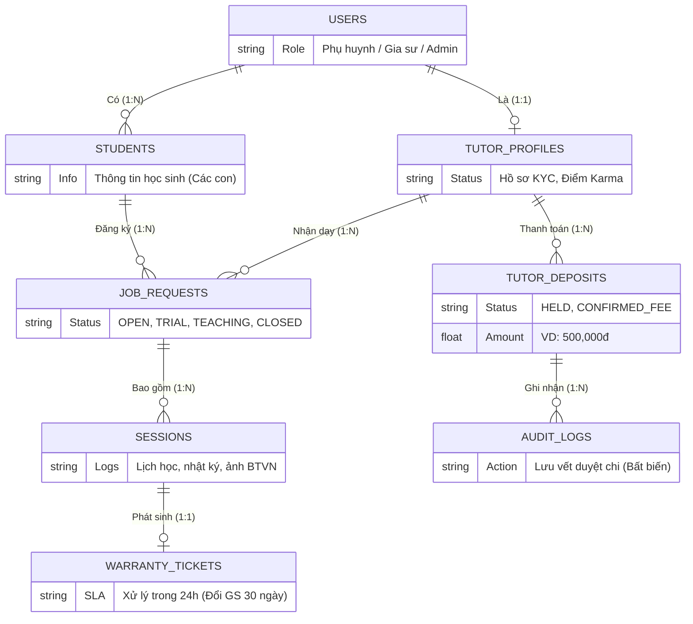

# 📄 BÁO CÁO THÔNG ĐỒ ÁN: PHÂN TÍCH ĐỀ TÀI

> **Đề tài:** Xây dựng Hệ thống Web CRM Quản lý và Kết nối Trung tâm Gia sư Trực tuyến  
> **Học phần:** Đồ án Tốt nghiệp / Báo cáo Tiến độ Đồ án Chuyên ngành  
> **Nội dung:** Phân tích Toàn diện Nghiệp vụ, Kiến trúc Liên cổng, Quy tắc Xử lý & Mô hình Dữ liệu

---

## 1. Tổng Quan Kiến Trúc Hệ Thống (3 Phân Hệ Web Portal)

Hệ thống được thiết kế theo mô hình kiến trúc **Web Application Responsive**, phân tách rõ ràng thành 3 phân hệ cổng tương tác độc lập nhưng kết nối dữ liệu xuyên suốt qua API và WebSocket thời gian thực:

```text
┌─────────────────────────────────────────────────────────────────────────────┐
│                       HỆ THỐNG CRM TRUNG TÂM GIA SƯ                         │
└─────────────────────────────────────────────────────────────────────────────┘
         ▲                                     ▲                       ▲
         │                                     │                       │
┌────────┴───────────────┐           ┌─────────┴──────────┐  ┌─────────┴───────────────┐
│ 1. CLIENT WEB PORTAL   │           │ 2. TUTOR WEB PORTAL│  │ 3. ADMIN CRM BACK-OFFICE│
│ (Phụ huynh & Học sinh) │           │ (Đối tác Gia sư)   │  │ (Vận hành, CSKH, Kế toán│
├────────────────────────┤           ├────────────────────┤  ├─────────────────────────┤
│ • Đăng yêu cầu tìm GS  │           │ • Xác thực hồ sơ   │  │ • Tự động lên sàn lớp   │
│ • Quản lý hồ sơ các con│           │ • Điểm tín nhiệm   │  │ • Bảng Kanban 4 trạng   │
│ • Đánh giá sau dạy thử │           │ • Sàn lớp & Nộp cọc│    thái (OPEN/TRIAL/...)   │
│ • Trả tiền trực tiếp GS│           │ • Lịch dạy & Báo   │  │ • Smart Matching Top 5  │
│ • Đổi gia sư 30 ngày   │             nghỉ trước 24h     │  │ • Trọng tài đối soát cọc│
│ • Theo dõi lịch & điểm │           │ • Nhật ký buổi học │  │ • Ticket Bảo hành 30 ngày│
│ • Đối soát buổi cuối th│           │ • Sổ tay thu nhập  │  │ • Quản trị phân quyền   │
└────────────────────────┘           └────────────────────┘  └─────────────────────────┘
```

---

## 2. Phân Tích Các Tác Nhân & Phân Quyền Hệ Thống (Actors & RBAC)

Hệ thống phân định rành mạch quyền hạn và trách nhiệm của từng nhóm người dùng:

```text
┌────────────────────────────────────────────────────────────────────────────────────────┐
│                        MA TRẬN PHÂN QUYỀN VAI TRÒ (RBAC MATRIX)                        │
├──────────────────────┬─────────────────────────────────────────────────────────────────┤
│ Vai trò (Role)       │ Trách nhiệm & Quyền hạn nghiệp vụ chính                         │
├──────────────────────┼─────────────────────────────────────────────────────────────────┤
│ 1. Phụ huynh         │ • Đăng tin tìm gia sư miễn phí 100%, không cần nạp ví trước.    │
│    (Client / Parent) │ • Chấm điểm, đánh giá sau đợt dạy thử (1B Giáo viên / 2B SV).   │
│                      │ • Thanh toán học phí trực tiếp cho gia sư vào cuối tháng.       │
│                      │ • Kích hoạt quyền Bảo hành đổi gia sư miễn phí trong 30 ngày.   │
├──────────────────────┼─────────────────────────────────────────────────────────────────┤
│ 2. Gia sư            │ • Xác thực danh tính (CCCD + Thẻ SV / Bằng ĐH Sư phạm).         │
│    (Tutor)           │ • Phân loại: Giáo viên (GV) hoặc Sinh viên (SV).                 │
│                      │ • Nộp cọc cam kết (500,000 đ qua VietQR) để mở khóa thông tin. │
│                      │ • Điền nhật ký buổi học, giao bài tập, báo nghỉ trước >= 24h.   │
├──────────────────────┼─────────────────────────────────────────────────────────────────┤
│ 3. Nhân viên Vận hành│ • Thẩm định hồ sơ KYC của gia sư trước khi cho phép nhận lớp.   │
│    & CSKH (Operator) │ • Giám sát bảng Kanban trạng thái các lớp học trên sàn.         │
│                      │ • Điều phối gia sư mới thay thế khi có Ticket Bảo hành (SLA 24h)│
├──────────────────────┼─────────────────────────────────────────────────────────────────┤
│ 4. Kế toán           │ • Vận hành màn hình Trọng tài & Đối soát cọc sau đợt dạy thử.   │
│    (Accountant)      │ • Thực hiện 4 lệnh tài chính: Duyệt doanh thu phí, Hoàn cọc     │
│                      │   100%, Tịch thu cọc vi phạm, Hoàn cọc 50%.                     │
├──────────────────────┼─────────────────────────────────────────────────────────────────┤
│ 5. Giám đốc          │ • Toàn quyền xem báo cáo doanh thu, tiền cọc và KPI vận hành.   │
│    (Admin / Manager) │ • Cấu hình các tham số vận hành toàn hệ thống.                  │
└──────────────────────┴─────────────────────────────────────────────────────────────────┘
```

---

## 3. Phân Tích Luồng Nghiệp Vụ & Chức Năng Chi Tiết Theo 3 Cổng (Web Portals)

Hệ thống được vận hành xoay quanh 3 cổng Web độc lập nhưng đồng bộ dữ liệu thời gian thực. Dưới đây là phân tích chi tiết từng luồng và các chức năng con của mỗi cổng.

### 3.1. Phân Hệ Cổng Khách Hàng (Client Web Portal)
Cổng dành riêng cho Phụ huynh và Học sinh, tập trung vào trải nghiệm tìm gia sư tự động và quản lý học tập.

* **Luồng 1: Đăng ký & Quản lý Hồ sơ Gia đình**
  * **Đăng nhập không mật khẩu:** Sử dụng OTP qua Zalo/SMS hoặc Google Login để tối ưu trải nghiệm.
  * **Quản lý đa học sinh:** Phụ huynh có thể thêm/sửa hồ sơ nhiều con (tối đa 5 bé) trên cùng một tài khoản.
  * **Khai báo chi tiết:** Điền thông tin lực học hiện tại, tính cách học sinh (nhút nhát, lười làm bài tập,...) và mục tiêu đầu ra để hỗ trợ gia sư.

* **Luồng 2: Đăng Tin Tìm Gia Sư Tự Động (Zero-Touch Ingestion)**
  * **Form yêu cầu 5 bước:** Chọn con $\rightarrow$ Chọn môn & khối lớp $\rightarrow$ Chọn GV (dạy thử 1 buổi) hoặc SV (dạy thử 2 buổi) $\rightarrow$ Lịch học $\rightarrow$ Địa chỉ & Học phí.
  * **Kiểm duyệt tự động 1 giây:** Hệ thống tự động đẩy tin lên sàn ngay lập tức mà không cần nhân viên gọi điện xác nhận (Zero-Touch).

* **Luồng 3: Quản Lý Dạy Thử & Phán Quyết**
  * **Nhận form đánh giá:** Tự động nhận link đánh giá qua Web/Zalo sau khi hoàn thành số buổi dạy thử quy định.
  * **4 Kịch bản phán quyết (1-Click):** 
    1. Chốt nhận gia sư.
    2. Từ chối do lỗi Gia sư (Tự động kích hoạt đổi gia sư).
    3. Hủy lớp do lỗi Phụ huynh (Bận/Đổi ý).
    4. Giảm số buổi học.

* **Luồng 4: Theo Dõi Học Tập & Bảo Hành**
  * **Nhật ký & Thời khóa biểu:** Xem tóm tắt kiến thức, ảnh bài tập và điểm số do gia sư cập nhật sau mỗi buổi.
  * **Nút báo nghỉ học:** Báo nghỉ đột xuất cho con, hệ thống tự động thông báo tới gia sư để đổi lịch.
  * **Yêu cầu đổi gia sư (Bảo hành 30 ngày):** Phụ huynh bấm 1 nút để kích hoạt quyền bảo hành đổi gia sư miễn phí trong 30 ngày đầu, trung tâm cam kết bù người trong 24 giờ.

---

### 3.2. Phân Hệ Cổng Đối Tác Gia Sư (Tutor Web Portal)
Cổng làm việc của đội ngũ Gia sư (Giáo viên / Sinh viên), từ khâu tìm lớp đến nhận lương.

* **Luồng 1: Onboarding & KYC (Định danh)**
  * **Tải hồ sơ số:** Chụp và tải ảnh 2 mặt CCCD, Bằng đại học hoặc Thẻ sinh viên.
  * **Thiết lập thông số nhận ghép lớp:** Khai báo danh sách các Quận/Huyện có thể di chuyển và ma trận lịch rảnh trong tuần.
  * **Phân loại tự động:** Hệ thống gán mác `TEACHER` hoặc `STUDENT` để quy định số buổi dạy thử tương ứng.

* **Luồng 2: Tìm Kiếm & Nhận Lớp (Smart Matching)**
  * **Lướt Sàn lớp tự do:** Xem danh sách các lớp đang tuyển, lọc theo quận và môn. Thông tin SĐT và số nhà chi tiết bị ẩn.
  * **Nhận chuông Smart Matching:** Nhận thông báo thời gian thực khi có lớp phù hợp cao (Match Score) được hệ thống tự động gợi ý.
  * **Nút "Nhận lớp này":** Thao tác 1 chạm để chốt lớp và chuyển sang bước cọc.

* **Luồng 3: Đặt Cọc VietQR Động**
  * **Quét mã VietQR (500,000đ):** Quét mã thanh toán trên màn hình, tiền cọc chuyển sang trạng thái `HELD`.
  * **Mở khóa dữ liệu:** Web tự động hiển thị đầy đủ SĐT, Họ tên phụ huynh và số phòng chung cư.
  * **Đếm ngược SLA 2 giờ:** Đồng hồ đếm ngược ép gia sư phải gọi điện hẹn lịch phụ huynh trong vòng 2 giờ.

* **Luồng 4: Nhật Ký Giảng Dạy & Thu Nhập**
  * **Viết báo cáo buổi dạy:** Điền nội dung bài giảng, tải ảnh (hỗ trợ kéo thả / `Ctrl+V`) bài kiểm tra.
  * **Báo nghỉ 24h:** Xin nghỉ trước giờ học 24 tiếng sẽ không bị trừ điểm uy tín (Karma).
  * **Sổ tay đối soát thu nhập:** Tự động tính số buổi đã dạy nhân với đơn giá, hiển thị số tiền phụ huynh cần thanh toán cuối tháng.
  * **Theo dõi điểm Karma:** Xem biến động điểm tín nhiệm (khởi tạo 100 điểm, thưởng/phạt tự động).

---

### 3.3. Phân Hệ Cổng Quản Trị Trung Tâm (Admin CRM Back-office)
Hệ thống điều hành trung tâm dành cho Sales, CSKH, và Kế toán.

* **Luồng 1: Giám Sát Vòng Đời Lớp Học (Kanban)**
  * **Bảng Kanban 4 cột tự động:** Lớp học tự di chuyển qua các cột `OPEN` (Tuyển dụng) $\rightarrow$ `TRIAL` (Dạy thử) $\rightarrow$ `TEACHING` (Học chính thức) $\rightarrow$ `CLOSED` (Đóng/Hủy).
  * **Điều khiển Smart Matching:** Bấm nút bắn thông báo mời nhận lớp cho Top 5 gia sư phù hợp nhất để đẩy nhanh tốc độ ghép lớp.

* **Luồng 2: Customer 360 & Điều Phối CSKH**
  * **Xem hồ sơ gia đình:** Truy xuất toàn bộ lịch sử thuê gia sư, số tiền đã giao dịch, đánh giá của phụ huynh trong quá khứ.
  * **Điều phối Ticket Bảo hành:** Tiếp nhận yêu cầu đổi gia sư (SLA 24 giờ), CSKH liên hệ và ép ghép gia sư mới ngay lập tức.

* **Luồng 3: Trọng Tài Đối Soát Cọc (Dành cho Kế Toán)**
  * Màn hình độc quyền dành cho kế toán xử lý cọc sau dạy thử với 4 nút lệnh tài chính:
    1. **[Duyệt Doanh Thu Phí]:** Chuyển cọc 500k thành lợi nhuận trung tâm khi chốt lớp.
    2. **[Hoàn 100% Cọc]:** Chuyển trả lại 500k cho gia sư khi phụ huynh tự hủy.
    3. **[Tịch Thu Cọc]:** Xóa trắng 500k của gia sư (cho vào quỹ phạt) và trừ điểm Karma.
    4. **[Hoàn 50%]:** Trả lại 250k khi phụ huynh giảm số buổi học.
  * **Audit Logs:** Mọi lệnh duyệt chi đều ghi vết bất biến (thời gian, người duyệt, số tiền) để chống gian lận nội bộ.

* **Luồng 4: Quản Trị Hệ Thống & Phân Quyền (RBAC)**
  * **Phân quyền người dùng:** Cấp quyền riêng biệt cho Admin, CSKH (không xem tài chính), Kế toán (chỉ duyệt chi).
  * **Cài đặt tham số (Settings):** Cấu hình tự do mức tiền cọc mặc định (500k), thời gian đếm ngược (2 giờ), số ngày bảo hành (30 ngày).
  * **Dashboard KPI:** Xem báo cáo Tỷ lệ chốt đơn (Win Rate), thời gian ghép lớp trung bình, báo cáo tồn quỹ cọc.

---

## 4. Phân Tích Các Quy Tắc Nghiệp Vụ Cốt Lõi (Core Business Rules)

```text
┌────────────────────────────────────────────────────────────────────────────────────────┐
│                     BẢNG QUY TẮC NGHIỆP VỤ HỆ THỐNG (BUSINESS RULES)                   │
├───────────────┬────────────────────────────────────────────────────────────────────────┤
│ Mã Quy Tắc    │ Nội dung chi tiết & Ràng buộc logic                                    │
├───────────────┼────────────────────────────────────────────────────────────────────────┤
│ BR-KYC        │ Gia sư phải có trạng thái VERIFIED (đã duyệt CCCD + Thẻ SV/Bằng cấp)   │
│               │ mới được phép ứng tuyển nhận lớp.                                      │
├───────────────┼────────────────────────────────────────────────────────────────────────┤
│ BR-CLASSIFY   │ Phân loại bắt buộc: Giáo viên (TEACHER) dạy thử đúng 1 buổi;           │
│               │ Sinh viên (STUDENT) dạy thử đúng 2 buổi.                               │
├───────────────┼────────────────────────────────────────────────────────────────────────┤
│ BR-KARMA      │ Khởi tạo 100 điểm. Dạy tốt nhận +15đ, bị phản ánh hổng kiến thức -25đ, │
│               │ tự ý bùng lớp -50đ. Dưới 20 điểm bị Blacklist khóa vĩnh viễn.          │
├───────────────┼────────────────────────────────────────────────────────────────────────┤
│ BR-DEPOSIT    │ Tiền cọc 500,000 đ được giữ ở trạng thái HELD. Mở khóa SĐT/Địa chỉ     │
│               │ phụ huynh kèm đồng hồ đếm ngược 2 giờ gọi điện hẹn lịch dạy thử.       │
├───────────────┼────────────────────────────────────────────────────────────────────────┤
│ BR-REFUND-100 │ Nếu phụ huynh hủy lớp vì lý do cá nhân (gia đình bận, hoãn học),       │
│               │ trung tâm bắt buộc hoàn 100% tiền cọc (500k) cho gia sư trong 24h.     │
├───────────────┼────────────────────────────────────────────────────────────────────────┤
│ BR-WARRANTY   │ Trong 30 ngày đầu, phụ huynh được đổi gia sư miễn phí 100%. Trung tâm │
│               │ cam kết điều động gia sư mới trong vòng 24 giờ.                        │
├───────────────┼────────────────────────────────────────────────────────────────────────┤
│ BR-LEAVE-24H  │ Gia sư phải báo nghỉ trước giờ dạy tối thiểu 24 giờ kèm đề xuất giờ bù │
│               │ mới được tính là hợp lệ; báo nghỉ muộn bị trừ điểm Karma.              │
└───────────────┴────────────────────────────────────────────────────────────────────────┘
```

---

## 5. Phân Tích Mô Hình Thực Thể Dữ Liệu Cốt Lõi (Core Data Schema)

Hệ thống được thiết kế xoay quanh các thực thể quan hệ chặt chẽ:



---

## 6. Điểm Sáng & Ưu Thế Vượt Trội Của Đề Tài

1. **Tính Thực Tế & Khả Thi Cao:** Khắc phục hoàn toàn sự bất cập của mô hình cũ (không ép nạp ví tiền triệu, phụ huynh trả tiền trực tiếp cho gia sư cuối tháng, phân xử cọc minh bạch).
2. **Tối Ưu Hóa 100% Nền Tảng Web (Web-First):** Tiếp cận không rào cản (Zero-Install), không bắt tải app, hỗ trợ đầy đủ các thao tác văn phòng hiện đại (kéo thả tệp, dán ảnh `Ctrl + V`, thanh toán VietQR động).
3. **Tự Động Hóa Giải Phóng Sức Lao Động:** Đăng tin tự động lên sàn lớp trong 1 giây, thuật toán Smart Matching tự động gợi ý gia sư, không cần nuôi đội ngũ telesales gọi điện thủ công.
4. **Giải Quyết Bài Toán Niềm Tin:** Ràng buộc trách nhiệm bằng cọc 500k và điểm uy tín Karma, đồng thời bảo vệ quyền lợi tối đa cho gia sư (hoàn cọc 100% khi lỗi do phụ huynh) và phụ huynh (bảo hành đổi người 30 ngày).
