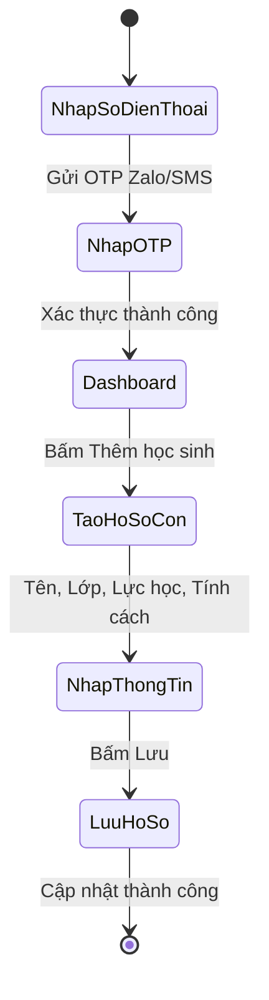
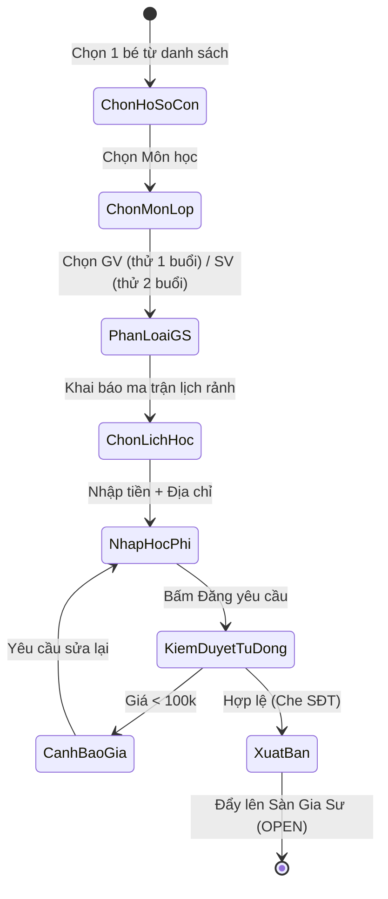
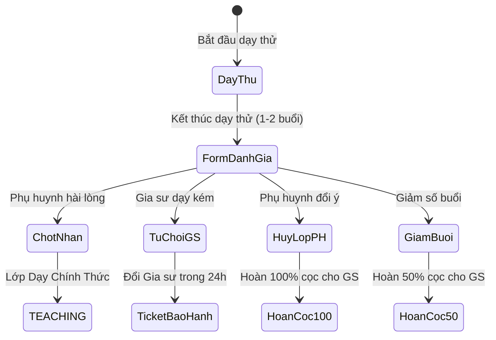
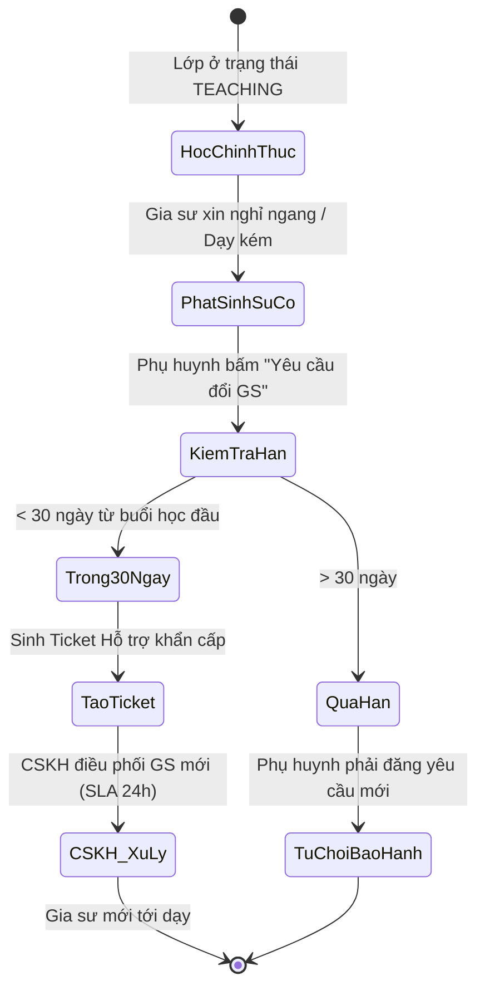
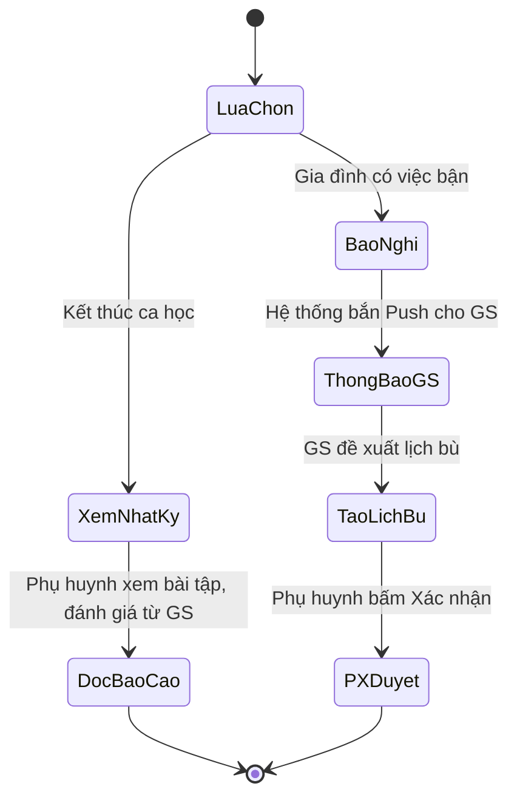

# PHÂN TÍCH NGHIỆP VỤ CHI TIẾT: CỔNG KHÁCH HÀNG (CLIENT WEB PORTAL)

> **Mục tiêu nghiệp vụ:** Lấy phụ huynh làm trung tâm, tối giản hóa toàn bộ quá trình tìm kiếm gia sư từ chỗ phải gọi điện tư vấn rườm rà sang mô hình "Tự phục vụ" (Self-service) 100% tự động. Bảo vệ quyền lợi tuyệt đối cho phụ huynh thông qua chính sách học thử và bảo hành.

---

## 1. Nghiệp Vụ: Định Danh & Quản Lý Hồ Sơ Gia Đình
* **Đăng nhập không mật khẩu (Passwordless):** 
  * Phụ huynh (thường là người lớn tuổi, bận rộn) thường hay quên mật khẩu. Do đó, nghiệp vụ yêu cầu sử dụng mã OTP qua Zalo/SMS hoặc Đăng nhập Google để thao tác nhanh nhất.
* **Quản lý con cái (Học sinh):**
  * Phụ huynh có thể tạo nhiều hồ sơ cho các con trong nhà. 
  * **Quy tắc nghiệp vụ:** Bắt buộc khai báo "Lực học hiện tại", "Tính cách (nhút nhát, lười, hiếu động...)" và "Mục tiêu đầu ra". Lý do: Đây là dữ liệu sống còn để hệ thống (và gia sư) biết cách tiếp cận học sinh, lên giáo án phù hợp ngay từ buổi đầu tiên, tăng tỷ lệ chốt lớp.
  * **Quy tắc bảo lưu:** Nếu một học sinh đã từng phát sinh lịch học, phụ huynh không được quyền xóa vĩnh viễn hồ sơ đó (để trung tâm giữ lịch sử đối soát nợ, khiếu nại), chỉ được phép "Ẩn" khỏi màn hình.

**Sơ đồ Activity - Quản Lý Hồ Sơ:**

## 2. Nghiệp Vụ: Đăng Tin Tìm Gia Sư Tự Động (Zero-Touch Ingestion)
* **Mô tả:** Phụ huynh tự đưa yêu cầu lên sàn lớp một cách tự động, trung tâm không cần nuôi đội ngũ Telesales để gọi điện xác nhận. Phụ huynh **không phải trả phí môi giới** cho trung tâm.
* **Quy tắc Phân loại Gia sư:** 
  * Phụ huynh chọn **Giáo viên**: Nghiệp vụ quy định dạy thử đúng **1 buổi**. Mức học phí đề xuất thường cao.
  * Phụ huynh chọn **Sinh viên**: Nghiệp vụ quy định dạy thử **2 buổi**. Mức phí rẻ hơn.
* **Quy tắc Bảo mật Dữ liệu:** 
  * Ngay khi phụ huynh bấm "Đăng yêu cầu", tin sẽ lên sàn lập tức. Tuy nhiên, hệ thống có nghiệp vụ **"Che dấu vết" (Masking)**: Số điện thoại, họ tên và số nhà chi tiết của phụ huynh sẽ bị ẩn đi. Gia sư trên sàn chỉ thấy được tên Tòa chung cư/Tên đường và Phường/Quận. (Chỉ khi gia sư nộp tiền cọc, thông tin này mới được mở khóa).
  * **Chống phá giá:** Hệ thống cảnh báo nếu phụ huynh nhập học phí dưới 100,000 đ/buổi để bảo vệ quyền lợi thu nhập cho gia sư.

**Sơ đồ Activity - Đăng Tin Zero-Touch:**

## 3. Nghiệp Vụ: Phán Quyết Sau Dạy Thử (Trial Evaluation)
* Sau khi kết thúc số buổi học thử (1 hoặc 2 buổi), phụ huynh sẽ nhận được một form đánh giá chất lượng. Tại đây, nghiệp vụ yêu cầu phụ huynh đưa ra 1 trong 4 phán quyết ảnh hưởng trực tiếp đến dòng tiền của gia sư:
  1. **Chốt nhận Gia sư:** Phụ huynh hài lòng. Tiền học phí của các buổi dạy thử sẽ được cộng dồn để phụ huynh trả luôn cho gia sư vào cuối tháng. Hợp đồng chính thức bắt đầu.
  2. **Từ chối do lỗi Gia sư:** Phụ huynh không ưng ý (Lý do: Gia sư đến muộn, kiến thức hổng, tác phong kém). $\rightarrow$ **Nghiệp vụ xử lý:** Gia sư cũ sẽ bị trung tâm tịch thu cọc và trừ điểm uy tín. Phụ huynh sẽ được trung tâm tự động tìm một gia sư khác thay thế đến dạy thử.
  3. **Hủy lớp do lỗi Phụ huynh:** Phụ huynh đổi ý không thuê gia sư nữa, hoặc gia đình bận đột xuất. $\rightarrow$ **Nghiệp vụ xử lý:** Trung tâm sẽ hoàn trả lại 100% tiền cọc cho gia sư vì gia sư không có lỗi.
  4. **Giảm số buổi học:** Phụ huynh chốt nhận gia sư nhưng muốn giảm từ 2 buổi/tuần xuống 1 buổi/tuần. $\rightarrow$ **Nghiệp vụ xử lý:** Lớp vẫn tiếp tục, nhưng trung tâm sẽ hoàn lại 50% tiền cọc phí môi giới cho gia sư.

**Sơ đồ Activity - Luồng Phán Quyết 4 Kịch Bản:**

## 4. Nghiệp Vụ: Thanh Toán & Bảo Hành 30 Ngày
* **Nghiệp vụ Thanh toán Trực tiếp:** Khác với các nền tảng khác ép phụ huynh nạp tiền vào ví hệ thống, mô hình này cho phép phụ huynh **trả tiền học phí trực tiếp cho gia sư** (tiền mặt/chuyển khoản) vào cuối mỗi tháng học dựa trên "Sổ đối soát số buổi thực tế" trên web, không qua trung gian, triệt tiêu cảm giác bị giam tiền.
* **Chính sách Bảo hành (Warrant SLA):**
  * Quyền lợi mạnh mẽ nhất của phụ huynh: Trong vòng **30 ngày đầu tiên** (tính từ buổi dạy chính thức), nếu gia sư bỗng nhiên xin nghỉ ngang, hoặc dạy sa sút, phụ huynh bấm nút **"Đổi gia sư"**.
  * **Cam kết trung tâm:** Điều phối gia sư mới đến thay thế trong vòng 24 giờ. Phụ huynh **không mất thêm chi phí nào**. Đối với gia sư cũ, phụ huynh chỉ thanh toán số buổi thực tế người đó đã dạy.

**Sơ đồ Activity - Kích Hoạt Bảo Hành:**

## 5. Nghiệp Vụ: Nhật Ký & Xin Nghỉ Học
* **Theo dõi tiến độ:** Phụ huynh được xem tóm tắt nội dung bài học, ảnh chụp bài kiểm tra và lời nhận xét của gia sư ngay sau khi ca học kết thúc.
* **Báo nghỉ đột xuất:** Nếu học sinh ốm/bận, phụ huynh thao tác báo nghỉ trên app. Hệ thống sẽ tự động thông báo cho gia sư để sắp xếp giờ dạy bù. Lịch dạy bù chỉ có hiệu lực khi cả gia sư và phụ huynh cùng bấm "Xác nhận".

**Sơ đồ Activity - Quản Lý Nhật Ký & Báo Nghỉ:**

