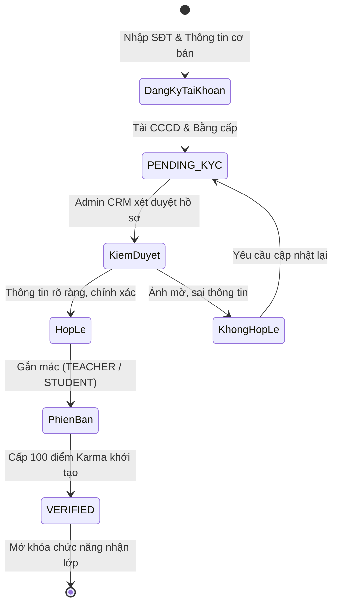
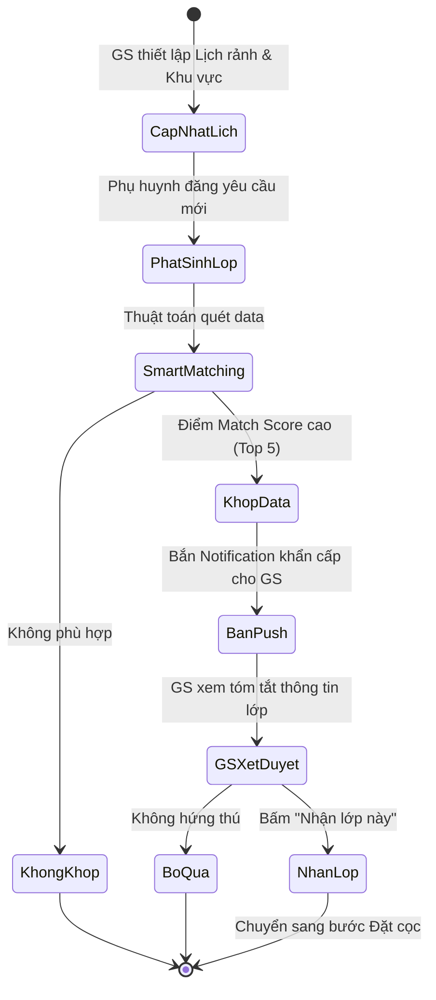
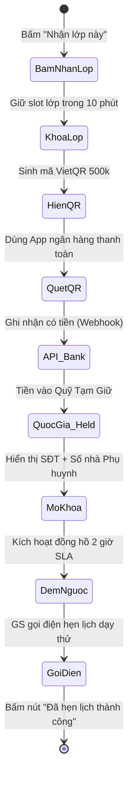
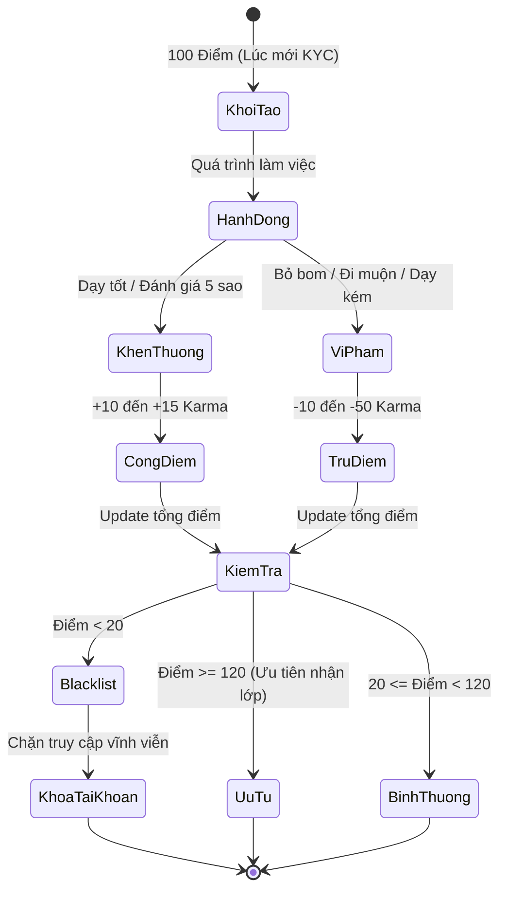
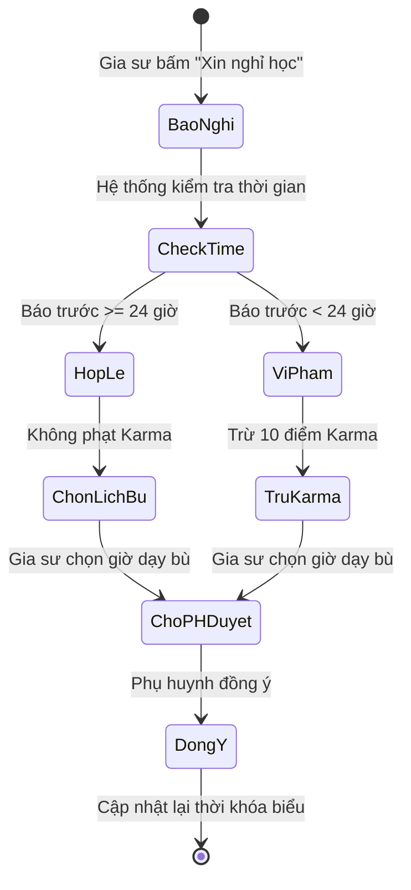
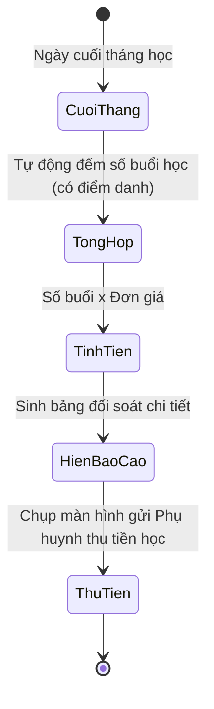

# PHÂN TÍCH NGHIỆP VỤ CHI TIẾT: CỔNG ĐỐI TÁC GIA SƯ (TUTOR WEB PORTAL)

> **Mục tiêu nghiệp vụ:** Xây dựng một môi trường làm việc minh bạch, công bằng cho đội ngũ Gia sư. Sử dụng tiền cọc và Điểm uy tín (Karma) làm công cụ ràng buộc trách nhiệm, thay thế cho việc đôn đốc thủ công bằng con người.

---

## 1. Nghiệp Vụ: Định Danh Điện Tử (KYC) & Phân Loại
* **Quy tắc Định danh (KYC):** Bất kỳ ai đăng ký làm gia sư đều không được phép nhận lớp ngay. Họ bắt buộc phải tải lên hệ thống ảnh 2 mặt CCCD và giấy tờ chuyên môn (Thẻ sinh viên hoặc Bằng Sư phạm).
* **Nghiệp vụ Phân loại:**
  * Bộ phận Hành chính sẽ kiểm duyệt hồ sơ. Nếu đạt, hồ sơ được cấp tích xanh (`VERIFIED`).
  * Hệ thống dán nhãn phân loại:
    * **Giáo viên:** Yêu cầu cung cấp bằng đại học sư phạm/chứng chỉ. Chỉ phải dạy thử 1 buổi cho phụ huynh.
    * **Sinh viên:** Yêu cầu cung cấp thẻ SV hoặc bảng điểm. Phải dạy thử 2 buổi cho phụ huynh.
  * Chỉ khi tài khoản được `VERIFIED`, gia sư mới được phép nhìn thấy Sàn lớp.

**Sơ đồ Activity - Định Danh KYC:**

## 2. Nghiệp Vụ: Tìm Lớp & Thuật Toán Ghép Nối (Smart Matching)
Gia sư có 2 con đường nghiệp vụ để nhận việc:
* **Hình thức 1 - Tìm việc chủ động:** Lướt xem danh sách các lớp học công khai trên Sàn. Các lớp này ẩn thông tin cá nhân của phụ huynh nhưng hiển thị rõ khu vực Quận/Huyện, Môn, Khối lớp và Mức lương. Gia sư dùng bộ lọc để tự tìm lớp vừa ý.
* **Hình thức 2 - Nhận việc tự động (Smart Matching):** 
  * Gia sư khai báo "Lịch rảnh trong tuần" và "Bán kính các quận có thể đi dạy".
  * Khi có yêu cầu mới từ phụ huynh khớp với hồ sơ của gia sư (Khớp môn, khớp giờ rảnh, gần nhà), hệ thống sẽ **bắn chuông thông báo (Push Notification)** nhắc gia sư vào nhận lớp nhanh. Top 5 gia sư có điểm uy tín cao nhất và gần nhà nhất sẽ nhận được tin báo này trước.

**Sơ đồ Activity - Nhận Lớp Smart Matching:**

## 3. Nghiệp Vụ: Ràng Buộc Trách Nhiệm Bằng Tiền Cọc (VietQR)
* **Quy tắc Đặt cọc:** Để triệt tiêu tình trạng gia sư "bấm nhận lớp cho vui" rồi bỏ bom phụ huynh, nghiệp vụ bắt buộc gia sư phải nộp một khoản cọc (ví dụ: 500,000 VNĐ) để được cấp thông tin liên hệ của phụ huynh.
* **Luồng Thanh toán không chạm:**
  * Màn hình hiển thị mã VietQR động chứa sẵn số tiền 500k và nội dung chuyển khoản tự động.
  * Gia sư quét mã bằng app ngân hàng $\rightarrow$ Hệ thống tự động ghi nhận tiền vào quỹ "Tạm giữ".
  * Lập tức màn hình mở khóa hiển thị Họ Tên, SĐT và số nhà cụ thể của Phụ huynh.
* **SLA Liên hệ Phụ huynh:** Từ lúc nộp cọc thành công, đồng hồ đếm ngược **2 giờ** bắt đầu chạy. Nghiệp vụ ép buộc gia sư phải gọi điện thiết lập lịch hẹn dạy thử với phụ huynh trong thời gian này, nếu quá hạn không gọi sẽ bị trừ điểm uy tín hoặc khóa tài khoản.

**Sơ đồ Activity - Thanh Toán Cọc VietQR:**

## 4. Nghiệp Vụ: Chấm Điểm Uy Tín (Karma Scoring System)
* **Triết lý nghiệp vụ:** Dùng "Gamification" (Trò chơi hóa) để thưởng phạt phân minh thay cho việc dùng lời lẽ nhắc nhở.
* **Cơ chế vận hành:**
  * Gia sư mới được cấp **100 điểm Karma** làm vốn.
  * **Cộng điểm:** Nhận lớp và dạy thử thành công (+15đ), được phụ huynh đánh giá 5 sao (+10đ).
  * **Trừ điểm:** Nhận lớp xong bỏ không đến dạy thử (-50đ), Đến muộn không báo trước (-20đ), Dạy sai kiến thức bị phụ huynh khiếu nại (-25đ).
* **Chế tài:** 
  * Điểm cao (Hạng Ưu tú): Được giảm giá tiền cọc, được ưu tiên nhận thông báo lớp VIP sớm hơn người khác 2 giờ.
  * Điểm thấp $< 20$ (Blacklist): Khóa tài khoản vĩnh viễn, đưa CCCD và SĐT vào danh sách đen không cho phép hoạt động trên sàn nữa.

**Sơ đồ Activity - Vận Hành Điểm Karma:**

## 5. Nghiệp Vụ: Báo Cáo Buổi Dạy & Kỷ Luật Báo Nghỉ
* **Nhật ký:** Sau mỗi ca dạy, gia sư phải lên app điền báo cáo nội dung đã dạy và tải ảnh bài tập lên cho phụ huynh xem.
* **Quy chuẩn Báo nghỉ 24h:**
  * Trách nhiệm đi dạy là tuyệt đối. Tuy nhiên nếu ốm đau/có việc bận đột xuất, nghiệp vụ quy định gia sư phải bấm nút "Xin nghỉ" **trước giờ học tối thiểu 24 tiếng**.
  * Nếu báo trước 24 tiếng $\rightarrow$ Hệ thống thông cảm, không trừ điểm uy tín, yêu cầu chọn khung giờ dạy bù.
  * Nếu báo nghỉ quá gấp (dưới 24 tiếng) $\rightarrow$ Hành vi này gây ảnh hưởng đến uy tín trung tâm và phụ huynh, hệ thống tự động trừ 10 điểm Karma.

**Sơ đồ Activity - Logic Xử Lý Báo Nghỉ:**

## 6. Nghiệp Vụ: Sổ Tay Đối Soát Thu Nhập
* Vì tiền học phí do phụ huynh trực tiếp trả cho gia sư, trung tâm không can thiệp. Tuy nhiên, để tránh tranh chấp "tháng này học mấy buổi", ứng dụng cung cấp Sổ đối soát tự động nhân số buổi thực dạy với đơn giá. Cuối tháng gia sư chỉ việc chụp màn hình bảng đối soát này gửi cho phụ huynh để thu tiền.

**Sơ đồ Activity - Sổ Đối Soát Thu Nhập:**

