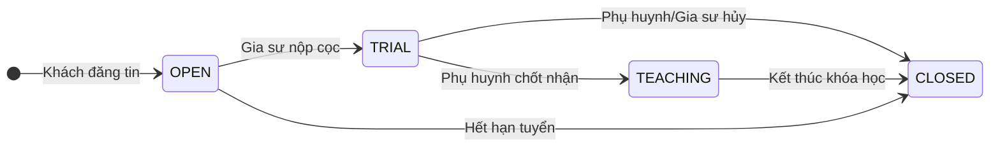
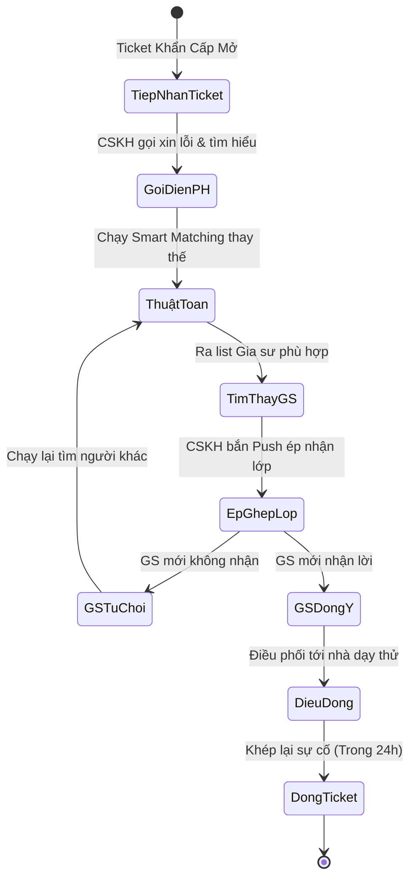
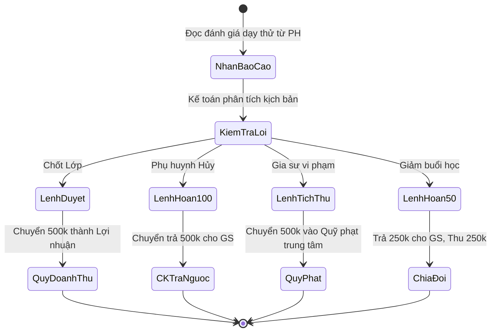
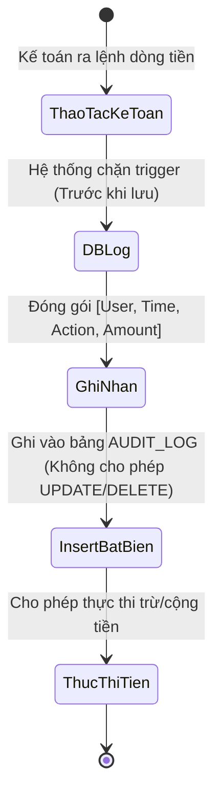
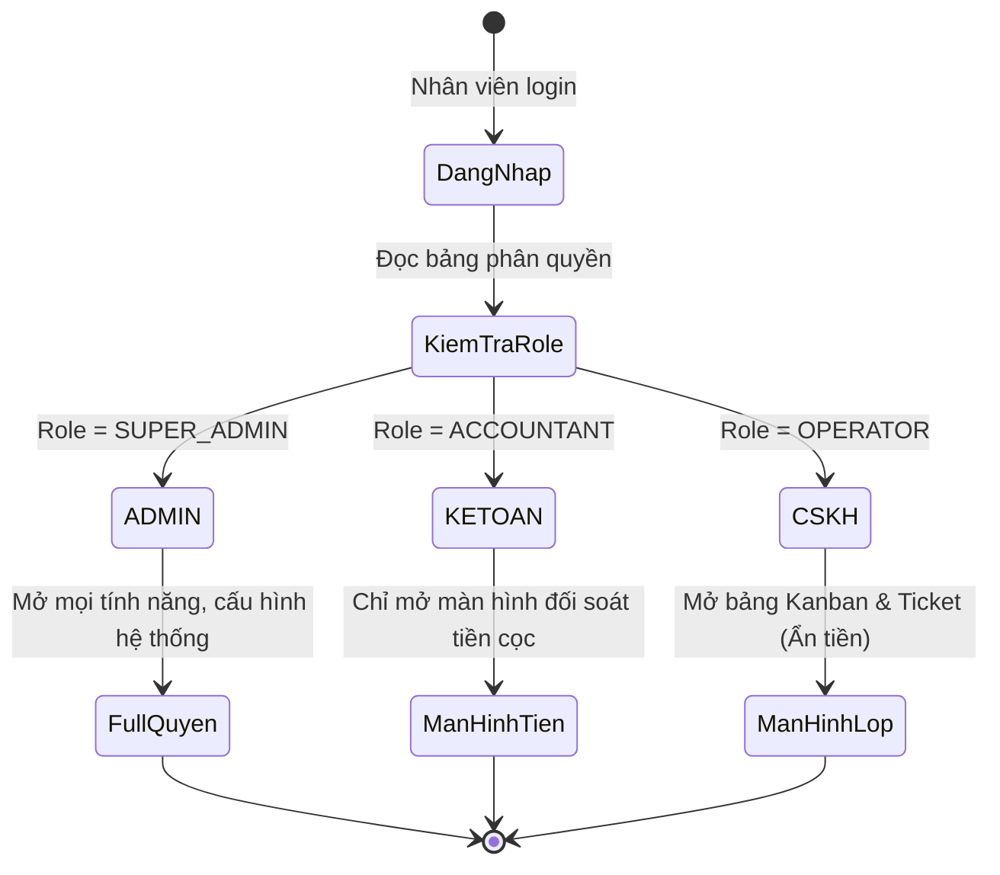

# PHÂN TÍCH NGHIỆP VỤ CHI TIẾT: CỔNG QUẢN TRỊ (ADMIN CRM BACK-OFFICE)

> **Mục tiêu nghiệp vụ:** Số hóa toàn bộ công việc vận hành của trung tâm gia sư, từ giám sát chất lượng lớp học, điều phối CSKH, cho đến phân xử tài chính. Triệt tiêu các quy trình thủ công trên Excel, chống thất thoát dòng tiền và giảm chi phí nhân sự.

---

## 1. Nghiệp Vụ: Giám Sát Vòng Đời Lớp Học (Sales/Class Kanban)
* **Bài toán:** Trung tâm có hàng trăm lớp học diễn ra cùng lúc, nhân viên không thể nhớ lớp nào đang ở giai đoạn nào.
* **Giải pháp Nghiệp vụ:** Xây dựng bảng Kanban giám sát tự động gồm 4 giai đoạn vòng đời cốt lõi:
  1. **Cột OPEN (Đang tuyển):** Chứa các yêu cầu mới tinh từ phụ huynh. Nếu một lớp nằm ở cột này quá lâu (ví dụ >3 ngày) mà chưa có ai nhận, nhân viên phải chạy thuật toán ép ghép lớp hoặc tăng mức học phí để thu hút gia sư.
  2. **Cột TRIAL (Đang dạy thử):** Chứa các lớp mà gia sư đã nộp cọc 500k và đang trong thời gian 1-2 buổi dạy thử tại nhà phụ huynh.
  3. **Cột TEACHING (Học chính thức):** Lớp dạy thử thành công, hợp đồng thiết lập, lớp đi vào trạng thái ổn định lâu dài.
  4. **Cột CLOSED (Đóng/Hủy):** Lớp hoàn thành xong khóa học hoặc bị hủy do sự cố.
* Thẻ lớp học sẽ **tự động nhảy** từ cột này sang cột khác dựa vào hành vi thao tác của Phụ huynh/Gia sư trên app, nhân viên vận hành chỉ đóng vai trò giám sát, không cần kéo thả bằng tay.

**Sơ đồ Activity - Vòng Đời Lớp Học (Kanban Flow):**

## 2. Nghiệp Vụ: Điều Phối & Xử Lý Sự Cố (CSKH & Ticket Bảo Hành)
* **Nghiệp vụ Customer 360:** Nhân viên CSKH có cái nhìn toàn cảnh về một gia đình: Học sinh này trước đây đã từng đổi bao nhiêu gia sư? Phụ huynh này là người khó tính hay dễ tính (dựa trên lịch sử đánh giá sao)? Từ đó có phương án ứng xử phù hợp.
* **Nghiệp vụ Xử lý Bảo hành (SLA 24 Giờ):**
  * Khi phụ huynh bấm "Yêu cầu đổi gia sư" (kích hoạt quyền bảo hành 30 ngày), màn hình Admin sẽ nhảy lên một **Ticket Sự Cố Khẩn Cấp màu đỏ**.
  * **SLA (Service Level Agreement):** Trung tâm cam kết với khách hàng phải xử lý trong 24 giờ.
  * Nhân viên CSKH có nhiệm vụ: Gọi điện xin lỗi phụ huynh, tìm hiểu nguyên nhân gia sư cũ bị đuổi, sau đó dùng công cụ Smart Matching trên hệ thống để tìm khẩn cấp 1 gia sư khác nhét vào lớp học này để tránh bị mất khách. Khi gia sư mới đến nhà, Ticket được đóng lại.

**Sơ đồ Activity - Xử Lý Ticket Bảo Hành:**

## 3. Nghiệp Vụ: Trọng Tài Tài Chính & Đối Soát (Kế Toán)
* **Bài toán:** Giao dịch tiền cọc (thường là 500,000đ - 1,000,000đ) rất dễ dẫn đến tranh chấp giữa trung tâm và gia sư. Gia sư luôn sợ bị trung tâm "quỵt cọc".
* **Giải pháp Nghiệp vụ:** Xây dựng màn hình "Trọng tài phán xử" độc quyền dành cho Kế toán, dựa vào kết quả Đánh giá Dạy thử của Phụ huynh để ra lệnh xử lý dòng tiền.
* **4 Lệnh Kế Toán:**
  1. **Lệnh Duyệt Doanh Thu:** (Khi lớp chốt thành công). Kế toán xác nhận chuyển khoản tiền 500k từ "Quỹ Tạm Giữ" sang "Quỹ Doanh Thu Lợi Nhuận" của trung tâm.
  2. **Lệnh Hoàn Cọc 100%:** (Khi lỗi do phụ huynh tự hủy lớp). Kế toán lấy thông tin số tài khoản ngân hàng của gia sư, chuyển khoản trả lại 500k cho họ, nhập Mã Giao Dịch ngân hàng vào hệ thống để làm bằng chứng đã hoàn tiền.
  3. **Lệnh Tịch Thu Cọc:** (Khi gia sư đi trễ, dạy sai kiến thức, thái độ lồi lõm). Kế toán bấm nút tịch thu 500k đưa vào Quỹ Phạt của trung tâm, hệ thống đồng thời trừ thẳng điểm uy tín của gia sư đó.
  4. **Lệnh Hoàn Cọc 50%:** (Khi phụ huynh giảm bớt số buổi học so với cam kết ban đầu). Kế toán trả lại 250k cho gia sư để chia sẻ rủi ro.

**Sơ đồ Activity - Quyết Toán Cọc (Kế Toán):**

## 4. Nghiệp Vụ: Kiểm Toán (Audit Logs) & Chống Gian Lận
* **Nghiệp vụ Lưu vết (Audit Trail):** Mọi hành động thao tác đến Tiền Cọc, Điểm Uy Tín của gia sư đều bị hệ thống ghi lại vết vĩnh viễn (Bao gồm: Tài khoản nhân viên nào làm, thời gian nào, làm hành động gì, số tiền bao nhiêu).
* **Ý nghĩa:** Chống tình trạng kế toán/nhân viên gian lận, tự ý rút lõi tiền cọc của gia sư, hoặc lén lút cộng điểm uy tín cho người quen. Giám đốc chỉ cần mở log ra là đối soát được toàn bộ.

**Sơ đồ Activity - Lưu Vết Audit Logs:**

## 5. Nghiệp Vụ: Quản Trị Phân Quyền (RBAC - Role Based Access Control)
* **Quy tắc phân quyền:**
  * **Role Giám đốc (Admin):** Thấy toàn bộ luồng tiền, doanh thu, thiết lập các tham số hệ thống (giá trị tiền cọc mặc định, thời gian đếm ngược 2 giờ, thời hạn bảo hành 30 ngày).
  * **Role Kế toán (Accountant):** Thấy màn hình xử lý tiền và đối soát cọc, không can thiệp vào chuyên môn lớp học.
  * **Role Vận hành/CSKH (Operator):** Chỉ thấy bảng Kanban lớp học và giải quyết khiếu nại phụ huynh, tuyệt đối **bị ẩn (che mờ)** các số liệu liên quan đến dòng tiền, doanh thu để bảo mật tài chính công ty.

**Sơ đồ Activity - Phân Quyền RBAC:**

