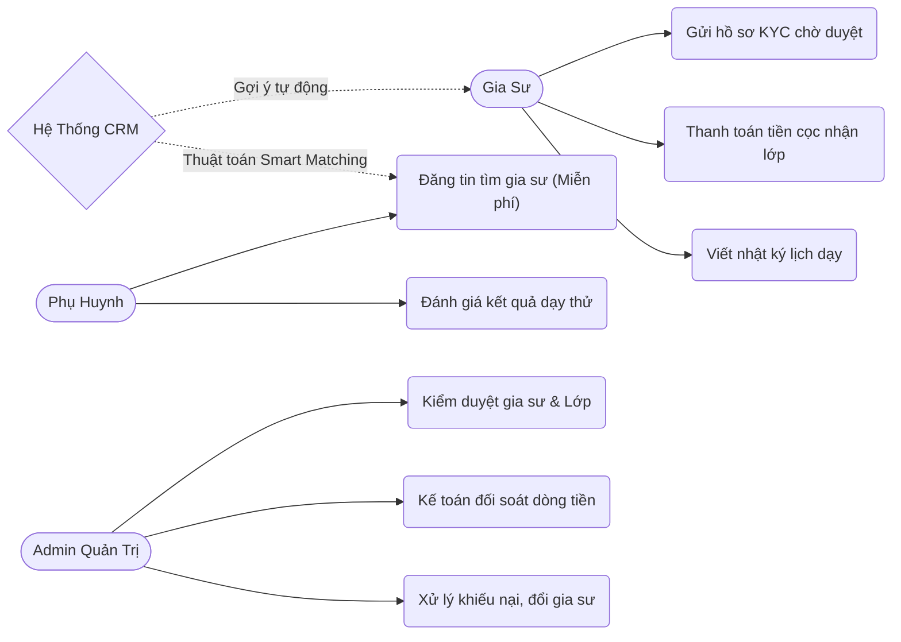
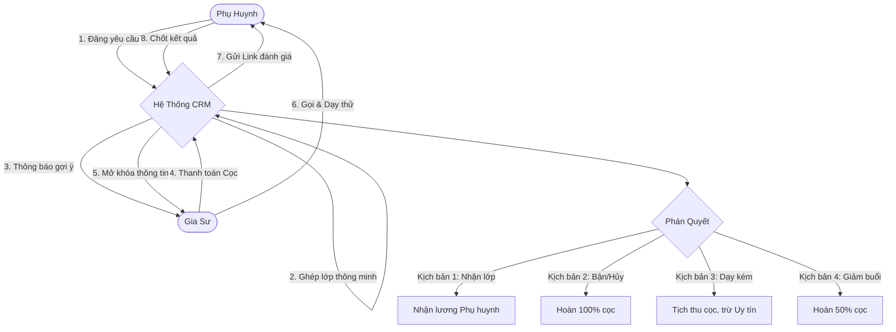
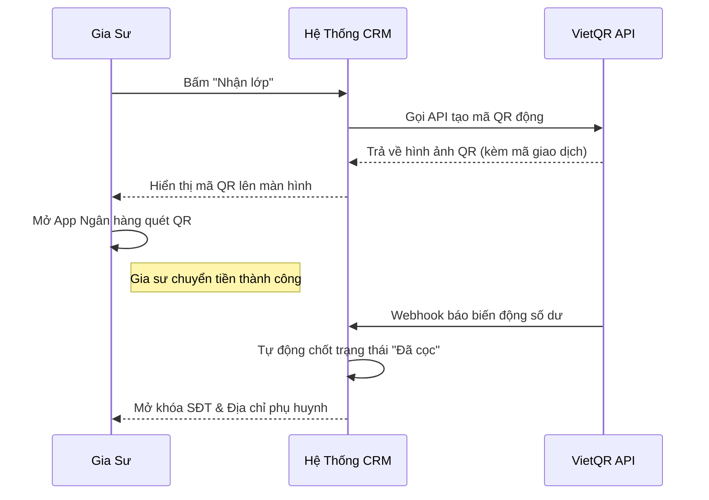

# 1. Tên đề tài
- Xây dựng Hệ thống Web CRM Quản lý và Kết nối Trung tâm Gia sư Trực tuyến. 

# 2. Lý do chọn đề tài và khả năng áp dụng vào thực tế
## 2.1. Lý do chọn đề tài 
- Hiện nay, việc tìm gia sư và nhận lớp gia sư đang gặp rất nhiều bất cập:
+ Phụ huynh: Lo ngại gặp gia sư kém chất lượng, bị ép đóng tiền mua gói học phí trước nhưng trung tâm làm việc thiếu trách nhiệm, khó đổi gia sư nếu quá trình giảng dạy không phù hợp.
+ Gia sư (Sinh viên/Giáo viên): E ngại các trung tâm môi giới lừa đảo chiếm đoạt tiền cọc. Trường hợp phụ huynh hủy lớp đột xuất nhưng trung tâm không hỗ trợ hoàn trả tiền cọc.
+ Trung tâm môi giới: Quản lý thủ công (ghi sổ, Excel), tốn kém chi phí nhân sự tư vấn, dễ xảy ra sai sót trong quá trình đối soát tài chính với gia sư.

## 2.2. Khả năng áp dụng thực tế
- Đồ án này giải quyết trực tiếp các bất cập trên bằng cách tạo ra một nền tảng minh bạch:
+ Không ép phụ huynh nạp tiền trước: Phụ huynh đăng tin tìm gia sư miễn phí, tiền học phí sẽ trả trực tiếp cho gia sư vào cuối tháng.
+ Bảo vệ tiền cọc cho gia sư: Gia sư thực hiện thanh toán tiền cọc để nhận thông tin lớp. Nếu phụ huynh đổi ý hủy lớp, hệ thống đảm bảo hoàn cọc 100% trong 24h.
+ Tự động hóa trung tâm: Không cần nhân viên sale gọi điện. Phụ huynh đăng yêu cầu -> web tự động gửi thông báo đến các gia sư phù hợp -> gia sư vào nhận lớp. Mọi giao dịch đối soát tiền cọc đều được ghi nhận tự động, rõ ràng.

# 3. Phân tích đề tài



=>> Hệ thống được chia làm 3 Cổng (Portal) hoạt động độc lập nhưng liên kết dữ liệu chặt chẽ với nhau:

## 3.1. Cổng Phụ Huynh (Client Portal): Dành cho phụ huynh và học sinh.
- Đăng ký & Đăng nhập: Nhanh chóng, tiện lợi qua mã OTP Số điện thoại hoặc tài khoản Google. Một tài khoản phụ huynh có thể tạo và quản lý hồ sơ tìm gia sư cho nhiều con. 
- Đăng tin tìm gia sư: Điền yêu cầu (môn, lớp, giá, lịch học) hoàn toàn miễn phí.
- Quản lý học tập: Xem nhật ký học tập (điểm số, bài tập) do gia sư cập nhật.
- Đánh giá & Phán quyết: Đánh giá chất lượng sau khi học thử (chốt nhận gia sư hoặc yêu cầu đổi người).
- Bảo hành: Yêu cầu trung tâm đổi gia sư miễn phí trong 30 ngày nếu không hài lòng về chất lượng.

## 3.2. Cổng Gia Sư (Tutor Portal): Dành cho sinh viên và giáo viên.
- Đăng ký & Xác thực danh tính: Đăng ký tài khoản và bắt buộc tải lên hình ảnh CCCD, thẻ sinh viên/bằng cấp. Tài khoản phải chờ trung tâm kiểm duyệt hợp lệ mới được phép hoạt động và nhận lớp.
- Quản lý & Thanh toán: Hệ thống cung cấp các chức năng để quản lý dòng tiền và thực hiện thanh toán trên nền tảng (nạp/rút).
- Nhận lớp & Đóng cọc: Lướt "Sàn lớp" để tìm lớp phù hợp, tiến hành thanh toán tiền cọc trên hệ thống để mở khóa thông tin liên hệ của phụ huynh.
- Nhật ký & Lịch dạy: Viết báo cáo sau mỗi buổi dạy, xin phép nghỉ dạy (trước 24h).
- Theo dõi thu nhập: Xem bảng lương dự kiến và điểm uy tín (Karma).

## 3.3. Cổng Quản Trị (Admin CRM Portal): Dành cho nhân viên điều hành của trung tâm.
- Tài khoản Nội bộ & Phân quyền: Đăng nhập bằng tài khoản nội bộ do hệ thống cấp phát. Phân quyền chặt chẽ các chức năng tùy theo vai trò: Giám đốc, Kế toán, và Chăm sóc khách hàng (CSKH).
- Thuật toán ghép lớp thông minh: Tự động phân tích và thông báo gợi ý tới Top 5 gia sư phù hợp nhất ngay khi có lớp mới.
- Bảng theo dõi lớp: Giám sát trạng thái các lớp: Đang tuyển -> Đang dạy thử -> Đã chốt
- Kế toán & Đối soát cọc: Màn hình chuyên dụng quản lý dòng tiền. Kế toán có thể đối soát và duyệt các lệnh như: "Duyệt doanh thu", "Hoàn cọc", và "Duyệt yêu cầu thanh toán/rút tiền".
- CSKH: Quản lý toàn diện dữ liệu khách hàng và tiếp nhận xử lý các phiếu yêu cầu bảo hành/đổi gia sư.

=>> Luồng hoạt động chi tiết giữa các cổng:



**Giai đoạn 1: Đăng tin & Tự động ghép nối**
1. Phụ huynh: Lên web điền form tìm gia sư.
2. Hệ thống CRM: Tự động kiểm duyệt, đẩy tin lên "Sàn lớp" và lập tức quét tìm gia sư phù hợp nhất.
3. Ghép lớp thông minh: Tự động gửi thông báo đề xuất lớp học tới Top 5 gia sư có mức độ phù hợp cao nhất (dựa trên môn, lịch rảnh và vị trí).

**Giai đoạn 2: Đặt cọc & Dạy thử**



1. Gia sư: Bấm "Nhận lớp" và thanh toán tiền cọc trên hệ thống. 
2. Hệ thống: Xác nhận cọc, lập tức mở khóa số điện thoại và địa chỉ nhà của phụ huynh. 
3. Dạy thử: Trong vòng 2 giờ, gia sư gọi điện hẹn lịch và đến dạy thử 1 buổi. Gia sư sau đó cập nhật nhật ký buổi dạy lên hệ thống.

**Giai đoạn 3: Phán quyết & Quyết toán cọc (4 Kịch bản)** 
Hệ thống gửi link cho phụ huynh đánh giá kết quả dạy thử, sẽ có 4 trường hợp xảy ra:
1. Kịch bản 1 (Chốt nhận gia sư): Tiền cọc của gia sư chuyển thành phí môi giới của trung tâm. Gia sư dạy chính thức và nhận lương trực tiếp từ phụ huynh.
2. Kịch bản 2 (Hủy do phụ huynh đổi ý/bận): Gia đình hoãn học. Trung tâm sẽ hoàn trả 100% tiền cọc cho gia sư trong 24h.
3. Kịch bản 3 (Từ chối do lỗi gia sư): Gia sư dạy kém/đi muộn. Trung tâm sẽ tịch thu cọc, trừ điểm uy tín (Karma), và lập tức bảo hành đổi gia sư khác cho phụ huynh.
4. Kịch bản 4 (Chốt nhưng giảm số buổi): Phụ huynh nhận gia sư nhưng giảm số buổi học/tuần. Trung tâm sẽ hoàn trả 50% tiền cọc cho gia sư.

=>> Kế hoạch tiến hành làm (Thời gian sắp tới)
(Dự kiến kế hoạch triển khai các bước xây dựng code)
1. Giai đoạn 1: Thiết kế cơ sở dữ liệu và dựng khung giao diện cho 3 phân hệ (Phụ huynh, Gia sư, Quản trị).
2. Giai đoạn 2: Xây dựng chức năng cốt lõi: Phụ huynh đăng tin tìm lớp, hệ thống hiển thị thông tin lên sàn lớp để gia sư tiếp cận.
3. Giai đoạn 3: Tích hợp hệ thống thanh toán tự động để mở khóa lớp. Xây dựng hệ thống đánh giá/chốt lớp sau khi hoàn thành học thử.
4. Giai đoạn 4: Phát triển các chức năng quản trị cho trung tâm (Bảng kéo thả theo dõi lớp, Bảng đối soát tài chính dành cho kế toán).
5. Giai đoạn 5: Kiểm thử luồng chạy thực tế, sửa lỗi và viết báo cáo hoàn thiện.

# 4. Các công cụ sử dụng

```mermaid
flowchart LR
    %% Khai báo các thành phần
    subgraph Frontend [Frontend (React/Vite)]
        CP(Cổng Phụ Huynh)
        TP(Cổng Gia Sư)
        AP(Cổng Quản Trị)
    end
    
    subgraph Backend [Backend (NestJS)]
        API("REST API & Socket.IO")
        Logic("Business Logic & CRM")
    end
    
    subgraph Database [Database & Storage]
        PG[("PostgreSQL")]
        RD[("Redis Cache")]
    end
    
    %% Luồng dữ liệu
    CP & TP & AP <-->|HTTP/WS| API
    API <--> Logic
    Logic <--> PG
    Logic <--> RD
```

## 4.1. Công cụ & Môi trường phát triển:
- Trình soạn thảo mã (IDE): Visual Studio Code (VS Code).
- Quản lý mã nguồn: Sử dụng Git và lưu trữ mã nguồn trên GitHub.
- Môi trường Database: Sử dụng Docker Desktop để chạy các container chứa PostgreSQL và Redis ngay trên máy cá nhân một cách gọn nhẹ (thay thế cho XAMPP kiểu cũ).
- Kiểm thử API & Dữ liệu: Dùng Postman / Swagger để test API Backend, và phần mềm DBeaver (hoặc pgAdmin) để kết nối và xem trực tiếp dữ liệu trong PostgreSQL.

## 4.2. Ngôn ngữ & Framework lập trình (Viết code chính):
- Frontend (Giao diện Web): Sử dụng  ReactJS (Vite) kết hợp với CSS/Tailwind. Phân hệ Admin Quản trị sẽ sử dụng bộ thư viện Ant Design để xây dựng các bảng biểu, màn hình thống kê chuyên nghiệp.
- Backend (Logic máy chủ): Viết bằng Node.js sử dụng framework NestJS để xử lý luồng nghiệp vụ. Tích hợp thêm thư viện Socket.IO để xử lý các tính năng thông báo theo thời gian thực (nhảy chuông ngay lập tức mà không cần tải lại trang).

## 4.3. Cơ sở dữ liệu & Lưu trữ (Tài nguyên):
- Database cốt lõi: Dùng PostgreSQL để lưu trữ toàn bộ thông tin người dùng, danh sách lớp học và giao dịch tài chính.
- Cache (Bộ nhớ đệm): Dùng Redis để tăng tốc độ truy xuất dữ liệu và quản lý phiên đăng nhập an toàn.
- Lưu trữ Đám mây (Cloud Storage): Sử dụng Cloudinary hoặc AWS S3 để lưu trữ file ảnh (ảnh CCCD, bằng cấp gia sư, ảnh bài tập).
