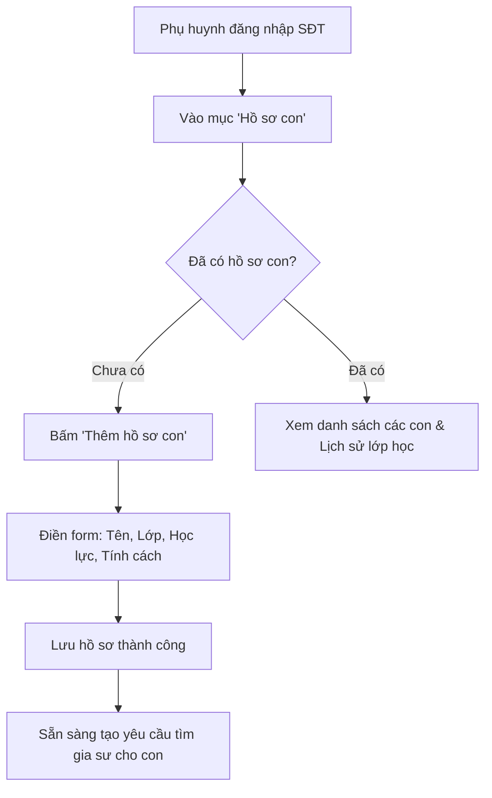

# ĐẶC TẢ NGHIỆP VỤ: HỒ SƠ GIA ĐÌNH & HỌC SINH (CLIENT PORTAL)

> **Mã phân hệ:** CLI-REF-01  
> **Phân hệ:** Cổng Khách hàng (Client Portal)  
> **Đối tượng:** Phụ huynh (Parent), Học sinh (Student)

---

## 1. Mục Tiêu Nghiệp Vụ

Trong mô hình gia đình tại Việt Nam, một phụ huynh thường quản lý việc học cho từ 1 đến 3 con ở các độ tuổi và cấp học khác nhau. 
Hệ thống triển khai kiến trúc **Family Profile** tinh gọn:
* **Tài khoản duy nhất:** Đăng ký bằng Số điện thoại của Phụ huynh.
* **Hồ sơ độc lập cho từng con:** Mỗi con có một bảng thông tin về năng lực, trường lớp, tính cách và lịch sử học tập riêng.
* **Không lưu trữ ví tiền phức tạp:** Tập trung toàn bộ vào thông tin học tập của con để đội ngũ Sales/Gia sư có thể cá nhân hóa phương pháp dạy.

---

## 2. Cấu Trúc Dữ Liệu Hồ Sơ Con (Child Profile Data Model)

Mỗi hồ sơ con được gắn với `parent_id` bao gồm các trường thông tin:

| Trường thông tin | Bắt buộc | Ví dụ | Ý nghĩa nghiệp vụ |
| :--- | :---: | :--- | :--- |
| `full_name` | Có | Nguyễn Minh Khôi | Tên học sinh để gia sư xưng hô |
| `gender` | Có | Nam / Nữ | Phục vụ ghép gia sư cùng/khác giới theo nhu cầu |
| `birth_date` | Có | 15/08/2012 (Lớp 8) | Xác định lứa tuổi và tâm lý lứa tuổi |
| `school_name` | Không | THCS Trưng Vương | Biết chương trình học ở trường (Công lập/Quốc tế) |
| `current_grade` | Có | Lớp 8 | Cấp lớp cần gia sư kèm cặp |
| `academic_level` | Có | Mất gốc Toán hình | Đánh giá học lực hiện tại để chọn gia sư phù hợp |
| `personality_notes`| Không | Nhút nhát, sợ hỏi bài | Ghi chú tâm lý giúp gia sư chuẩn bị phương pháp dạy |
| `target_goal` | Không | Thi đỗ chuyên Toán | Mục tiêu kỳ vọng của gia đình |

---

## 3. Quy Trình Nghiệp Vụ: Thêm & Quản Lý Hồ Sơ Con

### 3.1. Các bước thực hiện
1. Phụ huynh đăng nhập vào Client Portal bằng Số điện thoại (xác thực OTP hoặc mật khẩu).
2. Điều hướng tới mục **"Hồ sơ con"** (`/client/children`).
3. Bấm nút **"Thêm con"** $\rightarrow$ Nhập thông tin con.
4. Bấm **"Lưu hồ sơ"** $\rightarrow$ Bản ghi được lưu vào cơ sở dữ liệu.

### 3.2. Quy tắc nghiệp vụ (Business Rules)
* **BR-CHILD-01 (Số lượng con tối đa):** Một tài khoản phụ huynh được tạo tối đa **5 hồ sơ con**.
* **BR-CHILD-02 (Ràng buộc khi xóa):** 
  * Cho phép xóa hồ sơ con nếu con chưa từng tham gia lớp học nào và không có yêu cầu tìm gia sư đang hoạt động.
  * Nếu con đang có lớp học (kể cả lớp đã hoàn thành), hệ thống chỉ cho phép **"Ẩn hồ sơ"** để giữ lại dữ liệu lịch sử đối soát.

---

## 4. Danh Sách Lịch Sử Học Tập Của Con
Tại trang chi tiết của mỗi con, phụ huynh có thể xem:
* Lớp học hiện tại: Môn gì, gia sư nào đang dạy, bắt đầu từ ngày nào.
* Lịch sử các gia sư từng dạy thử: Đạt hay không đạt, đánh giá sao của phụ huynh.
* Đánh giá định kỳ của gia sư về sự tiến bộ của con qua từng tháng.
