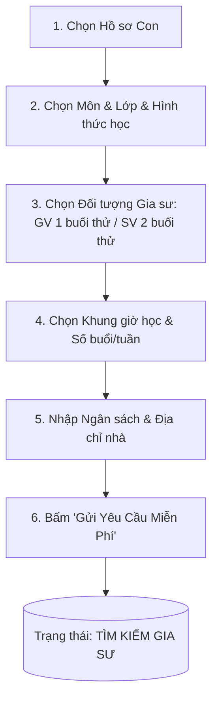

# ĐẶC TẢ NGHIỆP VỤ: ĐĂNG YÊU CẦU TÌM GIA SƯ MIỄN PHÍ (CLIENT PORTAL)

> **Mã phân hệ:** CLI-REF-02  
> **Phân hệ:** Cổng Khách hàng (Client Portal)  
> **Đối tượng:** Phụ huynh (Parent), Tư vấn viên (Sales)

---

## 1. Mục Tiêu Nghiệp Vụ & Nguyên Tắc "Không Rủi Ro"

Trong mô hình cũ, phụ huynh bị ép phải nạp tiền triệu mua gói 10 buổi ngay từ đầu, khiến tỷ lệ bỏ rơi phễu (Drop-off) lên tới hơn 85%.
Mô hình cải tạo áp dụng **Triết lý Bán hàng Hiện đại**:
* **Miễn phí 100% khi tạo yêu cầu:** Phụ huynh không cần thanh toán bất kỳ đồng nào.
* **Bảo mật tuyệt đối thông tin (Anti-bypass & Privacy):** 
  * Tin đăng công khai trên sàn chỉ hiển thị Quận/Huyện (ví dụ: *"Quận Cầu Giấy, Hà Nội"*).
  * **Tuyệt đối ẩn số điện thoại, tên phụ huynh và số nhà cụ thể** trên tất cả các kênh công khai để chống lộ dữ liệu và chống gia sư tự ý đi đêm.

---

## 2. Biểu Mẫu Tạo Yêu Cầu Tìm Gia Sư (Tutor Request Form)



### 2.1. Các trường thông tin chi tiết:
1. **Học sinh thụ hưởng:** Chọn 1 bé từ danh sách hồ sơ con.
2. **Môn học cần tìm:** Toán, Văn, Anh, Lý, Hóa, Sinh, Tin học, Luyện chữ, Tiếng Nhật...
3. **Cấp lớp:** Chọn từ Lớp 1 đến Lớp 12, Luyện thi ĐH, Giao tiếp.
4. **Hình thức học:** Tại nhà (Offline) hoặc Trực tuyến (Online).
5. **Yêu cầu đối tượng gia sư (`target_tutor_type`):**
   * 🎓 **Sinh viên (Student Tutor):** Học phí vừa phải, dễ gần gũi với học sinh. **Quy định dạy thử: 2 buổi**.
   * 👩‍🏫 **Giáo viên (Teacher):** Có kinh nghiệm sư phạm vững vàng, chuyên luyện thi. **Quy định dạy thử: 1 buổi**.
   * **Giới tính ưu tiên:** Nam / Nữ / Không yêu cầu.
6. **Lịch học mong muốn:**
   * Số buổi/tuần (ví dụ: 2 buổi/tuần, 3 buổi/tuần).
   * Các thứ trong tuần và khung giờ (ví dụ: Tối Thứ 3 và Tối Thứ 6 từ 19h00 - 21h00).
7. **Địa chỉ giảng dạy:**
   * Tỉnh/Thành phố $\rightarrow$ Quận/Huyện $\rightarrow$ Phường/Xã $\rightarrow$ Số nhà/Tên tòa nhà.
8. **Mức học phí dự kiến:** Khoảng giá phụ huynh sẵn sàng chi trả (ví dụ: 200,000 đ - 300,000 đ/buổi 2 tiếng).

---

## 3. Vòng Đời Yêu Cầu Tìm Gia Sư (Request State Lifecycle)

```text
[MỚI TẠO] ──> ĐANG TƯ VẤN (Sales gọi điện xác nhận) 
                    │
                    ├──> ĐANG TÌM GIA SƯ (Matching lọc ứng viên)
                    │
                    ├──> ĐÃ GIAO DẠY THỬ (Gia sư đã cọc & liên hệ PH)
                    │
                    └──> HOÀN TẤT / ĐÓNG YÊU CẦU (Chốt lớp chính thức)
```

---

## 4. Trải Nghiệm Khách Hàng Sau Khi Đăng Tin
* Sau khi bấm gửi yêu cầu, màn hình hiển thị: *"Yêu cầu của bạn đã được gửi thành công! Tư vấn viên của trung tâm sẽ gọi điện hỗ trợ trong vòng 15 phút."*
* Phụ huynh có thể xem trạng thái trực tiếp trên Web Client Portal theo thời gian thực (Real-time).
* Khi trung tâm chọn được gia sư phù hợp và gia sư đã hoàn tất đặt cọc, phụ huynh nhận được tin nhắn Zalo ZNS / SMS kèm đường link xem bản **Tóm tắt hồ sơ gia sư (Profile Card)** trực tiếp trên trình duyệt.
