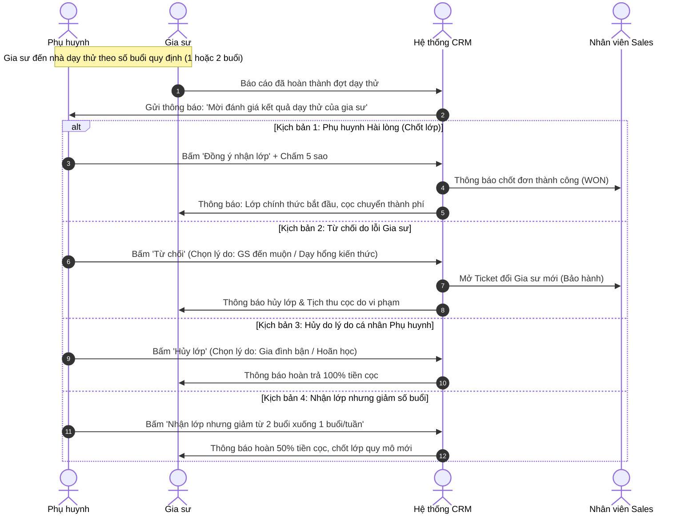

# ĐẶC TẢ NGHIỆP VỤ: TRẢI NGHIỆM DẠY THỬ & ĐÁNH GIÁ (CLIENT PORTAL)

> **Mã phân hệ:** CLI-REF-03  
> **Phân hệ:** Cổng Khách hàng (Client Portal)  
> **Đối tượng:** Phụ huynh (Parent), Học sinh (Student), Gia sư (Tutor)

---

## 1. Bản Chất Nghiệp Vụ Dạy Thử

Giai đoạn dạy thử là "điểm chạm quan trọng nhất" trong quyết định mua dịch vụ của phụ huynh.
Hệ thống quy định rõ:
* **Gia sư là Giáo viên:** Thời gian thử việc là **1 buổi duy nhất**.
* **Gia sư là Sinh viên:** Thời gian thử việc là **2 buổi**.
* **Tính chất học phí dạy thử:**
  * Nếu phụ huynh nhận dạy chính thức: Buổi dạy thử được tính là buổi học có tính tiền trong tháng học đầu tiên.
  * Nếu phụ huynh từ chối (reject): Buổi dạy thử là hoàn toàn miễn phí cho phụ huynh.

---

## 2. Quy Trình Dạy Thử & Phản Hồi Kết Quả (Trial Feedback Flow)

---

## 3. Biểu Mẫu Đánh Giá Sau Dạy Thử (Evaluation Form)

Trên Client Portal, màn hình phản hồi hiển thị 4 lựa chọn rõ ràng:

### 3.1. Lựa chọn 1: "Chốt nhận gia sư này" (`ACCEPT`)
* **Chấm điểm sao:** 1 sao đến 5 sao.
* **Nhận xét phương pháp:** Lời khen hoặc góp ý gửi tới gia sư.
* **Thỏa thuận lịch học chính thức:** Xác nhận lại các buổi trong tuần và ngày bắt đầu học chính thức.

### 3.2. Lựa chọn 2: "Không đạt yêu cầu - Lỗi do Gia sư" (`REJECT_TUTOR_FAULT`)
* Bắt buộc chọn lý do vi phạm:
  1. *Gia sư đến trễ giờ, về sớm, tác phong thiếu nghiêm túc*.
  2. *Kiến thức chuyên môn chưa vững, không giải được bài tập của con*.
  3. *Phương pháp giảng dạy không phù hợp với tâm lý của con*.
  4. *Gia sư tự ý hủy hẹn hoặc không đến dạy thử*.
* **Hành động tiếp theo:** Phụ huynh được lựa chọn:
  * *"Yêu cầu đổi gia sư khác miễn phí"* $\rightarrow$ Hệ thống tự động chuyển lại phễu tìm kiếm gia sư mới cho con.
  * *"Hủy hoàn toàn nhu cầu tìm gia sư"*.

### 3.3. Lựa chọn 3: "Hủy lớp - Lý do từ phía Gia đình" (`REJECT_PARENT_FAULT`)
* Bắt buộc chọn lý do:
  1. *Lịch học ở trường của con bị thay đổi đột xuất*.
  2. *Gia đình có việc bận riêng / chuyển chỗ ở*.
  3. *Con muốn tự học / người nhà kèm cặp*.
* **Ý nghĩa:** Căn cứ minh bạch này giúp trung tâm hoàn lại tiền cọc cho gia sư mà không gây tranh cãi.

### 3.4. Lựa chọn 4: "Nhận dạy nhưng Giảm số buổi" (`SCALE_DOWN`)
* Ví dụ: Ban đầu yêu cầu 2 buổi/tuần, sau dạy thử phụ huynh thấy con chỉ cần học 1 buổi/tuần:
  * Phụ huynh cập nhật lại số buổi học là 1 buổi/tuần.
  * Hệ thống tự động chia đôi tiền cọc: Hoàn lại 50% tiền cọc cho gia sư, trung tâm chỉ thu phí 1 buổi.
