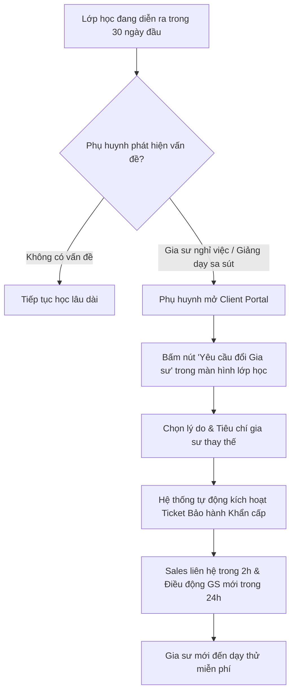

# ĐẶC TẢ NGHIỆP VỤ: THANH TOÁN TRỰC TIẾP & BẢO HÀNH 30 NGÀY (CLIENT PORTAL)

> **Mã phân hệ:** CLI-REF-04  
> **Phân hệ:** Cổng Khách hàng (Client Portal)  
> **Đối tượng:** Phụ huynh (Parent), Tư vấn viên (Sales / CSKH)

---

## 1. Cơ Chế Thanh Toán Trực Tiếp (Direct Payment)

Thay vì buộc phụ huynh nạp tiền vào ví điện tử trung gian của hệ thống:
* **Học phí thanh toán sau:** Phụ huynh trả tiền học trực tiếp cho gia sư vào **cuối tháng** (hoặc sau mỗi chu kỳ 10 buổi học chính thức).
* **Hình thức linh hoạt:** Tiền mặt hoặc chuyển khoản ngân hàng trực tiếp vào STK của gia sư.
* **Quyền lợi:** Phụ huynh chỉ trả tiền khi con đã thực sự được học đầy đủ số buổi, không lo bị trung tâm hay gia sư chiếm dụng vốn.

---

## 2. Chính Sách "Bảo Hành Đổi Gia Sư Miễn Phí Trong 30 Ngày"

Để tạo sự an tâm tuyệt đối cho khách hàng khi thuê gia sư qua trung tâm, hệ thống cung cấp tính năng **Bảo hành 30 ngày (30-Day Tutor Warranty)**:

### 2.1. Điều kiện áp dụng bảo hành
* Thời gian: Trong vòng **30 ngày** kể từ ngày bắt đầu buổi dạy chính thức đầu tiên.
* Các trường hợp được bảo hành đổi người miễn phí:
  1. Gia sư bận việc đột xuất, xin nghỉ dạy dài hạn.
  2. Học sinh không hòa hợp được với phong cách giảng dạy của gia sư.
  3. Phụ huynh nhận thấy sau 1 tháng con không có tiến bộ rõ rệt.

### 2.2. Chi phí bảo hành
* **Hoàn toàn miễn phí 100%:** Phụ huynh không phải trả thêm bất kỳ một khoản phí môi giới nào cho trung tâm khi yêu cầu đổi gia sư trong thời hạn bảo hành.

---

## 3. Khảo Sát Mức Độ Hài Lòng (CSAT & NPS Survey)
* Sau 30 ngày học đầu tiên, Client Portal tự động hiển thị popup khảo sát 1 chạm:
  * *"Anh/chị đánh giá chất lượng dịch vụ của trung tâm ở mức mấy điểm (1 - 10)?"*
  * *"Anh/chị có sẵn sàng giới thiệu trung tâm cho bạn bè/người quen không?"*
* Nếu điểm số $\le 6$: Hệ thống lập tức tạo việc khẩn cho Trưởng phòng CSKH gọi điện chăm sóc và xử lý ngay trong ngày.
