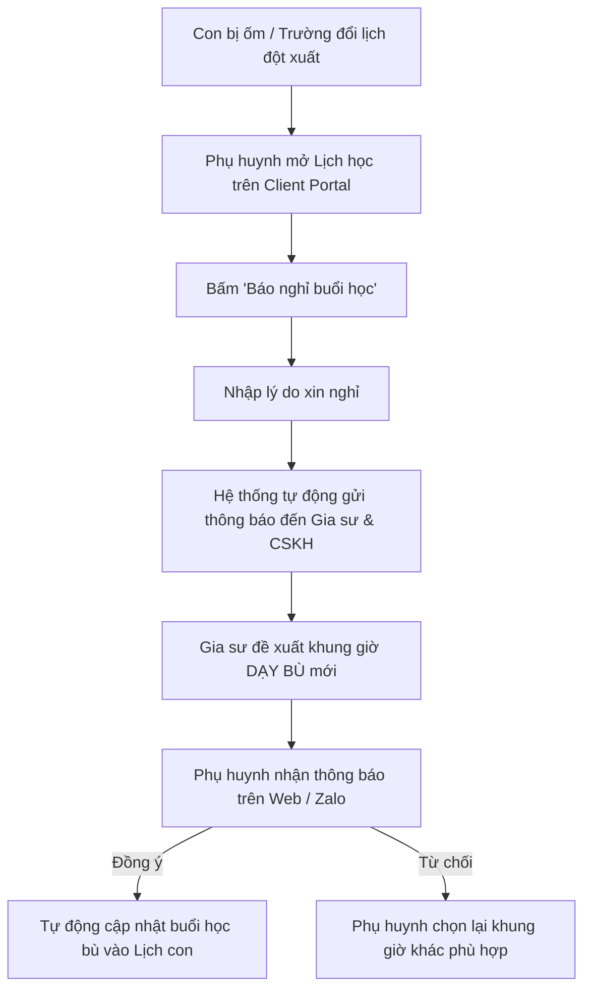

# ĐẶC TẢ NGHIỆP VỤ: THEO DÕI LỊCH HỌC, NHẬT KÝ & BÁO NGHỈ (CLIENT PORTAL)

> **Mã phân hệ:** CLI-REF-05  
> **Phân hệ:** Cổng Khách hàng (Client Portal)  
> **Đối tượng:** Phụ huynh (Parent), Học sinh (Student), Gia sư (Tutor)

---

## 1. Mục Tiêu Nghiệp Vụ

Dù không bắt phụ huynh phải nhập mã PIN trừ ví phức tạp như hệ thống cũ, tính năng **Theo dõi Lịch học & Nhật ký con học** là tiện ích then chốt giúp phụ huynh:
* Nắm bắt chính xác lịch học các con trong tuần/tháng.
* Biết rõ hôm nay con học bài gì, làm bài tập thế nào, thái độ học ra sao dù phụ huynh đi làm bận rộn.
* Báo nghỉ học tiện lợi chỉ bằng 1 chạm, tránh gia sư đến nhà vô ích.
* Đối soát chuẩn xác số buổi học trong tháng để thanh toán học phí cho gia sư.

---

## 2. Thời Khóa Biểu Học Tập Của Con (Student Calendar)

* **Xem theo tuần hoặc theo tháng:**
  * Hiển thị danh sách các buổi học của từng bé: Môn học, gia sư phụ trách, thời gian bắt đầu - kết thúc.
  * Phân biệt màu sắc cho từng bé nếu gia đình có nhiều con.
* **Mã màu trạng thái buổi học:**
  * 🟢 **Xanh lá:** Buổi học đã diễn ra thành công (đã có nhật ký nhận xét).
  * 🔵 **Xanh dương:** Buổi học sắp tới theo lịch định kỳ.
  * ⚪ **Xám:** Buổi học đã được báo nghỉ học hợp lệ.
  * 🟡 **Vàng:** Buổi học bù được đề xuất đang chờ phụ huynh phê duyệt.

---

## 3. Xem Nhật Ký Buổi Học & Nhận Xét Của Gia Sư (Daily Session Review)

Sau mỗi buổi học, phụ huynh mở app xem chi tiết:
1. **Thời gian thực dạy:** Ví dụ: 19h05 - 21h05.
2. **Nội dung bài học:** *Hình học: Định lý Pytago và luyện tập giải bài tập SGK.*
3. **Đánh giá thái độ con:** *Con tiếp thu nhanh, tập trung tốt, tính toán cẩn thận hơn buổi trước.*
4. **Bài tập về nhà (Homework):** *Bài 1, 2, 4 phiếu bài tập đính kèm.*
5. **Ảnh phiếu bài tập / Điểm kiểm tra:** Phụ huynh bấm vào ảnh để phóng to xem bài làm và nét chữ của con.

---

## 4. Báo Nghỉ Học & Phê Duyệt Lịch Học Bù (Leave & Reschedule)

---

## 5. Đối Soát Số Buổi Học Cuối Tháng (Monthly Settlement)

* Đến ngày cuối tháng (ví dụ ngày 28-30 hàng tháng):
* Client Portal tự động tổng hợp:
  * **Học sinh:** Bé Khôi (Lớp 9).
  * **Gia sư:** Thầy Nguyễn Văn A (Môn Toán).
  * **Tổng số buổi đã học trong tháng:** 8 buổi (Kèm danh sách chi tiết từng ngày đã học).
  * **Đơn giá:** 200,000 đ / buổi.
  * **Tổng tiền cần thanh toán:** 1,600,000 đ.
* Phụ huynh thanh toán trực tiếp (tiền mặt/chuyển khoản) cho gia sư $\rightarrow$ Cả hai bên đều minh bạch con số, triệt tiêu 100% việc tranh cãi nhớ nhầm số buổi.
