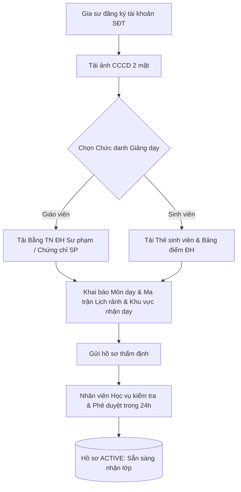

# ĐẶC TẢ NGHIỆP VỤ: HỒ SƠ NĂNG LỰC & PHÂN LOẠI GIA SƯ (TUTOR PORTAL)

> **Mã phân hệ:** TUT-REF-01  
> **Phân hệ:** Cổng Đối tác Gia sư (Tutor Portal)  
> **Đối tượng:** Gia sư (Sinh viên, Giáo viên), Nhân viên Học vụ (Academic)

---

## 1. Mục Tiêu Nghiệp Vụ

Để đảm bảo chất lượng giảng dạy và cung cấp thông tin minh bạch cho phụ huynh, mọi gia sư tham gia hệ thống đều phải trải qua quy trình xác minh năng lực (KYC) và được phân loại rõ ràng:
* **Phân định rõ 2 nhóm đối tượng:** Sinh viên và Giáo viên.
* **Kiểm duyệt bằng cấp chặt chẽ:** Chỉ những môn học và cấp lớp được Học vụ phê duyệt mới được phép nhận lớp.

---

## 2. Quy Trình Khai Báo & Thẩm Định Hồ Sơ

---

## 3. Chi Tiết Các Trường Thông Tin Hồ Sơ

| Nhóm thông tin | Trường dữ liệu | Bắt buộc | Ghi chú nghiệp vụ |
| :--- | :--- | :---: | :--- |
| **Định danh cá nhân** | `full_name`, `gender`, `birth_date` | Có | Tên thật theo CCCD |
| **Xác minh danh tính** | Ảnh chụp CCCD mặt trước & sau | Có | Mã hóa lưu trữ an toàn |
| **Phân loại gia sư** | `tutor_type`: `TEACHER` hoặc `STUDENT` | Có | **Quy định số buổi dạy thử: GV 1 buổi, SV 2 buổi** |
| **Chứng minh học vấn** | Thẻ SV / Bằng ĐH Sư phạm | Có | Căn cứ duyệt danh hiệu và mức lương |
| **Địa chỉ cư trú** | Quận/Huyện, Phường/Xã | Có | Nơi ở hiện tại của gia sư |
| **Khu vực nhận dạy** | `teaching_areas` (ví dụ: Cầu Giấy, Nam Từ Liêm) | Có | Các Quận/Huyện gia sư có thể đến dạy |
| **Môn dạy & Khối lớp** | Danh sách: Môn (Toán), Lớp (Lớp 9) | Có | Mỗi môn có cờ `is_verified` (Chờ duyệt / Đã duyệt) |
| **Ma trận Lịch rảnh** | Bảng lưới 7 ngày $\times$ 3 ca (Sáng/Chiều/Tối)| Có | Điều kiện lọc không bị trùng lịch lớp khác |

---

## 4. Quy Tắc Nghiệp Vụ Thẩm Định (Verification Rules)
* **BR-TUT-01:** Chỉ những gia sư có trạng thái hồ sơ là `VERIFIED` mới được quyền nhìn thấy danh sách lớp và bấm nút "Nhận lớp".
* **BR-TUT-02:** Gia sư chỉ được nhận lớp thuộc những môn học mà mình đã được trung tâm duyệt `is_verified = true`.
* **BR-TUT-03:** Nếu phát hiện làm giả thẻ sinh viên hoặc bằng cấp, tài khoản lập tức bị khóa vĩnh viễn và đưa vào danh sách đen (Blacklist).
