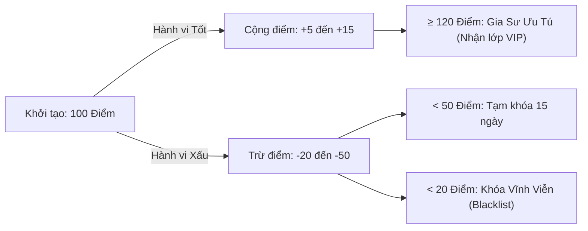

# ĐẶC TẢ NGHIỆP VỤ: ĐIỂM TÍN NHIỆM & UY TÍN GIA SƯ (TUTOR PORTAL)

> **Mã phân hệ:** TUT-REF-02  
> **Phân hệ:** Cổng Đối tác Gia sư (Tutor Portal)  
> **Đối tượng:** Gia sư (Tutor), Quản trị viên (Admin)

---

## 1. Mục Tiêu Nghiệp Vụ

Trong mô hình môi giới gia sư, việc gia sư nhận lớp rồi tự ý bỏ không đến dạy, hoặc đến dạy trễ giờ làm hỏng hình ảnh của trung tâm là vấn đề nhức nhối nhất.
Hệ thống triển khai cơ chế **Điểm Tín Nhiệm (Tutor Karma Score)** để:
* Khen thưởng những gia sư có trách nhiệm, dạy tốt và được phụ huynh yêu mến.
* Tự động loại bỏ những gia sư thiếu tác phong sư phạm hoặc có biểu hiện gian lận.

---

## 2. Thang Điểm & Cơ Chế Biến Động Điểm Tín Nhiệm

Mỗi gia sư sau khi xác minh hồ sơ thành công được cấp **100 Điểm khởi đầu**.

### 2.1. Danh mục Quy tắc Cộng điểm (Reward Rules)
| Hành vi tích cực | Điểm cộng | Điều kiện ghi nhận |
| :--- | :---: | :--- |
| **Dạy thử thành công** | **$+15$** | Phụ huynh bấm "Đồng ý nhận gia sư" sau đợt dạy thử. |
| **Đánh giá 5 sao từ phụ huynh** | **$+10$** | Phụ huynh chấm điểm đánh giá tối đa kèm phản hồi tốt. |
| **Đóng cọc & Liên hệ phụ huynh đúng hạn** | **$+5$** | Nộp cọc và gọi điện chào phụ huynh trong vòng 2 giờ. |
| **Hoàn thành 3 tháng giảng dạy liên tục** | **$+20$** | Không có khiếu nại hay vi phạm trong suốt 3 tháng. |

### 2.2. Danh mục Quy tắc Trừ điểm & Xử phạt (Penalty Rules)
| Hành vi vi phạm | Điểm trừ | Chế tài kèm theo |
| :--- | :---: | :--- |
| **Nhận lớp nhưng tự ý bỏ dạy thử** | **$-50$** | **Tịch thu 100% tiền cọc**, khóa tài khoản 30 ngày. |
| **Đến dạy thử muộn không báo trước** | **$-20$** | Nhận cảnh cáo vàng trên bảng tin gia sư. |
| **Dạy thử thất bại do hổng kiến thức** | **$-25$** | Tịch thu cọc, yêu cầu kiểm tra lại chuyên môn môn học. |
| **Thái độ thiếu chuẩn mực sư phạm** | **$-30$** | Tịch thu cọc, trừ điểm trực tiếp. |

---

## 3. Phân Hạng Gia Sư & Quyền Lợi Đi Kèm

* 🥇 **Hạng Ưu Tú (Điểm $\ge 120$):**
  * Được gắn huy hiệu sao vàng trên hồ sơ.
  * Được quyền xem và ứng tuyển các lớp VIP / Thù lao cao trước 2 giờ so với các gia sư khác.
  * Giảm 10% phí cọc khi nhận lớp.
* 🥈 **Hạng Chuẩn (Điểm từ $60$ đến $119$):**
  * Quyền lợi bình thường, nhận lớp theo quy chế chuẩn.
* ⚠️ **Hạng Cảnh Báo (Điểm từ $20$ đến $59$):**
  * Bị giới hạn: Chỉ được nhận tối đa 1 lớp tại một thời điểm (không được nhận nhiều lớp cùng lúc).
* 🚫 **Blacklist (Điểm $< 20$):**
  * Hệ thống tự động khóa vĩnh viễn số điện thoại và CCCD của gia sư này trên toàn hệ thống.
