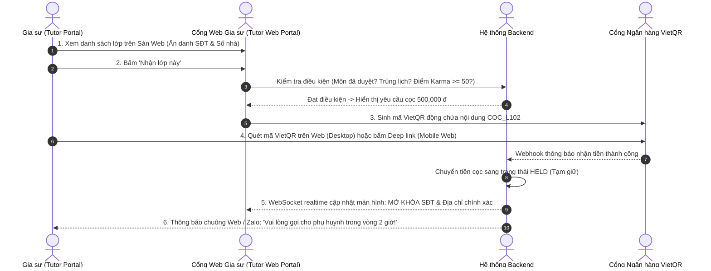

# ĐẶC TẢ NGHIỆP VỤ: SÀN LỚP & ĐẶT CỌC NHẬN LỚP (TUTOR PORTAL)

> **Mã phân hệ:** TUT-REF-03  
> **Phân hệ:** Cổng Đối tác Gia sư (Tutor Portal)  
> **Đối tượng:** Gia sư (Tutor), Kế toán (Accountant)

---

## 1. Bản Chất Khoản Tiền Cọc Nhận Lớp (Commitment Deposit)

Khác với mô hình thu học phí của phụ huynh, mô hình này yêu cầu **Gia sư phải đặt cọc khi nhận lớp**:
* **Ý nghĩa:** Khoản tiền này là **Ký quỹ bảo lãnh trách nhiệm** của gia sư trước khi nhận được thông tin liên hệ của phụ huynh.
* **Định mức tiền cọc:** Tính toán căn cứ vào số buổi học mỗi tuần:
  * Lớp 1 buổi / tuần: Cọc **250,000 đ**.
  * Lớp 2 buổi / tuần: Cọc **500,000 đ** *(Mức tiêu chuẩn phổ biến nhất)*.
  * Lớp 3 buổi / tuần: Cọc **750,000 đ**.
  * *(Hoặc cố định $40\% \times$ Học phí dự kiến tháng đầu tiên).*

---

## 2. Quy Trình Nhận Lớp & Mở Khóa Thông Tin (Unlock Contact Flow)

---

## 3. Điều Kiện Để Gia Sư Được Phép Bấm "Nhận Lớp"
Hệ thống tự động kiểm tra các ràng buộc:
1. **Chuyên môn (`is_verified`):** Môn học và khối lớp của tin đăng phải trùng khớp với môn gia sư đã được duyệt.
2. **Không xung đột lịch (`SCHEDULE_CONFLICT`):** Khung giờ của lớp mới không được trùng với các lớp gia sư đang dạy.
3. **Điểm uy tín hợp lệ:** Điểm Karma hiện tại phải $\ge 50$.
4. **Không nợ lệnh cọc cũ:** Gia sư không có lớp nào đang ở trạng thái nợ tiền cọc.

---

## 4. Bảo Mật Thông Tin & Cơ Chế Hiển Thị Địa Chỉ
* **Thông tin hiển thị CÔNG KHAI trên sàn lớp:**
  * Để gia sư định lượng chính xác quãng đường di chuyển (tránh trường hợp nhận xong mới thấy quá xa trường/nhà trọ), hệ thống hiển thị **Địa chỉ mốc cụ thể**: Tên tòa chung cư, tên đường, tên ngõ, phường, quận.
  * *Mẫu tin đăng chuẩn thực tế:* `SIÊU GẤP - SAM207 - TOÁN 10 (TB, KHÁ) - 200K/ 1,5 TIẾNG - 3B/T (TỐI T3,5,7) - CC HOPE 3, NGUYỄN LAM, SÀI ĐỒNG, LONG BIÊN - YCSV NỮ, DẠY TỐT`.
* **Thông tin BẢO MẬT (Chỉ mở khóa sau khi đóng cọc):**
  * Tên phụ huynh: *"Chị Lan"*.
  * Số điện thoại liên hệ: `0912 345 678`.
  * Số phòng / Số căn hộ chính xác: *"P.1208, Tòa Hope 3"*.
* **Thời hạn liên hệ:** Hệ thống kích hoạt đồng hồ đếm ngược **2 giờ**. Nếu sau 2 giờ gia sư chưa bấm "Đã liên hệ", hệ thống sẽ gửi cảnh báo nhắc nhở.
