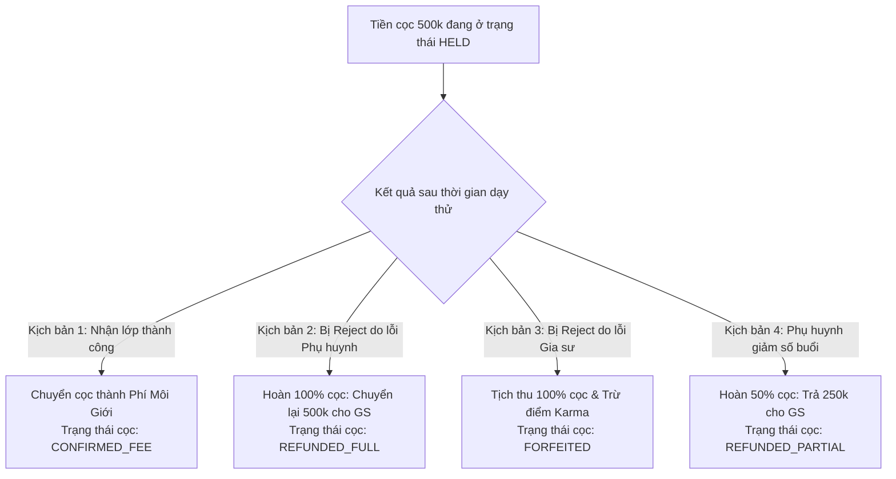

# ĐẶC TẢ NGHIỆP VỤ: DẠY THỬ & QUYẾT TOÁN TIỀN CỌC (TUTOR PORTAL)

> **Mã phân hệ:** TUT-REF-04  
> **Phân hệ:** Cổng Đối tác Gia sư (Tutor Portal)  
> **Đối tượng:** Gia sư (Tutor), Kế toán (Accountant), Học vụ (Academic)

---

## 1. Quy Định Về Thời Gian Dạy Thử Của Gia Sư

Gia sư có trách nhiệm hoàn thành số buổi dạy thử theo đúng chức danh đã đăng ký:
* **Đối với Giáo viên:** Thực hiện đúng **1 buổi dạy thử**.
* **Đối với Sinh viên:** Thực hiện đủ **2 buổi dạy thử**.

Sau mỗi buổi dạy thử, gia sư mở ứng dụng và bấm: **"Báo cáo hoàn thành buổi thử [1/2]"** kèm ghi chú ngắn gọn về nội dung bài học.

---

## 2. 4 Kịch Bản Quyết Toán Tiền Cọc Của Gia Sư

### 2.1. Kịch bản 1: Nhận lớp thành công (Happy Path)
* **Điều kiện:** Phụ huynh bấm "Đồng ý nhận lớp".
* **Xử lý tài chính:** Khoản cọc 500,000 đ chuyển từ `HELD` thành doanh thu phí môi giới của trung tâm.
* **Quyền lợi gia sư:**
  * Lớp chuyển sang trạng thái `TEACHING` chính thức.
  * Gia sư được cộng **$+15$ điểm Karma**.
  * Hàng tháng gia sư nhận đủ 100% học phí từ phụ huynh.

### 2.2. Kịch bản 2: Bị từ chối do lỗi Phụ huynh (Hoàn cọc 100%)
* **Điều kiện:** Phụ huynh hủy lớp với lý do: Gia đình bận, con đổi lịch học ở trường, không muốn thuê gia sư nữa.
* **Xử lý tài chính:** Kế toán trung tâm chuyển khoản trả lại **đúng 500,000 đ** vào tài khoản ngân hàng của gia sư trong vòng **24 giờ**.
* **Điểm uy tín:** Điểm Karma của gia sư được bảo toàn nguyên vẹn.

### 2.3. Kịch bản 3: Bị từ chối do lỗi Gia sư (Tịch thu cọc)
* **Điều kiện:** Phụ huynh phản ánh đúng: Gia sư đến trễ giờ, không đến dạy thử, hổng kiến thức căn bản.
* **Xử lý tài chính:** Trung tâm **tịch thu 100% tiền cọc (500,000 đ)** để bù đắp chi phí vận hành và tìm người thay thế cho phụ huynh.
* **Điểm uy tín:** Gia sư bị trừ **$-25$ đến $-50$ điểm Karma**.

### 2.4. Kịch bản 4: Phụ huynh giảm số buổi (Hoàn cọc 50%)
* **Điều kiện:** Ban đầu lớp yêu cầu 2 buổi/tuần (cọc 500k), sau khi dạy thử phụ huynh chỉ muốn học 1 buổi/tuần.
* **Xử lý tài chính:** 
  * Trung tâm điều chỉnh lại mức phí tương ứng quy mô 1 buổi: chỉ thu 250,000 đ.
  * Kế toán chuyển khoản **hoàn trả 250,000 đ** cho gia sư.

---

## 3. Quy Trình Khiếu Nại Hoàn Cọc (Appeal Ticket)
* Nếu gia sư bị từ chối nhưng nghi ngờ phụ huynh "bịa lý do" để quỵt cọc:
* Gia sư có thể vào màn hình lớp $\rightarrow$ Bấm **"Gửi đơn khiếu nại"**.
* Tải lên ảnh chụp màn hình tin nhắn Zalo trao đổi giữa hai bên.
* Đội ngũ Học vụ của trung tâm cam kết gọi điện xác minh chéo với phụ huynh trong vòng **24 giờ** để bảo vệ quyền lợi chính đáng cho gia sư.
