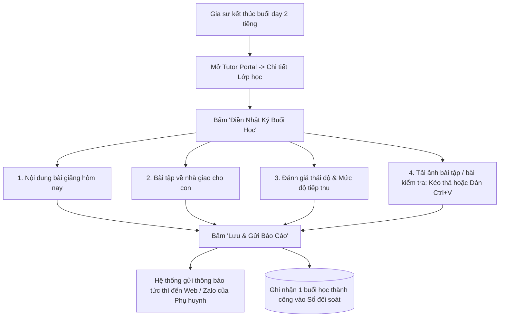

# ĐẶC TẢ NGHIỆP VỤ: NHẬT KÝ BUỔI HỌC & THEO DÕI TIẾN ĐỘ HỌC SINH (TUTOR PORTAL)

> **Mã phân hệ:** TUT-REF-05  
> **Phân hệ:** Cổng Đối tác Gia sư (Tutor Portal)  
> **Đối tượng:** Gia sư (Tutor), Phụ huynh (Parent)

---

## 1. Mục Tiêu Nghiệp Vụ

Nhật ký buổi học là công cụ đắc lực giúp gia sư:
* Báo cáo minh bạch nội dung đã dạy sau mỗi buổi cho phụ huynh mà không cần phải đứng nói chuyện trực tiếp nếu phụ huynh bận.
* Lưu lại bài tập về nhà để học sinh không thể "quên" làm bài.
* Theo dõi biểu đồ tiến bộ của học sinh qua từng tuần/tháng để chứng minh hiệu quả giảng dạy.

---

## 2. Quy Trình Ghi Nhật Ký Giảng Dạy (Session Logging Flow)

---

## 3. Biểu Mẫu Ghi Báo Cáo Buổi Học (Session Log Form)

Mỗi buổi học, gia sư chỉ mất khoảng 1-2 phút để điền nhanh:

| Trường thông tin | Bắt buộc | Ví dụ minh họa | Ý nghĩa |
| :--- | :---: | :--- | :--- |
| **Thời gian thực dạy** | Có | 19h05 - 21h05 (120 phút) | Ghi nhận đúng giờ bắt đầu và kết thúc |
| **Nội dung đã dạy** | Có | *Học Hình học: Định lý Pytago, giải bài tập SGK trang 42.* | Giúp phụ huynh biết con đã học đến bài nào |
| **Bài tập về nhà (Homework)**| Có | *Làm bài tập 1, 2, 4 trong phiếu bài tập đính kèm.* | Nhắc nhở học sinh tự học ở nhà |
| **Đánh giá thái độ con** | Có | ⭐⭐⭐⭐⭐ (5/5 sao) *"Hôm nay Khôi tập trung tốt, hiểu bài nhanh nhưng tính toán còn hơi vội."* | Giúp phụ huynh nắm bắt tâm lý học của con |
| **Ảnh minh chứng đính kèm** | Không | Tải lên tối đa 3 ảnh (Ảnh chụp bài làm, phiếu điểm 15 phút) | Minh chứng thực tế về kết quả làm bài của con |

---

## 4. Sổ Theo Dõi Tiến Độ Học Sinh (Student Progress Tracker)
* **Lịch sử điểm kiểm tra:** Gia sư ghi lại điểm các bài kiểm tra 15 phút, 1 tiết của học sinh $\rightarrow$ Hệ thống tự vẽ **Biểu đồ tiến bộ điểm số (Progress Chart)**.
* **Chứng minh năng lực gia sư:** Khi phụ huynh thấy biểu đồ điểm số của con đi lên từ 5 điểm lên 8 điểm, gia sư dễ dàng được gia đình thưởng thêm hoặc tiếp tục thuê học các năm sau.
