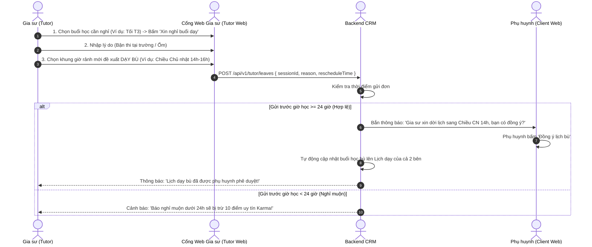

# ĐẶC TẢ NGHIỆP VỤ: LỊCH DẠY, BÁO NGHỈ & ĐỀ XUẤT DẠY BÙ (TUTOR PORTAL)

> **Mã phân hệ:** TUT-REF-06  
> **Phân hệ:** Cổng Đối tác Gia sư (Tutor Portal)  
> **Đối tượng:** Gia sư (Tutor), Phụ huynh (Parent)

---

## 1. Mục Tiêu Nghiệp Vụ

Một gia sư thường dạy từ 2 đến 5 lớp khác nhau trong tuần. Để tránh bị trùng lịch, quên lịch hoặc bối rối khi di chuyển:
* Hệ thống cung cấp **Thời khóa biểu đi dạy trực quan**.
* Hiển thị **địa chỉ chi tiết và số điện thoại liên hệ** của phụ huynh kèm nút sao chép địa chỉ tiện lợi.
* Quy chuẩn hóa quy trình **Báo nghỉ trước 24 giờ** và **Xếp lịch dạy bù** nhanh chóng mà không làm phật lòng phụ huynh.

---

## 2. Thời Khóa Biểu Giảng Dạy & Thông Tin Địa Chỉ

```text
┌─────────────────────────────────────────────────────────────────────────────┐
│ THỜI KHÓA BIỂU ĐI DẠY (TUẦN NÀY)                                             │
├─────────────────────────────────────────────────────────────────────────────┤
│ [HÔM NAY - THỨ 3, 22/09/2026]                                               │
│ • 19:00 - 21:00: Lớp Toán 10 - Bé Khôi (Mã lớp: SAM207)                    │
│   Địa chỉ: P.1208, Tòa ĐN2, CC Hope 3, Nguyễn Lam, Sài Đồng, Long Biên      │
│   [ Nút: 📋 SAO CHÉP ĐỊA CHỈ ]  [ Nút: 📞 GỌI PHỤ HUYNH ]                   │
├─────────────────────────────────────────────────────────────────────────────┤
│ [NGÀY MAI - THỨ 4, 23/09/2026]                                               │
│ • 17:30 - 19:30: Lớp Tiếng Anh 8 - Bé Linh (Mã lớp: SAM108)                 │
│   Địa chỉ: Số 45 Ngõ 120 Trần Duy Hưng, Cầu Giấy                             │
│   [ Nút: 📋 SAO CHÉP ĐỊA CHỈ ]  [ Nút: 📞 GỌI PHỤ HUYNH ]                   │
└─────────────────────────────────────────────────────────────────────────────┘
```

* **Hiển thị địa chỉ rõ ràng:** Hiển thị chi tiết số nhà, số phòng, tòa nhà cùng nút 1-Click "Sao chép địa chỉ" để gia sư dễ dàng lưu lại hoặc gửi khi cần.
* **Nhắc lịch trước 2 giờ:** Tự động gửi thông báo chuông Web / Zalo để gia sư kịp chuẩn bị giáo án và sắp xếp thời gian di chuyển.

---

## 3. Quy Trình Báo Nghỉ & Đề Xuất Lịch Dạy Bù



---

## 4. Quy Tắc Nghiệp Vụ Báo Nghỉ (Business Rules)
* **BR-LEAVE-01 (Thời hạn báo nghỉ):**
  * Gia sư phải gửi thông báo xin nghỉ trước giờ học **tối thiểu 24 giờ** để giữ điểm uy tín.
  * Báo nghỉ muộn (dưới 24h): Trừ **$-10$ điểm Karma**.
  * Tự ý không đến dạy và không gửi đơn: Trừ **$-50$ điểm Karma**, phạt cảnh cáo toàn trung tâm.
* **BR-LEAVE-02 (Quy định dạy bù):**
  * Mọi buổi học báo nghỉ hợp lệ đều phải được sắp xếp dạy bù trong vòng **14 ngày** để đảm bảo tiến độ ôn thi của học sinh.
