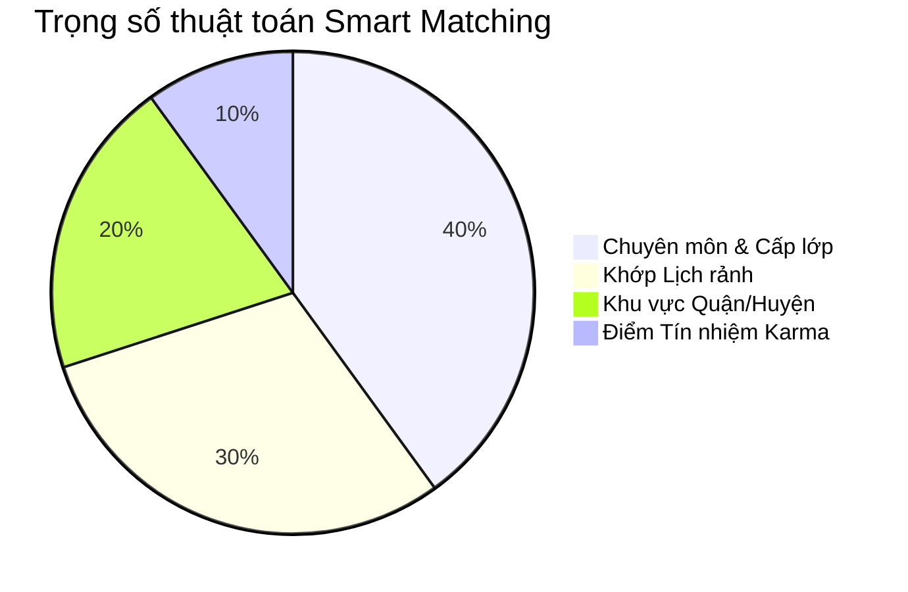

# ĐẶC TẢ NGHIỆP VỤ: BỘ MÁY GHÉP LỚP THÔNG MINH (ADMIN CRM)

> **Mã phân hệ:** CRM-REF-04  
> **Phân hệ:** Cổng Quản trị Trung tâm (Admin CRM)  
> **Đối tượng:** Nhân viên Tư vấn (Sales), Hệ thống tự động (Automated Matching)

---

## 1. Mục Tiêu Nghiệp Vụ

Thay vì nhân viên phải dùng mắt thường đọc hàng trăm hồ sơ trong file Excel rất chậm chạp và dễ nhầm lẫn:
* Hệ thống tính toán tự động điểm tương thích (% Match Score) theo thuật toán đa trọng số.
* Giảm thời gian tìm gia sư từ **3 ngày xuống còn dưới 4 giờ**.

---

## 2. Công Thức Tính Điểm Tương Thích (Match Score Formula)

$$\text{Tổng điểm Match (\%)} = (S_{\text{chuyên môn}} \times 40\%) + (S_{\text{lịch rảnh}} \times 30\%) + (S_{\text{khu vực quận/huyện}} \times 20\%) + (S_{\text{uy tín Karma}} \times 10\%)$$

### 2.1. Chi tiết quy tắc chấm điểm từng thành phần:

| Tiêu chí | Trọng số | Quy tắc tính điểm |
| :--- | :---: | :--- |
| **1. Chuyên môn ($S_{\text{chuyên môn}}$)** | **40%** | • Khớp đúng môn + đúng lớp + đã được duyệt: **100đ**. • Đúng môn nhưng khác cấp lớp: **40đ**. • Không đúng môn: **0đ (Loại ngay)**. |
| **2. Lịch rảnh ($S_{\text{lịch rảnh}}$)** | **30%** | • Khớp 100% các khung giờ phụ huynh yêu cầu: **100đ**. • Khớp 50% số buổi: **50đ**. • Bị trùng lịch lớp khác: **0đ (Loại ngay)**. |
| **3. Khu vực ($S_{\text{khu vực}}$)** | **20%** | • Gia sư có đăng ký nhận dạy tại đúng Quận/Huyện của học sinh: **100đ**. • Quận lân cận giáp ranh: **60đ**. • Khác quận/không đăng ký: **0đ**. |
| **4. Điểm uy tín ($S_{\text{uy tín}}$)** | **10%** | • Karma $\ge 120$: **100đ**. • Karma từ 80 - 119: **80đ**. • Karma từ 50 - 79: **50đ**. |

---

## 3. Giao Diện & Thao Tác Của Nhân Viên Sales

Khi Sales bấm vào một yêu cầu tìm gia sư:
1. Màn hình tự động hiển thị danh sách **Top 5 Gia sư có điểm tương thích cao nhất** (sắp xếp giảm dần từ 98%, 92%, 85%...).
2. Thẻ gia sư hiển thị đầy đủ: Ảnh thẻ, Họ tên, Trường học, Chức danh (GV / SV), Khu vực quận đăng ký, Điểm Karma.
3. **Thao tác 1-Click:**
   * Nút **"Bắn thông báo mời nhận lớp":** Tự động gửi thông báo chuông trực tiếp trên Cổng Web của 5 gia sư này để họ xem và nộp cọc nhận lớp.
   * Nút **"Chỉ định nhận lớp":** Nếu gia sư đã liên hệ đồng ý trước, Sales bấm gán trực tiếp để tạo lệnh cọc.
