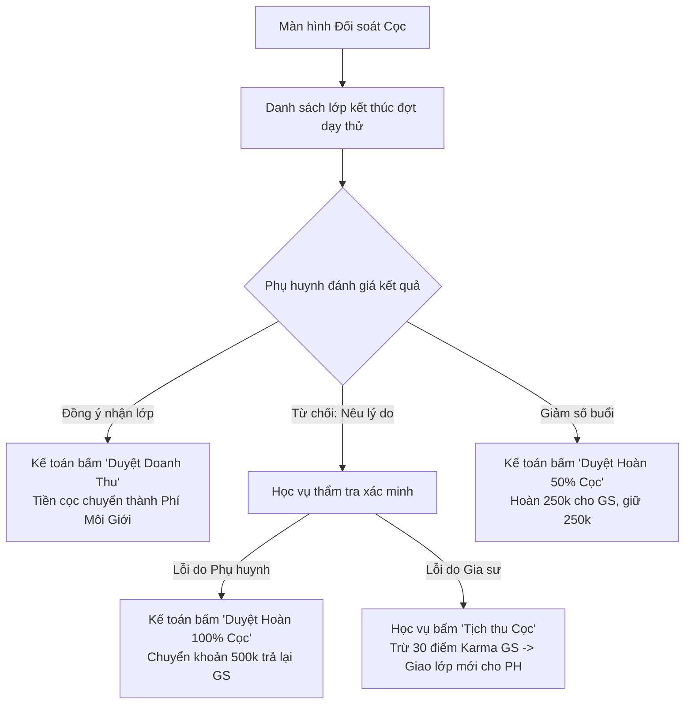

# ĐẶC TẢ NGHIỆP VỤ: TRỌNG TÀI & ĐỐI SOÁT TIỀN CỌC (ADMIN CRM)

> **Mã phân hệ:** CRM-REF-05  
> **Phân hệ:** Cổng Quản trị Trung tâm (Admin CRM)  
> **Đối tượng:** Nhân viên Học vụ (Academic), Kế toán (Accountant)

---

## 1. Mục Tiêu Nghiệp Vụ

Trong thực tế, khâu đối soát tiền cọc là nơi dễ xảy ra tranh chấp và mất thời gian nhất:
* Phụ huynh nói gia sư dạy kém $\rightarrow$ Không muốn nhận.
* Gia sư nói phụ huynh bịa lý do để trốn cọc $\rightarrow$ Đòi lại tiền.

Phân hệ Trọng tài Đối soát giúp:
* Minh bạch hóa quy trình thẩm định.
* Kế toán và Học vụ thao tác chuẩn xác, có căn cứ và lưu vết kiểm toán (Audit Trail).

---

## 2. Quy Trình Thẩm Định & Ra Phán Quyết Đối Soát Cọc

---

## 3. Chi Tiết 4 Nút Thao Tác Của Kế Toán & Học Vụ

### 3.1. Nút 1: `DUYỆT DOANH THU (CHỐT PHÍ)`
* **Điều kiện:** Phụ huynh đã xác nhận nhận lớp trên Client Portal hoặc Học vụ gọi điện xác nhận phụ huynh hài lòng.
* **Thực thi hệ thống:**
  * Trạng thái tiền cọc: `CONFIRMED_FEE`.
  * Trạng thái lớp học: `TEACHING`.
  * Ghi nhận 500,000 đ vào doanh thu thực của trung tâm.
  * Tự động cộng $+15$ điểm tín nhiệm Karma cho gia sư.

### 3.2. Nút 2: `HOÀN 100% TIỀN CỌC (LỖI DO PHỤ HUYNH)`
* **Điều kiện:** Phụ huynh xác nhận đổi ý, con đổi lịch học ở trường, bận việc riêng.
* **Thực thi hệ thống:**
  * Kế toán thực hiện chuyển khoản trả lại 500,000 đ về STK của gia sư.
  * Nhập mã giao dịch chuyển khoản ngân hàng (FT reference).
  * Trạng thái tiền cọc: `REFUNDED_FULL`.
  * Điểm Karma của gia sư được bảo toàn.

### 3.3. Nút 3: `TỊCH THU TIỀN CỌC (LỖI DO GIA SƯ)`
* **Điều kiện:** Phụ huynh phản ánh đúng: Gia sư không đến dạy, đến muộn, tác phong thiếu chuẩn mực, hổng kiến thức.
* **Thực thi hệ thống:**
  * Trạng thái tiền cọc: `FORFEITED`.
  * Tiền cọc được kết chuyển thành khoản thu phạt vi phạm bù đắp chi phí vận hành.
  * Tự động trừ $-25$ đến $-50$ điểm Karma của gia sư.
  * Kích hoạt tự động Ticket "Bảo hành tìm gia sư mới" cho phụ huynh.

### 3.4. Nút 4: `HOÀN CỌC 50% (ĐIỀU CHỈNH GIẢM BUỔI)`
* **Điều kiện:** Phụ huynh và gia sư thống nhất giảm từ 2 buổi/tuần xuống 1 buổi/tuần.
* **Thực thi hệ thống:**
  * Trung tâm giữ 250,000 đ làm phí môi giới.
  * Kế toán chuyển khoản hoàn trả 250,000 đ cho gia sư.
  * Trạng thái tiền cọc: `REFUNDED_PARTIAL`.

---

## 4. Nhật Ký Truy Vết Kiểm Toán (Audit Logs)
Mọi thao tác bấm duyệt hoàn tiền hoặc phạt cọc bắt buộc:
* Ghi nhận `accountant_id` hoặc `academic_id` người thực hiện.
* Lưu thời gian chính xác và lý do bắt buộc.
* Không một nhân viên nào được phép xóa lịch sử giao dịch cọc để chống gian lận nội bộ.
