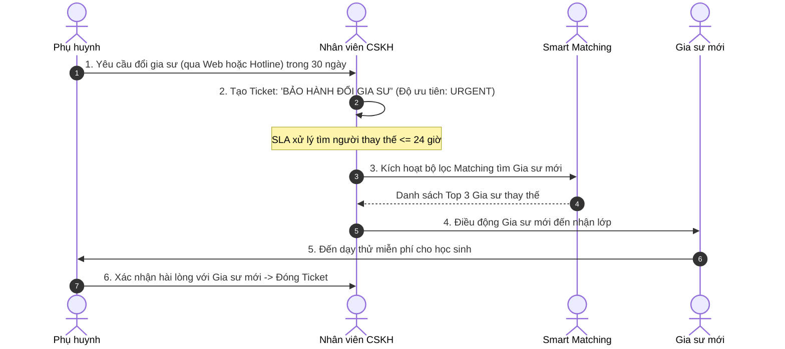

# ĐẶC TẢ NGHIỆP VỤ: BẢO HÀNH CSKH & BÁO CÁO KPI (ADMIN CRM)

> **Mã phân hệ:** CRM-REF-06  
> **Phân hệ:** Cổng Quản trị Trung tâm (Admin CRM)  
> **Đối tượng:** Nhân viên Chăm sóc Khách hàng (CSKH), Giám đốc Trung tâm (Director)

---

## 1. Quy Trình Bảo Hành Đổi Gia Sư (Warranty Ticket Workflow)

Chính sách bảo hành 30 ngày là cam kết tạo nên uy tín cạnh tranh của trung tâm:



---

## 2. Hệ Thống Tự Động Nhắc Việc (Automated Task Engine)

Để nhân viên không bị quên việc chăm sóc khách hàng:
* **Task 1: Nhắc sau buổi dạy thử 24 giờ:**
  * CRM tự động tạo Task cho Sales phụ trách: *"Gọi điện cho Phụ huynh [Tên PH] để hỏi thăm kết quả buổi dạy thử của con"*.
* **Task 2: Nhắc khảo sát chất lượng sau 30 ngày:**
  * CRM tự động tạo Task cho CSKH: *"Gọi điện hỏi thăm tình hình học tập sau 1 tháng, kiểm tra xem con có tiến bộ không"*.
* **Task 3: Nhắc tái chăm sóc đầu năm học mới:**
  * Vào tháng 8 hàng năm, hệ thống tự động lọc toàn bộ danh sách phụ huynh cũ từng thuê gia sư và sinh Task gọi điện ưu đãi học đầu năm.

---

## 3. Bảng Điều Khiển Báo Cáo KPI Bán Hàng & Doanh Thu (Executive Dashboard)

Dành cho Giám đốc và Trưởng phòng kinh doanh theo dõi sức khỏe doanh nghiệp theo thời gian thực:

```text
┌────────────────────────┬────────────────────────┬────────────────────────┐
│      TỔNG SỐ LEAD      │   TỶ LỆ CHỐT THÀNH CÔNG│   THỜI GIAN GHÉP LỚP   │
│       1,450 LEAD       │         42.8%          │        3.8 GIỜ         │
│   (+15% so với tháng trước) (Mục tiêu: > 40%)   │   (Mục tiêu: < 4 giờ)  │
├────────────────────────┼────────────────────────┼────────────────────────┤
│   DOANH THU THU CỌC    │  TỶ LỆ HOÀN TRẢ CỌC    │   ĐIỂM HÀI LÒNG NPS    │
│     362,500,000 đ      │         8.4%           │        85 ĐIỂM         │
│     (Đạt 112% KPI)     │    (Mục tiêu: < 10%)   │     (Mức Xuất sắc)     │
└────────────────────────┴────────────────────────┴────────────────────────┘
```

### 3.1. Công thức tính chi tiết các chỉ số:
1. **Tỷ lệ chốt thành công (Win Rate):**
   $$\text{Win Rate} = \frac{\text{Số lớp chốt dạy chính thức}}{\text{Tổng số Lead hợp lệ tiếp nhận}} \times 100\%$$
2. **Thời gian ghép lớp trung bình (Time-to-Match):**
   $$\text{TTM} = \frac{\sum (\text{Thời điểm Gia sư Cọc} - \text{Thời điểm Lead tạo})}{\text{Tổng số lớp ghép thành công}}$$
3. **Chỉ số hài lòng khách hàng (NPS):**
   $$\text{NPS} = \% \text{Khách hàng tích cực (9-10 điểm)} - \% \text{Khách hàng tiêu cực (1-6 điểm)}$$
