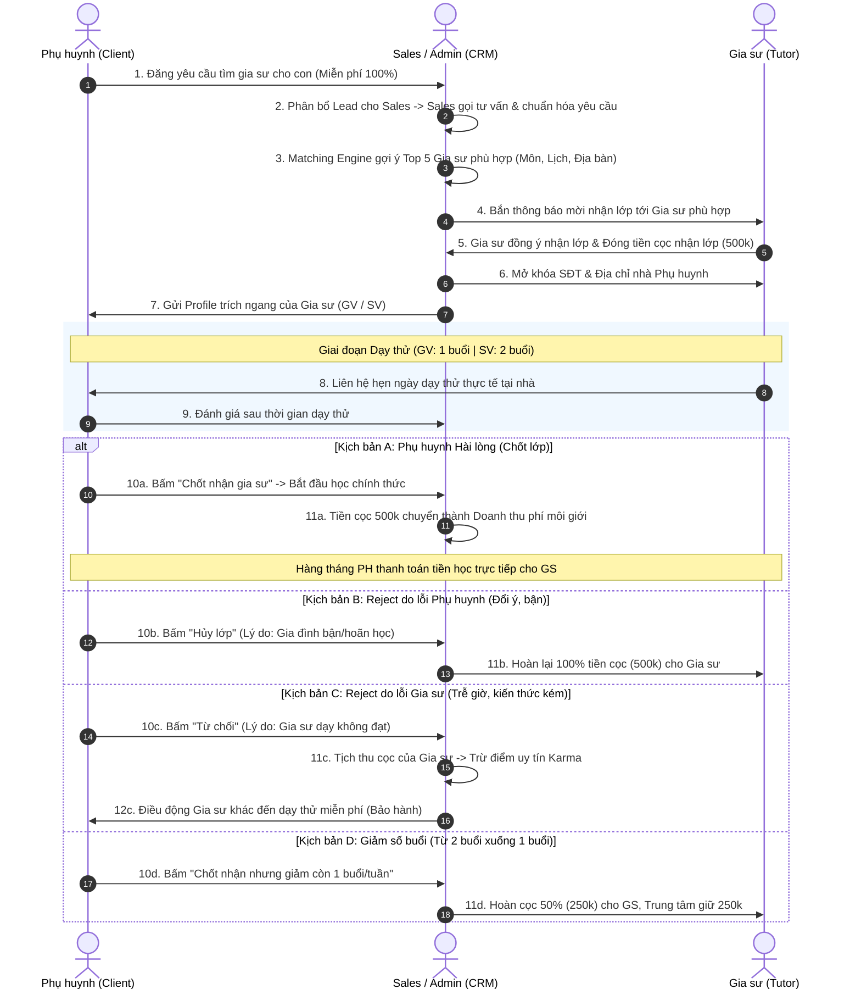

# 📚 TỔNG QUAN KIẾN TRÚC NGHIỆP VỤ HỆ THỐNG CRM GIA SƯ

> **Thư mục:** `docs/nghiep-vu-cai-tai/`  
> **Nền tảng:** Web Trình duyệt (Desktop & Mobile Web)  
> **Mục tiêu:** Đặc tả toàn bộ quy trình nghiệp vụ của 3 cổng tương tác: **Client Portal**, **Tutor Portal**, **Admin CRM**.

---

## 🌟 1. Nguyên Tắc Nghiệp Vụ Cốt Lõi

1. **Phụ huynh (Client):** **Đăng tin miễn phí 100%**, không nạp tiền trước. Trải nghiệm dạy thử để thẩm định chất lượng trước khi chốt nhận gia sư.
2. **Gia sư (Tutor):** Nhận lớp có trách nhiệm thông qua **Khoản cọc cam kết (500,000 đ)**. Phân định rõ số buổi dạy thử: **Giáo viên (1 buổi)** và **Sinh viên (2 buổi)**.
3. **Trung tâm (Admin CRM):** Vận hành phễu bán hàng, Smart Matching ghép lớp, chăm sóc khách hàng và **đối soát cọc minh bạch**. Phụ huynh thanh toán học phí trực tiếp cho gia sư hàng tháng.

---

## 🏛️ 2. Bản Đồ 3 Phân Hệ Cổng Nghiệp Vụ Cải Tạo

```text
┌─────────────────────────────────────────────────────────────────────────────┐
│                    HỆ THỐNG CRM TRUNG TÂM GIA SƯ (CẢI TẠO)                  │
└─────────────────────────────────────────────────────────────────────────────┘
         ▲                                     ▲                       ▲
         │                                     │                       │
┌────────┴───────────────┐           ┌─────────┴──────────┐  ┌─────────┴───────────────┐
│ 1. CLIENT PORTAL       │           │ 2. TUTOR PORTAL    │  │ 3. ADMIN CRM PORTAL     │
│ (Phụ huynh & Học sinh) │           │ (Đối tác Gia sư)   │  │ (Sales & Vận hành CSKH) │
├────────────────────────┤           ├────────────────────┤  ├─────────────────────────┤
│ • Đăng tin MIỄN PHÍ    │           │ • Hồ sơ & Môn dạy  │  │ • Quản lý Lead & Phễu   │
│ • Quản lý hồ sơ con    │           │ • Điểm uy tín Karma│  │ • Smart Matching Engine │
│ • Duyệt kết quả dạy thử│           │ • Sàn lớp & Nộp cọc│  │ • Phân xử & Đối soát cọc│
│ • Trả tiền trực tiếp GS│           │ • Nhận lớp dạy thử │  │ • Bảo hành đổi người    │
│ • Yêu cầu đổi gia sư   │           │ • Rút / Hoàn cọc   │  │ • Dashboard KPI Sales   │
└────────────────────────┘           └────────────────────┘  └─────────────────────────┘
```

---

## 🔄 3. Luồng Nghiệp Vụ Liên Cổng Xuyên Suốt (Cross-Portal Workflow)



---

## 📂 4. Danh Mục Tài Liệu Chi Tiết Theo Từng Cổng

> 🌟 **TÀI LIỆU MASTER TỔNG HỢP TOÀN BỘ:** [TongHopNghiepVuCRM.md](file:///c:/Users/truclh/Desktop/CRM-Gia%20s%C6%B0%20%282%29/CRM-Gia%20s%C6%B0/CRM-Gia%20s%C6%B0/docs/nghiep-vu-cai-tai/TongHopNghiepVuCRM.md) *(Đọc liền một mạch toàn bộ 3 cổng)*

---

### 👨‍👩‍👧 Phân hệ 1: Cổng Khách Hàng (`1-client-portal/`)
* [01-HoSoGiaDinhVaHocSinh.md](file:///c:/Users/truclh/Desktop/CRM-Gia%20s%C6%B0%20%282%29/CRM-Gia%20s%C6%B0/CRM-Gia%20s%C6%B0/docs/nghiep-vu-cai-tai/1-client-portal/01-HoSoGiaDinhVaHocSinh.md): Quản lý tài khoản phụ huynh, hồ sơ các con, lực học, tính cách.
* [02-DangTinTimGiaSuMienPhi.md](file:///c:/Users/truclh/Desktop/CRM-Gia%20s%C6%B0%20%282%29/CRM-Gia%20s%C6%B0/CRM-Gia%20s%C6%B0/docs/nghiep-vu-cai-tai/1-client-portal/02-DangTinTimGiaSuMienPhi.md): Quy trình đăng tin tìm gia sư miễn phí 100%, chọn đối tượng GV (1 buổi thử) / SV (2 buổi thử), cơ chế bảo mật địa chỉ.
* [03-TraiNghiemDayThuVaDanhGia.md](file:///c:/Users/truclh/Desktop/CRM-Gia%20s%C6%B0%20%282%29/CRM-Gia%20s%C6%B0/CRM-Gia%20s%C6%B0/docs/nghiep-vu-cai-tai/1-client-portal/03-TraiNghiemDayThuVaDanhGia.md): Trải nghiệm dạy thử và form đánh giá sau dạy thử (Chốt nhận / Từ chối do lỗi GS / Hủy do lỗi PH / Giảm số buổi).
* [04-ThanhToanVaBaoHanh30Ngay.md](file:///c:/Users/truclh/Desktop/CRM-Gia%20s%C6%B0%20%282%29/CRM-Gia%20s%C6%B0/CRM-Gia%20s%C6%B0/docs/nghiep-vu-cai-tai/1-client-portal/04-ThanhToanVaBaoHanh30Ngay.md): Cơ chế thanh toán trực tiếp cho gia sư và chính sách bảo hành đổi người miễn phí trong 30 ngày.
* [05-TheoDoiLichHocVaNhanXet.md](file:///c:/Users/truclh/Desktop/CRM-Gia%20s%C6%B0%20%282%29/CRM-Gia%20s%C6%B0/CRM-Gia%20s%C6%B0/docs/nghiep-vu-cai-tai/1-client-portal/05-TheoDoiLichHocVaNhanXet.md): **[MỚI]** Theo dõi thời khóa biểu của con, xem nhật ký buổi học, nhận xét của gia sư và đối soát số buổi cuối tháng.

---

### 👨‍🏫 Phân hệ 2: Cổng Đối Tác Gia Sư (`2-tutor-portal/`)
* [01-HoSoNangLucVaPhanLoai.md](file:///c:/Users/truclh/Desktop/CRM-Gia%20s%C6%B0%20%282%29/CRM-Gia%20s%C6%B0/CRM-Gia%20s%C6%B0/docs/nghiep-vu-cai-tai/2-tutor-portal/01-HoSoNangLucVaPhanLoai.md): Xác minh CCCD/bằng cấp, phân loại Giáo viên vs Sinh viên, ma trận lịch rảnh và bán kính di chuyển.
* [02-DiemTinNhiemKarma.md](file:///c:/Users/truclh/Desktop/CRM-Gia%20s%C6%B0%20%282%29/CRM-Gia%20s%C6%B0/CRM-Gia%20s%C6%B0/docs/nghiep-vu-cai-tai/2-tutor-portal/02-DiemTinNhiemKarma.md): Cơ chế thang điểm uy tín 100 điểm, các quy tắc thưởng/phạt, chế tài khóa tài khoản và Blacklist.
* [03-SanLopVaDatCocNhanLop.md](file:///c:/Users/truclh/Desktop/CRM-Gia%20s%C6%B0%20%282%29/CRM-Gia%20s%C6%B0/CRM-Gia%20s%C6%B0/docs/nghiep-vu-cai-tai/2-tutor-portal/03-SanLopVaDatCocNhanLop.md): Xem sàn lớp ẩn danh, quy tắc tính phí cọc (500k), luồng thanh toán VietQR và mở khóa SĐT phụ huynh.
* [04-QuyTrinhDayThuVaQuyetToanCoc.md](file:///c:/Users/truclh/Desktop/CRM-Gia%20s%C6%B0%20%282%29/CRM-Gia%20s%C6%B0/CRM-Gia%20s%C6%B0/docs/nghiep-vu-cai-tai/2-tutor-portal/04-QuyTrinhDayThuVaQuyetToanCoc.md): Thực hiện dạy thử (GV 1 buổi / SV 2 buổi), 4 kịch bản quyết toán cọc và quy trình khiếu nại cọc.
* [05-NhatKyBuoiHocVaTienDo.md](file:///c:/Users/truclh/Desktop/CRM-Gia%20s%C6%B0%20%282%29/CRM-Gia%20s%C6%B0/CRM-Gia%20s%C6%B0/docs/nghiep-vu-cai-tai/2-tutor-portal/05-NhatKyBuoiHocVaTienDo.md): **[MỚI]** Điền nhật ký giảng dạy, giao bài tập về nhà, đánh giá thái độ học sinh, tải ảnh phiếu bài tập và sổ theo dõi tiến độ.
* [06-LichDayBaoNghiVaDayBu.md](file:///c:/Users/truclh/Desktop/CRM-Gia%20s%C6%B0%20%282%29/CRM-Gia%20s%C6%B0/CRM-Gia%20s%C6%B0/docs/nghiep-vu-cai-tai/2-tutor-portal/06-LichDayBaoNghiVaDayBu.md): **[MỚI]** Thời khóa biểu đi dạy, xem địa chỉ lớp, quy chuẩn báo nghỉ trước 24h và đề xuất lịch dạy bù.
* [07-TaiKhoanNganHangVaThuNhap.md](file:///c:/Users/truclh/Desktop/CRM-Gia%20s%C6%B0%20%282%29/CRM-Gia%20s%C6%B0/CRM-Gia%20s%C6%B0/docs/nghiep-vu-cai-tai/2-tutor-portal/07-TaiKhoanNganHangVaThuNhap.md): **[MỚI]** Quản lý tài khoản ngân hàng nhận tiền, sổ tay thu nhập đối soát học phí cuối tháng và lịch sử cọc.

---

### 🏢 Phân hệ 3: Cổng Quản Trị Trung Tâm (`3-admin-crm/`)
* [01-TiepNhanVaPhanBoLead.md](file:///c:/Users/truclh/Desktop/CRM-Gia%20s%C6%B0%20%282%29/CRM-Gia%20s%C6%B0/CRM-Gia%20s%C6%B0/docs/nghiep-vu-cai-tai/3-admin-crm/01-TiepNhanVaPhanBoLead.md): Tiếp nhận yêu cầu tìm gia sư từ Website Phụ huynh, tự động kiểm duyệt và đẩy thẳng lên Sàn lớp mà không cần gọi điện tư vấn.
* [02-PheubanHangKanban.md](file:///c:/Users/truclh/Desktop/CRM-Gia%20s%C6%B0%20%282%29/CRM-Gia%20s%C6%B0/CRM-Gia%20s%C6%B0/docs/nghiep-vu-cai-tai/3-admin-crm/02-PheubanHangKanban.md): Bảng Kanban giám sát 4 giai đoạn vòng đời lớp học tự động (Đang tuyển -> Dạy thử -> Học chính thức -> Đóng lớp).
* [03-Customer360VaNhatKyTuVan.md](file:///c:/Users/truclh/Desktop/CRM-Gia%20s%C6%B0%20%282%29/CRM-Gia%20s%C6%B0/CRM-Gia%20s%C6%B0/docs/nghiep-vu-cai-tai/3-admin-crm/03-Customer360VaNhatKyTuVan.md): Quản lý dữ liệu phụ huynh 360 độ, hồ sơ các con, lịch sử lớp học và các ticket hỗ trợ.
* [04-SmartMatchingEngine.md](file:///c:/Users/truclh/Desktop/CRM-Gia%20s%C6%B0%20%282%29/CRM-Gia%20s%C6%B0/CRM-Gia%20s%C6%B0/docs/nghiep-vu-cai-tai/3-admin-crm/04-SmartMatchingEngine.md): Thuật toán chấm điểm % tương thích 4 trọng số (Môn, Lịch, Quận/Huyện, Karma), tự động gợi ý Top 5 gia sư và bắn thông báo Web.
* [05-TrongTaiVaDoiSoatCoc.md](file:///c:/Users/truclh/Desktop/CRM-Gia%20s%C6%B0%20%282%29/CRM-Gia%20s%C6%B0/CRM-Gia%20s%C6%B0/docs/nghiep-vu-cai-tai/3-admin-crm/05-TrongTaiVaDoiSoatCoc.md): Màn hình đối soát cọc, thẩm định lý do từ chối dạy thử, 4 nút thao tác duyệt tài chính và lưu vết kiểm toán.
* [06-BaoHanhCSKHVaBaoCaoKPI.md](file:///c:/Users/truclh/Desktop/CRM-Gia%20s%C6%B0%20%282%29/CRM-Gia%20s%C6%B0/CRM-Gia%20s%C6%B0/docs/nghiep-vu-cai-tai/3-admin-crm/06-BaoHanhCSKHVaBaoCaoKPI.md): Quản lý Ticket bảo hành đổi gia sư trong 30 ngày, tự động nhắc việc chăm sóc và Executive Dashboard KPI.
* [07-PhanQuyenVaCauHinhHeThong.md](file:///c:/Users/truclh/Desktop/CRM-Gia%20s%C6%B0%20%282%29/CRM-Gia%20s%C6%B0/CRM-Gia%20s%C6%B0/docs/nghiep-vu-cai-tai/3-admin-crm/07-PhanQuyenVaCauHinhHeThong.md): **[MỚI]** Ma trận phân quyền người dùng theo vai trò (RBAC) và quản trị cấu hình tham số vận hành hệ thống.
