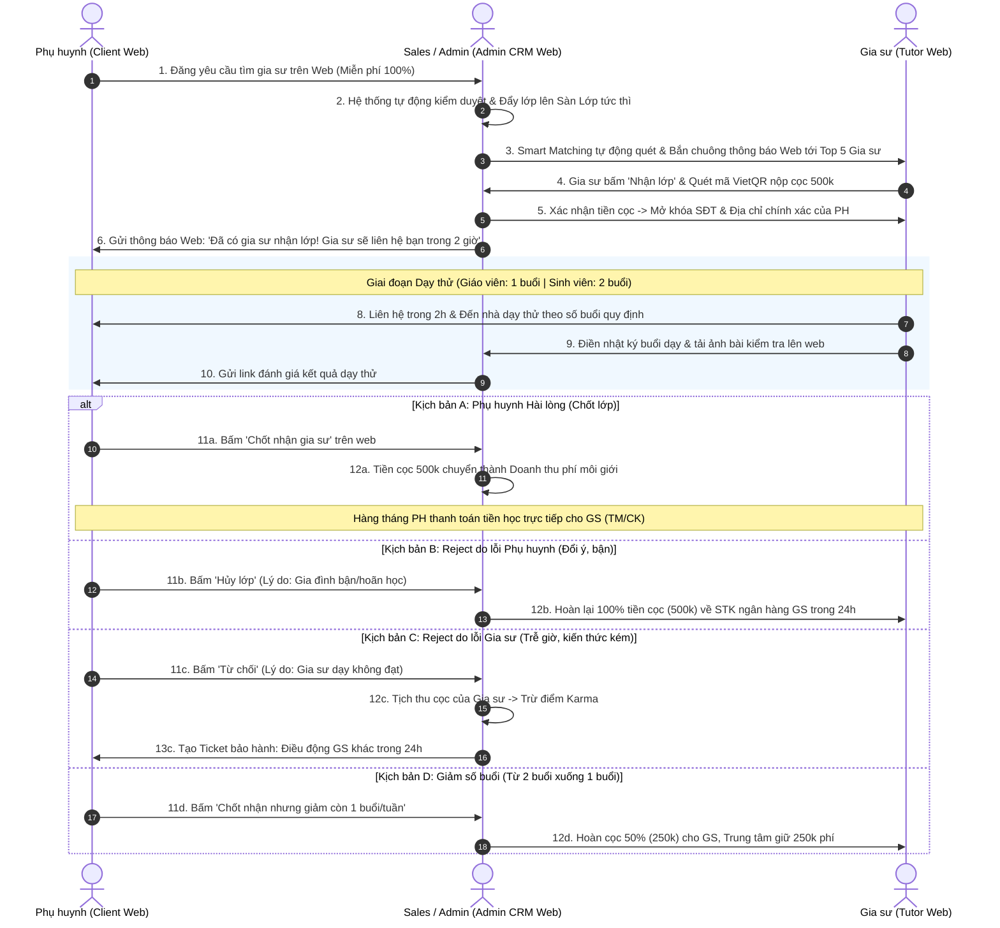
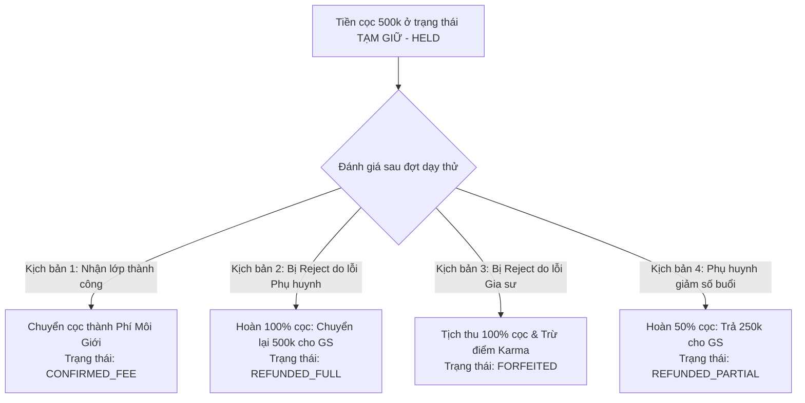
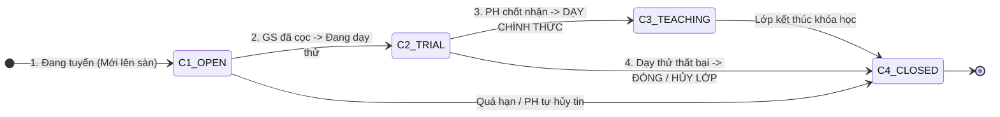

# ĐẶC TẢ NGHIỆP VỤ HỆ THỐNG CRM TRUNG TÂM GIA SƯ

> **Tài liệu:** Đặc tả Nghiệp vụ Chi tiết (Business Requirements Specification - BRS)  
> **Phạm vi hệ thống:** 3 Cổng tương tác trên nền tảng Web: **Client Portal** (Phụ huynh/Học sinh), **Tutor Portal** (Gia sư), **Admin CRM** (Quản trị & Vận hành).

---

## 📑 MỤC LỤC

1. [PHẦN I: TỔNG QUAN HỆ THỐNG & LUỒNG LIÊN CỔNG](#phần-i-tổng-quan-hệ-thống--luồng-liên-cổng)
   * [1.1. Bản đồ 3 Phân hệ Cổng Nghiệp vụ](#11-bản-đồ-3-phân-hệ-cổng-nghiệp-vụ)
   * [1.2. Sơ đồ Luồng Nghiệp vụ Xuyên suốt (End-to-End Workflow)](#12-sơ-đồ-luồng-nghiệp-vụ-xuyên-suốt-end-to-end-workflow)
2. [PHẦN II: PHÂN HỆ CỔNG KHÁCH HÀNG (CLIENT PORTAL)](#phần-ii-phân-hệ-cổng-khách-hàng-client-portal)
   * [2.1. Quản lý Hồ sơ Gia đình & Học sinh (Family & Student Profile)](#21-quản-lý-hồ-sơ-gia-đình--học-sinh-family--student-profile)
   * [2.2. Đăng Yêu cầu Tìm Gia sư (Job Request Form)](#22-đăng-yêu-cầu-tìm-gia-sư-job-request-form)
   * [2.3. Quy trình Dạy thử & 4 Kịch bản Đánh giá](#23-quy-trình-dạy-thử--4-kịch-bản-đánh-giá)
   * [2.4. Thanh toán Học phí Trực tiếp & Chính sách Bảo hành 30 Ngày](#24-thanh-toán-học-phí-trực-tiếp--chính-sách-bảo-hành-30-ngày)
   * [2.5. Theo dõi Lịch học & Nhật ký Buổi học Hàng ngày](#25-theo-dõi-lịch-học--nhật-ký-buổi-học-hàng-ngày)
3. [PHẦN III: PHÂN HỆ CỔNG ĐỐI TÁC GIA SƯ (TUTOR PORTAL)](#phần-iii-phân-hệ-cổng-đối-tác-gia-sư-tutor-portal)
   * [3.1. Xác thực Hồ sơ Năng lực (KYC) & Phân loại Giáo viên / Sinh viên](#31-xác-thực-hồ-sơ-năng-lực-kyc--phân-loại-giáo-viên--sinh-viên)
   * [3.2. Hệ thống Điểm Tín nhiệm Karma (Karma Scoring System)](#32-hệ-thống-điểm-tín-nhiệm-karma-karma-scoring-system)
   * [3.3. Sàn Lớp & Quy trình Đặt cọc Nhận lớp (Commitment Deposit)](#33-sàn-lớp--quy-trình-đặt-cọc-nhận-lớp-commitment-deposit)
   * [3.4. 4 Kịch bản Quyết toán Tiền cọc Sau Dạy thử](#34-4-kịch-bản-quyết-toán-tiền-cọc-sau-dạy-thử)
   * [3.5. Nhật ký Giảng dạy & Theo dõi Tiến độ Học sinh](#35-nhật-ký-giảng-dạy--theo-dõi-tiến-độ-học-sinh)
   * [3.6. Lịch dạy & Quy chuẩn Báo nghỉ 24h](#36-lịch-dạy--quy-chuẩn-báo-nghỉ-24h)
   * [3.7. Quản lý Tài khoản Ngân hàng & Sổ tay Thu nhập Đối soát](#37-quản-lý-tài-khoản-ngân-hàng--sổ-tay-thu-nhập-đối-soát)
4. [PHẦN IV: PHÂN HỆ CỔNG QUẢN TRỊ TRUNG TÂM (ADMIN CRM BACK-OFFICE)](#phần-iv-phân-hệ-cổng-quản-trị-trung-tâm-admin-crm-back-office)
   * [4.1. Tiếp nhận & Tự động Đẩy Lớp Lên Sàn (Automated Job Ingestion)](#41-tiếp-nhận--tự-động-đẩy-lớp-lên-sàn-automated-job-ingestion)
   * [4.2. Bảng Kanban Giám sát Vòng đời Lớp học (Class Lifecycle Kanban)](#42-bảng-kanban-giám-sát-vòng-đời-lớp-học-class-lifecycle-kanban)
   * [4.3. Hồ sơ Khách hàng 360 Độ & Lịch sử Học sinh](#43-hồ-sơ-khách-hàng-360-độ--lịch-sử-học-sinh)
   * [4.4. Bộ máy Smart Matching Engine Gợi ý Top 5 Gia sư](#44-bộ-máy-smart-matching-engine-gợi-ý-top-5-gia-sư)
   * [4.5. Phân hệ Trọng tài Đối soát Cọc & Lưu vết Kiểm toán Audit Logs](#45-phân-hệ-trọng-tài-đối-soát-cọc--lưu-vết-kiểm-toán-audit-logs)
   * [4.6. Quản lý Ticket Bảo hành 30 Ngày & Báo cáo KPI Vận hành](#46-quản-lý-ticket-bảo-hành-30-ngày--báo-cáo-kpi-vận-hành)
   * [4.7. Quản lý Phân quyền Người dùng (RBAC) & Cấu hình Tham số Vận hành](#47-quản-lý-phân-quyền-người-dùng-rbac--cấu-hình-tham-số-vận-hành)
5. [PHẦN V: QUY CHUẨN TƯƠNG TÁC NGHIỆP VỤ TRÊN GIAO DIỆN WEB](#phần-v-quy-chuẩn-tương-tác-nghiệp-vụ-trên-giao-diện-web)
   * [5.1. Luồng Thanh toán VietQR Động theo Màn hình Thiết bị](#51-luồng-thanh-toán-vietqr-động-theo-màn-hình-thiết-bị)
   * [5.2. Luồng Thông báo Đa kênh Thời gian thực](#52-luồng-thông-báo-đa-kênh-thời-gian-thực)
   * [5.3. Quy chuẩn Nhập liệu Nhật ký & Quản lý Tệp tin](#53-quy-chuẩn-nhập-liệu-nhật-ký--quản-lý-tệp-tin)
   * [5.4. Quy chuẩn Bảng làm việc Phễu Bán hàng & Phím tắt Nhanh](#54-quy-chuẩn-bảng-làm-việc-phễu-bán-hàng--phím-tắt-nhanh)

---

# PHẦN I: TỔNG QUAN HỆ THỐNG & LUỒNG LIÊN CỔNG

## 1.1. Bản đồ 3 Phân hệ Cổng Nghiệp vụ

Hệ thống CRM Gia Sư vận hành trên nền tảng Web với 3 phân hệ tương tác riêng biệt:

```text
┌─────────────────────────────────────────────────────────────────────────────┐
│                       HỆ THỐNG CRM TRUNG TÂM GIA SƯ                         │
└─────────────────────────────────────────────────────────────────────────────┘
         ▲                                     ▲                       ▲
         │                                     │                       │
┌────────┴───────────────┐           ┌─────────┴──────────┐  ┌─────────┴───────────────┐
│ 1. CLIENT WEB PORTAL   │           │ 2. TUTOR WEB PORTAL│  │ 3. ADMIN CRM BACK-OFFICE│
│ (Phụ huynh & Học sinh) │           │ (Đối tác Gia sư)   │  │ (Sales & Vận hành CSKH) │
├────────────────────────┤           ├────────────────────┤  ├─────────────────────────┤
│ • Đăng yêu cầu tìm GS  │           │ • Xác thực hồ sơ   │  │ • Tiếp nhận đơn từ Web │
│ • Quản lý hồ sơ các con│           │ • Điểm tín nhiệm   │  │ • Phễu Kanban 6 bước    │
│ • Đánh giá sau dạy thử │           │ • Sàn lớp & Nộp cọc│  │ • Smart Matching Top 5  │
│ • Trả tiền trực tiếp GS│           │ • Lịch dạy & Báo nghỉ│• Trọng tài đối soát cọc│
│ • Đổi gia sư 30 ngày   │           │ • Nhật ký buổi học │  │ • Ticket Bảo hành 30 ngày│
│ • Theo dõi lịch & điểm │           │ • Sổ tay thu nhập  │  │ • Báo cáo KPI doanh số  │
└────────────────────────┘           └────────────────────┘  └─────────────────────────┘
```

---

## 1.2. Sơ đồ Luồng Nghiệp vụ Xuyên suốt (End-to-End Workflow)



---

# PHẦN II: PHÂN HỆ CỔNG KHÁCH HÀNG (CLIENT PORTAL)

## 2.1. Quản lý Hồ sơ Gia đình & Học sinh (Family & Student Profile)

* **Xác thực tài khoản:** Đăng nhập qua **Số điện thoại + OTP Zalo/SMS** hoặc **Google Login**.
* **Quản lý đa học sinh:** Mỗi tài khoản phụ huynh quản lý tối đa 5 học sinh trong gia đình.
* **Cấu trúc dữ liệu học sinh (`students`):**

| Trường dữ liệu | Bắt buộc | Ví dụ dữ liệu | Ý nghĩa nghiệp vụ |
| :--- | :---: | :--- | :--- |
| `full_name` | Có | Nguyễn Minh Khôi | Tên học sinh |
| `gender` | Có | Nam / Nữ | Tiêu chí ghép gia sư theo nguyện vọng gia đình |
| `birth_date` | Có | 15/08/2012 | Xác định chính xác khối lớp và độ tuổi |
| `school_name` | Không | THCS Trưng Vương | Nhận diện chương trình đào tạo (Công lập / Quốc tế) |
| `current_grade` | Có | Lớp 8 | Khối lớp bám sát sách giáo khoa |
| `academic_level` | Có | Mất gốc Hình học | Năng lực học tập hiện tại cần bổ trợ |
| `personality_notes`| Không| Nhút nhát, sợ hỏi | Ghi chú tâm lý giúp gia sư chuẩn bị phương pháp dạy |
| `target_goal` | Không | Thi đỗ chuyên Toán | Mục tiêu đầu ra để xây dựng lộ trình học |

* **Quy tắc bảo lưu dữ liệu (BR-STUDENT-DELETE):**
  * Học sinh chưa có lớp học: Được phép xóa vĩnh viễn khỏi danh sách.
  * Học sinh đã từng phát sinh lớp học: Chỉ được phép bấm "Ẩn hồ sơ", toàn bộ dữ liệu lịch sử buổi học và điểm số được lưu giữ phục vụ đối soát.

---

## 2.2. Đăng Yêu cầu Tìm Gia sư (Job Request Form)

* **Chi phí:** **Miễn phí 100%**. Phụ huynh không cần thanh toán bất kỳ khoản tiền nào khi đăng tin.
* **Quy trình đăng tin gồm 5 bước:**
  1. **Chọn học sinh:** Chọn 1 con từ danh sách hồ sơ gia đình.
  2. **Chọn môn học:** Toán, Vật lý, Hóa học, Ngữ văn, Tiếng Anh, Luyện thi đại học...
  3. **Yêu cầu đối tượng gia sư:**
     * 👩‍🏫 **Giáo viên:** Có kinh nghiệm giảng dạy lâu năm. **Quy định dạy thử: 1 buổi**.
     * 🎓 **Sinh viên:** Nhiệt huyết, mức phí hợp lý. **Quy định dạy thử: 2 buổi**.
     * Giới tính ưu tiên: Nam / Nữ / Không yêu cầu.
  4. **Thời gian học mong muốn:**
     * Số buổi trong tuần (ví dụ: 2 buổi/tuần, 3 buổi/tuần).
     * Ma trận ca học: Chọn thứ trong tuần và khung giờ (Sáng / Chiều / Tối).
  5. **Địa điểm học & Mức học phí:**
     * Địa chỉ: Tỉnh/Thành phố $\rightarrow$ Quận/Huyện $\rightarrow$ Phường/Xã $\rightarrow$ Tên đường/Chung cư $\rightarrow$ Số nhà/Căn hộ.
     * Mức học phí đề xuất: Ví dụ 200,000 đ - 300,000 đ / buổi (thời lượng 1.5h - 2h).

---

## 2.3. Quy trình Dạy thử & 4 Kịch bản Đánh giá

Sau khi hoàn thành số buổi dạy thử quy định (**1 buổi đối với Giáo viên, 2 buổi đối với Sinh viên**), hệ thống gửi thông báo kèm đường link đánh giá cho phụ huynh với 4 lựa chọn:

```text
[KẾT THÚC THỜI GIAN DẠY THỬ (GV: 1B | SV: 2B)]
                     │
    ┌────────────────┼────────────────┬────────────────┐
    ▼                ▼                ▼                ▼
1. CHỐT NHẬN GS  2. TỪ CHỐI DO GS  3. HỦY DO PH    4. GIẢM BUỔI
  (Accept)       (Tutor Fault)    (Parent Fault)   (Scale Down)
    │                │                │                │
Chuyển cọc 500k  Tịch thu cọc GS  Hoàn 100% cọc GS Hoàn 50% cọc (250k)
thành Phí Môi    Kích hoạt Ticket (500k) trong 24h Trung tâm giữ 250k
giới trung tâm   Bảo hành ĐỔI GS  Không phạt GS    Lớp tiếp tục học
```

1. **Kịch bản 1: Chốt nhận gia sư (`ACCEPT`)**
   * Đánh giá chất lượng (1 - 5 sao) kèm nhận xét.
   * Lớp chuyển sang trạng thái chính thức `TEACHING`.
   * Học phí buổi dạy thử được tính gộp vào kỳ thanh toán học phí đầu tiên cho gia sư.
2. **Kịch bản 2: Từ chối do lỗi Gia sư (`REJECT_TUTOR_FAULT`)**
   * Lý do vi phạm bắt buộc: *Đến muộn, tác phong thiếu chuẩn mực, hổng kiến thức, phương pháp dạy không phù hợp*.
   * Hệ thống kích hoạt Ticket **Bảo hành đổi gia sư miễn phí trong 24 giờ** và tịch thu cọc của gia sư vi phạm.
3. **Kịch bản 3: Hủy do lý do Phụ huynh (`REJECT_PARENT_FAULT`)**
   * Lý do: *Gia đình có việc bận đột xuất, học sinh đổi lịch học ở trường, tạm hoãn tìm gia sư*.
   * Trung tâm thực hiện **hoàn lại 100% tiền cọc (500k)** cho gia sư trong 24 giờ.
4. **Kịch bản 4: Giảm số buổi (`SCALE_DOWN`)**
   * Phụ huynh muốn giảm số buổi học (ví dụ: từ 2 buổi xuống 1 buổi/tuần).
   * Trung tâm điều chỉnh lớp và hoàn lại 50% tiền cọc (250k) cho gia sư.

---

## 2.4. Thanh toán Học phí Trực tiếp & Chính sách Bảo hành 30 Ngày

* **Cơ chế thanh toán trực tiếp:**
  * Phụ huynh không cần nạp tiền vào ví trung gian trên hệ thống.
  * Hàng tháng (hoặc sau mỗi chu kỳ 10 buổi học), phụ huynh thanh toán học phí trực tiếp cho gia sư bằng tiền mặt hoặc chuyển khoản ngân hàng.
* **Chính sách Bảo hành 30 ngày (30-Day Warranty):**
  * Trong vòng 30 ngày kể từ buổi dạy đầu tiên: Nếu gia sư xin nghỉ đột xuất hoặc dạy không hiệu quả, phụ huynh được quyền bấm **"Yêu cầu đổi gia sư"** hoàn toàn miễn phí.
  * Phụ huynh chỉ thanh toán cho gia sư cũ số buổi thực tế đã học.
  * Trung tâm cam kết điều động gia sư mới đến nhà dạy thử trong vòng **24 giờ**.

---

## 2.5. Theo dõi Lịch học & Nhật ký Buổi học Hàng ngày

* **Thời khóa biểu trực quan (Calendar View):** Theo dõi lịch học của các con theo tuần/tháng với màu sắc phân biệt từng bé.
* **Xem Nhật ký buổi học:**
  * Kiến thức trọng tâm đã học trong buổi.
  * Bài tập về nhà được giao.
  * Đánh giá thái độ học tập và mức độ tiếp thu bài của con.
  * Xem trực tiếp ảnh chụp phiếu bài tập, bài kiểm tra 15 phút đính kèm.
* **Báo nghỉ học & Duyệt học bù:**
  * Bấm nút "Báo nghỉ" khi con ốm/bận $\rightarrow$ Hệ thống tự động báo cho gia sư và tư vấn viên.
  * Duyệt khung giờ học bù do gia sư đề xuất trực tiếp trên giao diện web.
* **Sổ đối soát số buổi cuối tháng:** Tự động tổng hợp số buổi thực tế đã học trong tháng: *Ví dụ: 8 buổi $\times$ 200,000 đ = 1,600,000 đ*, đảm bảo minh bạch, tránh tranh cãi về số buổi.

---

# PHẦN III: PHÂN HỆ CỔNG ĐỐI TÁC GIA SƯ (TUTOR PORTAL)

## 3.1. Xác thực Hồ sơ Năng lực (KYC) & Phân loại Giáo viên / Sinh viên

* **Hồ sơ thẩm định:** Tải ảnh 2 mặt CCCD, Thẻ sinh viên (đối với SV) hoặc Bằng tốt nghiệp Sư phạm / Chứng chỉ sư phạm (đối với GV).
* **Phân loại gia sư (`tutor_type`):**
  * `TEACHER` (Giáo viên): Dạy thử **1 buổi**.
  * `STUDENT` (Sinh viên): Dạy thử **2 buổi**.
* **Thiết lập Lịch rảnh & Khu vực nhận dạy:** Khai báo các buổi rảnh trong tuần và danh sách các Quận/Huyện có thể nhận dạy (ví dụ: Cầu Giấy, Nam Từ Liêm, Đống Đa) để nhận gợi ý lớp phù hợp.

---

## 3.2. Hệ thống Điểm Tín nhiệm Karma (Karma Scoring System)

* **Điểm khởi tạo:** Mỗi gia sư được cấp **100 điểm Karma** khi tài khoản được phê duyệt.
* **Quy tắc cộng điểm thưởng:**
  * Dạy thử thành công và được phụ huynh nhận dạy chính thức: $+15$ điểm.
  * Nhận đánh giá 5 sao từ phụ huynh: $+10$ điểm.
  * Nộp cọc và liên hệ phụ huynh đúng hạn trong 2 giờ: $+5$ điểm.
* **Quy tắc trừ điểm phạt:**
  * Nhận lớp nhưng tự ý bỏ không đến dạy thử: $-50$ điểm (Tịch thu 100% cọc).
  * Đến muộn buổi dạy không báo trước: $-20$ điểm.
  * Bị phản ánh hổng kiến thức sư phạm: $-25$ điểm.
  * Báo nghỉ muộn dưới 24 giờ: $-10$ điểm.
* **4 Hạng danh hiệu Gia sư:**
  * 🥇 **Ưu Tú ($\ge 120$ điểm):** Huy hiệu Sao vàng, ưu tiên xem lớp VIP sớm 2 giờ, chiết khấu 10% phí cọc.
  * 🥈 **Chuẩn (60 - 119 điểm):** Hoạt động bình thường.
  * ⚠️ **Cảnh Báo (20 - 59 điểm):** Giới hạn chỉ được nhận tối đa 1 lớp tại một thời điểm.
  * 🚫 **Blacklist ($< 20$ điểm):** Khóa tài khoản vĩnh viễn, đưa CCCD và SĐT vào danh sách đen.

---

## 3.3. Sàn Lớp & 2 Cơ Chế Nhận Lớp Của Gia Sư

Gia sư có thể nhận lớp thông qua **2 hình thức song song**:
1. **Hình thức 1 - Chủ động tìm trên Sàn lớp (Open Job Board):** Gia sư tự do lướt danh sách các lớp đang tuyển dụng trên Cổng Web Gia sư $\rightarrow$ Chọn lớp thấy phù hợp với môn dạy, lịch rảnh và quận/huyện của mình $\rightarrow$ Bấm nút *"Nhận lớp này"*.
2. **Hình thức 2 - Nhận thông báo gợi ý từ hệ thống (Smart Matching):** Khi có lớp mới khớp cao với hồ sơ của gia sư (đúng môn, đúng khối lớp, khớp lịch rảnh, cùng Quận/Huyện), hệ thống **tự động bắn thông báo chuông trực tiếp trên Trang Web** cho Top 5 gia sư phù hợp nhất $\rightarrow$ Gia sư bấm vào thông báo để xem và chốt nhận lớp nhanh.

---

### Quy chuẩn tin tuyển dụng trên Sàn lớp:
* Hiển thị địa chỉ mốc cụ thể để gia sư nắm được khu vực:
  > `SIÊU GẤP - SAM207 - TOÁN 10 (TB, KHÁ) - 200K/ 1,5 TIẾNG - 3B/TUẦN (TỐI T3,5,7) - CC HOPE 3, NGUYỄN LAM, SÀI ĐỒNG, LONG BIÊN - YCSV NỮ, DẠY TỐT`
* **Thông tin CÔNG KHAI:** Mã lớp, Môn học, Khối lớp, Mức thù lao, Lịch học, Yêu cầu giới tính, Tên tòa chung cư, Tên đường, Phường, Quận.
* **Thông tin BẢO MẬT (Chỉ mở khóa sau khi nộp cọc):** Họ tên phụ huynh, Số điện thoại và Số nhà/Số phòng cụ thể.

### Quy trình nộp cọc nhận lớp (500,000 đ):
1. Dù là tự tìm trên sàn hay bấm từ thông báo Web, gia sư đều bấm nút **"Nhận lớp này"**.
2. Hệ thống sinh mã VietQR động chứa số tiền 500k và cú pháp giao dịch nhận diện.
3. Gia sư thực hiện chuyển khoản nộp cọc $\rightarrow$ Khoản tiền được chuyển sang trạng thái **`HELD` (Tạm giữ)**.
4. Màn hình tự động mở khóa toàn bộ thông tin liên hệ của phụ huynh.
5. Đồng hồ đếm ngược **2 giờ**: Gia sư có trách nhiệm gọi điện cho phụ huynh để hẹn lịch dạy thử.

---

## 3.4. 4 Kịch Bản Quyết Toán Tiền Cọc Sau Dạy Thử



1. **Nhận lớp thành công (`CONFIRMED_FEE`):** Tiền cọc 500k chuyển thành doanh thu phí môi giới của trung tâm. Gia sư dạy chính thức, nhận 100% học phí từ phụ huynh cuối tháng, cộng $+15$ điểm Karma.
2. **Từ chối do lỗi Phụ huynh (`REFUNDED_FULL`):** Phụ huynh bận việc, đổi ý không thuê $\rightarrow$ Kế toán hoàn 100% tiền cọc (500k) về tài khoản ngân hàng của gia sư trong 24 giờ.
3. **Từ chối do lỗi Gia sư (`FORFEITED`):** Gia sư đến muộn, bỏ dạy, không đạt yêu cầu $\rightarrow$ Trung tâm tịch thu 100% tiền cọc (500k) và trừ $-25$ đến $-50$ điểm Karma.
4. **Giảm số buổi học (`REFUNDED_PARTIAL`):** Giảm từ 2 buổi xuống 1 buổi/tuần $\rightarrow$ Trung tâm hoàn 50% tiền cọc (250k) cho gia sư, chỉ thu phí 250k.

---

## 3.5. Nhật Ký Giảng Dạy & Theo Dõi Tiến Độ Học Sinh

* **Báo cáo sau mỗi buổi dạy:**
  * Giờ bắt đầu và giờ kết thúc thực tế.
  * Nội dung kiến thức đã giảng dạy.
  * Bài tập về nhà được giao.
  * Đánh giá thái độ học tập và mức độ tiếp thu (1 - 5 sao + nhận xét).
  * Đính kèm ảnh phiếu bài tập, bài kiểm tra 15 phút.
* **Biểu đồ tiến độ học sinh:** Tự động tổng hợp điểm số các bài kiểm tra thành biểu đồ đường thể hiện sự tiến bộ của học sinh qua từng tuần/tháng.

---

## 3.6. Lịch Dạy & Quy Chuẩn Báo Nghỉ 24h

* **Thời khóa biểu dạy tuần:** Hiển thị danh sách các ca dạy trong tuần theo thứ tự thời gian.
* **Chi tiết ca dạy & Địa chỉ:** Hiển thị đầy đủ môn học, khối lớp, họ tên phụ huynh, số điện thoại liên hệ và địa chỉ nhà chính xác (kèm nút "Sao chép địa chỉ" 1 chạm tiện lợi).
* **Quy chuẩn Báo nghỉ & Đề xuất dạy bù:**
  * Báo nghỉ trước $\ge 24$ giờ: Hợp lệ, không trừ điểm uy tín.
  * Báo nghỉ muộn ($< 24$ giờ): Trừ 10 điểm Karma.
  * Đề xuất giờ dạy bù: Gia sư chọn khung giờ rảnh mới $\rightarrow$ Phụ huynh bấm đồng ý $\rightarrow$ Lịch dạy bù được cập nhật tự động.

---

## 3.7. Quản Lý Tài Khoản Ngân Hàng & Sổ Tay Thu Nhập Đối Soát

* **Tài khoản ngân hàng (`tutor_bank_accounts`):** Lưu tối đa 3 tài khoản ngân hàng chính chủ để nhận tiền hoàn cọc.
* **Sổ tay thu nhập:**
  * Tự động tổng hợp: Số buổi đã dạy trong tháng, tổng tiền học phí cần thu từ phụ huynh.
  * Nút "Đã nhận đủ tiền từ phụ huynh" để lưu vết tài chính cá nhân.
  * Nút "Nhờ trung tâm can thiệp" nếu phụ huynh chậm trả học phí quá 5 ngày.

---

# PHẦN IV: PHÂN HỆ CỔNG QUẢN TRỊ TRUNG TÂM (ADMIN CRM BACK-OFFICE)

## 4.1. Tiếp Nhận & Tự Động Đẩy Lớp Lên Sàn (Automated Job Ingestion)

* **Tự động hóa 100%:** Ngay khi phụ huynh hoàn tất biểu mẫu tìm gia sư trên Cổng Web (Client Portal), hệ thống **tự động kiểm duyệt dữ liệu** (chống spam, kiểm tra hợp lệ môn học, học phí) và kích hoạt lớp ngay lập tức mà **hoàn toàn không cần nhân viên gọi điện tư vấn**.
* **Tự động sinh mã lớp & Đẩy lên Sàn:**
  * Hệ thống tự động sinh mã lớp duy nhất (Ví dụ: `SAM207`).
  * Tự động chuẩn hóa nội dung tin tuyển dụng công khai (hiển thị môn học, khối lớp, lịch học, học phí, tên tòa nhà/đường/quận; ẩn SĐT và số phòng) và đẩy thẳng lên **Sàn lớp** để gia sư chủ động nhận.
* **Kích hoạt Smart Matching tức thì:** Đồng thời, hệ thống tự động chạy thuật toán quét hồ sơ và bắn thông báo chuông Web đến Top 5 gia sư phù hợp nhất.

---

## 4.2. Bảng Kanban Giám Sát Vòng Đời Lớp Học (Class Lifecycle Kanban)

Thay vì phễu telesales truyền thống, bảng Kanban của Admin CRM đóng vai trò là **Bảng giám sát trạng thái lớp học tự động** gồm 4 cột:



* **Ý nghĩa 4 cột trạng thái lớp:**
  1. **Đang tuyển (`OPEN`):** Lớp đang mở trên Sàn tuyển dụng và hệ thống đang gửi thông báo ghép gia sư.
  2. **Đang dạy thử (`TRIAL`):** Đã có gia sư đóng cọc 500k giữ chỗ và đang tiến hành dạy thử tại nhà phụ huynh (GV 1 buổi / SV 2 buổi).
  3. **Học chính thức (`TEACHING`):** Phụ huynh đã bấm chốt nhận trên web, cọc chuyển thành phí môi giới, lớp học đều đặn hàng tuần.
  4. **Đã đóng / Hủy (`CLOSED`):** Lớp hoàn tất khóa học hoặc bị hủy (kèm lý do `cancel_reason`: *Gia sư dạy kém, Phụ huynh bận, v.v.*).

---

## 4.3. Hồ Sơ Khách Hàng 360 Độ & Lịch Sử Lớp Học

* **Customer 360:** Xem thông tin tập trung của từng gia đình: Họ tên phụ huynh, số điện thoại, địa chỉ, danh sách các con, lực học, tính cách từng bé.
* **Lịch sử lớp học:** Theo dõi toàn bộ các lớp mà gia đình từng mở, gia sư nào đã phụ trách, kết quả đánh giá và lịch sử thanh toán.
* **Nhật ký hỗ trợ (Support Tickets):** Lưu vết mọi yêu cầu cần giải đáp khi phụ huynh bấm nút *"Yêu cầu hỗ trợ"* hoặc *"Yêu cầu đổi gia sư"* trên Cổng Web.

---

## 4.4. Bộ Máy Smart Matching Engine Gợi Ý Top 5 Gia Sư

Thuật toán tự động chấm điểm tương thích **% Match Score** dựa trên 4 trọng số:

$$\text{Match Score} = (S_{\text{chuyên môn}} \times 40\%) + (S_{\text{lịch rảnh}} \times 30\%) + (S_{\text{khu vực quận/huyện}} \times 20\%) + (S_{\text{uy tín Karma}} \times 10\%)$$

* **Hiển thị Top 5 gia sư phù hợp nhất** xếp theo tỷ lệ % tương thích giảm dần.
* **Thao tác 1-Click:**
  * Bấm "Bắn thông báo mời nhận lớp": Tự động gửi thông báo trực tiếp trên Cổng Web của 5 gia sư này để họ xem và nộp cọc nhận lớp.
  * Bấm "Chỉ định lớp": Gán trực tiếp gia sư vào lớp khi có thỏa thuận đặc biệt.

---

## 4.5. Phân Hệ Trọng Tài Đối Soát Cọc & Lưu Vết Kiểm Toán Audit Logs

Màn hình chuyên trách của Học vụ và Kế toán khi lớp kết thúc đợt dạy thử:
* **Hồ sơ thẩm định:** Đánh giá của phụ huynh trên Web, báo cáo nhật ký buổi dạy của gia sư và nội dung phản ánh khiếu nại.
* **4 Nút Thao tác Quyết toán Tài chính:**
  1. `[Duyệt Doanh Thu Phí]`: Chốt 500k thành doanh thu dịch vụ khi lớp thành công.
  2. `[Duyệt Hoàn Cọc 100%]`: Chuyển trả lại 500k cho gia sư kèm mã giao dịch ngân hàng đối soát.
  3. `[Tịch Thu Cọc]`: Tịch thu tiền cọc, chuyển vào quỹ phạt và tự động trừ điểm Karma của gia sư.
  4. `[Duyệt Hoàn Cọc 50%]`: Hoàn lại 250k khi giảm số buổi học.
* **Lưu vết kiểm toán (Audit Logs):** Mọi thao tác phê duyệt tài chính được lưu vĩnh viễn với đầy đủ thông tin: `user_id`, `timestamp`, `action`, `amount`, `notes`.

---

## 4.6. Quản Lý Ticket Bảo Hành 30 Ngày & Báo Cáo KPI Vận Hành

* **Quy trình xử lý Ticket Bảo hành (SLA $\le 24$ giờ):** Khi phụ huynh gửi yêu cầu đổi gia sư trên web, hệ thống tự động tạo Ticket ưu tiên khẩn cấp. Nhân viên CSKH có tối đa 24 giờ để điều phối gia sư mới đến dạy thử miễn phí.
* **Tự động hóa khảo sát & nhắc việc:**
  * Tự động gửi thông báo Web nhắc phụ huynh đánh giá sau khi hoàn thành buổi dạy thử.
  * Tự động gửi thông báo khảo sát mức độ hài lòng vào ngày thứ 30.
* **Báo cáo KPI Giám đốc:**
  * Tỷ lệ chốt đơn thành công (Win Rate %).
  * Thời gian ghép lớp trung bình (Average Time-to-Match).
  * Báo cáo tiền cọc: Tổng cọc đang giữ (`HELD`), Doanh thu phí môi giới (`CONFIRMED_FEE`), Tổng cọc đã hoàn (`REFUNDED`).
  * Chỉ số hài lòng khách hàng NPS.

---

## 4.7. Quản Lý Phân Quyền Người Dùng (RBAC) & Cấu Hình Tham Số Vận Hành

### Ma trận Phân quyền Vai trò (Role-Based Access Control):

| Vai trò người dùng | Quyền hạn chính trên hệ thống CRM |
| :--- | :--- |
| **Giám đốc / Admin** | • Toàn quyền xem và quản trị mọi dữ liệu lớp học, gia sư, phụ huynh trên hệ thống.<br>• Xem toàn bộ báo cáo doanh thu, dòng tiền cọc và KPI vận hành.<br>• Cài đặt và điều chỉnh các tham số vận hành hệ thống. |
| **Nhân viên Vận hành / CSKH** | • Thẩm định và duyệt hồ sơ năng lực gia sư (KYC CCCD, bằng cấp, thẻ sinh viên).<br>• Giám sát bảng Kanban trạng thái lớp học (OPEN, TRIAL, TEACHING, CLOSED).<br>• Tiếp nhận và xử lý các Ticket bảo hành 30 ngày (điều phối gia sư mới thay thế).<br>• Không có quyền xem hoặc chỉnh sửa số liệu tài chính của kế toán. |
| **Kế toán (Accountant)** | • Quản trị phân hệ Trọng tài & Đối soát cọc sau đợt dạy thử.<br>• Quyền bấm các nút tài chính: Duyệt doanh thu phí, Duyệt lệnh hoàn cọc 100%, Duyệt hoàn cọc 50%.<br>• Nhập mã giao dịch ngân hàng đối soát và xuất file báo cáo dòng tiền cọc. |

### Cấu hình Tham số Vận hành Hệ thống:
* **Mức cọc nhận lớp mặc định:** Cài đặt số tiền cọc (Ví dụ: 500,000 đ hoặc theo % học phí tháng).
* **Thời gian gia sư liên hệ phụ huynh:** Cài đặt đồng hồ đếm ngược gia sư phải gọi điện cho phụ huynh sau khi cọc (mặc định 2 giờ).
* **Thời gian dạy thử chuẩn:** Cài đặt số buổi dạy thử theo từng nhóm đối tượng (Giáo viên: 1 buổi, Sinh viên: 2 buổi).
* **Thời hạn bảo hành đổi gia sư:** Cài đặt số ngày bảo hành miễn phí (mặc định 30 ngày).
* **Quản lý danh mục dùng chung:** Thêm/sửa/ẩn danh mục Môn học, Khối lớp và Danh sách Quận/Huyện phục vụ lọc dữ liệu.

---

# PHẦN V: QUY CHUẨN TƯƠNG TÁC NGHIỆP VỤ TRÊN GIAO DIỆN WEB

## 5.1. Luồng Thanh toán VietQR Động theo Màn hình Thiết bị

* **Giao diện Desktop/Laptop (Màn hình lớn):** Hiển thị mã VietQR động lớn ở trung tâm kèm bộ đếm ngược 10 phút. Gia sư mở App Ngân hàng trên điện thoại quét thẳng vào màn hình máy tính. Web tự động lắng nghe kết quả qua WebSocket và cập nhật trạng thái nhận lớp thành công tức thì.
* **Giao diện Mobile Web (Trình duyệt điện thoại):** Cung cấp nút bấm "Mở App Ngân hàng" (VietQR Deep Link) hoặc 1 chạm "Sao chép STK" và "Sao chép Cú pháp CK".

## 5.2. Luồng Thông báo Đa kênh Thời gian thực

* **Thông báo trong Web (In-App Bell):** Hiển thị chấm đỏ và danh sách thông báo thời gian thực khi người dùng đang mở tab web.
* **Kênh Zalo ZNS / SMS Brandname:** Tự động gửi tin nhắn khi người dùng đóng tab web (Mã OTP đăng nhập, thông báo lớp mới kèm link, link đánh giá dạy thử, thông báo hoàn cọc ngân hàng).
* **Telegram Bot:** Kênh thông báo lớp mới tức thì cho gia sư có liên kết tài khoản.

## 5.3. Quy chuẩn Nhập liệu Nhật ký & Quản lý Tệp tin

* **Kéo thả tệp tin (Drag & Drop):** Hỗ trợ kéo thả đồng thời nhiều ảnh bài tập, CCCD, chứng chỉ.
* **Dán trực tiếp từ bộ nhớ tạm (`Ctrl + V`):** Cho phép chụp màn hình và dán trực tiếp ảnh vào ô nhật ký/bằng chứng mà không cần lưu file ra máy.
* **Xem trực tiếp trên trình duyệt (In-Browser Lightbox):** Phóng to, xoay ảnh bài kiểm tra ngay trên cửa sổ Popup của web mà không cần tải file về máy tính.

## 5.4. Quy chuẩn Bảng làm việc Phễu Bán hàng & Phím tắt Nhanh

* **Bảng Kanban cuộn ngang:** Hiển thị đồng thời cả 6 cột phễu trên màn hình máy tính để bàn (1080p+), hỗ trợ kéo thả thẻ chuột mượt mà.
* **Phím tắt hỗ trợ thao tác nhanh:**
  * `Ctrl + K`: Mở ô tìm kiếm nhanh toàn hệ thống.
  * `Alt + N`: Mở form tạo Lead mới siêu tốc.
  * `Esc`: Đóng cửa sổ chi tiết.
