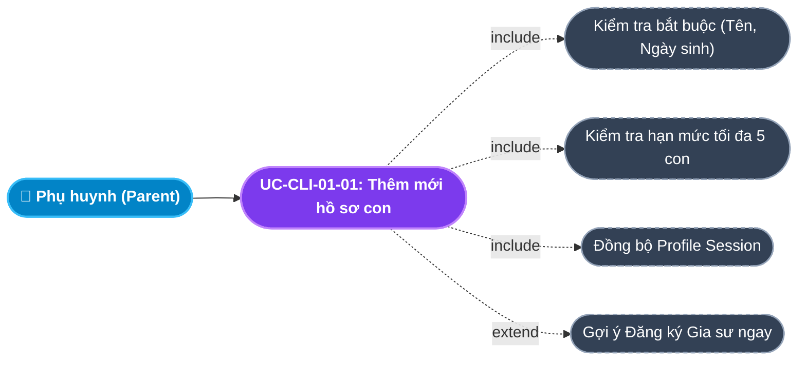
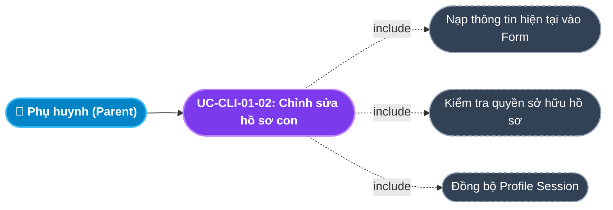
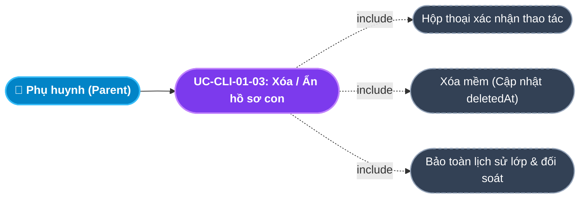
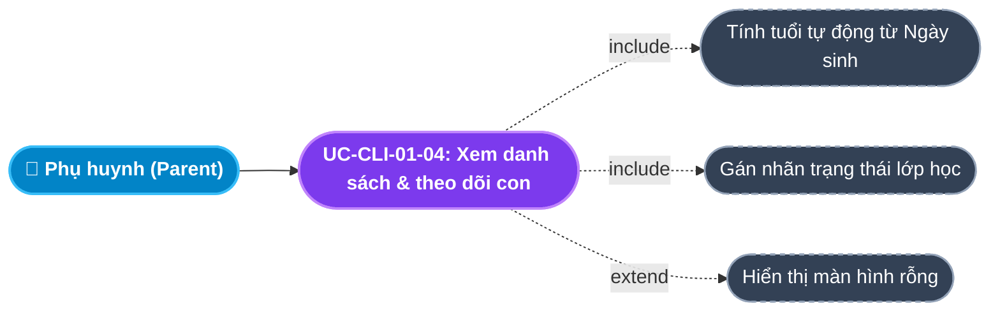
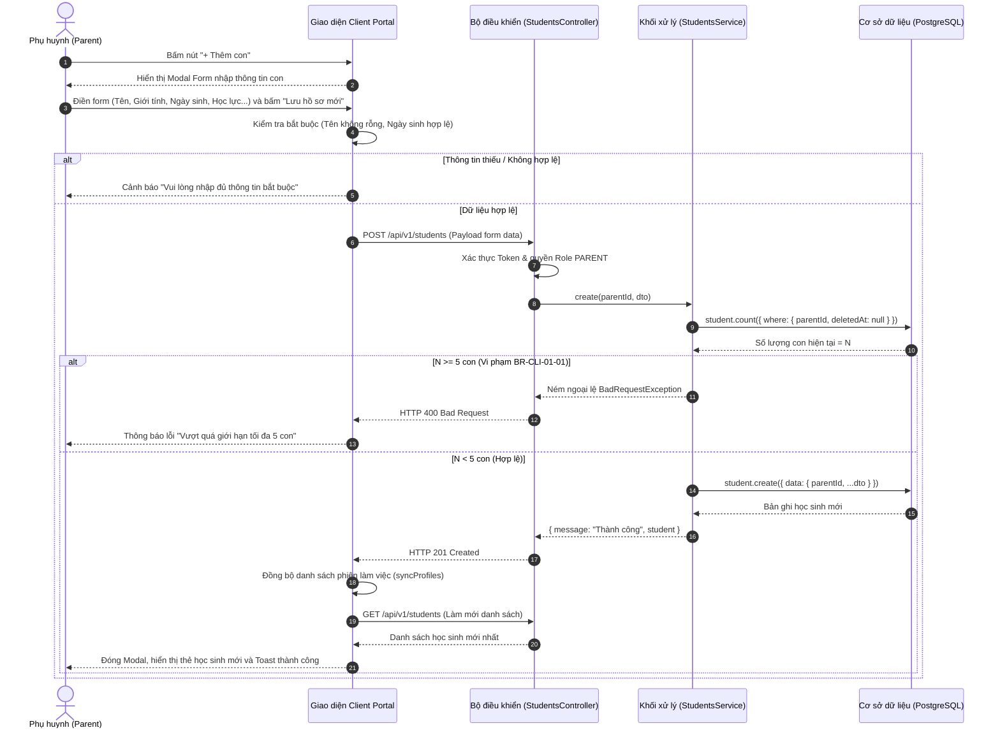
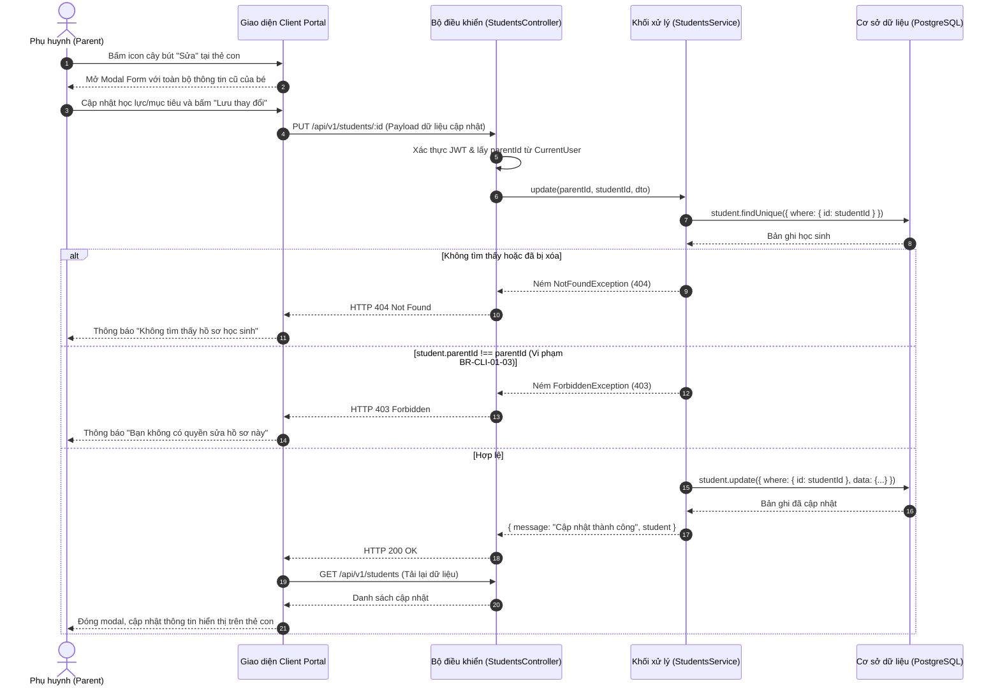
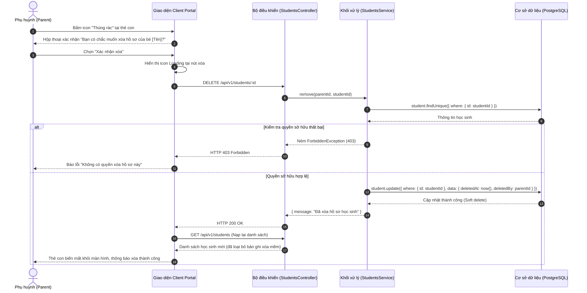
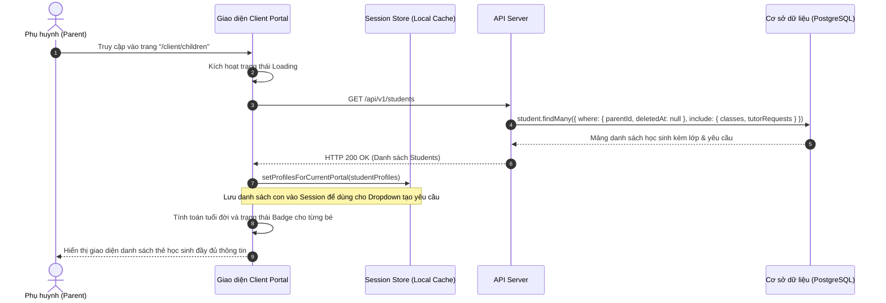

# Usecase: UC-CLI-01 - Quản lý Hồ sơ Gia đình & Học sinh (Family & Student Profile Management)

## 1. Giới thiệu chức năng
- **Mục đích**: Cung cấp bộ công cụ toàn diện trên Cổng Khách hàng (Client Portal) cho Phụ huynh để quản lý thông tin các con trong gia đình (mô hình Family Profile tinh gọn). Hệ thống cho phép phụ huynh tạo lập, cập nhật, theo dõi tiến trình học tập và đặc điểm tâm lý của từng học sinh độc lập, phục vụ chuẩn xác cho công tác ghép nối gia sư (Smart Matching), cá nhân hóa phương pháp giảng dạy mà không yêu cầu ví tiền hay thủ tục phức tạp.
- **Actor (Tác nhân)**: Phụ huynh (Parent), Học sinh (Student), Tư vấn viên (Sales / Academic Admin).
- **Điều kiện tiên quyết**: Phụ huynh đã đăng nhập thành công vào Client Portal bằng Số điện thoại (xác thực mật khẩu / OTP) và sở hữu vai trò `PARENT`.

### Danh mục các chức năng con (Sub-features):
1. **UC-CLI-01-01: Thêm mới hồ sơ con**: Thiết lập hồ sơ con mới vào danh mục gia đình (tên, giới tính, ngày sinh, trường, lớp, học lực, tính cách, mục tiêu).
2. **UC-CLI-01-02: Chỉnh sửa hồ sơ con**: Cập nhật thông tin học tập, biến động học lực, đổi trường lớp hoặc thay đổi mục tiêu thi cử.
3. **UC-CLI-01-03: Xóa / Ẩn hồ sơ con (Soft Delete)**: Đóng và ẩn hồ sơ học sinh khi không còn nhu cầu học, đảm bảo bảo toàn lịch sử lớp học và dữ liệu đối soát.
4. **UC-CLI-01-04: Xem danh sách & theo dõi trạng thái con**: Tổng quan danh sách các con, giám sát tình trạng lớp học (Đang học / Đang chờ ghép / Chưa đăng ký), số tuổi, học lực và ghi chú sư phạm.
5. **UC-CLI-01-05: Đồng bộ hồ sơ phiên đăng nhập (Profile Session Sync)**: Tự động cập nhật danh sách học sinh vào bộ nhớ phiên làm việc của Portal, phục vụ chuyển đổi ngữ cảnh nhanh.

---

## 2. Dữ liệu nghiệp vụ đầu vào (Input Data & Parameters)

### 2.1. Dữ liệu biểu mẫu Hồ sơ học sinh (Student Form Data)
| Tên trường | Kiểu dữ liệu | Tính chất | Ý nghĩa nghiệp vụ & Ràng buộc |
|---|---|---|---|
| `Họ và tên` (fullName) | Chuỗi (String) | Bắt buộc | Tên đầy đủ của học sinh. Tối đa 100 ký tự. Không được chứa toàn ký tự trắng. |
| `Giới tính` (gender) | Enum / String | Bắt buộc | `MALE` (Nam), `FEMALE` (Nữ), `OTHER` (Khác). Phục vụ tiêu chí ghép gia sư theo giới tính. |
| `Ngày sinh` (dateOfBirth) | Date (`YYYY-MM-DD`) | Bắt buộc | Ngày tháng năm sinh. Hệ thống tự động tính tuổi thực tế và kiểm tra lứa tuổi học sinh (4 - 25 tuổi). |
| `Trường đang học` (school) | Chuỗi (String) | Tùy chọn | Trường học hiện tại (VD: `THCS Cầu Giấy`, `Vinschool`). Tối đa 150 ký tự. |
| `Lớp hiện tại` (grade) | Chuỗi (String) | Tùy chọn | Cấp lớp cần tìm gia sư (VD: `Lớp 9`, `Lớp 12`, `Đại học`). Tối đa 20 ký tự. |
| `Học lực hiện tại` (academicLevel) | Enum / String | Mặc định | `WEAK` (Mất gốc / Yếu kém), `AVERAGE` (Trung bình - cần củng cố), `GOOD` (Khá - cần nâng cao), `EXCELLENT` (Giỏi / Luyện thi HSG). Mặc định: `AVERAGE`. |
| `Môn học cần kèm` (subjectsNeeded) | Chuỗi (String) | Tùy chọn | Danh sách từ khóa môn học cần phụ đạo (VD: `Toán Hình, Tiếng Anh`). Tối đa 255 ký tự. |
| `Mục tiêu học tập` (targetGoal) | Chuỗi (String) | Tùy chọn | Kỳ vọng cụ thể của phụ huynh (VD: `Thi đỗ Chuyên Sư Phạm`, `Lấy lại căn bản sau 2 tháng`). Tối đa 255 ký tự. |
| `Tính cách / Tâm lý` (personalityTraits / learningStyle) | Chuỗi (String) | Tùy chọn | Ghi chú tâm lý giúp gia sư cá nhân hóa giáo án (VD: `Nhút nhát ngại hỏi`, `Hiếu động cần kiên nhẫn`). Tối đa 255 ký tự. |
| `Ghi chú cho giáo vụ` (notes) | Văn bản (Text) | Tùy chọn | Thông tin bổ trợ riêng biệt gửi cho bộ phận tư vấn & giáo vụ. Tối đa 500 ký tự. |

### 2.2. Dữ liệu Trạng thái & Theo dõi (Status & Badges)
| Tiêu chí | Kiểu dữ liệu | Nguồn tính toán | Hành vi & Hiển thị giao diện |
|---|---|---|---|
| `Số lớp đang học` (classCount) | Số nguyên | Đếm các bản ghi `classes` có trạng thái `TRIAL` hoặc `TEACHING`. | Hiển thị Badge Xanh lá (`#71dd37`): `Đang học X lớp` kèm chấm nhấp nháy. |
| `Số yêu cầu chờ ghép` (requestCount) | Số nguyên | Đếm các bản ghi `tutorRequests` có trạng thái `NEW`, `CONSULTING`, `PUBLISHED`. | Hiển thị Badge Cam (`#ffab00`): `Đang chờ ghép Y yêu cầu`. |
| `Chưa đăng ký` | Boolean | Không có lớp và không có yêu cầu nào đang chờ. | Hiển thị Badge Xám (`#8592a3`): `Chưa đăng ký gia sư`. |

---

## 3. Quy tắc nghiệp vụ (Business Rules)

| Mã Quy tắc | Tình huống nghiệp vụ | Cách hệ thống xử lý | Thông báo hiển thị cho người dùng |
|---|---|---|---|
| **BR-CLI-01-01** | **Giới hạn số con tối đa trên 1 tài khoản**: Phụ huynh đã có 5 hồ sơ con nhưng cố gắng tạo thêm con thứ 6. | Hệ thống kiểm tra số lượng học sinh hoạt động của `parentId`. Nếu $\ge 5$ $\rightarrow$ Từ chối thao tác tạo mới. | "Mỗi tài khoản phụ huynh chỉ được quản lý tối đa 5 hồ sơ con. Vui lòng liên hệ Hotline nếu có nhu cầu mở rộng." |
| **BR-CLI-01-02** | **Ràng buộc an toàn khi Xóa (Soft Delete)**: Phụ huynh nhấn xóa hồ sơ con đang có lớp học hoặc yêu cầu tìm gia sư. | Hệ thống kiểm tra: Nếu con đang có lớp học (kể cả lớp đã hoàn thành), hệ thống chỉ đánh dấu xóa mềm (`deletedAt = now()`, `deletedBy = parentId`), không xóa vật lý để giữ toàn vẹn lịch sử đối soát học phí. | "Đã xóa hồ sơ học sinh thành công" |
| **BR-CLI-01-03** | **Kiểm tra quyền sở hữu hồ sơ (Authorization)**: Người dùng sửa/xóa hồ sơ con nhưng `student.parentId !== currentUser.parentId`. | Backend kiểm tra khóa ngoại `parentId`. Nếu không khớp $\rightarrow$ Trả `HTTP 403 Forbidden`. | "Bạn không có quyền thao tác trên hồ sơ học sinh này" |
| **BR-CLI-01-04** | **Kiểm tra tính hợp lệ của ngày sinh**: Nhập ngày sinh trong tương lai hoặc tuổi < 4 tuổi / > 30 tuổi. | Frontend và Backend chặn lại nếu `dateOfBirth > now()` hoặc tuổi không nằm trong khoảng hợp lệ. | "Ngày sinh không hợp lệ. Học sinh phải từ 4 tuổi trở lên" |
| **BR-CLI-01-05** | **Đồng bộ danh tính phiên làm việc (Session Sync)**: Sau khi Thêm/Sửa/Xóa thành công học sinh. | Frontend cập nhật danh sách học sinh vào `sessionStore` (`getProfilesForCurrentPortal`), giúp các dropdown chọn con ở trang Đăng tin cập nhật tức thì. | Tự động đồng bộ ngầm không cần tải lại trang |
| **BR-CLI-01-06** | **Ràng buộc trường bắt buộc**: Để trống Họ tên hoặc Ngày sinh. | Client highlight đỏ trường bị thiếu, ngăn chặn gửi form lên máy chủ. | "Vui lòng nhập đầy đủ Họ tên và Ngày sinh của học sinh" |
| **BR-CLI-01-07** | **Lọc bản ghi xóa mềm**: Phụ huynh tải danh sách con. | Backend lọc nghiêm ngặt điều kiện `where: { parentId, deletedAt: null }`. Không bao giờ trả về bản ghi đã xóa. | Hiển thị chính xác các con đang hoạt động |
| **BR-CLI-01-08** | **Chuẩn hóa chuỗi dữ liệu**: Người dùng nhập tên thừa dấu cách hoặc định dạng hoa thường lộn xộn. | Hệ thống tự động cắt tỉa khoảng trắng `trim()` trước khi lưu vào CSDL. | Dữ liệu hiển thị chuẩn hóa sạch đẹp |

---

## 4. Đặc tả chi tiết các Use Case chức năng con (Sub-Use Cases Specification)

---

### 4.1. UC-CLI-01-01: Thêm mới hồ sơ con (Create Student Profile)

#### Sơ đồ Use Case:

#### Bảng đặc tả nghiệp vụ:

| STT | Hạng mục | Nội dung chi tiết |
|:---:|---|---|
| **1** | **Thông tin chung** | - **UC ID**: `UC-CLI-01-01` - **UC Name**: Thêm mới hồ sơ con (Create Student Profile) - **Actor**: Phụ huynh (Parent) - **Mục tiêu**: Bổ sung thông tin học sinh mới vào tài khoản gia đình để chuẩn bị gửi yêu cầu tìm gia sư. - **Mô tả**: Phụ huynh nhập các thông tin cá nhân và định hướng học tập của con qua form Modal; hệ thống kiểm tra và lưu vào CSDL. - **Priority**: High (Chức năng cốt lõi) |
| **2** | **Trigger** | Phụ huynh nhấn nút **"+ Thêm con"** hoặc **"Thêm con ngay"** tại màn hình Con của tôi (`/client/children`). |
| **3** | **Pre-condition** | 1. Đã đăng nhập vào Client Portal với vai trò `PARENT`. 2. Số lượng con hiện có của tài khoản < 5 con (`BR-CLI-01-01`). |
| **4** | **Post-condition** | 1. Bản ghi học sinh mới được tạo trong bảng `students` liên kết với `parentId`. 2. Thẻ hồ sơ của con xuất hiện trên danh sách với trạng thái *"Chưa đăng ký gia sư"*. 3. Danh sách học sinh trong phiên làm việc (Session) được cập nhật ngay lập tức. |
| **5** | **Main Flow** | 1. Phụ huynh nhấn nút **"+ Thêm con"**. 2. Giao diện mở Modal form nhập liệu với các giá trị mặc định (`gender = 'MALE'`, `academicLevel = 'AVERAGE'`). 3. Phụ huynh điền: Họ tên, Giới tính, Ngày sinh, Trường, Lớp, Học lực, Môn cần kèm, Mục tiêu, Tính cách, Ghi chú. 4. Phụ huynh nhấn **"Lưu hồ sơ mới"**. 5. Client kiểm tra hợp lệ dữ liệu (Họ tên không rỗng, Ngày sinh hợp lệ). 6. Gửi request `POST /api/v1/students` kèm payload dữ liệu. 7. Backend kiểm tra hạn mức $\le 5$ con và lưu bản ghi mới vào CSDL. 8. Backend trả về `HTTP 201 Created` kèm thông tin học sinh vừa tạo. 9. Giao diện đóng Modal, gọi `fetchStudents()` làm mới danh sách và hiển thị Toast thông báo thành công. |
| **6** | **Alternative / Exception Flow** | - **AF-01 (Hủy bỏ nhập liệu)**: Phụ huynh bấm nút "Hủy" hoặc biểu tượng `X` $\rightarrow$ Đóng modal ngay, giữ nguyên dữ liệu cũ. - **EF-01 (Vượt quá hạn mức 5 con)**: Nếu tài khoản đã có 5 con $\rightarrow$ Backend trả lỗi `400 Bad Request`, giao diện báo lỗi *"Tối đa 5 hồ sơ con"*. - **EF-02 (Thiếu trường bắt buộc)**: Để trống Họ tên hoặc Ngày sinh $\rightarrow$ Giao diện cảnh báo *"Vui lòng nhập đủ thông tin"* và không gửi request. - **EF-03 (Lỗi kết nối máy chủ)**: Mạng lỗi hoặc HTTP 500 $\rightarrow$ Toast hiển thị *"Không thể lưu hồ sơ học sinh"*. |
| **7** | **Business Rules & Validation** | - `BR-CLI-01-01`: Giới hạn tối đa 5 con/phụ huynh. - `BR-CLI-01-04`: Ngày sinh không được trong tương lai. - `fullName`: Độ dài từ 2 đến 100 ký tự. - `gender`: Thuộc tập `['MALE', 'FEMALE', 'OTHER']`. |
| **8** | **Acceptance Criteria** | - **AC-01**: Bấm "+ Thêm con" mở modal < 200ms. - **AC-02**: Nhập thông tin hợp lệ và bấm Lưu $\rightarrow$ Modal đóng, thẻ học sinh mới xuất hiện trên giao diện ngay. - **AC-03**: Thẻ con mới có nút bấm trực tiếp "Đăng ký gia sư" liên kết đúng `studentId`. |

---

### 4.2. UC-CLI-01-02: Chỉnh sửa hồ sơ con (Update Student Profile)

#### Sơ đồ Use Case:

#### Bảng đặc tả nghiệp vụ:

| STT | Hạng mục | Nội dung chi tiết |
|:---:|---|---|
| **1** | **Thông tin chung** | - **UC ID**: `UC-CLI-01-02` - **UC Name**: Chỉnh sửa hồ sơ con (Update Student Profile) - **Actor**: Phụ huynh (Parent) - **Mục tiêu**: Điều chỉnh thông tin học lực, mục tiêu học tập, lớp học hoặc tâm lý của con khi có sự thay đổi. - **Mô tả**: Tải dữ liệu cũ lên Modal form, người dùng sửa các trường mong muốn và lưu vào hệ thống. - **Priority**: High |
| **2** | **Trigger** | Phụ huynh nhấn vào biểu tượng cây bút **"Sửa" (Pencil)** tại thẻ hồ sơ của con tương ứng. |
| **3** | **Pre-condition** | 1. Đã đăng nhập vào hệ thống. 2. Học sinh cần sửa thuộc quyền sở hữu của phụ huynh (`student.parentId === currentUser.parentId`). |
| **4** | **Post-condition** | 1. Dữ liệu hồ sơ con được cập nhật chính xác trong CSDL. 2. Thẻ hồ sơ cập nhật lại tuổi, học lực, mục tiêu và môn học tương ứng. |
| **5** | **Main Flow** | 1. Phụ huynh tìm đến thẻ con cần sửa và bấm icon cây bút **Sửa**. 2. Hệ thống mở Modal Form, tự động điền toàn bộ dữ liệu hiện tại của con. 3. Phụ huynh cập nhật các thông tin mong muốn (ví dụ đổi học lực từ "Mất gốc" sang "Khá"). 4. Phụ huynh bấm **"Lưu thay đổi"**. 5. Client kiểm tra hợp lệ dữ liệu. 6. Gửi request `PUT /api/v1/students/:id` kèm dữ liệu mới. 7. Backend kiểm tra quyền sở hữu (`BR-CLI-01-03`) và cập nhật bản ghi trong CSDL. 8. Backend trả về `HTTP 200 OK` kèm dữ liệu đã cập nhật. 9. Giao diện đóng Modal, nạp lại dữ liệu và hiển thị thông báo thành công. |
| **6** | **Alternative / Exception Flow** | - **AF-01 (Hủy bỏ sửa)**: Bấm "Hủy" hoặc biểu tượng `X` $\rightarrow$ Đóng modal, giữ nguyên giá trị cũ. - **EF-01 (Không có quyền sửa)**: Thao tác trên ID con của phụ huynh khác $\rightarrow$ Trả `403 Forbidden`, báo lỗi *"Bạn không có quyền sửa hồ sơ học sinh này"*. - **EF-02 (Hồ sơ đã bị xóa trước đó)**: Hồ sơ đã bị xóa mềm $\rightarrow$ Trả `404 Not Found`, báo *"Không tìm thấy hồ sơ học sinh"*. |
| **7** | **Business Rules & Validation** | - `BR-CLI-01-03`: Kiểm tra chặt chẽ `student.parentId === currentParentId`. - `BR-CLI-01-05`: Đồng bộ dữ liệu mới vào `sessionStore`. |
| **8** | **Acceptance Criteria** | - **AC-01**: Khi bấm icon Sửa, form mở ra hiển thị 100% dữ liệu chính xác của học sinh đó. - **AC-02**: Thay đổi học lực và bấm lưu $\rightarrow$ Badge màu học lực tại thẻ con đổi màu tương ứng ngay lập tức. |

---

### 4.3. UC-CLI-01-03: Xóa / Ẩn hồ sơ con (Soft Delete Student Profile)

#### Sơ đồ Use Case:

#### Bảng đặc tả nghiệp vụ:

| STT | Hạng mục | Nội dung chi tiết |
|:---:|---|---|
| **1** | **Thông tin chung** | - **UC ID**: `UC-CLI-01-03` - **UC Name**: Xóa / Ẩn hồ sơ con (Soft Delete Student Profile) - **Actor**: Phụ huynh (Parent) - **Mục tiêu**: Loại bỏ hồ sơ học sinh nhập sai hoặc không còn nhu cầu học tập khỏi danh sách hiển thị. - **Mô tả**: Xác nhận cảnh báo người dùng và thực hiện xóa mềm (gán cờ `deletedAt`) để bảo vệ dữ liệu lịch sử. - **Priority**: Medium |
| **2** | **Trigger** | Phụ huynh nhấn vào biểu tượng **Thùng rác (Trash2)** tại thẻ hồ sơ của con cần xóa. |
| **3** | **Pre-condition** | 1. Có quyền thao tác trên tài khoản phụ huynh. 2. Hồ sơ con đang hiển thị trên danh sách. |
| **4** | **Post-condition** | 1. Cập nhật `deletedAt = now()` và `deletedBy = parentId` trong CSDL. 2. Thẻ hồ sơ con biến mất hoàn toàn khỏi giao diện của phụ huynh. 3. Lịch sử lớp học và các giao dịch đối soát cũ của con vẫn được bảo toàn nguyên vẹn trong hệ thống CRM. |
| **5** | **Main Flow** | 1. Phụ huynh nhấn biểu tượng **Thùng rác** tại góc dưới thẻ con. 2. Hệ thống hiển thị hộp thoại xác nhận: *"Bạn có chắc muốn xóa hồ sơ của bé [Tên bé]?"*. 3. Phụ huynh chọn **Xác nhận (OK)**. 4. Nút bấm chuyển sang biểu tượng xoay Loading (`deletingId === s.id`). 5. Client gửi request `DELETE /api/v1/students/:id`. 6. Backend kiểm tra quyền sở hữu (`BR-CLI-01-03`). 7. Backend cập nhật `deletedAt` cho học sinh và trả về `HTTP 200 OK`. 8. Client nạp lại danh sách học sinh, thẻ của con biến mất khỏi màn hình. |
| **6** | **Alternative / Exception Flow** | - **AF-01 (Hủy bỏ xóa)**: Phụ huynh nhấn nút "Cancel" trên hộp thoại xác nhận $\rightarrow$ Hủy thao tác, giữ nguyên hồ sơ. - **EF-01 (Lỗi kết nối máy chủ)**: Mất mạng hoặc lỗi server $\rightarrow$ Dừng xoay loading, hiển thị thông báo: *"Không thể xóa hồ sơ học sinh"*. |
| **7** | **Business Rules & Validation** | - `BR-CLI-01-02`: Tuyệt đối không xóa vật lý (Hard Delete), luôn áp dụng Soft Delete để bảo đảm toàn vẹn dữ liệu đối soát tài chính. - `BR-CLI-01-07`: Mọi truy vấn danh sách mặc định lọc `deletedAt: null`. |
| **8** | **Acceptance Criteria** | - **AC-01**: Bắt buộc phải có hộp thoại xác nhận trước khi xóa. - **AC-02**: Khi xóa thành công, thẻ con lập tức biến mất khỏi danh sách mà không cần tải lại toàn bộ trang web. |

---

### 4.4. UC-CLI-01-04: Xem danh sách & theo dõi trạng thái con (View Student List & Status)

#### Sơ đồ Use Case:

#### Bảng đặc tả nghiệp vụ:

| STT | Hạng mục | Nội dung chi tiết |
|:---:|---|---|
| **1** | **Thông tin chung** | - **UC ID**: `UC-CLI-01-04` - **UC Name**: Xem danh sách & theo dõi trạng thái học sinh (View Student List & Status) - **Actor**: Phụ huynh (Parent) - **Mục tiêu**: Giúp phụ huynh có cái nhìn tổng quan về tình trạng học tập, số lớp đang học và các thông số sư phạm của từng con. - **Mô tả**: Tải và hiển thị danh sách hồ sơ con dưới dạng thẻ (Cards) trực quan, có avatar phân loại giới tính, nhãn tiến độ lớp và nút điều hướng tìm gia sư. - **Priority**: High |
| **2** | **Trigger** | Phụ huynh điều hướng tới trang `/client/children` từ Dashboard hoặc Menu chính. |
| **3** | **Pre-condition** | Đã đăng nhập vào hệ thống với tư cách Phụ huynh. |
| **4** | **Post-condition** | Giao diện kết xuất danh sách hồ sơ học sinh kèm đầy đủ số liệu tính toán. |
| **5** | **Main Flow** | 1. Phụ huynh truy cập màn hình **Con Của Tôi**. 2. Giao diện hiển thị trạng thái đang tải (`Loader animate-spin`). 3. Client gửi request `GET /api/v1/students`. 4. Backend truy vấn CSDL: Lấy các bản ghi `Student` thỏa mãn `parentId` và `deletedAt: null`, kèm các lớp học đang diễn ra (`TRIAL`, `TEACHING`) và các yêu cầu tìm gia sư đang mở (`NEW`, `CONSULTING`, `PUBLISHED`). 5. Backend trả về mảng danh sách học sinh kèm các quan hệ liên kết. 6. Client tính toán tuổi theo hàm `calcAge(dateOfBirth)`, xác định màu sắc nhãn học lực và số lượng lớp đang học. 7. Kết xuất giao diện dạng lưới 2 cột (Grid layout). |
| **6** | **Alternative / Exception Flow** | - **EF-01 (Chưa có học sinh nào)**: Nếu danh sách trả về rỗng (`length === 0`) $\rightarrow$ Hiển thị giao diện Empty State thân thiện với icon `Users`, kèm thông điệp *"Chưa có hồ sơ học sinh nào"* và nút kêu gọi hành động **"Thêm con ngay"**. - **EF-02 (Lỗi nạp dữ liệu)**: Máy chủ gặp lỗi $\rightarrow$ Hiển thị thông báo lỗi màu đỏ ở đầu trang. |
| **7** | **Business Rules & Validation** | - `BR-CLI-01-07`: Loại trừ hoàn toàn các bản ghi đã xóa mềm. - Badge trạng thái tuân thủ chính xác: Nếu `classCount > 0` hiển thị Xanh lá; nếu `requestCount > 0` hiển thị Cam; còn lại hiển thị Xám. |
| **8** | **Acceptance Criteria** | - **AC-01**: Tải dữ liệu danh sách con < 500ms. - **AC-02**: Tuổi học sinh được tính toán chính xác tuyệt đối theo ngày/tháng/năm hiện tại. - **AC-03**: Nhấn vào nút "Đăng ký gia sư" tại thẻ con sẽ chuyển hướng đến trang `/client/request-tutor?studentId=...` với thông tin con được chọn sẵn. |

---

## 5. Sơ đồ tuần tự nghiệp vụ (Sequence Diagrams)

### 5.1. Sơ đồ: Thêm mới hồ sơ con (Create Student)

### 5.2. Sơ đồ: Chỉnh sửa thông tin hồ sơ con (Update Student)

### 5.3. Sơ đồ: Xóa / Ẩn hồ sơ con (Soft Delete Student)

### 5.4. Sơ đồ: Nạp danh sách & Đồng bộ phiên làm việc (Fetch & Sync)

---

## 6. Kịch bản kiểm thử & Nghiệm thu (Given / When / Then)

### Kịch bản 1: Thêm mới hồ sơ con thành công với đầy đủ thông tin
- **Given**: Phụ huynh đã đăng nhập tài khoản và hiện tại đang có 1 hồ sơ con trong danh sách.
- **When**: Phụ huynh bấm "+ Thêm con", nhập Họ tên là `"Nguyễn Minh Khôi"`, giới tính `"Nam"`, ngày sinh `"2012-08-15"`, học lực `"Khá"`, môn cần kèm `"Toán Hình"`, mục tiêu `"Thi đỗ chuyên Toán"` và bấm "Lưu hồ sơ mới".
- **Then**: Hệ thống lưu thành công vào CSDL, đóng Modal form. Thẻ hồ sơ bé `"NGUYỄN MINH KHÔI"` xuất hiện với avatar 👦, hiển thị `"Nam · 14 tuổi · Học lực Khá"` và nhãn `"Chưa đăng ký gia sư"`.

### Kịch bản 2: Chặn tạo hồ sơ khi vượt quá hạn mức 5 con
- **Given**: Tài khoản phụ huynh đã tạo sẵn 5 hồ sơ con đang hoạt động.
- **When**: Phụ huynh bấm "+ Thêm con" và cố gắng lưu thông tin bé thứ 6.
- **Then**: Hệ thống từ chối lưu, hiển thị thông báo lỗi rõ ràng: *"Mỗi tài khoản phụ huynh chỉ được quản lý tối đa 5 hồ sơ con"*. Dữ liệu cũ được giữ nguyên không đổi.

### Kịch bản 3: Chỉnh sửa thông tin học lực và mục tiêu của con
- **Given**: Học sinh `"Nguyễn Minh Khôi"` đang có học lực là `"Mất gốc / Yếu"`.
- **When**: Phụ huynh bấm icon Sửa, đổi học lực thành `"Khá (cần nâng cao)"`, cập nhật mục tiêu là `"Điểm phẩy Toán đạt 8.5"` và bấm "Lưu thay đổi".
- **Then**: Modal đóng lại, thẻ của bé Khôi trên giao diện chuyển sang nhãn học lực màu xanh lá `"Học lực Khá"`, mục tiêu mới được hiển thị ngay lập tức.

### Kịch bản 4: Xóa an toàn hồ sơ con (Soft Delete)
- **Given**: Danh sách đang hiển thị hồ sơ bé `"Nguyễn Văn B"`.
- **When**: Phụ huynh bấm biểu tượng Thùng rác tại thẻ của bé và bấm "OK" trên hộp thoại xác nhận.
- **Then**: Nút thùng rác chuyển sang trạng thái xoay tròn trong thời gian gửi request. Sau khi xóa thành công, thẻ của bé `"Nguyễn Văn B"` biến mất khỏi danh sách. Bản ghi trong CSDL có trường `deletedAt` được cập nhật thời gian xóa.

### Kịch bản 5: Điều hướng trực tiếp sang tạo yêu cầu tìm gia sư
- **Given**: Thẻ hồ sơ của bé `"Nguyễn Minh Khôi"` hiển thị nhãn `"Chưa đăng ký gia sư"`.
- **When**: Phụ huynh bấm vào nút `+ Đăng ký gia sư` ở góc dưới thẻ.
- **Then**: Hệ thống chuyển hướng người dùng sang trang `/client/request-tutor?studentId=[ID_CỦA_KHÔI]`, tại đây thông tin của bé Khôi đã được điền sẵn vào bước 1 mà không cần chọn lại.
