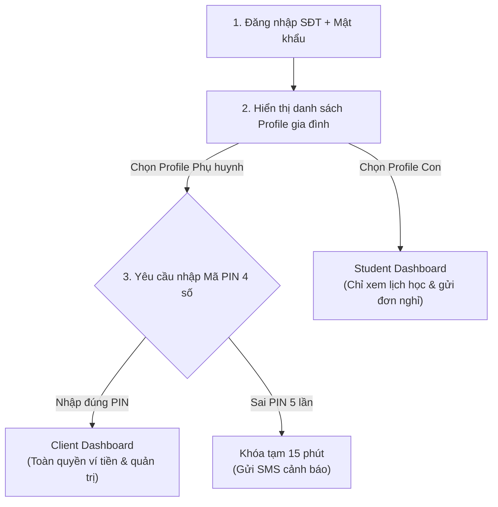
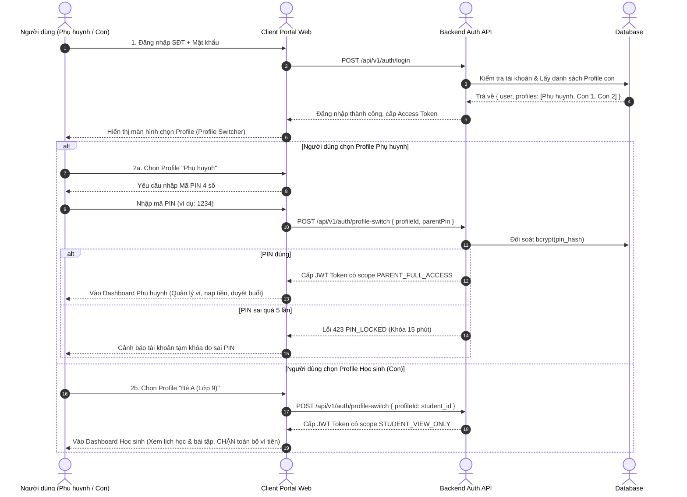

# ĐẶC TẢ NGHIỆP VỤ: HỒ SƠ GIA ĐÌNH & PROFILE SWITCHER (CLIENT PORTAL)

> **Mã phân hệ:** CLI-01  
> **Đối tượng sử dụng:** Phụ huynh (Parent), Học sinh (Student)  
> **Cổng truy cập:** `http://localhost:5173/client`

---

## 1. Mục Tiêu Nghiệp Vụ
Trong mô hình gia đình Việt Nam, một phụ huynh thường có từ 1 đến 3 con ở các độ tuổi và cấp học khác nhau. Mỗi con có nhu cầu học tập, môn học, giáo viên phụ trách, lịch học và gói học phí hoàn toàn khác biệt.

Hệ thống triển khai kiến trúc **Family Account (Mô hình tài khoản gia đình đa hồ sơ)**:
* **Tài khoản định danh duy nhất (Account)**: Thuộc sở hữu của Phụ huynh (đăng ký bằng SĐT cá nhân).
* **Nhiều hồ sơ con (Profiles)**: Mỗi con là một hồ sơ độc lập gắn với tài khoản phụ huynh.
* **Tách bạch dòng tiền và quản lý**: Ví tiền nằm ở cấp tài khoản Phụ huynh, nhưng gói học phí và lớp học được gắn chặt chẽ theo từng hồ sơ con.

---

## 2. Mô Hình Profile Switcher (Cơ Chế Chuyển Đổi Profile)

### 2.1. Sơ đồ tuần tự (Sequence Diagram) - Luồng Chuyển Profile & Xác Thực PIN

### 2.2. Phân quyền chi tiết giữa hai chế độ Profile

| Chức năng | Profile Phụ huynh (Parent Mode) | Profile Học sinh (Student Mode) |
| :--- | :---: | :---: |
| **Yêu cầu bảo mật** | Bắt buộc nhập **Mã PIN 4 số** | Không yêu cầu mã PIN |
| **Xem số dư ví & Lịch sử giao dịch** | Có toàn quyền | ❌ **Bị chặn hoàn toàn** |
| **Nạp tiền ví & Mua gói học phí** | Có toàn quyền | ❌ **Bị chặn hoàn toàn** |
| **Tạo yêu cầu tìm gia sư mới** | Có toàn quyền | ❌ **Bị chặn hoàn toàn** |
| **Duyệt gia sư dạy thử & Chốt lớp** | Có toàn quyền | ❌ **Bị chặn hoàn toàn** |
| **Xác nhận điểm danh buổi học (trừ buổi)** | Có toàn quyền | ❌ **Bị chặn hoàn toàn** |
| **Gửi khiếu nại (Dispute)** | Có toàn quyền | ❌ **Bị chặn hoàn toàn** |
| **Xem thời khóa biểu học tập** | Có | Có (chỉ thấy lịch của chính mình) |
| **Xem nhận xét của gia sư sau buổi học** | Có | Có |
| **Gửi đơn xin nghỉ học lẻ** | Duyệt & gửi trực tiếp sang GS | Gửi đơn chờ Phụ huynh phê duyệt |

---

## 3. Quy Trình Nghiệp Vụ: Quản Lý Hồ Sơ Con (Children CRUD)

### 3.1. Luồng chính (Happy Path)
1. Phụ huynh truy cập cổng Client $\rightarrow$ vào mục **"Hồ sơ con"** (`/client/children`).
2. Bấm nút **"Thêm hồ sơ con"**.
3. Điền biểu mẫu thông tin học sinh:
   * **Họ và tên con**: Bắt buộc (tối thiểu 2 từ, ví dụ: "Nguyễn Minh Khôi").
   * **Giới tính**: Nam / Nữ.
   * **Ngày sinh**: Định dạng ngày hợp lệ (tuổi từ 5 đến 20 tuổi).
   * **Trường đang học**: Tùy chọn (ví dụ: "THCS Trưng Vương").
   * **Cấp lớp hiện tại**: Chọn từ danh sách (Lớp 1 $\rightarrow$ Lớp 12, Đại học, Khác).
   * **Đặc điểm học lực / Ghi chú tính cách**: Nhút nhát, mất gốc Toán, cần ôn thi chuyên...
4. Bấm **"Lưu hồ sơ"**. Hệ thống tạo bản ghi trong bảng `students` liên kết với `parent_id`.

### 3.2. Quy tắc nghiệp vụ xóa hồ sơ con (Business Rule BR-CLI-CHILD)
* **Trường hợp xóa thành công**: Con chưa từng tham gia lớp học nào và chưa có yêu cầu tìm gia sư đang hoạt động.
* **Trường hợp chặn xóa (Edge Case)**: Nếu hồ sơ con đã có lớp học (kể cả trạng thái `COMPLETED`) hoặc đang có yêu cầu tìm gia sư ở trạng thái `CONSULTING` / `PUBLISHED` / `MATCHED`:
  * Hệ thống từ chối xóa và hiển thị thông báo: *"Không thể xóa hồ sơ con đã có lịch sử lớp học để đảm bảo dữ liệu đối soát và hóa đơn tài chính."*
  * Cho phép chỉnh sửa thông tin hoặc đánh dấu ẩn hồ sơ.

---

## 4. Cơ Chế Bảo Mật Mã PIN Phụ Huynh (Security PIN)

* **Thiết lập mã PIN**: Phụ huynh tạo mã PIN 4 chữ số (ví dụ: `1234`) khi đăng ký hoặc trong màn hình Cài đặt tài khoản.
* **Lưu trữ bảo mật**: Mã PIN chỉ được lưu dạng băm một chiều (bcrypt hash) trong CSDL (`pin_hash`), tuyệt đối không lưu dạng plain-text.
* **Chống tấn công Brute-Force (BR-SEC-04)**:
  * Nếu nhập sai mã PIN **5 lần liên tiếp**, tính năng xác thực tài chính và chuyển Profile Phụ huynh sẽ bị **khóa tạm thời trong 15 phút**.
  * Hệ thống ghi log cảnh báo an ninh vào bảng `audit_logs` và gửi tin nhắn cảnh báo qua SMS/Push đến Phụ huynh.
  * Hết 15 phút, số lần thử sai tự động reset về `0`.

---

## 5. Danh Sách Mã Lỗi Phục Vụ Dev & QA

| Mã lỗi (Error Code) | HTTP Status | Thông điệp người dùng | Cách khắc phục |
| :--- | :---: | :--- | :--- |
| `INVALID_PIN` | 400 | Mã PIN không chính xác. Còn lại {n} lần thử. | Nhập lại đúng 4 số PIN. |
| `PIN_LOCKED` | 423 | Tài khoản tạm khóa thao tác bảo mật 15 phút do sai PIN quá 5 lần. | Chờ hết 15 phút hoặc liên hệ Admin. |
| `STUDENT_HAS_CLASSES` | 400 | Không thể xóa hồ sơ học sinh đã có lịch sử lớp học. | Giữ nguyên hồ sơ để đối soát. |
| `FORBIDDEN_PROFILE` | 403 | Hồ sơ học sinh không có quyền truy cập chức năng này. | Chuyển sang Profile Phụ huynh. |

---

## 6. Hướng Dẫn Triển Khai Kỹ Thuật Phân Quyền (Technical Implementation)

Để đảm bảo việc phân quyền giữa Phụ huynh và Học sinh được an toàn tuyệt đối, đội ngũ phát triển (Dev) cần áp dụng cơ chế **Phân quyền dựa trên JWT Token (Role-Based Access Control bằng Scope)** với 2 lớp bảo vệ như sau:

### Lớp 1: Khóa chặt API tại Backend (NestJS Guards)
* Khi gọi API `POST /api/v1/auth/profile-switch`:
  * Nếu là Profile Phụ huynh (đã xác thực PIN): Trả về JWT Token chứa mảng scopes: `['PARENT_FULL_ACCESS']`.
  * Nếu là Profile Học sinh: Trả về JWT Token chứa mảng scopes: `['STUDENT_VIEW_ONLY']`.
* Ở tất cả các API liên quan đến tài chính (Nạp tiền, trừ tiền, tạo lệnh tìm gia sư), Backend phải đặt **Roles Guard** chặn tất cả các request.
  * Nếu JWT truyền lên chỉ có `STUDENT_VIEW_ONLY`, API lập tức ném ra lỗi `403 FORBIDDEN` để chặn đứng hành vi sửa dữ liệu, dù là hacker dùng phần mềm thứ 3.

### Lớp 2: Trải nghiệm người dùng tại Frontend (React/Vue)
* Dưới Client web, sau khi giải mã JWT Token (decode), Frontend sẽ lưu `currentRole` vào State Management (như Redux/Zustand).
* Sử dụng Render theo điều kiện (Conditional Rendering) để ẨN HOÀN TOÀN (chạy code `display: none` hoặc không render Component) đối với các nút nhạy cảm (Ví dụ: Nút "Nạp tiền", "Khiếu nại", màn hình "Quản lý ví") nếu người dùng đang ở `STUDENT_VIEW_ONLY`.
* Bắt buộc học sinh chỉ nhìn thấy 2 màn hình: Lịch học và Bài tập.
