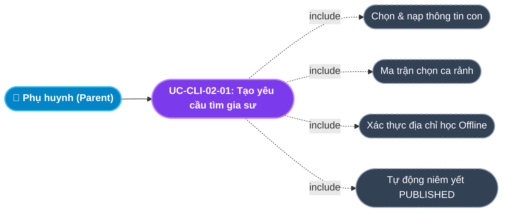
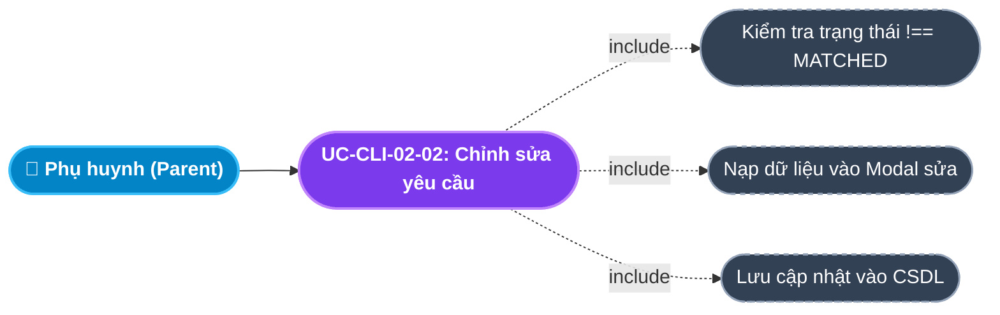
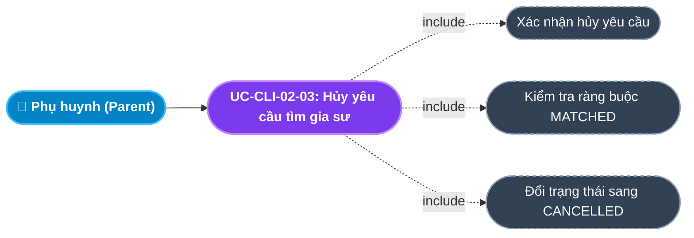
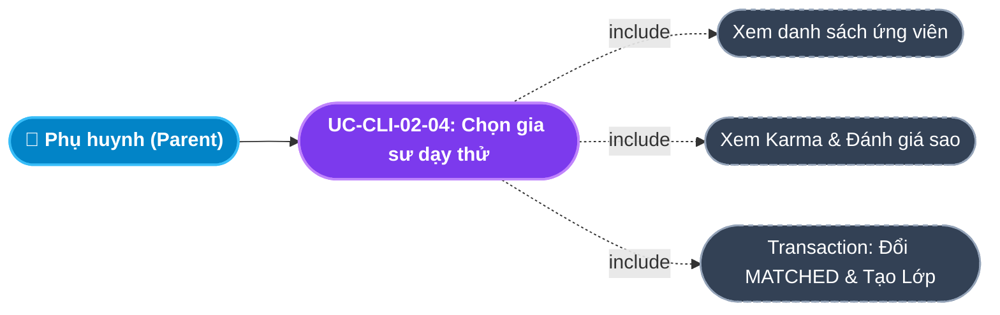
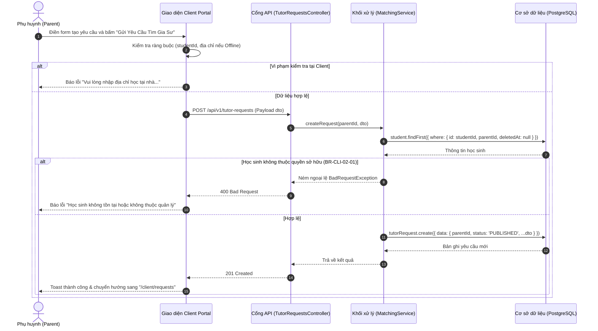
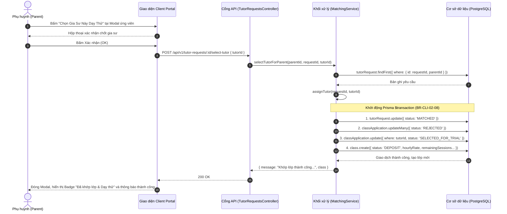

# Usecase: UC-CLI-02 - Đăng ký & Quản lý Yêu cầu Tìm Gia sư Miễn phí (Tutor Request Management)

## 1. Giới thiệu chức năng
- **Mục đích**: Cung cấp công cụ trực quan, minh bạch và hoàn toàn miễn phí trên Cổng Khách hàng (Client Portal) cho Phụ huynh tạo lập và quản lý các yêu cầu tìm gia sư theo nhu cầu học tập riêng biệt của từng con. Hệ thống hỗ trợ lên lịch học theo ma trận ca rảnh (Sáng/Chiều/Tối từ Thứ 2 đến Chủ Nhật), cấu hình mức ngân sách, hình thức học (Tại nhà / Online), đồng thời cho phép phụ huynh theo dõi tiến trình ứng tuyển của các gia sư, xem điểm uy tín Karma, đánh giá sao và trực tiếp phê duyệt gia sư vào dạy thử.
- **Actor (Tác nhân)**: Phụ huynh (Parent), Tư vấn viên (Sales / Điều phối viên), Gia sư (Tutor).
- **Điều kiện tiên quyết**: Phụ huynh đã đăng nhập vào Client Portal và đã có ít nhất 01 hồ sơ con trong hệ thống (`Student`).

### Danh mục các chức năng con (Sub-features):
1. **UC-CLI-02-01: Tạo mới yêu cầu tìm gia sư (Create Tutor Request)**: Chọn con, môn học, khối lớp, thiết lập ca rảnh trong tuần, số buổi/tuần, mức học phí đề xuất, hình thức học, địa chỉ và tiêu chí gia sư mong muốn.
2. **UC-CLI-02-02: Chỉnh sửa yêu cầu tìm gia sư (Update Tutor Request)**: Cập nhật môn học, học phí, số buổi hoặc yêu cầu bổ sung khi lớp chưa được ghép gia sư chính thức (`status !== 'MATCHED'`).
3. **UC-CLI-02-03: Hủy yêu cầu tìm gia sư (Cancel Tutor Request)**: Hủy bỏ yêu cầu tuyển gia sư khi gia đình thay đổi kế hoạch, chuyển trạng thái sang `CANCELLED`.
4. **UC-CLI-02-04: Lọc & Tra cứu yêu cầu tìm gia sư (Filter & Track Requests)**: Phân loại theo bộ lọc trạng thái: Tất cả, Đang tuyển (`PUBLISHED`), Đã khớp lớp (`MATCHED`), Đang tư vấn (`CONSULTING`), Đã hủy (`CANCELLED`).
5. **UC-CLI-02-05: Xem danh sách ứng viên & Chọn gia sư dạy thử (Review Candidates & Select Tutor)**: Xem chi tiết các gia sư đã nộp đơn ứng tuyển (Karma Score, Học vị, Đánh giá trung bình, Thư ngỏ), chọn gia sư ưng ý nhất để kích hoạt lịch dạy thử và tự động tạo Lớp học (`Class`).

---

## 2. Dữ liệu nghiệp vụ đầu vào (Input Data & Parameters)

### 2.1. Dữ liệu biểu mẫu Đăng ký Gia sư (Create Request Form Data)
| Tên trường | Kiểu dữ liệu | Tính chất | Ý nghĩa nghiệp vụ & Ràng buộc thực tế từ Code |
|---|---|---|---|
| `Học sinh` (studentId) | UUID | Bắt buộc | ID hồ sơ con thụ hưởng. Bắt buộc thuộc quyền sở hữu của phụ huynh (`parentId`). Có thể tự động nhận diện từ URL param `?studentId=...`. |
| `Môn học` (subject) | Chuỗi (String) | Bắt buộc | Môn học cần gia sư kèm (VD: `Toán`, `Tiếng Anh`, `Vật Lý`). Tự động điền từ trường `subjectsNeeded` của con nếu có. |
| `Cấp lớp` (grade) | Chuỗi (String) | Bắt buộc | Khối lớp hiện tại của học sinh (VD: `Lớp 9`, `Lớp 12`). |
| `Ca rảnh trong tuần` (selectedSlots) | Mảng chuỗi | Tùy chọn | Chọn các ô trong ma trận [Thứ 2 - CN] x [Sáng, Chiều, Tối]. Có nút chọn nhanh "Tất cả buổi tối" hoặc "Cuối tuần". |
| `Linh hoạt lịch` (flexibleSchedule) | Boolean | Tùy chọn | Nếu bật: Tự động ghi chú "Thỏa thuận linh hoạt với gia sư sau". |
| `Ghi chú lịch rảnh` (scheduleNotes) | Văn bản (Text) | Bắt buộc | Chuỗi tổng hợp từ `selectedSlots` và ghi chú bổ sung (VD: `Ca rảnh: Tối Thứ 3; Tối Thứ 6 \| Ghi chú: Học từ 19h30`). |
| `Số buổi mỗi tuần` (sessionsPerWeek) | Số nguyên (Integer) | Bắt buộc | Số buổi học trong 1 tuần. Ràng buộc: `Min = 1`, `Max = 7`. Mặc định = `2`. |
| `Học phí đề xuất` (budgetPerSession) | Số (Decimal/Number) | Bắt buộc | Mức học phí cho 1 buổi học (VNĐ). Ràng buộc: `Min = 50,000 đ`. Có các nút chọn nhanh: `150k`, `200k`, `250k`, `300k`, `350k`. Mặc định = `200,000 đ`. |
| `Hình thức học` (learningMode) | Enum / String | Mặc định | `OFFLINE` (Tại nhà học sinh) hoặc `ONLINE` (Trực tuyến qua Zoom/Meet). Mặc định: `OFFLINE`. |
| `Địa chỉ giảng dạy` (address) | Chuỗi (String) | Bắt buộc (nếu Offline) | Địa chỉ nhà cụ thể. Tự động lấy từ hồ sơ phụ huynh (`address, district, province`). Nếu chọn `ONLINE` $\rightarrow$ Tự động gán `"Online"`. |
| `Đối tượng gia sư` (tutorTypePref) | Enum / String | Mặc định | `ANY` (Không yêu cầu), `STUDENT` (Sinh viên), `TEACHER` (Giáo viên). |
| `Ưu tiên giới tính` (tutorGenderPref) | Enum / String | Mặc định | `ANY` (Không yêu cầu), `MALE` (Nam), `FEMALE` (Nữ). |
| `Yêu cầu riêng` (requirements) | Văn bản (Text) | Tùy chọn | Tiêu chí sư phạm riêng biệt (VD: `Kiên nhẫn, kèm chậm, có nghiệp vụ sư phạm toán hình`). |

### 2.2. Trạng thái vòng đời Yêu cầu tìm gia sư (Request Status Lifecycle)
| Mã trạng thái (Enum) | Nhãn hiển thị giao diện | Màu sắc Badge | Ý nghĩa nghiệp vụ |
|---|---|---|---|
| `NEW` | Mới gửi - Chờ duyệt | Tím (`#e7e7ff` / `#696cff`) | Yêu cầu vừa tạo, chờ hệ thống và Sales tiếp nhận. |
| `CONSULTING` | Đang tư vấn điều phối | Xám đậm (`#ebeef0` / `#566a7f`) | Chuyên viên tư vấn đang liên hệ phụ huynh để thẩm định và phân bổ. |
| `PUBLISHED` | Đang tuyển Gia sư | Vàng cam (`#fff2d6` / `#ffab00`) | Tin đã được công khai trên sàn nhận lớp để các gia sư ứng tuyển. |
| `MATCHED` | Đã khớp lớp & Dạy thử | Xanh lá (`#e8fadf` / `#71dd37`) | Phụ huynh hoặc Sales đã chọn gia sư; lớp học được tạo ở trạng thái `DEPOSIT`/`TRIAL`. |
| `CANCELLED` | Đã hủy | Đỏ nhạt (`#ffe0db` / `#ff3e1d`) | Phụ huynh chủ động hủy yêu cầu hoặc hết hạn tìm kiếm. |

---

## 3. Quy tắc nghiệp vụ (Business Rules)

| Mã Quy tắc | Tình huống nghiệp vụ | Cách hệ thống xử lý | Thông báo hiển thị cho người dùng |
|---|---|---|---|
| **BR-CLI-02-01** | **Xác thực quyền sở hữu học sinh**: Phụ huynh gửi `studentId` không tồn tại hoặc thuộc phụ huynh khác. | Backend kiểm tra `student.parentId === currentParentId`. Nếu sai $\rightarrow$ Trả `HTTP 400 Bad Request`. | "Học sinh không tồn tại hoặc không thuộc quyền quản lý của bạn" |
| **BR-CLI-02-02** | **Bắt buộc địa chỉ khi học Offline**: Chọn hình thức `OFFLINE` nhưng bỏ trống địa chỉ nhà. | Frontend kiểm tra `!address.trim()` và chặn submit form; Backend kiểm tra dữ liệu đầu vào. | "Vui lòng nhập địa chỉ học tại nhà để trung tâm điều phối gia sư gần khu vực" |
| **BR-CLI-02-03** | **Ràng buộc ngân sách tối thiểu**: Phụ huynh nhập học phí < 50,000 đ/buổi. | Class-validator kiểm tra `@Min(50000)`. Nếu nhỏ hơn $\rightarrow$ Backend ném ngoại lệ 400. | "Học phí đề xuất phải từ 50,000 đ trở lên" |
| **BR-CLI-02-04** | **Chặn sửa khi đã khớp lớp**: Phụ huynh cố gắng chỉnh sửa yêu cầu đã ở trạng thái `MATCHED`. | Backend kiểm tra `if (request.status === 'MATCHED')` $\rightarrow$ Ném `BadRequestException`. | "Lớp học đã được ghép gia sư, không thể chỉnh sửa" |
| **BR-CLI-02-05** | **Chặn hủy khi đã khớp lớp**: Phụ huynh bấm nút Hủy khi yêu cầu đã `MATCHED`. | Backend kiểm tra `status === 'MATCHED'` $\rightarrow$ Chặn thao tác, hướng dẫn phụ huynh liên hệ CSKH. | "Lớp học đã được khớp, vui lòng liên hệ trung tâm để xử lý hủy lớp" |
| **BR-CLI-02-06** | **Chống ứng tuyển trùng lặp**: Gia sư nộp đơn 2 lần vào cùng 1 yêu cầu. | Cơ sở dữ liệu ràng buộc `@@unique([tutorRequestId, tutorId])`. Backend kiểm tra tồn tại trước khi ghi. | "Bạn đã nộp đơn ứng tuyển cho lớp học này rồi" |
| **BR-CLI-02-07** | **Bảo mật thông tin Phụ huynh trên sàn công khai**: Gia sư hoặc khách vãng lai xem danh sách yêu cầu. | API `getPublishedRequestsForTutors` chỉ trả về `district, province` và tên học sinh; **tuyệt đối ẩn số điện thoại, email và số nhà chi tiết** (`Anti-bypass`). | Thông tin địa chỉ hiển thị tóm tắt: "Quận Cầu Giấy, Hà Nội" |
| **BR-CLI-02-08** | **Cơ chế chốt gia sư dạy thử (Transaction Safe)**: Phụ huynh bấm chọn gia sư từ danh sách ứng viên. | Hệ thống chạy Transaction: 1. Đổi yêu cầu sang `MATCHED`; 2. Chuyển đơn gia sư được chọn sang `SELECTED_FOR_TRIAL`, các đơn khác sang `REJECTED`; 3. Tạo Lớp học mới ở bảng `classes` với `status = 'DEPOSIT'`, `remainingSessions = sessionsPerWeek * 4`. | "Đã chọn Gia sư [Tên] dạy thử thành công! Lớp học đã được tạo." |

---

## 4. Đặc tả chi tiết các Use Case chức năng con (Sub-Use Cases Specification)

---

### 4.1. UC-CLI-02-01: Tạo mới yêu cầu tìm gia sư (Create Tutor Request)

#### Sơ đồ Use Case:

#### Bảng đặc tả nghiệp vụ:

| STT | Hạng mục | Nội dung chi tiết |
|:---:|---|---|
| **1** | **Thông tin chung** | - **UC ID**: `UC-CLI-02-01` - **UC Name**: Tạo mới yêu cầu tìm gia sư (Create Tutor Request) - **Actor**: Phụ huynh (Parent) - **Mục tiêu**: Đăng tải nhu cầu tìm gia sư mới với đầy đủ thông số thời gian, mức phí và môn học mà không tốn bất kỳ chi phí nào. - **Mô tả**: Phụ huynh chọn con, thiết lập lịch rảnh qua ma trận [Thứ 2-CN x Sáng/Chiều/Tối], chọn mức học phí và gửi yêu cầu lên hệ thống. - **Priority**: High (Chức năng tạo phễu cốt lõi) |
| **2** | **Trigger** | Phụ huynh nhấn nút **"Đăng ký gia sư"** tại thẻ học sinh hoặc nhấn **"Đăng ký tìm Gia sư mới"** từ trang Danh sách yêu cầu. |
| **3** | **Pre-condition** | 1. Đã đăng nhập vai trò `PARENT`. 2. Đã có ít nhất 01 hồ sơ con trong tài khoản. |
| **4** | **Post-condition** | 1. Bản ghi `tutorRequest` được tạo với `status = 'PUBLISHED'`. 2. Tin tuyển xuất hiện trên sàn nhận lớp của Gia sư và màn hình điều phối của Sales. 3. Chuyển hướng phụ huynh về trang `/client/requests` sau 1.5 giây. |
| **5** | **Main Flow** | 1. Phụ huynh truy cập `/client/request-tutor`. 2. Hệ thống tải thông tin các con và hồ sơ phụ huynh (lấy địa chỉ mặc định). Nếu URL có `?studentId=...`, hệ thống tự chọn con tương ứng. 3. Phụ huynh kiểm tra/chọn: Con, Môn học, Khối lớp. 4. Phụ huynh chọn ca rảnh trên ma trận hoặc tích "Thỏa thuận linh hoạt". 5. Phụ huynh chọn mức học phí (bấm các nút 150k - 350k hoặc nhập số), chọn đối tượng gia sư và hình thức học. 6. Bấm nút **"Gửi Yêu Cầu Tìm Gia Sư"**. 7. Client kiểm tra: `studentId` không rỗng, nếu Offline thì `address` không rỗng (`BR-CLI-02-02`). 8. Gửi request `POST /api/v1/tutor-requests` kèm payload dữ liệu. 9. Backend xác thực quyền sở hữu con (`BR-CLI-02-01`), lưu bản ghi vào CSDL với trạng thái `PUBLISHED`. 10. Giao diện thông báo thành công và tự động điều hướng sang trang Quản lý yêu cầu. |
| **6** | **Alternative / Exception Flow** | - **AF-01 (Tự động tính số buổi)**: Mỗi khi click chọn/bỏ chọn một ca trên ma trận, hệ thống tự động cập nhật số buổi/tuần tương ứng. - **EF-01 (Chưa có con)**: Chưa có hồ sơ con $\rightarrow$ Hiển thị cảnh báo và chuyển hướng sang trang thêm con `/client/children`. - **EF-02 (Thiếu địa chỉ Offline)**: Bỏ trống địa chỉ khi học Offline $\rightarrow$ Hiển thị lỗi màu đỏ: *"Vui lòng nhập địa chỉ học tại nhà..."*. - **EF-03 (Lỗi mạng hoặc 500)**: Toast hiển thị thông báo lỗi từ server, giữ nguyên dữ liệu trên form. |
| **7** | **Business Rules & Validation** | - `BR-CLI-02-01`: `studentId` phải thuộc quyền sở hữu của `parentId`. - `BR-CLI-02-02`: Địa chỉ bắt buộc đối với hình thức `OFFLINE`. - `BR-CLI-02-03`: Học phí đề xuất $\ge 50,000$ đ/buổi. - `sessionsPerWeek`: Số nguyên từ 1 đến 7. |
| **8** | **Acceptance Criteria** | - **AC-01**: Truy cập từ nút "Đăng ký gia sư" tại thẻ con $\rightarrow$ Tự động điền con, khối lớp, môn học trong < 300ms. - **AC-02**: Bấm nút chọn nhanh "Tất cả buổi tối" $\rightarrow$ Tự động tích chọn đủ 7 buổi tối từ T2 đến CN. - **AC-03**: Gửi thành công $\rightarrow$ Yêu cầu xuất hiện ngay ở trang `/client/requests` với Badge "Đang tuyển Gia sư" (màu cam). |

---

### 4.2. UC-CLI-02-02: Chỉnh sửa yêu cầu tìm gia sư (Update Tutor Request)

#### Sơ đồ Use Case:

#### Bảng đặc tả nghiệp vụ:

| STT | Hạng mục | Nội dung chi tiết |
|:---:|---|---|
| **1** | **Thông tin chung** | - **UC ID**: `UC-CLI-02-02` - **UC Name**: Chỉnh sửa yêu cầu tìm gia sư (Update Tutor Request) - **Actor**: Phụ huynh (Parent) - **Mục tiêu**: Điều chỉnh thông số học phí, số buổi, môn học hoặc địa chỉ của yêu cầu đang tuyển dụng. - **Mô tả**: Phụ huynh mở modal chỉnh sửa, thay đổi các thông tin và lưu cập nhật. - **Priority**: Medium |
| **2** | **Trigger** | Phụ huynh nhấn nút icon **"Chỉnh sửa" (Pencil)** trên thẻ yêu cầu tại trang `/client/requests`. |
| **3** | **Pre-condition** | Yêu cầu ở trạng thái `NEW`, `CONSULTING` hoặc `PUBLISHED` (Chưa bị chốt lớp `MATCHED`). |
| **4** | **Post-condition** | Bản ghi `tutorRequest` được cập nhật trong CSDL và phản ánh ngay lên thẻ hiển thị. |
| **5** | **Main Flow** | 1. Phụ huynh tìm đến thẻ yêu cầu cần chỉnh sửa và nhấn nút **Chỉnh sửa**. 2. Hệ thống mở Modal Form và nạp dữ liệu cũ (Môn, Lớp, Học phí, Số buổi, Lịch, Địa chỉ, Yêu cầu). 3. Phụ huynh thay đổi các thông số (ví dụ tăng học phí từ 200,000 đ lên 250,000 đ để thu hút thêm gia sư). 4. Phụ huynh nhấn **"Lưu cập nhật"**. 5. Client gửi request `PUT /api/v1/tutor-requests/:id` kèm dữ liệu mới. 6. Backend kiểm tra điều kiện không được sửa khi đã `MATCHED` (`BR-CLI-02-04`). 7. Backend cập nhật bản ghi trong CSDL và trả về `HTTP 200 OK`. 8. Modal đóng lại, danh sách yêu cầu được nạp lại và thông báo Toast thành công. |
| **6** | **Alternative / Exception Flow** | - **EF-01 (Cố tình sửa yêu cầu đã ghép lớp)**: Nếu yêu cầu đã là `MATCHED` $\rightarrow$ Backend trả lỗi `HTTP 400`, thông báo *"Lớp học đã được ghép gia sư, không thể chỉnh sửa"*. |
| **7** | **Business Rules & Validation** | - `BR-CLI-02-04`: Tuyệt đối chặn sửa khi `status === 'MATCHED'`. - `budgetPerSession`: Phải là số nguyên dương $\ge 50,000$ đ. |
| **8** | **Acceptance Criteria** | - **AC-01**: Modal mở ra với 100% dữ liệu chính xác của yêu cầu đó. - **AC-02**: Thay đổi học phí và lưu $\rightarrow$ Số tiền hiển thị trên thẻ yêu cầu được format VNĐ chuẩn xác. |

---

### 4.3. UC-CLI-02-03: Hủy yêu cầu tìm gia sư (Cancel Tutor Request)

#### Sơ đồ Use Case:

#### Bảng đặc tả nghiệp vụ:

| STT | Hạng mục | Nội dung chi tiết |
|:---:|---|---|
| **1** | **Thông tin chung** | - **UC ID**: `UC-CLI-02-03` - **UC Name**: Hủy yêu cầu tìm gia sư (Cancel Tutor Request) - **Actor**: Phụ huynh (Parent) - **Mục tiêu**: Đóng yêu cầu khi phụ huynh đã tự tìm được người kèm hoặc thay đổi kế hoạch học tập. - **Mô tả**: Người dùng xác nhận hủy, hệ thống cập nhật `status = 'CANCELLED'` và gỡ tin khỏi sàn. - **Priority**: Medium |
| **2** | **Trigger** | Phụ huynh nhấn nút icon **"Hủy yêu cầu" (Ban)** tại góc phải của thẻ yêu cầu. |
| **3** | **Pre-condition** | Yêu cầu thuộc quyền sở hữu của phụ huynh và chưa ở trạng thái `MATCHED`. |
| **4** | **Post-condition** | Trạng thái yêu cầu đổi thành `CANCELLED`, badge chuyển sang màu đỏ nhạt, tin bị ẩn khỏi sàn gia sư. |
| **5** | **Main Flow** | 1. Phụ huynh nhấn icon **Hủy yêu cầu**. 2. Hệ thống hiển thị hộp thoại xác nhận: *"Bạn có chắc chắn muốn hủy yêu cầu tìm gia sư môn [Môn] cho bé [Tên con]?"*. 3. Phụ huynh bấm **OK**. 4. Client gửi request `POST /api/v1/tutor-requests/:id/cancel`. 5. Backend kiểm tra tính hợp lệ (`BR-CLI-02-05`), cập nhật `status: 'CANCELLED'` trong CSDL. 6. Backend trả về bản ghi cập nhật. 7. Client nạp lại danh sách, thẻ chuyển sang Badge đỏ *"Đã hủy"*. |
| **6** | **Alternative / Exception Flow** | - **AF-01 (Hủy bỏ xác nhận)**: Bấm "Cancel" trên hộp thoại $\rightarrow$ Giữ nguyên trạng thái yêu cầu. - **EF-01 (Yêu cầu đã được khớp lớp)**: Backend trả lỗi `400 Bad Request`, thông báo: *"Lớp học đã được khớp, vui lòng liên hệ trung tâm để xử lý hủy lớp"*. |
| **7** | **Business Rules & Validation** | - `BR-CLI-02-05`: Không cho phép phụ huynh tự ý hủy trên web khi đã chốt gia sư dạy thử để tránh xung đột quyền lợi và tiền cọc. |
| **8** | **Acceptance Criteria** | - **AC-01**: Bắt buộc có hộp thoại xác nhận trước khi hủy. - **AC-02**: Sau khi hủy, yêu cầu chuyển vào tab bộ lọc "Đã hủy" và không còn hiển thị cho các gia sư nộp đơn. |

---

### 4.4. UC-CLI-02-04: Xem danh sách ứng viên & Chọn gia sư dạy thử (Review & Select Tutor)

#### Sơ đồ Use Case:

#### Bảng đặc tả nghiệp vụ:

| STT | Hạng mục | Nội dung chi tiết |
|:---:|---|---|
| **1** | **Thông tin chung** | - **UC ID**: `UC-CLI-02-04` - **UC Name**: Xem danh sách ứng viên & Chọn gia sư dạy thử (Review Candidates & Select Tutor) - **Actor**: Phụ huynh (Parent) - **Mục tiêu**: Giúp phụ huynh chủ động lựa chọn gia sư phù hợp nhất từ danh sách các gia sư đã nộp đơn ứng tuyển và kích hoạt buổi dạy thử. - **Mô tả**: Xem profile tóm tắt (Điểm uy tín Karma, bằng cấp, số sao, thư ứng tuyển) và bấm chọn gia sư; hệ thống tự động khóa yêu cầu và tạo lớp học mới. - **Priority**: High (Điểm chốt hợp đồng) |
| **2** | **Trigger** | Phụ huynh nhấn nút **"Xem danh sách ứng viên (X)"** trên thẻ yêu cầu có gia sư nộp đơn. |
| **3** | **Pre-condition** | Yêu cầu có `classApplications.length > 0` và đang ở trạng thái `PUBLISHED` hoặc `CONSULTING`. |
| **4** | **Post-condition** | 1. `tutorRequest.status` chuyển thành `MATCHED`. 2. Ứng viên được chọn chuyển sang `SELECTED_FOR_TRIAL`, các ứng viên khác chuyển sang `REJECTED`. 3. Tạo bản ghi mới trong bảng `classes` với `status = 'DEPOSIT'`, `remainingSessions = sessionsPerWeek * 4`. 4. Toast hiển thị thông báo thành công. |
| **5** | **Main Flow** | 1. Phụ huynh nhấn **"Xem danh sách ứng viên"**. 2. Hệ thống mở Modal hiển thị danh sách các gia sư ứng tuyển kèm: Họ tên, Điểm Karma (Badge tím), Đánh giá sao (Rating Avg), Trình độ học vị và Thư ngỏ (Cover letter). 3. Phụ huynh xem xét hồ sơ và bấm nút **"Chọn Gia Sư Này Dạy Thử"**. 4. Hộp thoại xác nhận xuất hiện: *"Xác nhận chọn Gia sư [Tên] dạy thử cho bé? Hệ thống sẽ tạo lớp học để bắt đầu."*. 5. Phụ huynh bấm **OK**. 6. Client gửi request `POST /api/v1/tutor-requests/:id/select-tutor` với body `{ tutorId }`. 7. Backend thực hiện Prisma Transaction: cập nhật trạng thái yêu cầu sang `MATCHED`, cập nhật đơn ứng tuyển và tạo bản ghi `Class` (`BR-CLI-02-08`). 8. Backend trả về thông tin lớp học vừa tạo. 9. Đóng Modal, tải lại danh sách yêu cầu, thẻ chuyển sang Badge xanh lá *"Đã khớp lớp & Dạy thử"*. |
| **6** | **Alternative / Exception Flow** | - **EF-01 (Gia sư chưa ứng tuyển)**: Truyền ID gia sư không nằm trong danh sách nộp đơn $\rightarrow$ Backend từ chối `400 Bad Request`, báo *"Gia sư này chưa ứng tuyển vào lớp"*. |
| **7** | **Business Rules & Validation** | - `BR-CLI-02-08`: Đảm bảo tính toàn vẹn giao dịch thông qua Prisma Transaction; chỉ cho phép 01 gia sư duy nhất được chọn dạy thử trên 1 lớp. |
| **8** | **Acceptance Criteria** | - **AC-01**: Hiển thị chính xác điểm Karma Score và số sao trung bình của từng ứng viên. - **AC-02**: Sau khi bấm chọn, lớp học lập tức được sinh ra trong CSDL và yêu cầu chuyển sang `MATCHED` không thể chọn thêm gia sư khác. |

---

## 5. Sơ đồ tuần tự nghiệp vụ (Sequence Diagrams)

### 5.1. Sơ đồ: Tạo mới yêu cầu tìm gia sư

### 5.2. Sơ đồ: Chọn gia sư dạy thử & Tạo Lớp học

---

## 6. Kịch bản kiểm thử & Nghiệm thu (Given / When / Then)

### Kịch bản 1: Tạo yêu cầu tìm gia sư Offline thành công
- **Given**: Phụ huynh có con là `"Nguyễn Minh Khôi"`, địa chỉ nhà là `"123 Cầu Giấy, Hà Nội"`.
- **When**: Phụ huynh chọn con Khôi, môn `"Toán"`, lớp `"Lớp 9"`, chọn 2 ca rảnh (Tối T3, Tối T6), học phí `"250,000 đ"`, hình thức `"OFFLINE"` và bấm Gửi yêu cầu.
- **Then**: Hệ thống tạo bản ghi mới với trạng thái `PUBLISHED`, ghi chú lịch là `"Ca rảnh: Tối Thứ 3; Tối Thứ 6"`. Màn hình hiển thị thông báo thành công và chuyển về trang danh sách yêu cầu.

### Kịch bản 2: Chặn tạo yêu cầu Offline khi thiếu địa chỉ
- **Given**: Phụ huynh chưa cập nhật địa chỉ nhà trong hồ sơ cá nhân.
- **When**: Phụ huynh tạo yêu cầu hình thức `"OFFLINE"` nhưng để trống ô địa chỉ.
- **Then**: Giao diện chặn submit và hiển thị cảnh báo đỏ: *"Vui lòng nhập địa chỉ học tại nhà để trung tâm điều phối gia sư gần khu vực"*. Không có request nào được gửi lên server.

### Kịch bản 3: Chỉnh sửa học phí đề xuất của yêu cầu đang tuyển
- **Given**: Yêu cầu tìm gia sư môn Tiếng Anh đang ở trạng thái `PUBLISHED` với học phí cũ là `200,000 đ`.
- **When**: Phụ huynh bấm nút Sửa, đổi học phí thành `300,000 đ` và bấm "Lưu cập nhật".
- **Then**: Modal đóng lại, thẻ yêu cầu cập nhật mức phí mới thành `"300.000 đ/buổi"`, CSDL lưu giá trị mới.

### Kịch bản 4: Chốt gia sư dạy thử từ danh sách ứng viên
- **Given**: Yêu cầu tìm gia sư có 2 ứng viên: Gia sư A (Karma: 100, 5 sao) và Gia sư B (Karma: 80, 4.5 sao).
- **When**: Phụ huynh mở danh sách ứng viên và bấm "Chọn Gia Sư Này Dạy Thử" cho Gia sư A.
- **Then**: Hệ thống hoàn tất giao dịch: Yêu cầu chuyển sang trạng thái `MATCHED`, Gia sư A chuyển thành `SELECTED_FOR_TRIAL`, một lớp học mới được tạo ở trạng thái `DEPOSIT`. Thẻ yêu cầu cập nhật Badge màu xanh lá.
