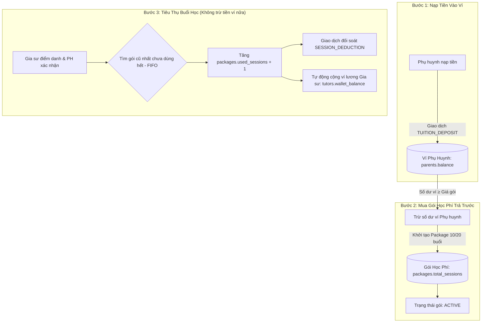
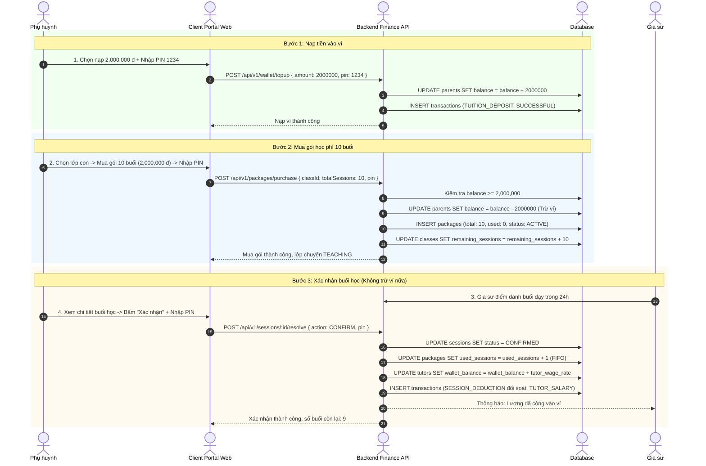

# ĐẶC TẢ NGHIỆP VỤ: VÍ TIỀN & GÓI HỌC PHÍ TRẢ TRƯỚC (CLIENT PORTAL)

> **Mã phân hệ:** CLI-02 / FIN-01  
> **Đối tượng sử dụng:** Phụ huynh (Parent), Kế toán (Accountant)  
> **Cổng truy cập:** `http://localhost:5173/client` (Menu Ví tiền & Gói học)

---

## 1. Bài Toán Dòng Tiền & Nguyên Tắc Cốt Lõi

Trước khi có hệ thống, các trung tâm gia sư thường gặp 2 lỗi lớn về kế toán:
1. **Thu tiền sau từng buổi**: Dễ bị nợ xấu, học xong không trả học phí, gia sư bị quỵt lương.
2. **Trừ tiền kép (Double Deduction)**: Khi mua gói trừ tiền một lần, lúc điểm danh lại tự động trừ tiền trong ví một lần nữa.

Hệ thống giải quyết triệt để bằng **Mô hình Dòng Tiền 3 Bước Minh Bạch (3-Step Money Flow)**:

### 1.1. Sơ đồ tuần tự (Sequence Diagram) - Luồng Dòng Tiền 3 Bước

---

## 2. Quy Trình Chi Tiết Các Nghiệp Vụ Tài Chính

### 2.1. Nạp tiền vào ví phụ huynh (Top-up Wallet)
* **Quy trình:**
  1. Phụ huynh vào **"Ví tiền"** $\rightarrow$ chọn **"Nạp tiền"**.
  2. Chọn/nhập số tiền muốn nạp (Tối thiểu: 200,000 VNĐ; Mặc định các mốc: 1tr, 2tr, 5tr, 10tr).
  3. Nhập **Mã PIN bảo mật 4 số**.
  4. Hệ thống tạo giao dịch `TUITION_DEPOSIT` với trạng thái `SUCCESSFUL` và cộng tiền vào `parents.balance`.
  *(Ở môi trường thực tế sẽ tích hợp cổng thanh toán VietQR / VNPAY / MoMo; ở bản đồ án là cơ chế Sandbox nạp tức thì).*

### 2.2. Mua gói học phí cho con (Purchase Prepaid Package)
* **Quy định số buổi (BR-FIN-01):**
  * Gói tối thiểu: **10 buổi** (ví dụ gói 10 buổi, 20 buổi, 30 buổi).
  * Tiền gói = Số buổi $\times$ Giá 1 buổi (`classes.hourly_rate`).
* **Điều kiện tiên quyết:**
  * Số dư ví `parents.balance` $\ge$ Tổng tiền gói. Nếu thiếu, hệ thống yêu cầu nạp thêm tiền.
  * Phụ huynh nhập đúng **Mã PIN 4 số**.
* **Thực thi trong 1 Database Transaction:**
  * Trừ tiền ví: `parents.balance = parents.balance - package_price`.
  * Tạo bản ghi mới trong bảng `packages` với `total_sessions = 10`, `used_sessions = 0`, `status = ACTIVE`.
  * Cập nhật số buổi còn lại của lớp: `classes.remaining_sessions = classes.remaining_sessions + 10`.
  * Nếu lớp đang bị tạm dừng vì hết buổi (`SUSPENDED`), lớp tự động quay lại trạng thái `TEACHING`.

### 2.3. Nguyên tắc tiêu thụ gói theo cơ chế FIFO (First-In, First-Out)
* Khi phụ huynh mua nhiều gói nối tiếp nhau (mua gối đầu khi gói cũ chưa hết):
  * Hệ thống sắp xếp các gói theo thời gian mua sớm nhất (`purchased_at ASC`).
  * Buổi học xác nhận sẽ trừ dần vào gói cũ trước cho đến khi `used_sessions = total_sessions`.
  * Gói cũ chuyển sang trạng thái `EXHAUSTED`, buổi tiếp theo sẽ tự động cắn vào gói mới hơn.

### 2.4. Cảnh báo cạn gói & Cơ chế tạm dừng lớp (BR-FIN-04)
* **Cảnh báo sớm**: Khi tổng số buổi còn lại của lớp $\le 2$ buổi, hệ thống tự động gửi thông báo Push + SMS nhắc phụ huynh: *"Lớp học của con còn 2 buổi, vui lòng mua thêm gói để tránh gián đoạn lịch học"*.
* **Hết gói**: Khi buổi học cuối cùng được xác nhận và số buổi còn lại $= 0$:
  * Gói chuyển trạng thái `EXHAUSTED`.
  * Lớp học tự động chuyển trạng thái `SUSPENDED` (Tạm dừng).
  * Gia sư và Phụ huynh nhận thông báo lớp tạm dừng cho đến khi gói mới được thanh toán.

### 2.5. Nghiệp vụ Hoàn tiền (Refund)
* **Trường hợp áp dụng**: Lớp học kết thúc sớm, phụ huynh dừng hợp đồng, hoặc đổi gia sư không thành công và phụ huynh yêu cầu rút học phí thừa.
* **Công thức tính tiền hoàn**:
  $$\text{Tiền hoàn} = \text{Số buổi chưa dùng} \times \text{Đơn giá buổi học của gói đã mua}$$
* **Quy trình:**
  1. Phụ huynh gửi yêu cầu hoàn phí kèm mã PIN xác nhận.
  2. Kế toán trung tâm kiểm tra, duyệt hoàn phí.
  3. Gói học chuyển sang trạng thái `REFUNDED`.
  4. Hệ thống tạo giao dịch `REFUND` cộng lại tiền vào ví phụ huynh hoặc chuyển khoản trả về tài khoản ngân hàng của phụ huynh.

---

## 3. Bảng Trạng Thái & Giao Dịch Liên Quan

| Trạng thái Gói (`PackageStatus`) | Ý nghĩa nghiệp vụ |
| :--- | :--- |
| `ACTIVE` | Gói đang hoạt động, còn số buổi sử dụng (`used_sessions < total_sessions`). |
| `EXHAUSTED` | Gói đã dùng hết số buổi (`used_sessions = total_sessions`). |
| `REFUNDED` | Gói đã được hoàn tiền và đóng vĩnh viễn. |

| Loại giao dịch (`TransactionType`) | Biến động ví Phụ huynh | Biến động ví Gia sư | Ý nghĩa |
| :--- | :---: | :---: | :--- |
| `TUITION_DEPOSIT` | **+ Cộng** | Không đổi | Nạp tiền vào ví phụ huynh. |
| `SESSION_DEDUCTION` | *Không đổi* | Không đổi | Ghi nhận 1 buổi đã dùng (đối soát nội bộ). |
| `TUTOR_SALARY` | Không đổi | **+ Cộng** | Trả thù lao giảng dạy vào ví gia sư. |
| `REFUND` | **+ Cộng** | Không đổi | Hoàn lại tiền buổi chưa học cho phụ huynh. |

---

## 4. Danh Sách Mã Lỗi Phục Vụ Dev & QA

| Mã lỗi (Error Code) | HTTP Status | Nguyên nhân | Hướng xử lý trên UI |
| :--- | :---: | :--- | :--- |
| `BALANCE_INSUFFICIENT` | 400 | Số dư ví không đủ để mua gói học phí. | Hiện popup thông báo thiếu tiền + nút dẫn tới nạp ví. |
| `PACKAGE_EXHAUSTED` | 400 | Lớp đã hết số buổi trong gói học. | Chuyển hướng phụ huynh tới màn hình mua thêm gói. |
| `INVALID_PIN` | 400 | Nhập sai mã PIN khi thanh toán. | Yêu cầu nhập lại mã PIN. |
| `MIN_SESSIONS_INVALID` | 422 | Số buổi đăng ký mua gói $< 10$ buổi. | Chặn form ở Client, yêu cầu chọn tối thiểu 10 buổi. |
