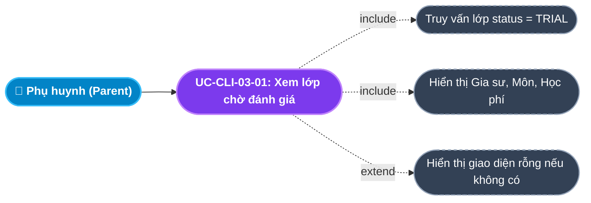
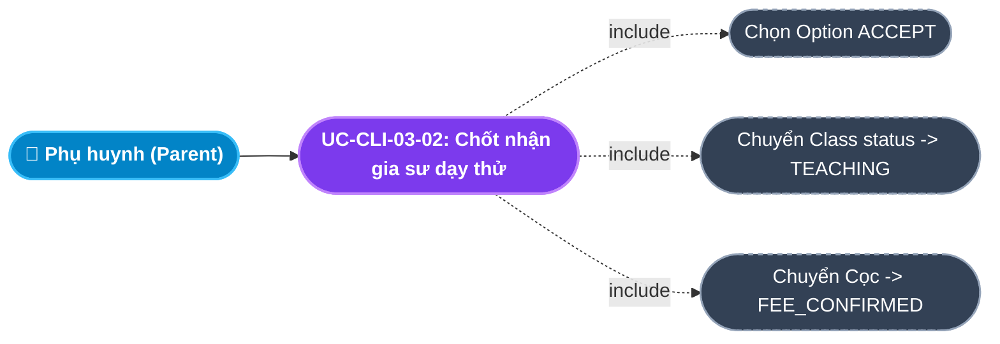
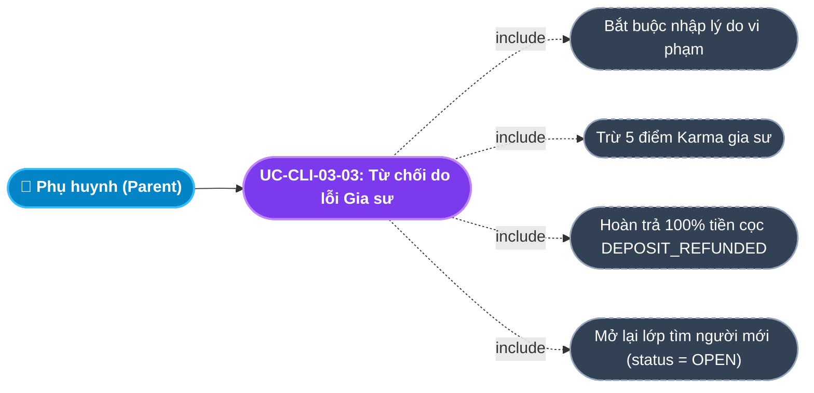
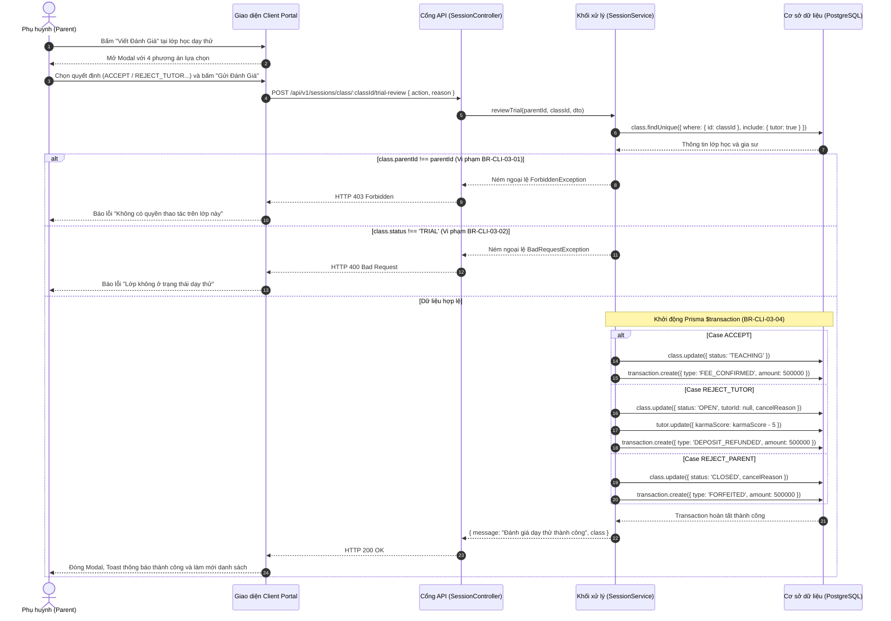

# Usecase: UC-CLI-03 - Trải nghiệm Dạy thử & Đánh giá Chốt lớp (Trial Experience & Evaluation)

## 1. Giới thiệu chức năng
- **Mục đích**: Cung cấp cơ chế đánh giá sau giai đoạn dạy thử minh bạch, chuẩn xác và công bằng trên Cổng Khách hàng (Client Portal). Giai đoạn dạy thử (1 buổi đối với Giáo viên, 2 buổi đối với Sinh viên) là điểm chạm quyết định việc ký kết lớp học chính thức. Hệ thống hỗ trợ phụ huynh đưa ra 4 quyết định nghiệp vụ khác nhau (Chốt nhận lớp, Đổi gia sư do lỗi gia sư, Hủy lớp do phía gia đình, Nhận lớp nhưng giảm số buổi). Mọi quyết định đều kích hoạt các chuỗi giao dịch tài chính tự động (hoàn cọc, chuyển cọc thành phí, hoặc tịch thu cọc) và cập nhật điểm uy tín Karma của gia sư.
- **Actor (Tác nhân)**: Phụ huynh (Parent), Học sinh (Student), Gia sư (Tutor), Học vụ & Kế toán (Academic / Accountant).
- **Điều kiện tiên quyết**: Lớp học (`Class`) đang ở trạng thái `TRIAL` (Gia sư đã hoàn tất đặt cọc 500,000 đ và đã thực hiện xong các buổi dạy thử theo quy định).

### Danh mục các chức năng con (Sub-features):
1. **UC-CLI-03-01: Xem danh sách lớp học chờ đánh giá dạy thử**: Hiển thị toàn bộ các lớp đang ở trạng thái `TRIAL` của các con trong gia đình kèm tên gia sư, môn học và mức học phí.
2. **UC-CLI-03-02: Phê duyệt nhận lớp chính thức (`ACCEPT`)**: Phụ huynh hài lòng với chất lượng dạy thử, chốt nhận gia sư dạy chính thức lâu dài.
3. **UC-CLI-03-03: Từ chối gia sư & Đổi người mới (`REJECT_TUTOR`)**: Gia sư dạy không đạt yêu cầu chuyên môn hoặc tác phong, kích hoạt hoàn cọc cho gia sư, trừ điểm Karma và mở lại lớp tìm gia sư mới.
4. **UC-CLI-03-04: Hủy lớp do lý do từ phía gia đình (`REJECT_PARENT`)**: Phụ huynh bận việc đột xuất hoặc đổi kế hoạch học tập, kích hoạt đóng lớp vĩnh viễn và xử lý tịch thu cọc.
5. **UC-CLI-03-05: Thu hẹp quy mô lớp học (`SCALE_DOWN`)**: Nhận dạy nhưng giảm bớt số buổi học/tuần, tự động tính toán lại mức cọc và điều chỉnh hợp đồng.

---

## 2. Dữ liệu nghiệp vụ đầu vào (Input Data & Parameters)

### 2.1. Dữ liệu biểu mẫu Đánh giá Dạy thử (Trial Review Form Data)
| Tên trường | Kiểu dữ liệu | Tính chất | Ý nghĩa nghiệp vụ & Ràng buộc thực tế từ Code |
|---|---|---|---|
| `Quyết định đánh giá` (action) | Enum / String | Bắt buộc | Nhận 1 trong 4 giá trị: `ACCEPT`, `REJECT_TUTOR`, `REJECT_PARENT`, `SCALE_DOWN`. |
| `Lý do phản hồi` (reason) | Văn bản (Text) | Bắt buộc (khi từ chối) | Bắt buộc khi `action !== 'ACCEPT'`. Nhập chi tiết nguyên nhân vi phạm của gia sư hoặc lý do thay đổi của gia đình. Tối đa 500 ký tự. |
| `Mã lớp học` (classId) | UUID | URL Param | Định danh lớp học trong bảng `classes` cần đánh giá. |

### 2.2. Ma trận tác động Nghiệp vụ theo Quyết định (Decision Impact Matrix)
| Hành động (`action`) | Trạng thái Lớp mới (`status`) | Biến động Karma Gia sư | Loại Giao dịch Cọc (`TransactionType`) | Giá trị Cọc (VNĐ) | Hành vi nghiệp vụ hệ thống |
|---|---|---|---|---|---|
| `ACCEPT` | `TEACHING` | Không đổi ($0$) | `FEE_CONFIRMED` | 500,000 đ | Chốt lớp chính thức. Tiền cọc 500k của gia sư chuyển thành Doanh thu Phí môi giới của trung tâm. |
| `REJECT_TUTOR` | `OPEN` | Trừ 5 điểm ($-5$) | `DEPOSIT_REFUNDED` | 500,000 đ | Thu hồi lớp khỏi gia sư (`tutorId = null`). Hoàn cọc 100% cho gia sư, trừ điểm Karma và đưa lớp quay lại sàn tuyển mới. |
| `REJECT_PARENT` | `CLOSED` | Không đổi ($0$) | `FORFEITED` | 500,000 đ | Đóng lớp học hoàn toàn. Tịch thu cọc của gia sư do gia đình tự ý hủy ngang hợp đồng đã cam kết. |
| `SCALE_DOWN` | `OPEN` | Trừ 2 điểm ($-2$) | `DEPOSIT_REFUNDED` | 250,000 đ | Hoàn lại 50% tiền cọc cho gia sư, trừ nhẹ 2 điểm Karma và mở lại lớp điều chỉnh quy mô. |

---

## 3. Quy tắc nghiệp vụ (Business Rules)

| Mã Quy tắc | Tình huống nghiệp vụ | Cách hệ thống xử lý | Thông báo hiển thị cho người dùng |
|---|---|---|---|
| **BR-CLI-03-01** | **Xác thực quyền sở hữu lớp học**: Phụ huynh gửi yêu cầu đánh giá nhưng `class.parentId !== currentUser.parentId`. | Backend kiểm tra quyền sở hữu. Nếu không khớp $\rightarrow$ Ném `ForbiddenException` (HTTP 403). | "Bạn không có quyền thực hiện thao tác trên lớp học này" |
| **BR-CLI-03-02** | **Ràng buộc trạng thái lớp học**: Phụ huynh đánh giá lớp học không ở trạng thái `TRIAL`. | Backend kiểm tra `class.status !== ClassStatus.TRIAL` $\rightarrow$ Ném `BadRequestException` (HTTP 400). | "Lớp không ở trạng thái dạy thử" |
| **BR-CLI-03-03** | **Bắt buộc nhập lý do khi từ chối**: Chọn `REJECT_TUTOR`, `REJECT_PARENT`, hoặc `SCALE_DOWN` nhưng để trống lý do. | Client kiểm tra validation và nhắc nhở; Backend kiểm tra dữ liệu trước khi xử lý. | "Vui lòng nhập lý do cụ thể cho quyết định này" |
| **BR-CLI-03-04** | **Tính toàn vẹn giao dịch Tài chính (Transaction Atomicity)**: Quá trình cập nhật lớp học, ví tiền, điểm Karma và lịch sử giao dịch. | Bắt buộc chạy bên trong `prisma.$transaction(async (tx) => ...)`. Nếu bất kỳ thao tác nào lỗi $\rightarrow$ Rollback toàn bộ. | "Đánh giá dạy thử thành công" |
| **BR-CLI-03-05** | **Bảo lưu và hoàn trả tiền cọc minh bạch**: Xử lý tiền đặt cọc 500,000 đ của gia sư sau dạy thử. | Tạo bản ghi trong bảng `transactions` với `status: SUCCESSFUL`, gắn `classId` và `tutorId` phục vụ đối soát kế toán. | Ghi nhận giao dịch đối soát tự động |

---

## 4. Đặc tả chi tiết các Use Case chức năng con (Sub-Use Cases Specification)

---

### 4.1. UC-CLI-03-01: Xem danh sách lớp học chờ đánh giá dạy thử

#### Sơ đồ Use Case:

#### Bảng đặc tả nghiệp vụ:

| STT | Hạng mục | Nội dung chi tiết |
|:---:|---|---|
| **1** | **Thông tin chung** | - **UC ID**: `UC-CLI-03-01` - **UC Name**: Xem danh sách lớp chờ đánh giá dạy thử (View Trial Classes) - **Actor**: Phụ huynh (Parent) - **Mục tiêu**: Liệt kê các lớp học đang trong giai đoạn dạy thử cần phản hồi ý kiến để chốt phương án học tập tiếp theo. - **Mô tả**: Tải danh sách lớp học từ API, lọc các lớp có `status === 'TRIAL'` và kết xuất thẻ thông tin. - **Priority**: High |
| **2** | **Trigger** | Phụ huynh điều hướng vào menu **"Đánh Giá Dạy Thử"** (`/client/attendance`) từ Dashboard hoặc Thanh điều hướng nhanh. |
| **3** | **Pre-condition** | Đã đăng nhập vào hệ thống Client Portal với vai trò Phụ huynh. |
| **4** | **Post-condition** | Hiển thị danh sách các lớp học dạy thử kèm số lượng thẻ badge vàng *"X lớp chờ duyệt"*. |
| **5** | **Main Flow** | 1. Phụ huynh truy cập `/client/attendance`. 2. Hệ thống hiển thị icon xoay Loader. 3. Client gửi request `GET /api/v1/classes`. 4. Backend trả về toàn bộ lớp học của phụ huynh. 5. Client thực hiện lọc: `res.data.filter(c => c.status === 'TRIAL')`. 6. Hiển thị danh sách các lớp dạy thử: Tên học sinh, Họ tên Gia sư, Học phí/buổi và nút **"Viết Đánh Giá"** (icon Ngôi sao). |
| **6** | **Alternative / Exception Flow** | - **EF-01 (Không có lớp dạy thử)**: Nếu mảng lọc rỗng (`length === 0`) $\rightarrow$ Hiển thị Empty State với icon Ngôi sao màu xám: *"Không có lớp nào cần đánh giá. Hiện tại không có lớp học nào đang trong giai đoạn dạy thử..."*. |
| **7** | **Business Rules & Validation** | - Chỉ kết xuất những lớp học có trạng thái chính xác là `TRIAL`. |
| **8** | **Acceptance Criteria** | - **AC-01**: Tải danh sách lớp < 400ms. - **AC-02**: Format học phí dạng tiền tệ VNĐ (VD: `200.000đ/buổi`). |

---

### 4.2. UC-CLI-03-02: Phê duyệt nhận lớp chính thức (`ACCEPT`)

#### Sơ đồ Use Case:

#### Bảng đặc tả nghiệp vụ:

| STT | Hạng mục | Nội dung chi tiết |
|:---:|---|---|
| **1** | **Thông tin chung** | - **UC ID**: `UC-CLI-03-02` - **UC Name**: Phê duyệt nhận lớp chính thức (Accept Tutor & Formalize Class) - **Actor**: Phụ huynh (Parent) - **Mục tiêu**: Xác nhận hài lòng với kết quả buổi dạy thử và chuyển lớp học sang giai đoạn giảng dạy chính thức lâu dài. - **Mô tả**: Chọn radio "Hài lòng — Chốt gia sư này", gửi lên máy chủ để cập nhật trạng thái lớp và chuyển cọc thành phí. - **Priority**: Critical (Quyết định kết thúc phễu bán hàng) |
| **2** | **Trigger** | Phụ huynh chọn radio **"Hài lòng — Chốt gia sư này"** và bấm nút **"Gửi Đánh Giá"** trong Modal phản hồi. |
| **3** | **Pre-condition** | 1. Modal đánh giá đang mở cho lớp học có `status === 'TRIAL'`. 2. Lớp học thuộc quyền quản lý của phụ huynh đang đăng nhập. |
| **4** | **Post-condition** | 1. `class.status` cập nhật thành `TEACHING`. 2. Tạo bản ghi giao dịch `FEE_CONFIRMED` số tiền 500,000 đ ghi nhận doanh thu phí môi giới. 3. Lớp học chuyển sang danh sách lớp học chính thức trên Dashboard phụ huynh. 4. Toast hiển thị thông báo thành công. |
| **5** | **Main Flow** | 1. Phụ huynh nhấn nút **"Viết Đánh Giá"** tại dòng lớp học. 2. Modal mở ra, mặc định tích chọn radio **"Hài lòng — Chốt gia sư này"** (`decision = 'ACCEPT'`). 3. Phụ huynh bấm nút **"Gửi Đánh Giá"**. 4. Client gửi request `POST /api/v1/sessions/class/:classId/trial-review` với body `{ action: 'ACCEPT' }`. 5. Backend kiểm tra quyền sở hữu (`BR-CLI-03-01`) và trạng thái lớp (`BR-CLI-03-02`). 6. Backend thực hiện giao dịch: Cập nhật `class.status = TEACHING`, tạo Transaction `FEE_CONFIRMED`. 7. Backend trả về `HTTP 200 OK` kèm `{ message: "Đánh giá dạy thử thành công", class }`. 8. Modal đóng lại, nạp lại danh sách lớp dạy thử (lớp vừa chốt biến mất khỏi danh sách chờ). |
| **6** | **Alternative / Exception Flow** | - **EF-01 (Lỗi kết nối máy chủ)**: Mất mạng $\rightarrow$ Nút submit dừng xoay loading, hiển thị lỗi màu đỏ trên Modal: *"Đánh giá dạy thử thất bại"*. |
| **7** | **Business Rules & Validation** | - `BR-CLI-03-04`: Toàn bộ logic cập nhật trạng thái và tạo giao dịch cọc phải nằm trong 1 Prisma Transaction duy nhất. |
| **8** | **Acceptance Criteria** | - **AC-01**: Sau khi chốt nhận, lớp học lập tức xuất hiện trên Dashboard với Badge "Đang học chính thức" (`TEACHING`). - **AC-02**: Bảng `transactions` sinh ra đúng 01 bản ghi `type: 'FEE_CONFIRMED'`, `amount: 500000`. |

---

### 4.3. UC-CLI-03-03: Từ chối gia sư do lỗi chuyên môn / tác phong (`REJECT_TUTOR`)

#### Sơ đồ Use Case:

#### Bảng đặc tả nghiệp vụ:

| STT | Hạng mục | Nội dung chi tiết |
|:---:|---|---|
| **1** | **Thông tin chung** | - **UC ID**: `UC-CLI-03-03` - **UC Name**: Từ chối gia sư & Đổi người mới (Reject Tutor & Request Replacement) - **Actor**: Phụ huynh (Parent) - **Mục tiêu**: Bảo vệ quyền lợi học tập của học sinh khi gia sư dạy thử không đạt yêu cầu chuyên môn hoặc vi phạm giờ giấc. - **Mô tả**: Phụ huynh chọn đổi gia sư, nhập lý do; hệ thống tự động hoàn cọc cho gia sư, trừ điểm phạt Karma và mở lại lớp tìm gia sư khác. - **Priority**: High |
| **2** | **Trigger** | Phụ huynh chọn radio **"Đổi gia sư khác (Do gia sư chưa phù hợp)"** trong Modal đánh giá. |
| **3** | **Pre-condition** | Lớp học đang ở trạng thái `TRIAL`. |
| **4** | **Post-condition** | 1. `class.status` chuyển thành `OPEN`, `tutorId = null`, lưu `cancelReason`. 2. `tutor.karmaScore` của gia sư bị trừ 5 điểm (`karmaScore - 5`). 3. Tạo bản ghi giao dịch `DEPOSIT_REFUNDED` số tiền 500,000 đ. 4. Lớp học tự động quay lại trạng thái tuyển dụng trên hệ thống. |
| **5** | **Main Flow** | 1. Phụ huynh tích chọn radio **"Đổi gia sư khác..."** (`REJECT_TUTOR`). 2. Giao diện hiển thị ô Textarea bắt buộc nhập lý do. 3. Phụ huynh nhập lý do: *"Gia sư đến muộn 20 phút, phát âm tiếng Anh chưa chuẩn"*, sau đó bấm **"Gửi Đánh Giá"**. 4. Client gửi request `POST /api/v1/sessions/class/:classId/trial-review` với body `{ action: 'REJECT_TUTOR', reason }`. 5. Backend xử lý Transaction: cập nhật lớp thành `OPEN`, gỡ `tutorId`, trừ 5 điểm Karma của gia sư, tạo Transaction hoàn cọc. 6. Backend trả về thông báo thành công. 7. Đóng Modal và nạp lại giao diện. |
| **6** | **Alternative / Exception Flow** | - **EF-01 (Bỏ trống lý do)**: Bấm gửi nhưng không nhập lý do $\rightarrow$ Giao diện cảnh báo *"Vui lòng nhập lý do cụ thể..."* và không gửi request lên server. |
| **7** | **Business Rules & Validation** | - `BR-CLI-03-03`: Bắt buộc phải có lý do giải trình khi từ chối gia sư. - Trừ 5 điểm Karma uy tín của gia sư để cảnh báo chất lượng giảng dạy. |
| **8** | **Acceptance Criteria** | - **AC-01**: Điểm Karma của gia sư bị trừ chính xác 5 điểm trong CSDL. - **AC-02**: Lớp học mở lại trạng thái `OPEN` để các gia sư khác tiếp tục ứng tuyển mà phụ huynh không phải tạo lại yêu cầu từ đầu. |

---

## 5. Sơ đồ tuần tự nghiệp vụ (Sequence Diagrams)

### 5.1. Sơ đồ tuần tự: Đánh giá kết quả dạy thử

---

## 6. Kịch bản kiểm thử & Nghiệm thu (Given / When / Then)

### Kịch bản 1: Phụ huynh chốt nhận lớp sau dạy thử thành công
- **Given**: Lớp học môn Toán của bé Khôi do Gia sư Thầy Hùng dạy đang ở trạng thái `TRIAL`.
- **When**: Phụ huynh mở màn hình Đánh giá dạy thử, chọn option `"Hài lòng — Chốt gia sư này"` (`ACCEPT`) và bấm Gửi đánh giá.
- **Then**: Lớp học chuyển sang trạng thái `TEACHING`. Hệ thống sinh ra giao dịch `FEE_CONFIRMED` 500,000 đ ghi nhận phí dịch vụ. Modal đóng lại và lớp biến mất khỏi danh sách chờ duyệt dạy thử.

### Kịch bản 2: Từ chối gia sư do thiếu kiến thức chuyên môn
- **Given**: Gia sư dạy thử môn Hóa lớp 12 nhưng không giải được các dạng bài nâng cao của học sinh.
- **When**: Phụ huynh chọn option `"Đổi gia sư khác (Do gia sư chưa phù hợp)"`, nhập lý do `"Kiến thức chuyên môn chưa vững"` và bấm gửi.
- **Then**: Lớp học đổi trạng thái thành `OPEN` và xóa gia sư phụ trách (`tutorId = null`). Gia sư bị trừ 5 điểm uy tín Karma trong CSDL, hệ thống ghi nhận giao dịch `DEPOSIT_REFUNDED` 500,000 đ để hoàn tiền cọc cho gia sư.

### Kịch bản 3: Hủy lớp học do lý do cá nhân từ phía gia đình
- **Given**: Gia đình học sinh có việc đột xuất phải chuyển chỗ ở về quê, không thể tiếp tục học.
- **When**: Phụ huynh chọn option `"Hủy lớp (Gia đình thay đổi kế hoạch)"`, nhập lý do `"Gia đình chuyển nhà"` và bấm gửi.
- **Then**: Lớp học chuyển sang trạng thái đóng vĩnh viễn (`CLOSED`). Tiền cọc của gia sư bị tịch thu theo quy chế hợp đồng (`FORFEITED`), gia sư không bị trừ điểm Karma.
