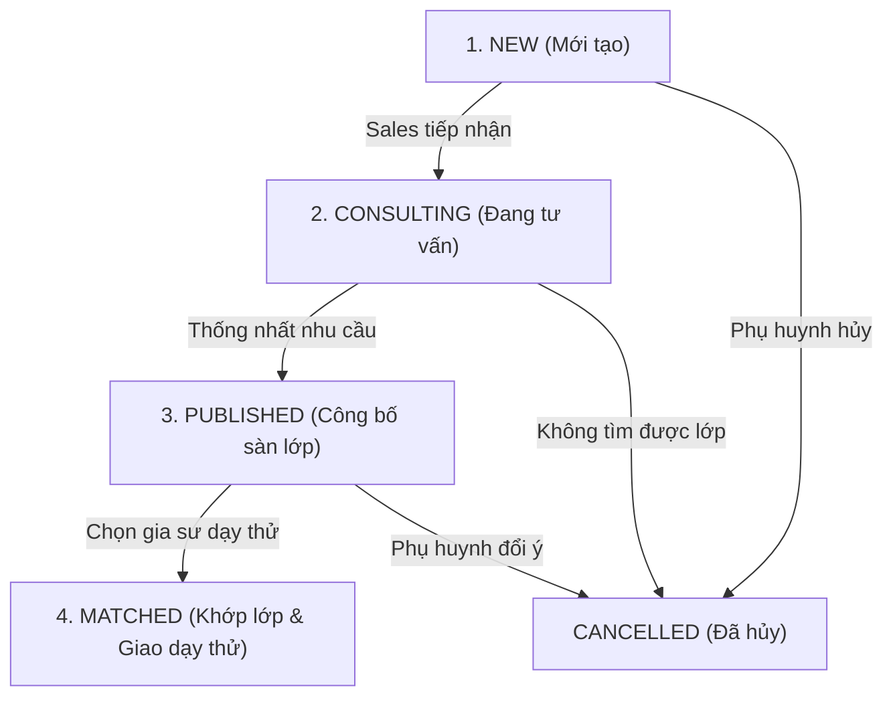
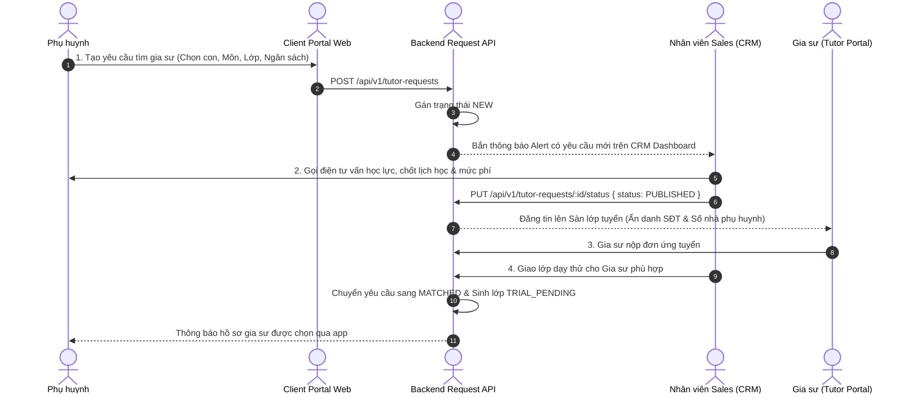

# ĐẶC TẢ NGHIỆP VỤ: YÊU CẦU TÌM GIA SƯ & TÌM KIẾM ẨN DANH (CLIENT PORTAL)

> **Mã phân hệ:** CLI-03 / REQ-01  
> **Đối tượng sử dụng:** Phụ huynh (Parent), Tư vấn viên (Sales)  
> **Cổng truy cập:** `http://localhost:5173/client/request-tutor`

---

## 1. Mục Tiêu & Cơ Chế Chống "Đi Đêm" (Anti-Bypass Protection)

Một trong những rủi ro lớn nhất của trung tâm gia sư là phụ huynh và gia sư sau khi thấy thông tin liên lạc của nhau sẽ tự ý liên hệ ngoài luồng để trốn phí trung gian.

Hệ thống áp dụng 2 nguyên tắc bảo mật tối thượng:
1. **BR-SEC-01 (Ẩn danh thông tin phụ huynh)**: Tin tuyển lớp công khai hiển thị cho gia sư xem CHỈ hiển thị: Quận/Huyện (ví dụ: "Quận Cầu Giấy, Hà Nội"), môn học, lớp, khung giờ học, mức thù lao. Tuyệt đối **không hiển thị SĐT, Email, số nhà hay tên phụ huynh**.
2. **BR-SEC-02 (Bảo vệ hồ sơ gia sư công khai)**: Khi phụ huynh chủ động tìm kiếm gia sư trên cổng Client, hệ thống chỉ hiển thị Họ + Tên đệm viết tắt + Tên (ví dụ: "Nguyễn V. A."), ảnh hồ sơ, trường đại học, kinh nghiệm và đánh giá sao. Tuyệt đối **không hiển thị SĐT, Facebook cá nhân hay địa chỉ nhà của gia sư**.

---

## 2. Vòng Đời Yêu Cầu Tìm Gia Sư (Request Lifecycle)

### 2.1. Sơ đồ tuần tự (Sequence Diagram) - Luồng Tiếp Nhận & Ghép Lớp

### 2.2. Chi tiết từng trạng thái:
* **`NEW` (Mới tạo)**: Yêu cầu vừa được phụ huynh gửi lên từ Client Portal, chưa có nhân viên phụ trách. Hiển thị thông báo còi đỏ trên màn hình Dashboard CRM.
* **`CONSULTING` (Đang tư vấn)**: Nhân viên Sales bấm nhận yêu cầu, liên hệ phụ huynh để tư vấn học lực của con, khung giờ tối ưu và mức học phí phù hợp.
* **`PUBLISHED` (Đã công bố)**: Yêu cầu đã được kiểm duyệt thông tin và đẩy lên "Sàn lớp mới tuyển" để các gia sư phù hợp có thể xem và nộp đơn ứng tuyển.
* **`MATCHED` (Đã ghép lớp)**: Trung tâm đã chọn được gia sư phù hợp nhất để giao dạy thử. Hệ thống tự động sinh lớp học (`Class`) ở trạng thái `TRIAL_PENDING`.
* **`CANCELLED` (Đã hủy)**: Phụ huynh thay đổi ý định hoặc trung tâm không thể tìm được gia sư phù hợp.

---

## 3. Quy Trình Tạo Yêu Cầu Tìm Gia Sư (Tạo YCGS)

### 3.1. Các trường thông tin bắt buộc
Phụ huynh mở form **"Tạo yêu cầu tìm gia sư"** và khai báo:
1. **Học sinh thụ hưởng**: Chọn 1 hồ sơ con cụ thể từ danh sách con đã khai (Family Account).
2. **Môn học cần học**: Toán, Ngữ văn, Tiếng Anh, Vật lý, Hóa học, Sinh học, Tin học, Luyện chữ...
3. **Cấp lớp**: Lớp 1 $\rightarrow$ Lớp 12, Luyện thi ĐH, Tiếng Anh giao tiếp...
4. **Hình thức học**: Học trực tiếp tại nhà (Home Tutoring) hoặc Học trực tuyến.
5. **Địa điểm học**: Chọn Tỉnh/Thành phố $\rightarrow$ Quận/Huyện $\rightarrow$ Phường/Xã $\rightarrow$ Số nhà cụ thể (Số nhà chỉ hiển thị khi đã chốt lớp dạy thử).
6. **Lịch học mong muốn**:
   * Số buổi học mỗi tuần (ví dụ: 2 buổi/tuần, 3 buổi/tuần).
   * Khung giờ và các thứ trong tuần (ví dụ: Tối Thứ 3 và Tối Thứ 6 từ 19h00 - 21h00).
7. **Ngân sách dự kiến**: Mức học phí phụ huynh sẵn sàng chi trả cho 1 buổi học (ví dụ: 250,000 VNĐ - 350,000 VNĐ/buổi 2 tiếng).
8. **Yêu cầu đối với gia sư**:
   * Giới tính ưu tiên: Nam / Nữ / Không yêu cầu.
   * Trình độ: Sinh viên các trường ĐH Top đầu (Sư phạm, Bách khoa, Ngoại thương...) hoặc Giáo viên đứng lớp.
   * Mục tiêu học tập: Lấy lại gốc, nâng cao, luyện thi học sinh giỏi, luyện thi chuyên...

### 3.2. Luồng thay thế (Sales tạo hộ)
* Trong trường hợp phụ huynh gọi điện trực tiếp tới hotline trung tâm:
  * Sales mở CRM Back-office $\rightarrow$ tạo Lead mới $\rightarrow$ nhập thay toàn bộ thông tin yêu cầu.
  * Yêu cầu được chuyển thẳng sang trạng thái `CONSULTING`.

---

## 4. Nghiệp Vụ Tìm Kiếm Gia Sư Chủ Động (Tutor Directory)

Bên cạnh việc chờ trung tâm điều phối, phụ huynh có thể chủ động khảo sát danh bạ gia sư công khai:
* **Bộ lọc tìm kiếm**:
  * Theo Môn học & Cấp lớp.
  * Theo Khu vực giảng dạy (Quận/Huyện).
  * Theo Giới tính & Trình độ (Sinh viên / Giáo viên / Cử nhân).
  * Theo Điểm đánh giá (Rating từ 4 sao đến 5 sao).
* **Hành động "Mời dạy thử"**:
  * Khi ưng ý một hồ sơ gia sư, phụ huynh bấm nút **"Mời dạy thử"**.
  * Hệ thống liên kết lời mời này với Yêu cầu tìm gia sư của con và gửi thông báo ưu tiên tới nhân viên Sales để tiến hành ghép nối gia sư này trước.

---

## 5. Danh Sách Mã Lỗi Phục Vụ Dev & QA

| Mã lỗi (Error Code) | HTTP Status | Nguyên nhân | Hướng xử lý |
| :--- | :---: | :--- | :--- |
| `CHILD_REQUIRED` | 422 | Chưa chọn hồ sơ con khi tạo yêu cầu tìm gia sư. | Yêu cầu chọn 1 bé trong danh sách. |
| `HOURLY_RATE_TOO_LOW` | 422 | Ngân sách nhập thấp hơn mức sàn tối thiểu của trung tâm (150,000 đ). | Yêu cầu điều chỉnh lại ngân sách hợp lệ. |
| `REQUEST_ALREADY_MATCHED` | 400 | Không thể hủy yêu cầu đã ở trạng thái `MATCHED`. | Phải thông qua quy trình hủy lớp của Học vụ. |
| `REQUEST_NOT_FOUND` | 404 | Yêu cầu tìm gia sư không tồn tại hoặc đã bị xóa. | Tải lại trang. |
