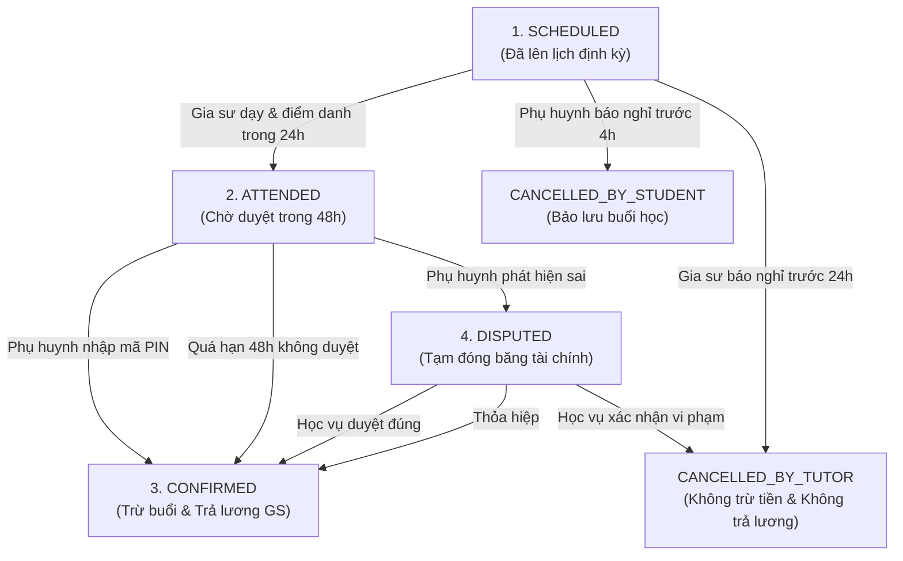
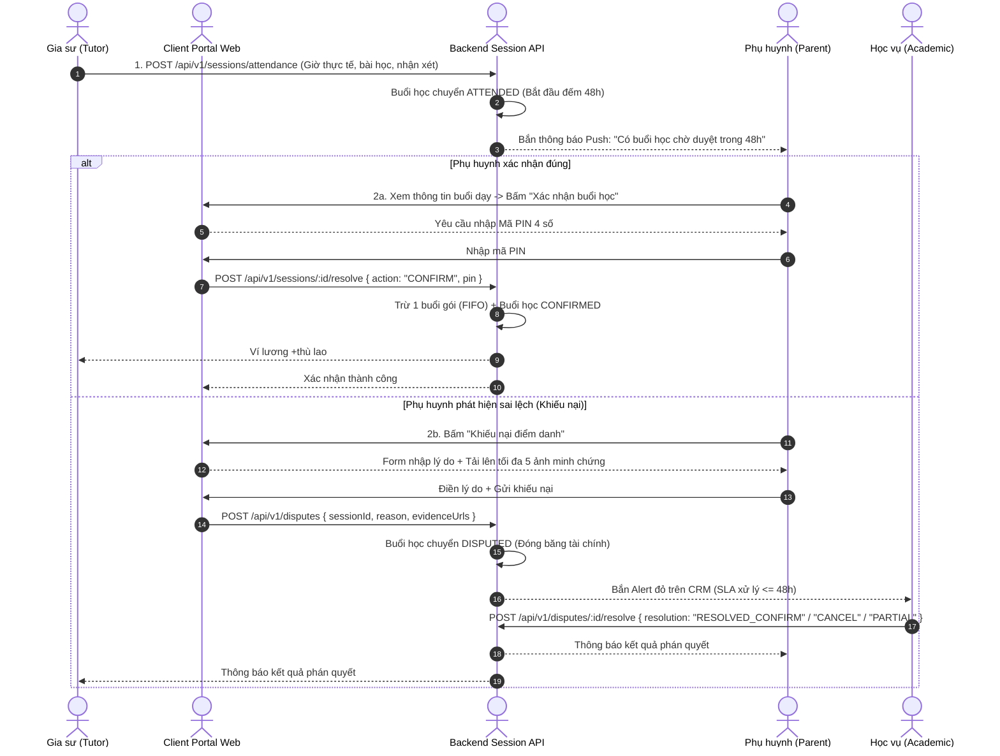

# ĐẶC TẢ NGHIỆP VỤ: XÁC NHẬN ĐIỂM DANH & KHIẾU NẠI BUỔI HỌC (CLIENT PORTAL)

> **Mã phân hệ:** CLI-04 / SES-01  
> **Đối tượng sử dụng:** Phụ huynh (Parent), Học vụ (Academic)  
> **Cổng truy cập:** `http://localhost:5173/client` (Chi tiết lớp học / Điểm danh)

---

## 1. Bản Chất Nghiệp Vụ
Xác nhận buổi học là **nghiệp vụ quan trọng nhất** trên Client Portal. Đây là điểm chốt chặn tài chính đảm bảo:
* Phụ huynh **chỉ trả tiền cho những buổi học thực sự diễn ra** và đạt yêu cầu.
* Gia sư **chắc chắn nhận được thù lao** minh bạch ngay khi buổi học được phụ huynh hoặc hệ thống phê duyệt.

---

## 2. Vòng Đời Buổi Học (Session State Machine)

### 2.1. Sơ đồ tuần tự (Sequence Diagram) - Luồng Xác Nhận & Trọng Tài Khiếu Nại

---

## 3. Quy Trình Xác Nhận Buổi Học (Happy Path)

### 3.1. Các bước thực hiện
1. Gia sư hoàn thành buổi dạy và gửi báo cáo điểm danh trên Tutor Portal. Buổi học chuyển sang trạng thái `ATTENDED`.
2. Hệ thống gửi thông báo Push + Inbox tới Phụ huynh: *"Gia sư vừa điểm danh buổi học ngày DD/MM cho bé [Tên]. Vui lòng xác nhận trong 48h."*
3. Phụ huynh truy cập cổng Client $\rightarrow$ mở **"Chi tiết lớp học của con"** $\rightarrow$ xem thông tin buổi học vừa diễn ra:
   * Thời gian bắt đầu và kết thúc thực tế (ví dụ: 19h00 - 21h00).
   * Nội dung bài học và nhận xét tiến độ học của con.
   * Ảnh đính kèm (nếu gia sư có chụp phiếu bài tập).
4. Nếu thông tin chuẩn xác, phụ huynh bấm nút **"Xác nhận buổi học"**.
5. Hệ thống hiển thị Modal yêu cầu nhập **Mã PIN 4 số**.
6. Phụ huynh nhập đúng mã PIN $\rightarrow$ Bấm **"Hoàn tất"**.
7. Tùy chọn chấm điểm đánh giá gia sư từ **1 sao đến 5 sao** kèm lời nhận xét.

### 3.2. Thực thi xử lý hệ thống (System Execution)
Ngay khi mã PIN hợp lệ, hệ thống kích hoạt giao dịch Database duy nhất:
* Trạng thái buổi học chuyển thành `CONFIRMED`.
* Tăng `used_sessions = used_sessions + 1` của gói học cũ nhất còn hạn (theo cơ chế FIFO).
* Giảm số buổi còn lại của lớp: `classes.remaining_sessions = classes.remaining_sessions - 1`.
* Ghi nhận giao dịch đối soát `SESSION_DEDUCTION`.
* Tự động cộng tiền thù lao vào ví lương của Gia sư: `tutors.wallet_balance = tutors.wallet_balance + tutor_wage_rate`.
* Gửi thông báo Push đến Gia sư: *"Buổi dạy ngày DD/MM đã được phụ huynh duyệt. Ví lương đã được cộng +{X} VNĐ."*

---

## 4. Quy Trình Khiếu Nại Buổi Học (Dispute Flow)

### 4.1. Điều kiện khiếu nại
Phụ huynh có quyền bấm **"Khiếu nại buổi học"** khi phát hiện các sai lệch:
* Gia sư không đến dạy nhưng vẫn bấm điểm danh báo có mặt (báo khống).
* Gia sư đến muộn về sớm nghiêm trọng (ví dụ buổi 2 tiếng nhưng chỉ dạy 45 phút).
* Gia sư làm việc riêng, sử dụng điện thoại, không tập trung dạy học.
* Thái độ giảng dạy thiếu chuẩn mực hoặc vi phạm quy định trung tâm.

### 4.2. Biểu mẫu khiếu nại
* **Lý do khiếu nại**: Chọn danh mục (Không đến dạy / Dạy thiếu giờ / Thái độ không tốt / Lý do khác).
* **Mô tả chi tiết**: Tối thiểu 20 ký tự giải trình rõ sự việc.
* **Minh chứng đính kèm (`dispute_evidence`)**: Cho phép tải lên tối đa **5 hình ảnh** (ảnh chụp camera an ninh trong nhà, ảnh bài vở chưa làm, tin nhắn trao đổi giữa 2 bên...).

### 4.3. Hành vi hệ thống khi có khiếu nại
* Buổi học lập tức chuyển sang trạng thái `DISPUTED`.
* **Đóng băng tài chính**: Hệ thống **KHÔNG trừ buổi học** trong gói của phụ huynh và **KHÔNG cộng tiền** vào ví gia sư.
* Hệ thống tạo phiếu khiếu nại khẩn cấp gửi về bảng điều khiển của Nhân viên Học vụ với **SLA xử lý $\le 48$ giờ**.
* Gia sư nhận thông báo buổi học đang bị khiếu nại và được yêu cầu liên hệ trung tâm để giải trình.

---

## 5. Cơ Chế Tự Động Xác Nhận (Auto-Confirm Settlement)

Để đảm bảo quyền lợi gia sư nhận lương đúng hạn trong trường hợp phụ huynh bận việc hoặc quên xác nhận:
* **Thời hạn chờ (Window Time)**: **48 giờ** kể từ thời điểm gia sư gửi điểm danh.
* **Cảnh báo trước hạn**: Khi còn 12 giờ trước khi hết hạn, hệ thống gửi thông báo nhắc nhở lần cuối: *"Buổi học sắp tự động xác nhận sau 12 giờ nếu không có phản hồi."*
* **Chạy Job định kỳ (Cron Job)**:
  * Hệ thống quét các buổi học ở trạng thái `ATTENDED` có `attendance_at` quá 48 giờ.
  * Tự động chuyển trạng thái buổi học thành `CONFIRMED`.
  * Thực thi trừ số buổi trong gói và cộng ví lương cho gia sư giống như phụ huynh tự xác nhận.
  * Ghi chú trong lịch sử: *"Tự động xác nhận bởi hệ thống (Auto-Confirm quá hạn 48h)"*.

---

## 6. Danh Sách Mã Lỗi Phục Vụ Dev & QA

| Mã lỗi (Error Code) | HTTP Status | Nguyên nhân | Hướng xử lý |
| :--- | :---: | :--- | :--- |
| `SESSION_NOT_ATTENDED` | 400 | Buổi học chưa được gia sư điểm danh, không thể xác nhận. | Chờ gia sư nộp báo cáo điểm danh. |
| `SESSION_ALREADY_CONFIRMED` | 400 | Buổi học này đã được xác nhận trước đó rồi. | Tải lại trang chi tiết lớp học. |
| `INVALID_PIN` | 400 | Nhập sai mã PIN xác nhận buổi học. | Nhập lại đúng 4 số PIN. |
| `PIN_LOCKED` | 423 | Thao tác bị khóa tạm thời 15 phút do nhập sai PIN 5 lần. | Chờ hết 15 phút. |
| `DISPUTE_LIMIT_EXCEEDED` | 422 | Tải lên quá 5 ảnh minh chứng khiếu nại. | Chọn tối đa 5 ảnh. |
