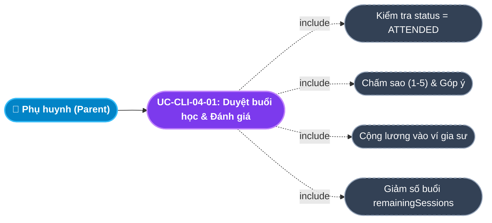
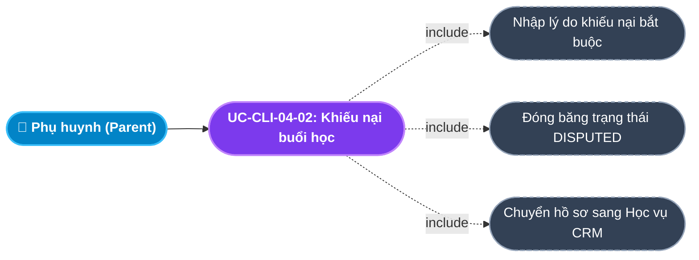
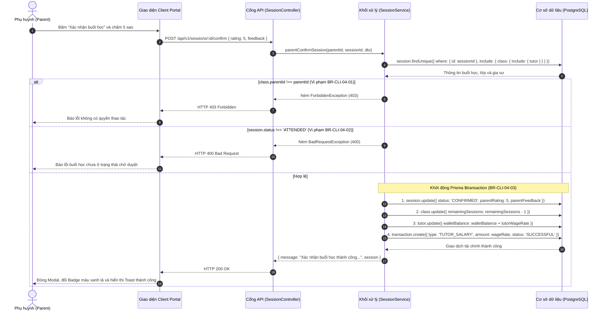
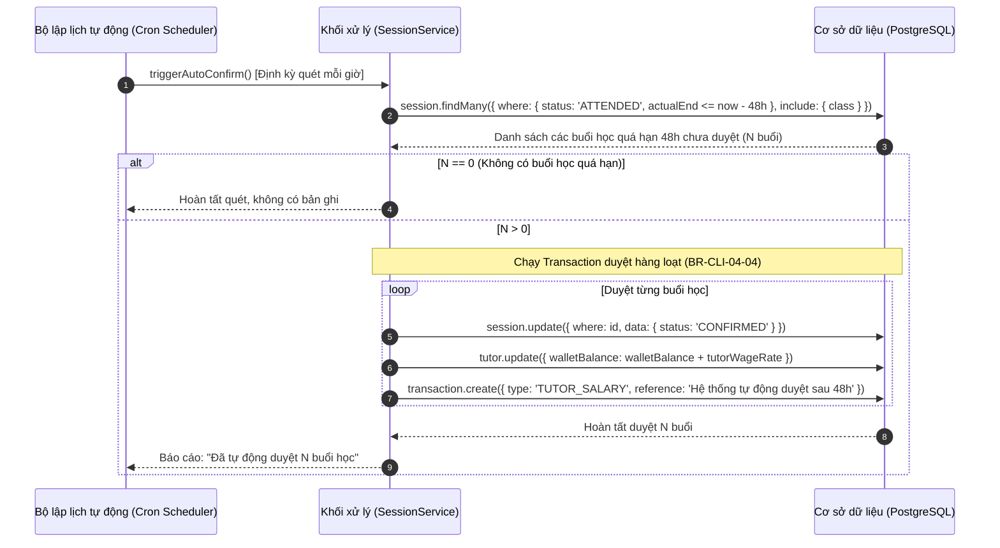

# Usecase: UC-CLI-04 - Phê duyệt Buổi học, Đối soát Học phí & Bảo hành 30 ngày (Session Confirmation & Warranty)

## 1. Giới thiệu chức năng
- **Mục đích**: Cung cấp cơ chế đối soát tài chính minh bạch, giải phóng thù lao giảng dạy tự động và chính sách bảo hành an tâm 30 ngày trên Cổng Khách hàng (Client Portal). Thay vì yêu cầu phụ huynh nạp tiền trước vào ví trung gian dễ gây lo ngại chiếm dụng vốn, hệ thống áp dụng mô hình thanh toán và giải ngân theo từng buổi học thực dạy: Phụ huynh kiểm tra nhật ký, chấm điểm đánh giá (Rating & Feedback) và xác nhận phê duyệt để hệ thống tự động cộng thù lao vào ví gia sư. Đồng thời, hệ thống cung cấp tính năng khiếu nại buổi học và cơ chế bảo hành đổi gia sư miễn phí trong 30 ngày đầu tiên nếu không đạt kỳ vọng tiến bộ.
- **Actor (Tác nhân)**: Phụ huynh (Parent), Gia sư (Tutor), Chuyên viên Học vụ (Academic Officer), Quản trị viên (Admin).
- **Điều kiện tiên quyết**: Phụ huynh đã đăng nhập và đang có lớp học ở trạng thái `TEACHING`, gia sư đã thực hiện điểm danh buổi học (`status = 'ATTENDED'`).

### Danh mục các chức năng con (Sub-features):
1. **UC-CLI-04-01: Phê duyệt buổi học & Đánh giá chất lượng (Confirm Session & Rating)**: Phụ huynh xác nhận buổi học đã diễn ra đúng giờ, chấm điểm sao (1 - 5 sao), gửi nhận xét và tự động giải ngân thù lao vào ví gia sư.
2. **UC-CLI-04-02: Tự động phê duyệt sau 48 giờ (Auto-confirm Mechanism)**: Hệ thống chạy Cron Job tự động duyệt các buổi học đã điểm danh quá 48h mà phụ huynh chưa thao tác, bảo vệ quyền lợi nhận lương kịp thời của gia sư.
3. **UC-CLI-04-03: Khiếu nại buổi học bất thường (Dispute Session)**: Phụ huynh khiếu nại các buổi học gia sư vắng mặt, dạy sai giờ hoặc chất lượng kém, tạm giữ thù lao và chuyển hồ sơ lên bộ phận Học vụ giải quyết.
4. **UC-CLI-04-04: Kích hoạt Bảo hành đổi gia sư trong 30 ngày (30-Day Tutor Warranty)**: Trong 30 ngày đầu kể từ khi bắt đầu học, phụ huynh có quyền yêu cầu trung tâm đổi gia sư mới hoàn toàn miễn phí nếu con không hòa hợp hoặc không tiến bộ.
5. **UC-CLI-04-05: Tổng hợp đối soát học phí cuối tháng (Monthly Settlement)**: Bảng thống kê chi tiết toàn bộ các buổi học thành công trong tháng, số tiền đã học và lịch sử thanh toán đối soát giữa Phụ huynh - Gia sư - Trung tâm.

---

## 2. Dữ liệu nghiệp vụ đầu vào (Input Data & Parameters)

### 2.1. Dữ liệu Phê duyệt & Đánh giá buổi học (Confirm Session Data)
| Tên trường | Kiểu dữ liệu | Tính chất | Ý nghĩa nghiệp vụ & Ràng buộc thực tế từ Code |
|---|---|---|---|
| `Mã buổi học` (sessionId) | UUID | Bắt buộc (URL Param) | Định danh buổi học trong bảng `sessions`. Buổi học phải đang ở trạng thái `ATTENDED`. |
| `Điểm đánh giá` (rating) | Số nguyên (Integer) | Tùy chọn | Chấm điểm chất lượng từ `1` đến `5` sao. Mặc định trên Modal là `5` sao. |
| `Nhận xét góp ý` (feedback) | Văn bản (Text) | Tùy chọn | Góp ý phương pháp dạy gửi riêng cho gia sư hoặc trung tâm. Tối đa 500 ký tự. |

### 2.2. Dữ liệu Khiếu nại buổi học (Dispute Session Data)
| Tên trường | Kiểu dữ liệu | Tính chất | Ý nghĩa nghiệp vụ & Ràng buộc |
|---|---|---|---|
| `Mã buổi học` (sessionId) | UUID | Bắt buộc | Buổi học bị phụ huynh khiếu nại. |
| `Lý do khiếu nại` (reason) | Văn bản (Text) | Bắt buộc | Nhập chi tiết hành vi bất thường (VD: `Gia sư không đến dạy nhưng vẫn điểm danh`, `Gia sư về sớm 45 phút`). Bắt buộc không được để trống. |

### 2.3. Bảng phân loại trạng thái Buổi học (Session Status Lifecycle)
| Trạng thái (Enum) | Nhãn hiển thị | Màu sắc Badge | Ý nghĩa luồng xử lý |
|---|---|---|---|
| `SCHEDULED` | Lịch sắp tới | Xanh dương (`#e7e7ff`) | Buổi học được lên lịch theo thời khóa biểu tuần hoặc buổi học bù. |
| `ATTENDED` | Chờ phụ huynh duyệt | Vàng cam (`#fff2d6`) | Gia sư đã đến dạy và bấm điểm danh thành công; hệ thống gửi thông báo cho phụ huynh. |
| `CONFIRMED` | Đã hoàn thành | Xanh lá (`#e8fadf`) | Phụ huynh đã duyệt (hoặc Auto-confirm sau 48h); thù lao đã cộng vào ví gia sư. |
| `DISPUTED` | Đang khiếu nại | Đỏ hồng (`#ffe0db`) | Phụ huynh khiếu nại; tiền thù lao bị đóng băng chờ Học vụ phán quyết. |
| `CANCELLED_BY_TUTOR` | Gia sư báo nghỉ | Xám (`#f5f5f9`) | Gia sư xin nghỉ phép hợp lệ và đã lên lịch dạy bù. |
| `CANCELLED_BY_STUDENT` | Học sinh báo nghỉ | Xám (`#f5f5f9`) | Phụ huynh xin nghỉ phép trước giờ học. |

---

## 3. Quy tắc nghiệp vụ (Business Rules)

| Mã Quy tắc | Tình huống nghiệp vụ | Cách hệ thống xử lý | Thông báo hiển thị cho người dùng |
|---|---|---|---|
| **BR-CLI-04-01** | **Xác thực quyền duyệt buổi học**: Người dùng xác nhận buổi học không thuộc lớp của mình. | Backend kiểm tra `session.class.parentId === currentParentId`. Nếu không khớp $\rightarrow$ Trả `HTTP 403 Forbidden`. | "Bạn không có quyền thao tác trên buổi học này" |
| **BR-CLI-04-02** | **Chỉ duyệt buổi học đang chờ**: Phụ huynh duyệt buổi học đang ở trạng thái `SCHEDULED` hoặc đã `CONFIRMED`. | Backend kiểm tra `session.status !== 'ATTENDED'` $\rightarrow$ Ném ngoại lệ `400 Bad Request`. | "Buổi học chưa ở trạng thái chờ duyệt hoặc đã được xác nhận" |
| **BR-CLI-04-03** | **Cơ chế cộng thù lao tự động (Instant Wage Release)**: Phụ huynh bấm Duyệt buổi học thành công. | Chạy Transaction: 1. Đổi `session.status = 'CONFIRMED'`; 2. Giảm số buổi còn lại `remainingSessions - 1`; 3. Cộng `tutorWageRate` vào `walletBalance` của gia sư; 4. Tạo bản ghi `Transaction` loại `TUTOR_SALARY`. | "Xác nhận buổi học thành công! Đã thanh toán thù lao vào ví gia sư." |
| **BR-CLI-04-04** | **Quy tắc Auto-confirm sau 48h**: Gia sư đã điểm danh nhưng sau 48 tiếng phụ huynh không bấm duyệt và không khiếu nại. | Cron Job quét các buổi `status = 'ATTENDED'` có `actualEnd <= now() - 48h`, tự động chuyển sang `CONFIRMED` và cộng lương cho gia sư. | "Hệ thống tự động duyệt lương sau 48h" |
| **BR-CLI-04-05** | **Đóng băng thù lao khi có khiếu nại**: Phụ huynh bấm Khiếu nại buổi học. | Hệ thống chuyển `status = 'DISPUTED'`, lưu `disputeReason`. Tuyệt đối không cộng tiền vào ví gia sư cho tới khi có phán quyết của Học vụ. | "Đã gửi khiếu nại buổi học tới bộ phận Học Vụ trung tâm để giải quyết!" |
| **BR-CLI-04-06** | **Chính sách Bảo hành đổi gia sư miễn phí trong 30 ngày**: Lớp học mới diễn ra $\le 30$ ngày kể từ ngày tạo lớp. | Phụ huynh có quyền gửi yêu cầu đổi gia sư. Trung tâm cam kết hỗ trợ điều phối gia sư mới miễn phí 100%, không thu thêm bất kỳ khoản phí môi giới nào. | "Kích hoạt chính sách bảo hành 30 ngày thành công" |

---

## 4. Đặc tả chi tiết các Use Case chức năng con (Sub-Use Cases Specification)

---

### 4.1. UC-CLI-04-01: Phê duyệt buổi học & Đánh giá chất lượng (Confirm Session & Rating)

#### Sơ đồ Use Case:

#### Bảng đặc tả nghiệp vụ:

| STT | Hạng mục | Nội dung chi tiết |
|:---:|---|---|
| **1** | **Thông tin chung** | - **UC ID**: `UC-CLI-04-01` - **UC Name**: Phê duyệt buổi học & Đánh giá chất lượng (Confirm Session & Rating) - **Actor**: Phụ huynh (Parent) - **Mục tiêu**: Xác nhận buổi học hợp lệ, chấm điểm sao khích lệ gia sư và giải ngân tiền lương buổi dạy vào ví gia sư. - **Mô tả**: Xem nhật ký buổi học, chọn số sao đánh giá (1-5 sao), bấm "Xác nhận buổi học"; hệ thống tự động hoàn tất giao dịch tài chính. - **Priority**: High (Nghiệp vụ tài chính cốt lõi) |
| **2** | **Trigger** | Phụ huynh bấm nút **"Xác nhận buổi học"** (icon CheckCircle2) tại dòng buổi học đang ở trạng thái `ATTENDED` trong Nhật ký lớp học. |
| **3** | **Pre-condition** | 1. Buổi học đang có trạng thái `ATTENDED` (Gia sư đã điểm danh). 2. Lớp học thuộc quyền sở hữu của phụ huynh. |
| **4** | **Post-condition** | 1. `session.status` chuyển thành `CONFIRMED`, lưu `parentRating` và `parentFeedback`. 2. `class.remainingSessions` giảm đi 1. 3. `tutor.walletBalance` tăng thêm đúng bằng `tutorWageRate`. 4. Sinh ra bản ghi `Transaction` loại `TUTOR_SALARY` thành công. |
| **5** | **Main Flow** | 1. Phụ huynh mở Nhật ký buổi học của lớp (`openClassJournal`). 2. Tìm đến buổi học có nhãn màu cam *"Chờ duyệt"* và bấm **"Xác nhận buổi học"**. 3. Modal mở ra, phụ huynh chọn số sao (mặc định 5 sao) và nhập nhận xét góp ý. 4. Bấm **"Xác nhận hoàn thành"**. 5. Client gửi request `POST /api/v1/sessions/:id/confirm` với `{ rating, feedback }`. 6. Backend kiểm tra quyền (`BR-CLI-04-01`) và trạng thái (`BR-CLI-04-02`). 7. Backend chạy Prisma Transaction cập nhật buổi học, giảm số buổi còn lại và cộng tiền vào ví gia sư (`BR-CLI-04-03`). 8. Backend trả về `HTTP 200 OK` kèm thông báo thành công. 9. Giao diện đóng modal, cập nhật nhãn buổi học sang màu xanh lá *"Đã hoàn thành"* (`CONFIRMED`). |
| **6** | **Alternative / Exception Flow** | - **EF-01 (Buổi học đã được duyệt trước đó)**: Nếu buổi học đã được tự động duyệt qua Cron Job $\rightarrow$ Backend trả lỗi 400, thông báo: *"Buổi học chưa ở trạng thái chờ duyệt hoặc đã được xác nhận"*, giao diện làm mới danh sách. |
| **7** | **Business Rules & Validation** | - `BR-CLI-04-03`: Bắt buộc đồng bộ việc trừ số buổi còn lại và cộng thù lao ví gia sư trong 1 transaction an toàn. |
| **8** | **Acceptance Criteria** | - **AC-01**: Bấm duyệt thành công $\rightarrow$ Ví gia sư được cộng tiền ngay lập tức mà không cần Admin can thiệp thủ công. - **AC-02**: Nhãn buổi học đổi màu xanh lá tức thì, điểm sao hiển thị trên lịch sử buổi học. |

---

### 4.2. UC-CLI-04-02: Khiếu nại buổi học bất thường (Dispute Session)

#### Sơ đồ Use Case:

#### Bảng đặc tả nghiệp vụ:

| STT | Hạng mục | Nội dung chi tiết |
|:---:|---|---|
| **1** | **Thông tin chung** | - **UC ID**: `UC-CLI-04-02` - **UC Name**: Khiếu nại buổi học bất thường (Dispute Session) - **Actor**: Phụ huynh (Parent) - **Mục tiêu**: Ngăn chặn gia sư gian lận điểm danh hoặc đòi thù lao khi chưa hoàn thành buổi dạy theo thỏa thuận. - **Mô tả**: Nhập lý do khiếu nại, đóng băng thù lao buổi học và gửi ticket khẩn cấp cho nhân viên Học vụ. - **Priority**: High (Kiểm soát gian lận) |
| **2** | **Trigger** | Phụ huynh bấm nút **"Khiếu nại"** (icon AlertTriangle) tại dòng buổi học nghi vấn. |
| **3** | **Pre-condition** | Buổi học đang hiển thị trong danh sách lớp học của phụ huynh. |
| **4** | **Post-condition** | 1. `session.status` chuyển thành `DISPUTED`. 2. Lưu chuỗi giải trình vào trường `disputeReason`. 3. Buổi học xuất hiện trên màn hình Quản lý khiếu nại của Học vụ (`/admin-crm/disputes`). 4. Tiền lương không được giải ngân vào ví gia sư. |
| **5** | **Main Flow** | 1. Phụ huynh bấm nút **"Khiếu nại"** tại buổi học nghi vấn. 2. Modal khiếu nại mở ra. 3. Phụ huynh nhập lý do: *"Hôm nay gia sư không đến dạy nhưng lại bấm điểm danh trên app"*. 4. Phụ huynh nhấn **"Gửi khiếu nại"**. 5. Client gửi request `POST /api/v1/sessions/:id/dispute` kèm `{ reason }`. 6. Backend cập nhật `status = 'DISPUTED'` và lưu `disputeReason`. 7. Backend trả về thông báo thành công. 8. Modal đóng lại, nhãn buổi học chuyển sang màu đỏ nhạt *"Đang khiếu nại"* (`DISPUTED`). |
| **6** | **Alternative / Exception Flow** | - **EF-01 (Bỏ trống lý do)**: Không nhập nội dung $\rightarrow$ Giao diện vô hiệu hóa nút submit và nhắc nhở người dùng nhập lý do. |
| **7** | **Business Rules & Validation** | - `BR-CLI-04-05`: Khi đã gắn nhãn `DISPUTED`, hệ thống cấm tuyệt đối chức năng tự động duyệt lương sau 48h đối với buổi học này. |
| **8** | **Acceptance Criteria** | - **AC-01**: Khiếu nại thành công $\rightarrow$ Ví gia sư không bị tăng số dư, ticket lập tức hiển thị bên cổng Học vụ CRM. |

---

## 5. Sơ đồ tuần tự nghiệp vụ (Sequence Diagrams)

### 5.1. Sơ đồ: Phụ huynh duyệt buổi học & Giải ngân lương tự động

### 5.2. Sơ đồ: Cơ chế Tự động duyệt lương sau 48h (Auto-Confirm Cron Job)

---

## 6. Kịch bản kiểm thử & Nghiệm thu (Given / When / Then)

### Kịch bản 1: Phụ huynh duyệt buổi học và chấm 5 sao hài lòng
- **Given**: Gia sư vừa hoàn thành buổi học 2 tiếng môn Toán (học phí 200,000 đ) và đã bấm điểm danh, buổi học đang ở trạng thái `ATTENDED`.
- **When**: Phụ huynh mở nhật ký buổi học, chọn số sao là 5 sao, gửi nhận xét `"Thầy dạy nhiệt tình, con hiểu bài"` và bấm Xác nhận.
- **Then**: Trạng thái buổi học chuyển sang `CONFIRMED`. Ví tiền của gia sư được cộng thêm đúng 200,000 đ. Bảng `transactions` ghi nhận giao dịch `TUTOR_SALARY` thành công.

### Kịch bản 2: Khiếu nại buổi học gia sư vắng mặt
- **Given**: Buổi học được lên lịch lúc 19h00 nhưng gia sư không đến, tuy nhiên hệ thống ghi nhận có lượt điểm danh.
- **When**: Phụ huynh bấm nút Khiếu nại, nhập nội dung `"Gia sư vắng mặt không đến nhà"` và bấm Gửi khiếu nại.
- **Then**: Buổi học chuyển sang trạng thái `DISPUTED`. Ví gia sư không được cộng tiền, ticket khiếu nại lập tức xuất hiện bên phân hệ Admin Học vụ để điều tra.

### Kịch bản 3: Tự động giải ngân sau 48 giờ phụ huynh bận không duyệt
- **Given**: Buổi học hoàn thành lúc 21h00 ngày Thứ Hai, phụ huynh đi công tác không truy cập portal duyệt bài.
- **When**: Đến 21h05 ngày Thứ Tư (quá 48 tiếng), hệ thống kích hoạt tiến trình `triggerAutoConfirm()`.
- **Then**: Buổi học tự động chuyển thành `CONFIRMED`. Hệ thống tự động giải ngân 200,000 đ vào ví gia sư với ghi chú `"Hệ thống tự động duyệt lương sau 48h"`.
