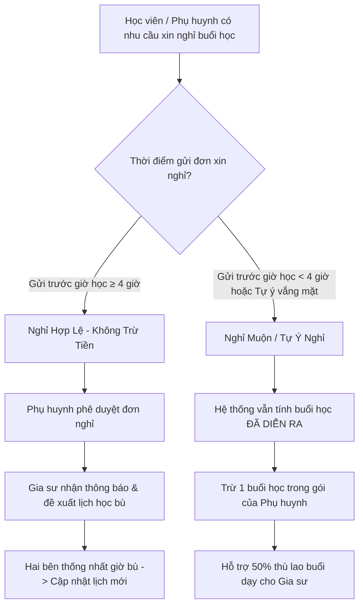
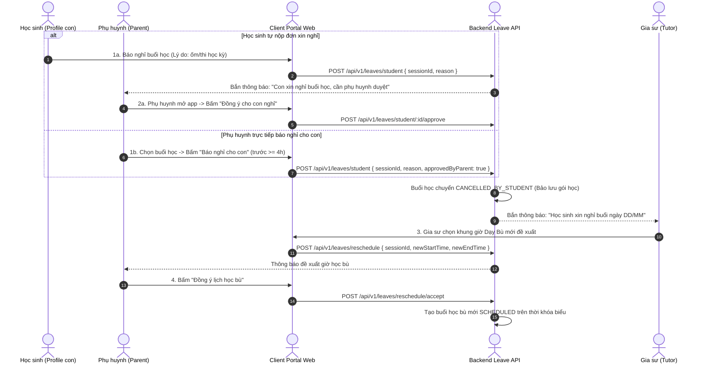

# ĐẶC TẢ NGHIỆP VỤ: THỜI KHÓA BIỂU & QUY TẮC BÁO NGHỈ HỌC (CLIENT PORTAL)

> **Mã phân hệ:** CLI-05 / SCH-01  
> **Đối tượng sử dụng:** Phụ huynh (Parent), Học sinh (Student), Gia sư (Tutor)  
> **Cổng truy cập:** `http://localhost:5173/client` (Menu Thời khóa biểu / Báo nghỉ)

---

## 1. Mục Tiêu Nghiệp Vụ
Để duy trì tiến độ học tập liên tục của học sinh và đảm bảo tính công bằng, tôn trọng thời gian của gia sư (tránh việc gia sư đội mưa gió đến nơi thì học sinh mới báo bận), hệ thống quy định chặt chẽ **Quy tắc Báo nghỉ trước 4 giờ (BR-SCH-01)**.

---

## 2. Quy Tắc Báo Nghỉ Của Học Viên (Business Rule BR-SCH-01)

### 1.1. Sơ đồ tuần tự (Sequence Diagram) - Luồng Báo Nghỉ & Thống Nhất Lịch Bù

### 2.1. Báo nghỉ hợp lệ ($\ge 4$ giờ trước giờ bắt đầu buổi học)
* **Quyền lợi tài chính**: **Tuyệt đối không bị trừ buổi học** trong gói học phí.
* **Quy trình phê duyệt nội bộ gia đình**:
  1. Nếu Học sinh dùng Profile của mình để báo nghỉ: Đơn xin nghỉ được tạo ở trạng thái `PENDING_PARENT_APPROVAL`. Gia sư chưa nhận được đơn này.
  2. Phụ huynh nhận thông báo, mở app kiểm tra lý do của con $\rightarrow$ Bấm **"Đồng ý cho con nghỉ"**.
  3. Đơn nghỉ chính thức chuyển sang Gia sư với trạng thái `APPROVED_BY_PARENT`.
  4. Buổi học chuyển sang trạng thái `CANCELLED_BY_STUDENT`.
  5. Gia sư và Phụ huynh mở giao diện xếp lịch bù để chọn một khung giờ khác trong tuần.

### 2.2. Báo nghỉ muộn ($< 4$ giờ trước giờ bắt đầu) hoặc Tự ý nghỉ không báo
* **Chế tài xử lý**:
  * Phụ huynh **vẫn bị trừ 1 buổi học** trong gói học phí (do gia sư đã dành thời gian và di chuyển tới nơi).
  * Tiền lương của buổi học này sẽ được trích **50% thù lao** để thanh toán hỗ trợ xăng xe, công sức cho gia sư; 50% còn lại giữ lại quỹ trung tâm.
  * Buổi học được ghi nhận là buổi học đặc biệt do học sinh vắng mặt không phép.

---

## 3. Quy Trình Thống Nhất & Duyệt Lịch Học Bù (Reschedule Flow)

1. Sau khi buổi học được hủy hợp lệ, màn hình hiển thị trạng thái *"Cần xếp lịch học bù"*.
2. Gia sư vào lịch dạy, chọn buổi cần bù $\rightarrow$ Bấm **"Đề xuất lịch bù"** $\rightarrow$ Chọn ngày và khung giờ rảnh mới.
3. Hệ thống kiểm tra: Giờ bù không được trùng với các lớp khác của cả 2 bên.
4. Phụ huynh nhận thông báo đề xuất lịch bù:
   * **Đồng ý**: Buổi học bù mới được tạo trên lịch với trạng thái `SCHEDULED`.
   * **Từ chối**: Phụ huynh đề xuất lại một khung giờ khác hoặc liên hệ trung tâm để nhờ điều phối.
5. Buổi học bù chính thức có giá trị như một buổi học định kỳ bình thường.

---

## 4. Quản Lý Thời Khóa Biểu Học Tập (Student Calendar)

* **Giao diện Lịch học**: Hiển thị theo dạng Lịch Tuần (Weekly Calendar) hoặc Lịch Tháng.
* **Mã màu trạng thái trực quan**:
  * 🟢 **Xanh lá**: Buổi học đã hoàn thành và được xác nhận (`CONFIRMED`).
  * 🟡 **Vàng**: Buổi học đã dạy, đang chờ phụ huynh duyệt điểm danh (`ATTENDED`).
  * 🔵 **Xanh dương**: Buổi học sắp tới theo lịch định kỳ (`SCHEDULED`).
  * 🔴 **Đỏ**: Buổi học đang có khiếu nại (`DISPUTED`).
  * ⚪ **Xám**: Buổi học đã được báo nghỉ hợp lệ (`CANCELLED_BY_*`).

---

## 5. Danh Sách Mã Lỗi Phục Vụ Dev & QA

| Mã lỗi (Error Code) | HTTP Status | Nguyên nhân | Hướng xử lý |
| :--- | :---: | :--- | :--- |
| `LEAVE_TOO_LATE` | 400 | Báo nghỉ khi buổi học chỉ còn dưới 4 giờ. | Cảnh báo: Buổi học sẽ vẫn bị tính phí trong gói. |
| `PARENT_APPROVAL_REQUIRED` | 403 | Học sinh tự gửi đơn nghỉ nhưng chưa có phụ huynh duyệt. | Thông báo học sinh nhắc phụ huynh vào app duyệt. |
| `SCHEDULE_CONFLICT` | 400 | Khung giờ học bù đề xuất bị trùng với lịch lớp học khác. | Chọn khung giờ khác không bị xung đột. |
| `SESSION_CANNOT_LEAVE` | 400 | Buổi học đã ở trạng thái `ATTENDED` hoặc `CONFIRMED`. | Không thể xin nghỉ cho buổi học đã diễn ra. |
