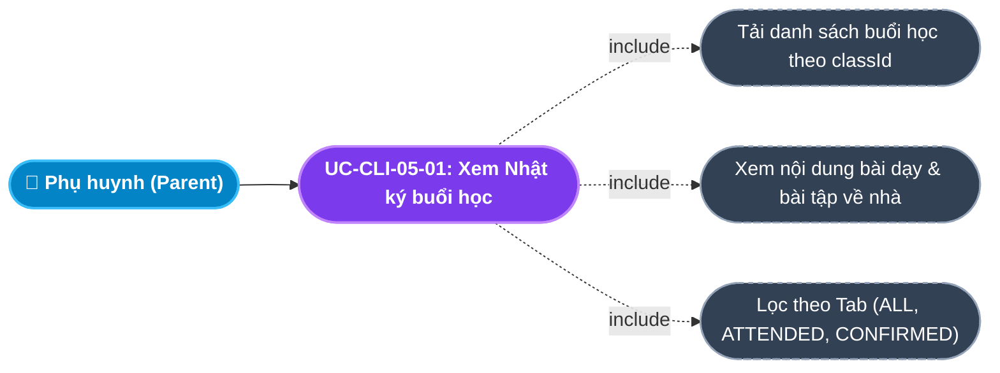
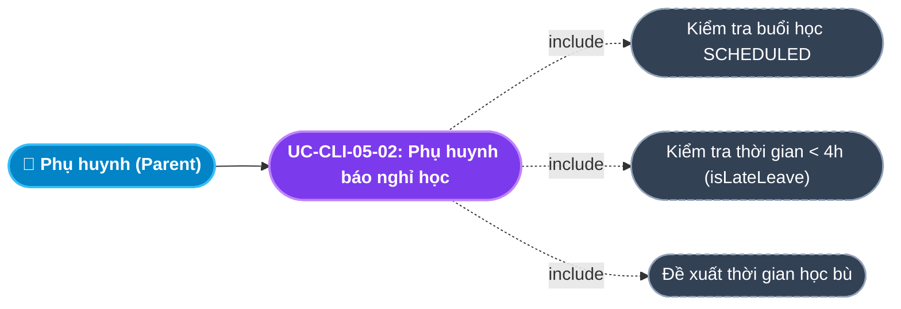
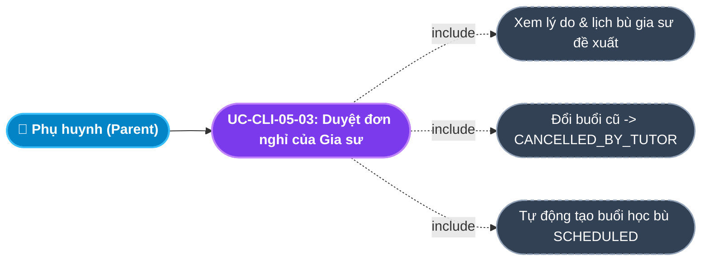
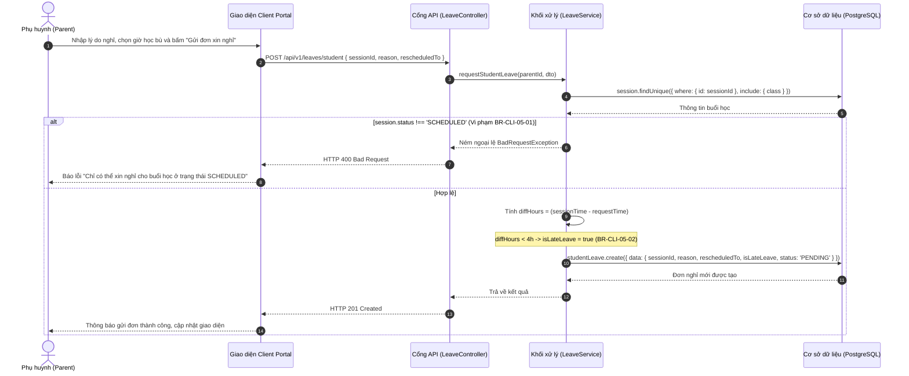
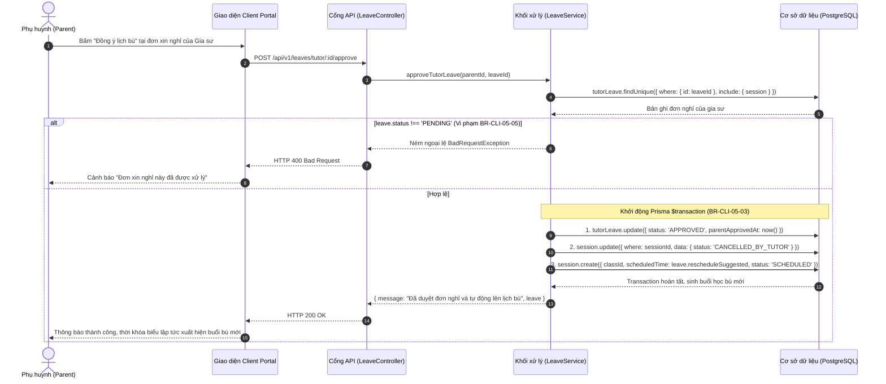

# Usecase: UC-CLI-05 - Theo dõi Lịch học, Nhật ký Buổi học & Báo nghỉ (Learning Journal & Leave Management)

## 1. Giới thiệu chức năng
- **Mục đích**: Cung cấp công cụ quản lý lịch học tập trực quan và nhật ký sư phạm chuyên sâu trên Cổng Khách hàng (Client Portal). Phụ huynh có thể dễ dàng nắm bắt thời khóa biểu các con theo tuần/tháng, kiểm tra thời gian bắt đầu - kết thúc thực tế của từng buổi dạy, xem nhận xét thái độ học tập và bài tập về nhà do gia sư ghi chép sau mỗi ca học. Hệ thống đồng thời cung cấp tính năng báo nghỉ học 1 chạm cho học sinh kèm đề xuất lịch học bù, phê duyệt đơn xin nghỉ của gia sư và tự động cập nhật thời khóa biểu bù giờ một cách hoàn toàn tự động.
- **Actor (Tác nhân)**: Phụ huynh (Parent), Học sinh (Student), Gia sư (Tutor).
- **Điều kiện tiên quyết**: Phụ huynh đã đăng nhập và đang có lớp học chính thức (`status = 'TEACHING'`).

### Danh mục các chức năng con (Sub-features):
1. **UC-CLI-05-01: Xem thời khóa biểu & Lịch học các con (Student Schedule)**: Hiển thị danh sách các buổi học định kỳ và các buổi học bù với mã màu trạng thái trực quan (Xanh dương, Vàng cam, Xanh lá, Đỏ, Xám).
2. **UC-CLI-05-02: Xem Nhật ký buổi học & Nhận xét sư phạm (Session Review Journal)**: Xem chi tiết giờ vào/ra thực tế, nội dung kiến thức đã học, đánh giá mức độ tiếp thu và bài tập về nhà do gia sư ghi lại.
3. **UC-CLI-05-03: Học sinh / Phụ huynh báo nghỉ học (Student Leave Request)**: Gửi đơn xin nghỉ phép kèm đề xuất ngày học bù (`rescheduledTo`), tự động gắn cờ báo nghỉ muộn nếu gửi trước giờ học < 4 tiếng.
4. **UC-CLI-05-04: Phê duyệt đơn xin nghỉ & Lịch dạy bù của Gia sư (Approve Tutor Leave)**: Phụ huynh xem đơn xin nghỉ của gia sư, bấm phê duyệt để hệ thống tự động hủy buổi cũ và lập tức sinh ra buổi học bù mới trên thời khóa biểu.
5. **UC-CLI-05-05: Lọc nhật ký buổi học theo trạng thái (Filter Session Journal)**: Lọc nhanh các buổi học: Tất cả (`ALL`), Chờ duyệt (`ATTENDED`), Đã hoàn thành (`CONFIRMED`), Sắp tới (`SCHEDULED`).

---

## 2. Dữ liệu nghiệp vụ đầu vào (Input Data & Parameters)

### 2.1. Dữ liệu Đơn Báo nghỉ của Học sinh (Student Leave Request Data)
| Tên trường | Kiểu dữ liệu | Tính chất | Ý nghĩa nghiệp vụ & Ràng buộc thực tế từ Code |
|---|---|---|---|
| `Mã buổi học` (sessionId) | UUID | Bắt buộc | Buổi học xin nghỉ. Buổi học phải đang ở trạng thái `SCHEDULED`. |
| `Lý do xin nghỉ` (reason) | Văn bản (Text) | Bắt buộc | Giải trình lý do nghỉ (VD: `Con bị sốt cao`, `Lịch thi học kỳ tại trường bị trùng`). Tối đa 500 ký tự. |
| `Thời gian học bù đề xuất` (rescheduledTo) | DateTime ISO8601 | Bắt buộc | Khung giờ phụ huynh đề xuất gia sư sang dạy bù (phải sau thời điểm xin nghỉ). |
| `Cờ báo nghỉ muộn` (isLateLeave) | Boolean | Tự động tính | Hệ thống tự tính: Nếu khoảng cách từ lúc gửi đơn đến giờ học $< 4$ tiếng $\rightarrow$ `isLateLeave = true`. |

### 2.2. Dữ liệu Phê duyệt đơn nghỉ của Gia sư (Approve Tutor Leave Data)
| Tên trường | Kiểu dữ liệu | Tính chất | Ý nghĩa nghiệp vụ & Ràng buộc |
|---|---|---|---|
| `Mã đơn nghỉ của Gia sư` (leaveId) | UUID | Bắt buộc (URL Param) | Đơn xin nghỉ trong bảng `tutorLeaves` có `status = 'PENDING'`. |

### 2.3. Bảng mã màu trạng thái Thời khóa biểu (Calendar Visual Badges)
| Mã trạng thái | Màu sắc Badge | Nhãn hiển thị | Ý nghĩa trên Lịch học |
|---|---|---|---|
| `SCHEDULED` | Xanh dương nhạt (`#e7e7ff` / `#696cff`) | Buổi học sắp tới | Buổi học định kỳ theo thời khóa biểu hoặc buổi dạy bù đã được chốt. |
| `ATTENDED` | Vàng cam (`#fff2d6` / `#ffab00`) | Chờ phụ huynh duyệt | Gia sư đã dạy xong và điểm danh, đang chờ phụ huynh chấm điểm. |
| `CONFIRMED` | Xanh lá tươi (`#e8fadf` / `#71dd37`) | Đã hoàn thành | Buổi học đã học xong, đã duyệt và đã thanh toán thù lao. |
| `CANCELLED_BY_STUDENT` | Xám nhạt (`#f5f5f9` / `#8592a3`) | Học sinh báo nghỉ | Buổi học đã được phụ huynh xin nghỉ phép thành công. |
| `CANCELLED_BY_TUTOR` | Xám nhạt (`#f5f5f9` / `#8592a3`) | Gia sư báo nghỉ | Buổi học đã hủy do gia sư xin phép, đã có lịch dạy bù thay thế. |
| `DISPUTED` | Đỏ nhạt (`#ffe0db` / `#ff3e1d`) | Đang khiếu nại | Buổi học phát sinh tranh chấp hoặc gia sư gian lận. |

---

## 3. Quy tắc nghiệp vụ (Business Rules)

| Mã Quy tắc | Tình huống nghiệp vụ | Cách hệ thống xử lý | Thông báo hiển thị cho người dùng |
|---|---|---|---|
| **BR-CLI-05-01** | **Chỉ cho phép xin nghỉ buổi học chưa diễn ra**: Phụ huynh xin nghỉ cho buổi học đã qua giờ hoặc đã điểm danh. | Backend kiểm tra `session.status !== SessionStatus.SCHEDULED` $\rightarrow$ Từ chối, trả HTTP 400. | "Chỉ có thể xin nghỉ cho buổi học ở trạng thái SCHEDULED" |
| **BR-CLI-05-02** | **Quy tắc Báo nghỉ muộn của Học sinh (< 4 giờ)**: Phụ huynh gửi đơn xin nghỉ khi chỉ còn dưới 4 tiếng là đến giờ học. | Hệ thống ghi nhận đơn nhưng tự động bật cờ `isLateLeave = true` để lưu vào lịch sử đối soát ý thức gia đình. | Ghi nhận cờ Báo nghỉ muộn |
| **BR-CLI-05-03** | **Tự động sinh buổi dạy bù khi duyệt đơn nghỉ của Gia sư**: Phụ huynh duyệt đơn nghỉ phép của gia sư. | Hệ thống chạy Transaction: 1. Đổi `tutorLeave.status = 'APPROVED'`; 2. Chuyển buổi cũ sang `CANCELLED_BY_TUTOR`; 3. Tự động `create` một buổi học mới tại bảng `sessions` với `scheduledTime = leave.rescheduleSuggested`, `status = 'SCHEDULED'`. | "Đã duyệt đơn nghỉ học của Gia sư và tự động lên lịch học bù mới!" |
| **BR-CLI-05-04** | **Kiểm tra quyền sở hữu đơn nghỉ**: Phụ huynh phê duyệt đơn của gia sư thuộc lớp học khác. | Backend kiểm tra `leave.session.class.parentId === currentParentId` $\rightarrow$ Nếu vi phạm ném `ForbiddenException` (HTTP 403). | "Lớp học này không thuộc quyền sở hữu của bạn" |
| **BR-CLI-05-05** | **Chống duyệt đơn nghỉ trùng lặp**: Phụ huynh click duyệt 2 lần vào cùng 1 đơn. | Backend kiểm tra `leave.status !== LeaveStatus.PENDING` $\rightarrow$ Ném `BadRequestException` (HTTP 400). | "Đơn xin nghỉ này đã được xử lý trước đó" |

---

## 4. Đặc tả chi tiết các Use Case chức năng con (Sub-Use Cases Specification)

---

### 4.1. UC-CLI-05-01: Xem Nhật ký buổi học & Nhận xét sư phạm (Session Review Journal)

#### Sơ đồ Use Case:

#### Bảng đặc tả nghiệp vụ:

| STT | Hạng mục | Nội dung chi tiết |
|:---:|---|---|
| **1** | **Thông tin chung** | - **UC ID**: `UC-CLI-05-01` - **UC Name**: Xem Nhật ký buổi học & Nhận xét sư phạm (Session Review Journal) - **Actor**: Phụ huynh (Parent) - **Mục tiêu**: Nắm bắt chi tiết tiến độ dạy học của con từng buổi dù phụ huynh bận rộn không thể trực tiếp kèm cặp. - **Mô tả**: Chọn lớp học cần xem, hệ thống hiển thị danh sách các buổi học kèm thời gian thực dạy, nội dung giảng dạy và ghi chú sư phạm. - **Priority**: High |
| **2** | **Trigger** | Phụ huynh nhấn vào một lớp học trong danh sách lớp học tại Dashboard hoặc màn hình chi tiết lớp. |
| **3** | **Pre-condition** | Lớp học đang hoạt động và đã có các buổi học được khởi tạo. |
| **4** | **Post-condition** | Hiển thị bảng nhật ký buổi học phân loại theo các tab trạng thái. |
| **5** | **Main Flow** | 1. Phụ huynh chọn lớp học cần kiểm tra (`openClassJournal(cls)`). 2. Giao diện hiển thị loading. 3. Client gửi request `GET /api/v1/sessions?classId=:classId`. 4. Backend truy vấn CSDL lấy danh sách buổi học xếp theo thời gian mới nhất lên đầu. 5. Hiển thị danh thiếp từng buổi: Ngày học, Giờ vào - Giờ ra thực tế (`actualStart` - `actualEnd`), Nội dung bài học và ghi chú của gia sư (`tutorNotes`). 6. Nếu buổi học đã được đánh giá, hiển thị số sao phụ huynh đã chấm và nhận xét phản hồi. |
| **6** | **Alternative / Exception Flow** | - **AF-01 (Lọc theo tab)**: Click tab `ATTENDED` $\rightarrow$ Chỉ hiển thị các buổi gia sư vừa dạy xong đang chờ duyệt để xử lý nhanh. |
| **7** | **Business Rules & Validation** | - Sắp xếp buổi học theo `scheduledTime: 'desc'`. |
| **8** | **Acceptance Criteria** | - **AC-01**: Tải nhật ký buổi học < 300ms. - **AC-02**: Hiển thị đầy đủ ghi chú bài tập về nhà của gia sư không bị cắt xén. |

---

### 4.2. UC-CLI-05-02: Học sinh / Phụ huynh báo nghỉ học (Student Leave Request)

#### Sơ đồ Use Case:

#### Bảng đặc tả nghiệp vụ:

| STT | Hạng mục | Nội dung chi tiết |
|:---:|---|---|
| **1** | **Thông tin chung** | - **UC ID**: `UC-CLI-05-02` - **UC Name**: Học sinh / Phụ huynh báo nghỉ học (Student Leave Request) - **Actor**: Phụ huynh (Parent) - **Mục tiêu**: Xin nghỉ buổi học một cách văn minh, kịp thời thông báo cho gia sư để tránh việc gia sư di chuyển đến nhà vô ích, đồng thời đề xuất giờ học bù. - **Mô tả**: Chọn buổi học sắp tới, nhập lý do nghỉ và chọn ngày giờ học bù mong muốn. - **Priority**: High |
| **2** | **Trigger** | Phụ huynh bấm nút **"Báo nghỉ học"** tại buổi học có trạng thái `SCHEDULED` hoặc truy cập menu `/client/leaves`. |
| **3** | **Pre-condition** | Buổi học đang ở trạng thái `SCHEDULED` (`BR-CLI-05-01`). |
| **4** | **Post-condition** | 1. Tạo bản ghi `studentLeave` với trạng thái `PENDING`. 2. Gắn cờ `isLateLeave` nếu gửi trước giờ học < 4 tiếng (`BR-CLI-05-02`). 3. Gia sư nhận được thông báo về đơn xin nghỉ và lịch học bù đề xuất. |
| **5** | **Main Flow** | 1. Phụ huynh tìm đến buổi học sắp tới cần xin nghỉ. 2. Bấm nút **"Báo nghỉ buổi này"**. 3. Form xuất hiện, phụ huynh nhập: Lý do xin nghỉ và Chọn ngày giờ học bù đề xuất (`rescheduledTo`). 4. Bấm nút **"Gửi đơn xin nghỉ"**. 5. Client gửi request `POST /api/v1/leaves/student` với `{ sessionId, reason, rescheduledTo }`. 6. Backend kiểm tra quyền và trạng thái buổi học. 7. Backend tính toán `diffHours`: Nếu $< 4$ tiếng $\rightarrow$ gán `isLateLeave = true`, ngược lại `false`. 8. Backend lưu bản ghi `studentLeave` vào CSDL và trả về `HTTP 201 Created`. 9. Giao diện thông báo thành công và cập nhật trạng thái đơn nghỉ. |
| **6** | **Alternative / Exception Flow** | - **EF-01 (Xin nghỉ buổi đã diễn ra)**: Chọn buổi học đã qua $\rightarrow$ Backend từ chối `400 Bad Request`, báo *"Chỉ có thể xin nghỉ cho buổi học ở trạng thái SCHEDULED"*. |
| **7** | **Business Rules & Validation** | - `BR-CLI-05-01`: Chỉ áp dụng cho buổi học `SCHEDULED`. - `BR-CLI-05-02`: Ngưỡng báo trước là 4 giờ. |
| **8** | **Acceptance Criteria** | - **AC-01**: Đơn báo nghỉ được lưu chính xác thời gian và lý do trong CSDL. - **AC-02**: Gia sư nhận được thông báo đề xuất lịch học bù ngay lập tức trên app. |

---

### 4.3. UC-CLI-05-03: Phê duyệt đơn xin nghỉ & Lịch dạy bù của Gia sư (Approve Tutor Leave)

#### Sơ đồ Use Case:

#### Bảng đặc tả nghiệp vụ:

| STT | Hạng mục | Nội dung chi tiết |
|:---:|---|---|
| **1** | **Thông tin chung** | - **UC ID**: `UC-CLI-05-03` - **UC Name**: Phê duyệt đơn xin nghỉ & Lịch dạy bù của Gia sư (Approve Tutor Leave) - **Actor**: Phụ huynh (Parent) - **Mục tiêu**: Xử lý đề xuất xin nghỉ phép của gia sư và đồng thuận với khung giờ dạy bù mà gia sư đề xuất. - **Mô tả**: Phụ huynh bấm nút phê duyệt, hệ thống hủy buổi cũ và tự động thêm buổi học bù mới vào thời khóa biểu. - **Priority**: High |
| **2** | **Trigger** | Phụ huynh bấm nút **"Đồng ý lịch bù"** tại thông báo đơn nghỉ của gia sư. |
| **3** | **Pre-condition** | Đơn xin nghỉ của gia sư đang ở trạng thái `PENDING`. |
| **4** | **Post-condition** | 1. `tutorLeave.status = 'APPROVED'`, ghi nhận `parentApprovedAt`. 2. Buổi học cũ đổi thành `CANCELLED_BY_TUTOR`. 3. Buổi học bù mới được tạo tại bảng `sessions` với `status = 'SCHEDULED'`. 4. Toast hiển thị thông báo thành công. |
| **5** | **Main Flow** | 1. Phụ huynh xem thông tin đơn nghỉ của gia sư (Lý do, Giờ học bù đề xuất). 2. Bấm nút **"Đồng ý lịch bù"**. 3. Client gửi request `POST /api/v1/leaves/tutor/:id/approve`. 4. Backend xác thực quyền sở hữu (`BR-CLI-05-04`) và trạng thái đơn (`BR-CLI-05-05`). 5. Backend thực hiện Transaction tự động tạo buổi học bù mới (`BR-CLI-05-03`). 6. Backend trả về `HTTP 200 OK` kèm thông tin đơn nghỉ cập nhật. 7. Thời khóa biểu của con tự động xuất hiện buổi học bù mới. |
| **6** | **Alternative / Exception Flow** | - **EF-01 (Đơn đã duyệt trước đó)**: Bấm duyệt lại $\rightarrow$ Trả lỗi 400 *"Đơn xin nghỉ này đã được xử lý trước đó"*. |
| **7** | **Business Rules & Validation** | - `BR-CLI-05-03`: Tự động tạo buổi học bù mới đúng khung giờ `rescheduleSuggested`. |
| **8** | **Acceptance Criteria** | - **AC-01**: Buổi học bù mới lập tức xuất hiện trên lịch của con với ghi chú rõ ràng: *"Dạy bù cho buổi học ngày [Ngày cũ] bị hủy do Gia sư nghỉ"*. |

---

## 5. Sơ đồ tuần tự nghiệp vụ (Sequence Diagrams)

### 5.1. Sơ đồ: Học sinh / Phụ huynh báo nghỉ học

### 5.2. Sơ đồ: Phụ huynh duyệt đơn nghỉ & Lên lịch dạy bù tự động

---

## 6. Kịch bản kiểm thử & Nghiệm thu (Given / When / Then)

### Kịch bản 1: Phụ huynh báo nghỉ học hợp lệ trước 24 giờ
- **Given**: Buổi học môn Toán của con được lên lịch lúc 19h00 ngày Thứ Bảy tuần này.
- **When**: Lúc 09h00 ngày Thứ Sáu (trước hơn 30 tiếng), phụ huynh gửi đơn báo nghỉ vì lý do `"Gia đình về quê"`, đề xuất học bù vào 19h00 Chủ Nhật.
- **Then**: Đơn nghỉ được tạo thành công với cờ `isLateLeave = false`. Gia sư nhận được thông báo để xác nhận lịch dạy bù vào Chủ Nhật.

### Kịch bản 2: Phụ huynh báo nghỉ sát giờ học (< 4 tiếng)
- **Given**: Buổi học bắt đầu lúc 18h00 tối nay.
- **When**: Lúc 16h30 (cách giờ học 1.5 tiếng), phụ huynh gửi đơn xin nghỉ vì con bị sốt đột xuất.
- **Then**: Đơn được ghi nhận thành công nhưng trường `isLateLeave` được tự động đánh dấu là `true` để làm căn cứ hậu kiểm.

### Kịch bản 3: Duyệt đơn nghỉ của gia sư và sinh buổi dạy bù tự động
- **Given**: Gia sư gửi đơn xin nghỉ buổi Thứ Năm vì bận thi ở trường đại học, đề xuất dạy bù vào 08h00 sáng Thứ Bảy.
- **When**: Phụ huynh nhấn "Đồng ý lịch bù".
- **Then**: Buổi học Thứ Năm chuyển sang trạng thái `CANCELLED_BY_TUTOR`. Lịch của con tự động xuất hiện thêm buổi học bù vào 08h00 sáng Thứ Bảy với trạng thái `SCHEDULED` mà không cần nhập liệu thủ công.
