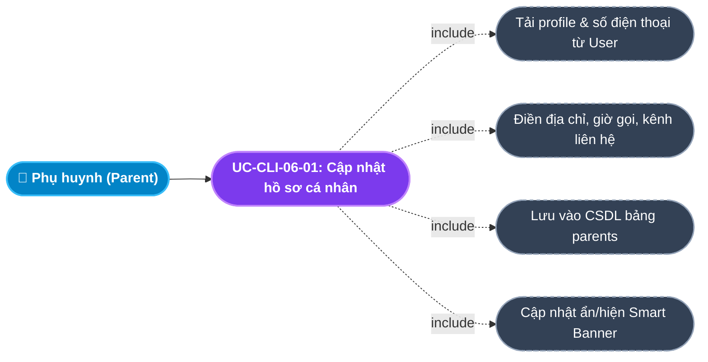
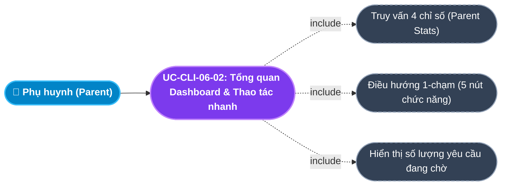
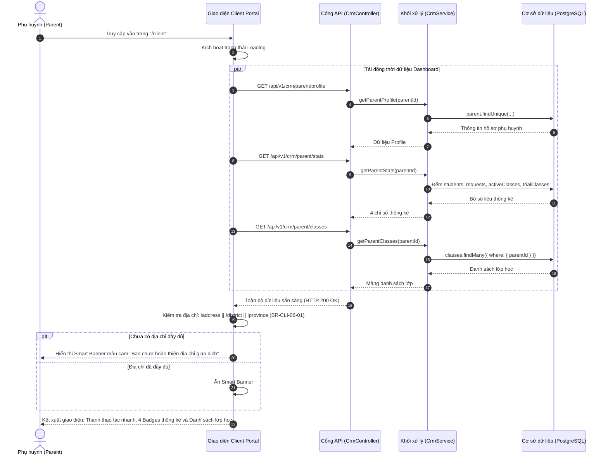
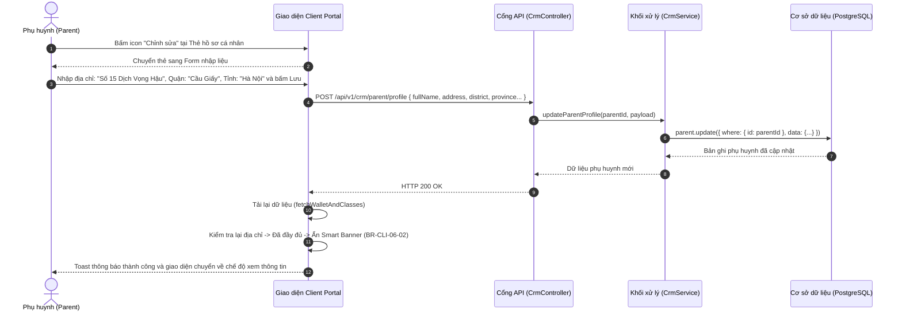

# Usecase: UC-CLI-06 - Dashboard Tổng quan, Thao tác nhanh & Cảnh báo Thông minh (Dashboard & Quick Actions)

## 1. Giới thiệu chức năng
- **Mục đích**: Cung cấp trung tâm chỉ huy tập trung và bảng điều khiển tổng quan (Action-Oriented Dashboard) trên Cổng Khách hàng (Client Portal). Dashboard không làm rối mắt người dùng bằng các biểu đồ phức tạp mà tập trung cung cấp: Bộ thanh điều hướng thao tác nhanh (Quick Actions) 1 chạm đến các tác vụ thường ngày, 4 chỉ số thống kê tức thì (Metric Badges), Banner cảnh báo thông minh tự động nhắc nhở hoàn thiện địa chỉ phục vụ thuật toán Smart Matching, đồng thời tích hợp trực tiếp bảng quản trị hồ sơ liên hệ phụ huynh và danh sách các lớp học đang diễn ra.
- **Actor (Tác nhân)**: Phụ huynh (Parent), Học sinh (Student), Hệ thống CRM (System).
- **Điều kiện tiên quyết**: Phụ huynh đã đăng nhập thành công vào Client Portal bằng Số điện thoại (xác thực Token JWT hợp lệ).

### Danh mục các chức năng con (Sub-features):
1. **UC-CLI-06-01: Thanh công cụ thao tác nhanh (Quick Actions Bar)**: 5 liên kết trực tiếp (1-click navigation): Quản lý con cái, Yêu cầu gia sư (kèm badge đếm số lượng), Báo nghỉ & dời lịch, Đánh giá dạy thử và nút Đăng ký tìm gia sư nổi bật.
2. **UC-CLI-06-02: Bảng chỉ số thống kê nhanh (Metric Badges Counter)**: 4 thẻ đo lường tự động từ CSDL: Số học sinh (`studentsCount`), Yêu cầu đang tìm (`requestsCount`), Lớp học chính thức (`activeClassesCount`) và Lớp đang dạy thử (`trialClassesCount`).
3. **UC-CLI-06-03: Banner cảnh báo thông minh (Smart Contextual Alert Banner)**: Tự động phân tích trường địa chỉ (`address`, `district`, `province`); hiển thị banner màu cam cảnh báo hoàn thiện thông tin giao dịch nhằm tăng độ chính xác ghép gia sư gần nhà.
4. **UC-CLI-06-04: Quản lý & Cập nhật hồ sơ Phụ huynh (Parent Profile Management)**: Xem và điều chỉnh họ tên, địa chỉ chi tiết, nghề nghiệp, khung giờ liên hệ ưu tiên (`MORNING`, `AFTERNOON`, `EVENING`, `ANYTIME`), kênh liên lạc (`CALL`, `ZALO`, `EMAIL`) và ghi chú gia đình.
5. **UC-CLI-06-05: Danh sách lớp học & Mở nhanh nhật ký (Class List & Journal Access)**: Hiển thị các thẻ lớp học đang diễn ra kèm gia sư phụ trách, học phí, số buổi đã học và 1-click mở nhanh chi tiết buổi học.

---

## 2. Dữ liệu nghiệp vụ đầu vào (Input Data & Parameters)

### 2.1. Dữ liệu biểu mẫu Cập nhật Hồ sơ Phụ huynh (Parent Profile Data)
| Tên trường | Kiểu dữ liệu | Tính chất | Ý nghĩa nghiệp vụ & Ràng buộc thực tế từ Code |
|---|---|---|---|
| `Họ và tên` (fullName) | Chuỗi (String) | Bắt buộc | Họ tên phụ huynh. Tối đa 100 ký tự. Không được để trống. |
| `Địa chỉ chi tiết` (address) | Chuỗi (String) | Bắt buộc | Số nhà, ngõ, tên đường hoặc tòa chung cư. Tối đa 255 ký tự. |
| `Quận / Huyện` (district) | Chuỗi (String) | Bắt buộc | Quận huyện cư trú (VD: `Quận Cầu Giấy`, `Thanh Xuân`). Dùng làm bán kính gợi ý gia sư gần nhà. |
| `Tỉnh / Thành phố` (province) | Chuỗi (String) | Bắt buộc | Tỉnh thành (VD: `Hà Nội`, `TP. Hồ Chí Minh`). |
| `Nghề nghiệp` (occupation) | Chuỗi (String) | Tùy chọn | Nghề nghiệp phụ huynh (VD: `Bác sĩ`, `Kỹ sư CNTT`). Tối đa 100 ký tự. |
| `Khung giờ nhận cuộc gọi` (contactTimePref) | Enum / String | Mặc định | `ANYTIME` (Bất cứ lúc nào), `MORNING` (Buổi sáng 8h-12h), `AFTERNOON` (Buổi chiều 14h-17h30), `EVENING` (Buổi tối sau 18h30). Mặc định: `ANYTIME`. |
| `Kênh liên hệ ưu tiên` (preferredContactMethod) | Enum / String | Mặc định | `CALL` (Gọi điện trực tiếp), `ZALO` (Nhắn tin qua Zalo), `EMAIL` (Gửi Email). Mặc định: `CALL`. |
| `Ghi chú hoàn cảnh gia đình` (familyNotes) | Văn bản (Text) | Tùy chọn | Thông tin hoàn cảnh gia đình giúp trung tâm tư vấn chu đáo nhất. |

### 2.2. Dữ liệu Thống kê Dashboard (Parent Stats Data)
| Tên chỉ số | Nguồn tính toán từ CSDL (`crm.service.ts`) | Ý nghĩa nghiệp vụ |
|---|---|---|
| `studentsCount` | `student.count({ where: { parentId, deletedAt: null } })` | Tổng số con đang quản lý trên tài khoản. |
| `requestsCount` | `tutorRequest.count({ where: { parentId, status: { in: ['NEW', 'CONSULTING', 'MATCHED'] }, deletedAt: null } })` | Số lượng yêu cầu tìm gia sư đang hoạt động. |
| `activeClassesCount` | `class.count({ where: { parentId, status: 'TEACHING', deletedAt: null } })` | Số lượng lớp học đang học chính thức ổn định. |
| `trialClassesCount` | `class.count({ where: { parentId, status: 'TRIAL', deletedAt: null } })` | Số lượng lớp đang trong thời gian dạy thử cần phản hồi. |

---

## 3. Quy tắc nghiệp vụ (Business Rules)

| Mã Quy tắc | Tình huống nghiệp vụ | Cách hệ thống xử lý | Thông báo hiển thị cho người dùng |
|---|---|---|---|
| **BR-CLI-06-01** | **Điều kiện kích hoạt Banner Cảnh báo Địa chỉ**: Phụ huynh chưa điền đủ địa chỉ (`!address \|\| !district \|\| !province`). | Hệ thống tự động hiển thị Banner màu cam ở đầu trang: *"Bạn chưa hoàn thiện địa chỉ giao dịch. Cập nhật ngay địa chỉ chi tiết để hệ thống dễ dàng gợi ý và ưu tiên các gia sư ở gần khu vực của bạn nhất."* | Hiển thị Banner cảnh báo màu cam |
| **BR-CLI-06-02** | **Tự động ẩn Banner khi hoàn thiện**: Phụ huynh bấm lưu thông tin địa chỉ đầy đủ. | Sau khi cập nhật hồ sơ thành công, hệ thống tải lại `profileInfo`; Banner lập tức biến mất mà không cần tải lại trang. | Banner tự động biến mất |
| **BR-CLI-06-03** | **Đồng bộ hóa địa chỉ vào Yêu cầu tìm gia sư**: Phụ huynh tạo yêu cầu tìm gia sư mới tại `/client/request-tutor`. | Hệ thống tự động ghép `[address, district, province]` thành chuỗi đầy đủ và điền sẵn vào ô địa chỉ học tại nhà, giúp phụ huynh không phải nhập lại. | Tự động điền địa chỉ vào biểu mẫu |
| **BR-CLI-06-04** | **Phản hồi không gián đoạn (Toast Notifications)**: Mọi thao tác cập nhật hồ sơ, lưu thông tin trên Dashboard. | Sử dụng thư viện `react-hot-toast` hiển thị góc màn hình, tự động biến mất sau 3 giây, tuyệt đối không dùng popup `alert()` gây chặn luồng người dùng. | Toast xanh lá thành công |
| **BR-CLI-06-05** | **Bảo mật số điện thoại và email đăng nhập**: Phụ huynh cập nhật thông tin cá nhân. | `User.phone` và `User.email` là thông tin định danh gốc; Form cập nhật hồ sơ chỉ cho phép sửa thông tin hồ sơ `Parent`, ngăn chặn thay đổi SĐT tùy tiện để bảo vệ quyền kiểm soát tài khoản. | Chỉ cho phép sửa thông tin hiển thị |

---

## 4. Đặc tả chi tiết các Use Case chức năng con (Sub-Use Cases Specification)

---

### 4.1. UC-CLI-06-01: Quản lý & Cập nhật hồ sơ Phụ huynh (Parent Profile Management)

#### Sơ đồ Use Case:

#### Bảng đặc tả nghiệp vụ:

| STT | Hạng mục | Nội dung chi tiết |
|:---:|---|---|
| **1** | **Thông tin chung** | - **UC ID**: `UC-CLI-06-01` - **UC Name**: Quản lý & Cập nhật hồ sơ Phụ huynh (Parent Profile Management) - **Actor**: Phụ huynh (Parent) - **Mục tiêu**: Cập nhật thông tin nơi ở, thời gian rảnh nhận cuộc gọi và kênh liên lạc thuận tiện nhất để nhân viên tư vấn hỗ trợ kịp thời. - **Mô tả**: Người dùng bấm nút Sửa hồ sơ, cập nhật biểu mẫu và lưu vào CSDL. - **Priority**: High |
| **2** | **Trigger** | Phụ huynh bấm nút icon cây bút **"Chỉnh sửa"** tại Thẻ thông tin phụ huynh ở cột phải của Dashboard. |
| **3** | **Pre-condition** | Đã đăng nhập vào hệ thống với vai trò `PARENT`. |
| **4** | **Post-condition** | 1. Dữ liệu trong bảng `parents` được cập nhật. 2. Thẻ hồ sơ phụ huynh hiển thị địa chỉ và thông tin mới. 3. Smart Banner tự động kiểm tra lại điều kiện ẩn/hiện. 4. Toast hiển thị: *"Đã cập nhật hồ sơ phụ huynh thành công!"*. |
| **5** | **Main Flow** | 1. Phụ huynh bấm nút **"Chỉnh sửa"** tại Thẻ hồ sơ cá nhân. 2. Giao diện chuyển sang chế độ Form nhập liệu (`editingProfile = true`). 3. Phụ huynh điền/sửa: Họ tên, Địa chỉ, Quận/Huyện, Tỉnh/Thành phố, Nghề nghiệp, Khung giờ nhận cuộc gọi, Kênh liên hệ ưu tiên và Ghi chú gia đình. 4. Phụ huynh bấm nút **"Lưu hồ sơ"**. 5. Client gửi request `POST /api/v1/crm/parent/profile` kèm payload dữ liệu. 6. Backend cập nhật bản ghi `Parent` theo `parentId` của tài khoản hiện tại. 7. Backend trả về `HTTP 200 OK`. 8. Client đóng chế độ form (`editingProfile = false`), làm mới dữ liệu và hiển thị Toast thành công. |
| **6** | **Alternative / Exception Flow** | - **AF-01 (Hủy chỉnh sửa)**: Bấm "Hủy" $\rightarrow$ Đóng form, khôi phục lại dữ liệu hiển thị cũ. - **EF-01 (Lỗi kết nối máy chủ)**: Mất mạng $\rightarrow$ Nút lưu dừng xoay loading, hiển thị Toast báo lỗi: *"Cập nhật thất bại"*. |
| **7** | **Business Rules & Validation** | - `BR-CLI-06-05`: Không cho phép sửa đổi số điện thoại gốc tại màn hình này. |
| **8** | **Acceptance Criteria** | - **AC-01**: Cập nhật xong địa chỉ đầy đủ $\rightarrow$ Banner cảnh báo màu cam lập tức biến mất. - **AC-02**: Địa chỉ mới được tự động điền khi phụ huynh mở trang Đăng ký tìm gia sư mới. |

---

### 4.2. UC-CLI-06-02: Bảng chỉ số thống kê & Thao tác nhanh (Metrics & Quick Actions)

#### Sơ đồ Use Case:

#### Bảng đặc tả nghiệp vụ:

| STT | Hạng mục | Nội dung chi tiết |
|:---:|---|---|
| **1** | **Thông tin chung** | - **UC ID**: `UC-CLI-06-02` - **UC Name**: Bảng chỉ số thống kê & Thao tác nhanh (Metrics & Quick Actions) - **Actor**: Phụ huynh (Parent) - **Mục tiêu**: Giúp phụ huynh nắm bắt tức thời toàn bộ quy mô học tập của gia đình và truy cập mọi nghiệp vụ chỉ với 1 click. - **Mô tả**: Tải số liệu thống kê từ API, hiển thị các Badge đo lường và các nút điều hướng nghiệp vụ nhanh. - **Priority**: High |
| **2** | **Trigger** | Phụ huynh đăng nhập hoặc truy cập vào trang chủ `/client`. |
| **3** | **Pre-condition** | Đăng nhập thành công với vai trò `PARENT`. |
| **4** | **Post-condition** | Hiển thị 4 thẻ số liệu thống kê và thanh công cụ 5 nút thao tác nhanh. |
| **5** | **Main Flow** | 1. Người dùng vào trang Dashboard Client Portal. 2. Giao diện gửi song song các API: `parent/profile`, `parent/stats`, `parent/classes`, `tutor-requests/my` qua `Promise.allSettled`. 3. Backend tính toán chính xác 4 chỉ số từ CSDL và trả về. 4. Giao diện kết xuất 4 ô thống kê: Học sinh, Yêu cầu gia sư, Lớp chính thức, Lớp dạy thử. 5. Hiển thị thanh thao tác nhanh ở đầu trang, tại nút "Yêu cầu gia sư" hiển thị kèm số lượng yêu cầu đang mở (ví dụ: `Yêu cầu gia sư (2)`). 6. Người dùng click vào nút bất kỳ $\rightarrow$ Chuyển hướng ngay tới phân hệ tương ứng. |
| **6** | **Alternative / Exception Flow** | - **AF-01 (Bấm thẻ thống kê)**: Click trực tiếp vào thẻ thống kê "Yêu cầu gia sư" $\rightarrow$ Tự động điều hướng đến trang `/client/requests`. |
| **7** | **Business Rules & Validation** | - Số liệu tính toán trực tiếp từ CSDL theo thời gian thực (Real-time). |
| **8** | **Acceptance Criteria** | - **AC-01**: Tải toàn bộ số liệu thống kê Dashboard < 500ms. - **AC-02**: Nhấp vào bất kỳ nút nào trên thanh Thao tác nhanh chuyển trang mượt mà không bị reload cả trang web. |

---

## 5. Sơ đồ tuần tự nghiệp vụ (Sequence Diagrams)

### 5.1. Sơ đồ: Tải dữ liệu Dashboard & Kích hoạt Cảnh báo Thông minh

### 5.2. Sơ đồ: Cập nhật hồ sơ phụ huynh & Tự động tắt cảnh báo

---

## 6. Kịch bản kiểm thử & Nghiệm thu (Given / When / Then)

### Kịch bản 1: Hiển thị Banner cảnh báo khi tài khoản mới chưa có địa chỉ
- **Given**: Tài khoản phụ huynh mới đăng ký qua số điện thoại, trường `address`, `district`, `province` trong CSDL đang rỗng (`null`).
- **When**: Phụ huynh đăng nhập vào Dashboard Client Portal.
- **Then**: Giao diện hiển thị Banner màu cam nổi bật ngay dưới thanh Thao tác nhanh với nội dung: *"Bạn chưa hoàn thiện địa chỉ giao dịch. Cập nhật ngay địa chỉ chi tiết để hệ thống dễ dàng gợi ý và ưu tiên các gia sư ở gần khu vực của bạn nhất."*.

### Kịch bản 2: Tự động tắt Banner cảnh báo sau khi bổ sung địa chỉ
- **Given**: Banner cảnh báo màu cam đang hiển thị trên Dashboard.
- **When**: Phụ huynh bấm Chỉnh sửa hồ sơ, điền địa chỉ là `"123 Trần Duy Hưng"`, Quận `"Cầu Giấy"`, Tỉnh `"Hà Nội"` và bấm Lưu hồ sơ.
- **Then**: Hệ thống lưu vào CSDL thành công, thông báo Toast xanh lá xuất hiện. Banner cảnh báo màu cam tự động biến mất khỏi màn hình ngay lập tức mà không cần F5 tải lại trang.

### Kịch bản 3: Truy cập nhanh các tính năng từ thanh công cụ Thao tác nhanh
- **Given**: Phụ huynh đang ở trang chủ Dashboard.
- **When**: Phụ huynh bấm vào nút `"Báo Nghỉ & Dời Lịch"` trên thanh Thao tác nhanh.
- **Then**: Hệ thống chuyển hướng ngay lập tức sang trang `/client/leaves` để phụ huynh gửi đơn xin nghỉ cho con.
