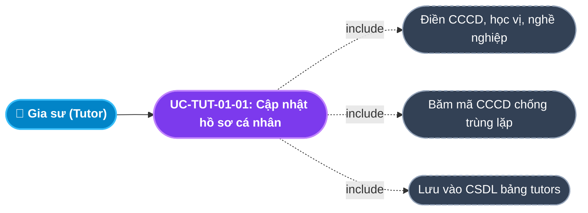
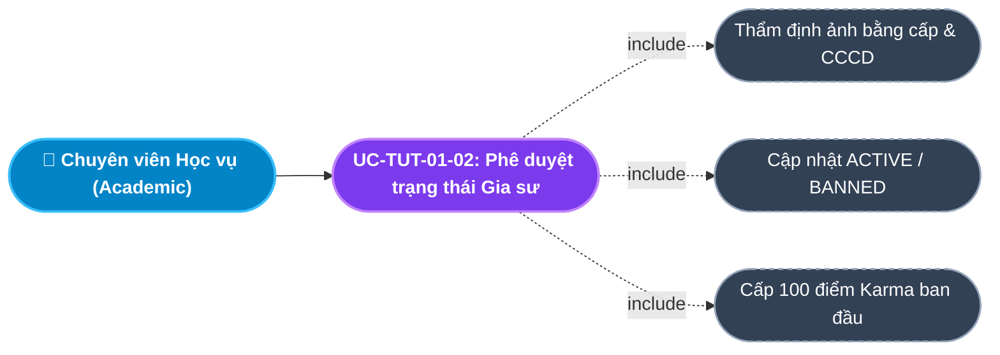
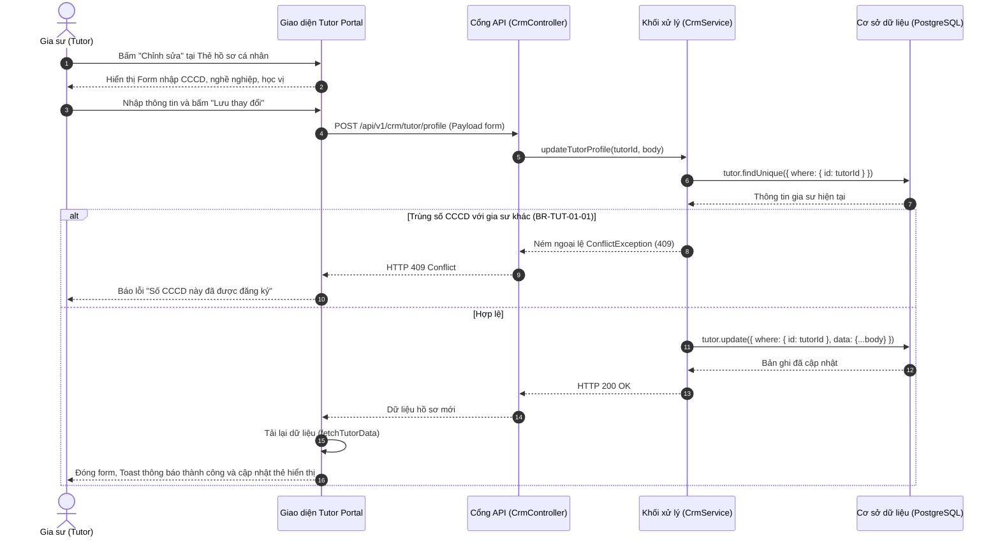

# Usecase: UC-TUT-01 - Hồ sơ Năng lực, Định danh CCCD & Phân loại Gia sư (Profile & Classification)

## 1. Giới thiệu chức năng
- **Mục đích**: Cung cấp bộ công cụ quản lý hồ sơ năng lực, xác thực danh tính điện tử (eKYC) và phân loại chức danh giảng dạy cho Gia sư trên Cổng Đối tác Gia sư (Tutor Portal). Hệ thống phân định rõ rệt 2 nhóm đối tượng: Sinh viên (`STUDENT`) và Giáo viên (`TEACHER`), gắn liền với quy chế dạy thử và định mức thù lao khác nhau. Hồ sơ được kiểm duyệt chặt chẽ bởi bộ phận Học vụ trước khi cấp quyền xem bảng tin và nhận lớp chính thức.
- **Actor (Tác nhân)**: Gia sư (Tutor), Chuyên viên Học vụ (Academic Officer), Quản trị viên hệ thống (Admin).
- **Điều kiện tiên quyết**: Gia sư đã đăng ký tài khoản thành công bằng Số điện thoại và được gán vai trò `TUTOR`.

### Danh mục các chức năng con (Sub-features):
1. **UC-TUT-01-01: Cập nhật thông tin định danh & CCCD**: Khai báo họ tên, ngày sinh, giới tính, số CCCD/CMND (lưu mã hash bảo mật).
2. **UC-TUT-01-02: Cập nhật học vị & Chuyên môn giảng dạy**: Khai báo nghề nghiệp, bằng cấp sư phạm / thẻ sinh viên, trình độ học vị (`qualification`).
3. **UC-TUT-01-03: Đăng ký môn dạy & Khối lớp phụ trách**: Đăng ký danh sách môn học kèm lớp (Toán, Lý, Hóa... từ Lớp 1 - 12) kèm trạng thái xác thực `isVerified`.
4. **UC-TUT-01-04: Thẩm định & Phê duyệt hồ sơ (Academic Verification)**: Chuyên viên Học vụ kiểm tra hồ sơ, phê duyệt trạng thái `ACTIVE`, đưa vào danh sách chờ duyệt (`PENDING_REVIEW`) hoặc khóa tài khoản (`BANNED`).
5. **UC-TUT-01-05: Chuyển đổi chế độ hiển thị công khai (Public Profile Toggle)**: Cho phép gia sư bật/tắt hồ sơ công khai trên trang web trung tâm để phụ huynh có thể tìm thấy và gửi lời mời dạy.

---

## 2. Dữ liệu nghiệp vụ đầu vào (Input Data & Parameters)

### 2.1. Dữ liệu biểu mẫu Hồ sơ Gia sư (Tutor Profile Form Data)
| Tên trường | Kiểu dữ liệu | Tính chất | Ý nghĩa nghiệp vụ & Ràng buộc thực tế từ Code |
|---|---|---|---|
| `Họ và tên` (fullName) | Chuỗi (String) | Bắt buộc | Tên thật theo CCCD. Tối đa 100 ký tự. Không được để trống. |
| `Giới tính` (gender) | Enum / String | Bắt buộc | `Nam`, `Nữ`, hoặc `Khác`. Phục vụ lọc yêu cầu tìm gia sư theo giới tính. |
| `Ngày sinh` (dateOfBirth) | Date (`YYYY-MM-DD`) | Bắt buộc | Ngày sinh gia sư. Yêu cầu $\ge 18$ tuổi. |
| `Số CCCD / CMND` (identityNumber) | Chuỗi (String) | Bắt buộc | Số căn cước công dân (12 số). Hệ thống tự động tạo mã băm `identityNumberHash` duy nhất (`@unique`) để chống đăng ký nhiều tài khoản. |
| `Nghề nghiệp hiện tại` (occupation) | Chuỗi (String) | Bắt buộc | VD: `Sinh viên ĐH Sư Phạm Hà Nội`, `Giáo viên THCS Trưng Vương`. Tối đa 100 ký tự. |
| `Trình độ / Học vị` (qualification) | Chuỗi (String) | Bắt buộc | VD: `Cử nhân Sư phạm Toán`, `Sinh viên năm 3 khoa Toán - Tin`. Dùng tính điểm phù hợp (Match Score). |
| `Phân loại gia sư` (tutorType) | Enum (`TUTOR_TYPE`) | Hệ thống gán | `STUDENT` (Sinh viên - thử việc 2 buổi) hoặc `TEACHER` (Giáo viên - thử việc 1 buổi). |
| `Trạng thái kiểm duyệt` (status) | Enum / String | Mặc định | `PENDING_REVIEW` (Chờ duyệt), `ACTIVE` (Đã kích hoạt), `BANNED` (Bị khóa do gian lận). |

### 2.2. Dữ liệu Môn học & Chuyên môn (Tutor Subjects Data)
| Tên trường | Kiểu dữ liệu | Tính chất | Ý nghĩa nghiệp vụ & Ràng buộc |
|---|---|---|---|
| `Môn học` (subject) | Chuỗi (String) | Bắt buộc | Môn đăng ký dạy (VD: `Toán`, `Tiếng Anh`, `Hóa học`). |
| `Cấp lớp` (grade) | Chuỗi (String) | Bắt buộc | Cấp lớp đăng ký (VD: `Lớp 9`, `Lớp 12`). |
| `Đã kiểm duyệt` (isVerified) | Boolean | Mặc định: `false` | Chỉ khi Học vụ duyệt bằng cấp $\rightarrow$ `isVerified = true`. |

---

## 3. Quy tắc nghiệp vụ (Business Rules)

| Mã Quy tắc | Tình huống nghiệp vụ | Cách hệ thống xử lý | Thông báo hiển thị cho người dùng |
|---|---|---|---|
| **BR-TUT-01-01** | **Chống trùng lặp số CCCD**: Đăng ký số CCCD đã tồn tại trong CSDL. | Backend kiểm tra `identityNumberHash`. Nếu trùng $\rightarrow$ Từ chối, trả HTTP 409 Conflict. | "Số CCCD này đã được đăng ký bởi một tài khoản gia sư khác" |
| **BR-TUT-01-02** | **Chỉ gia sư ACTIVE mới được ứng tuyển**: Gia sư ở trạng thái `PENDING_REVIEW` bấm ứng tuyển lớp. | Backend kiểm tra `tutor.status === 'ACTIVE'`. Nếu chưa duyệt $\rightarrow$ Chặn thao tác nộp đơn. | "Hồ sơ của bạn đang chờ kiểm duyệt. Vui lòng liên hệ trung tâm để được kích hoạt." |
| **BR-TUT-01-03** | **Ràng buộc số buổi dạy thử theo Chức danh**: Áp dụng quy chuẩn dạy thử cho từng phân loại gia sư. | Hệ thống quy định cứng: `STUDENT` dạy thử **2 buổi**; `TEACHER` dạy thử **1 buổi**. | Hiển thị rõ số buổi thử trên hợp đồng nhận lớp |
| **BR-TUT-01-04** | **Khóa tài khoản vĩnh viễn (Banned)**: Gia sư có hành vi gian lận bằng cấp hoặc tự ý bỏ lớp nhận cọc. | Học vụ đổi `status = 'BANNED'`. Hệ thống lập tức thu hồi mọi phiên đăng nhập và khóa quyền truy cập sàn lớp. | "Tài khoản của bạn đã bị khóa do vi phạm quy chế trung tâm" |
| **BR-TUT-01-05** | **Khởi tạo điểm uy tín Karma**: Gia sư mới được kích hoạt tài khoản lần đầu. | Hệ thống tự động cấp `karmaScore = 100` (Thang điểm chuẩn mực ban đầu). | Điểm uy tín ban đầu: 100 điểm |

---

## 4. Đặc tả chi tiết các Use Case chức năng con (Sub-Use Cases Specification)

---

### 4.1. UC-TUT-01-01: Cập nhật thông tin hồ sơ cá nhân & CCCD

#### Sơ đồ Use Case:

#### Bảng đặc tả nghiệp vụ:

| STT | Hạng mục | Nội dung chi tiết |
|:---:|---|---|
| **1** | **Thông tin chung** | - **UC ID**: `UC-TUT-01-01` - **UC Name**: Cập nhật thông tin hồ sơ cá nhân & CCCD (Update Personal Profile & ID) - **Actor**: Gia sư (Tutor) - **Mục tiêu**: Hoàn thiện thông tin pháp lý, bằng cấp và trình độ chuyên môn để được trung tâm thẩm định cấp quyền nhận lớp. - **Mô tả**: Nhập họ tên, CCCD, nghề nghiệp, bằng cấp qua form chỉnh sửa tại Dashboard Gia sư. - **Priority**: High |
| **2** | **Trigger** | Gia sư bấm nút **"Chỉnh sửa"** tại Thẻ hồ sơ cá nhân trên màn hình chính `/tutor`. |
| **3** | **Pre-condition** | Đã đăng nhập vào hệ thống với vai trò `TUTOR`. |
| **4** | **Post-condition** | 1. Bản ghi `Tutor` trong CSDL được cập nhật thông tin mới. 2. Thẻ hồ sơ hiển thị trạng thái *"Đã kích hoạt"* hoặc *"Chờ kiểm duyệt"*. 3. Toast thông báo: *"Đã cập nhật hồ sơ gia sư thành công!"*. |
| **5** | **Main Flow** | 1. Gia sư nhấn nút **"Chỉnh sửa"** tại Thẻ hồ sơ. 2. Giao diện mở form cập nhật: Họ tên, Số CCCD, Giới tính, Ngày sinh, Nghề nghiệp hiện tại, Trình độ/Học vị. 3. Gia sư điền đầy đủ thông tin và bấm **"Lưu thay đổi"**. 4. Client gửi request `POST /api/v1/crm/tutor/profile` kèm payload dữ liệu. 5. Backend kiểm tra tính duy nhất của mã băm CCCD (`BR-TUT-01-01`). 6. Backend cập nhật bản ghi `Tutor` và trả về `HTTP 200 OK`. 7. Giao diện đóng chế độ sửa, nạp lại dữ liệu và hiển thị Toast thành công. |
| **6** | **Alternative / Exception Flow** | - **EF-01 (Trùng số CCCD)**: Nhập số CCCD trùng với gia sư khác $\rightarrow$ Backend báo lỗi 409, giao diện hiển thị: *"Số CCCD này đã được đăng ký bởi một tài khoản khác"*. |
| **7** | **Business Rules & Validation** | - `BR-TUT-01-01`: Mã băm CCCD duy nhất trên toàn hệ thống. - Bắt buộc các trường: Họ tên, CCCD, Giới tính, Ngày sinh. |
| **8** | **Acceptance Criteria** | - **AC-01**: Form điền sẵn chính xác 100% dữ liệu cũ của gia sư khi bấm Chỉnh sửa. - **AC-02**: Lưu thành công cập nhật ngay số CCCD định dạng monospace trên thẻ hồ sơ. |

---

### 4.2. UC-TUT-01-02: Thẩm định & Phê duyệt trạng thái Gia sư (Academic Approval)

#### Sơ đồ Use Case:

#### Bảng đặc tả nghiệp vụ:

| STT | Hạng mục | Nội dung chi tiết |
|:---:|---|---|
| **1** | **Thông tin chung** | - **UC ID**: `UC-TUT-01-02` - **UC Name**: Thẩm định & Phê duyệt trạng thái Gia sư (Academic Tutor Verification) - **Actor**: Chuyên viên Học vụ (Academic), Admin - **Mục tiêu**: Kiểm duyệt tính xác thực của bằng cấp, thẻ sinh viên và hồ sơ gia sư trước khi mở quyền nhận lớp. - **Mô tả**: Chuyên viên kiểm tra hồ sơ trên CRM Admin và cập nhật trạng thái gia sư. - **Priority**: High |
| **2** | **Trigger** | Chuyên viên Học vụ chọn trạng thái mới trong Dropdown tại danh sách gia sư (`/admin-crm/tutors`). |
| **3** | **Pre-condition** | Có quyền quản trị vai trò `ADMIN` hoặc `ACADEMIC`. |
| **4** | **Post-condition** | 1. Cập nhật `tutor.status` thành `ACTIVE`, `PENDING_REVIEW` hoặc `BANNED`. 2. Nếu là lần đầu kích hoạt `ACTIVE` $\rightarrow$ Đảm bảo `karmaScore = 100`. |
| **5** | **Main Flow** | 1. Chuyên viên mở danh sách gia sư trên Admin CRM. 2. Xem chi tiết hồ sơ, đối chiếu thẻ SV/bằng tốt nghiệp. 3. Chuyển trạng thái sang `ACTIVE`. 4. Gửi request `POST /api/v1/crm/tutors/:id/status` với `{ status: 'ACTIVE' }`. 5. Backend cập nhật CSDL và gửi thông báo cho gia sư. 6. Gia sư đăng nhập thấy Badge đổi sang màu xanh lá *"Đã kích hoạt"*, sẵn sàng ứng tuyển lớp. |
| **6** | **Alternative / Exception Flow** | - **AF-01 (Phát hiện gian lận)**: Đổi trạng thái sang `BANNED` $\rightarrow$ Gia sư bị khóa quyền truy cập sàn lớp ngay lập tức (`BR-TUT-01-04`). |
| **7** | **Business Rules & Validation** | - `BR-TUT-01-02`: Chỉ `ACTIVE` mới được xem tin và nộp đơn ứng tuyển. - `BR-TUT-01-05`: Điểm Karma khởi tạo = 100. |
| **8** | **Acceptance Criteria** | - **AC-01**: Cập nhật trạng thái phản ánh tức thì trên Tutor Portal sau khi F5 hoặc mở lại app. |

---

## 5. Sơ đồ tuần tự nghiệp vụ (Sequence Diagrams)

### 5.1. Sơ đồ: Cập nhật hồ sơ năng lực Gia sư

---

## 6. Kịch bản kiểm thử & Nghiệm thu (Given / When / Then)

### Kịch bản 1: Cập nhật hồ sơ bằng cấp sư phạm thành công
- **Given**: Gia sư là sinh viên năm cuối trường ĐH Sư Phạm Hà Nội.
- **When**: Gia sư bấm Chỉnh sửa, nhập CCCD `"001200012345"`, nghề nghiệp `"Sinh viên năm cuối ĐH Sư Phạm"`, trình độ `"Cử nhân Sư phạm Toán"` và bấm Lưu thay đổi.
- **Then**: Hệ thống lưu thành công vào CSDL. Thẻ hồ sơ hiển thị đầy đủ học vị mới và thông tin CCCD định dạng font monospace rõ ràng.

### Kịch bản 2: Chặn trùng số CCCD với tài khoản khác
- **Given**: Số CCCD `"001200099999"` đã được Gia sư Nguyễn Văn A đăng ký trước đó.
- **When**: Gia sư Trần Thị B nhập số CCCD trùng `"001200099999"` và bấm Lưu.
- **Then**: Hệ thống từ chối cập nhật và trả về cảnh báo lỗi: *"Số CCCD này đã được đăng ký bởi một tài khoản gia sư khác"*. Dữ liệu cũ được giữ nguyên.

### Kịch bản 3: Chặn nộp đơn nhận lớp khi hồ sơ chưa được duyệt
- **Given**: Gia sư mới tạo tài khoản, hồ sơ đang có trạng thái `PENDING_REVIEW` (Badge vàng "Chờ kiểm duyệt").
- **When**: Gia sư truy cập Bảng tin tuyển dụng và bấm nút "Ứng tuyển nhận lớp".
- **Then**: Hệ thống chặn lại và hiển thị cảnh báo: *"Hồ sơ của bạn đang chờ kiểm duyệt. Vui lòng liên hệ trung tâm để được kích hoạt."*.
