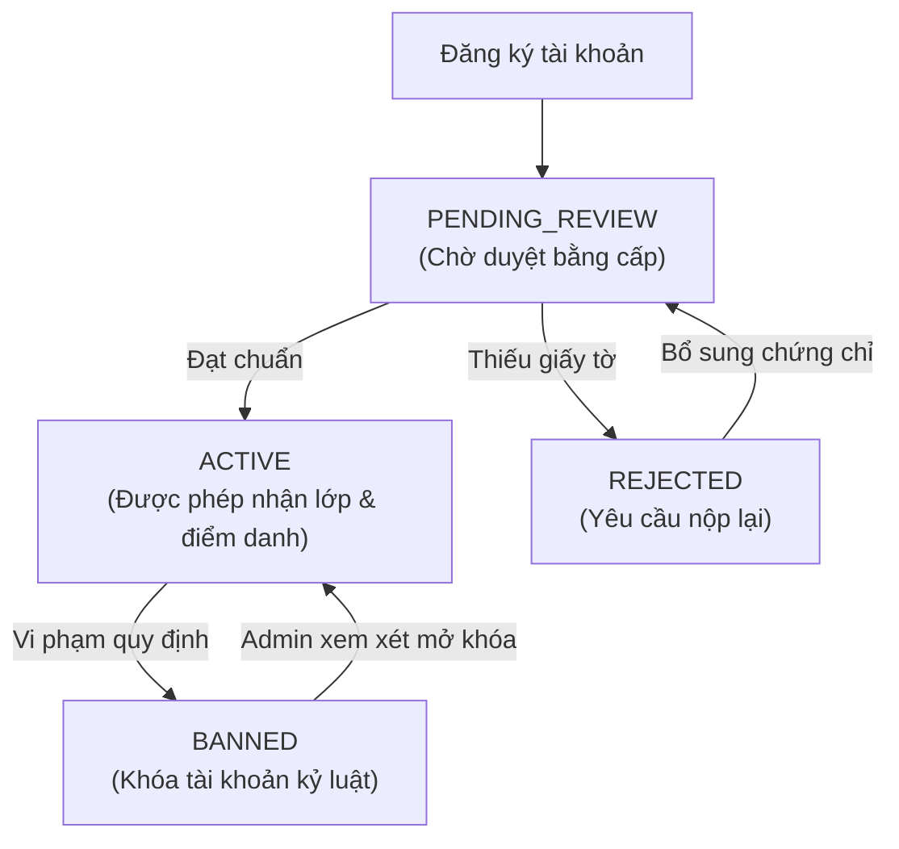
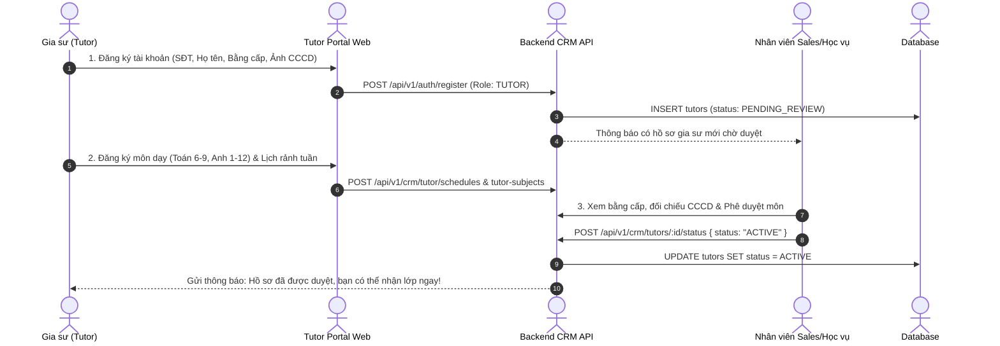

# ĐẶC TẢ NGHIỆP VỤ: HỒ SƠ GIA SƯ & MA TRẬN LỊCH RẢNH (TUTOR PORTAL)

> **Mã phân hệ:** TUT-01 / TUT-02  
> **Đối tượng sử dụng:** Gia sư (Tutor), Nhân viên Sales / Học vụ (CRM)  
> **Cổng truy cập:** `http://localhost:5173/tutor` (Menu Hồ sơ cá nhân & Lịch rảnh)

---

## 1. Mục Tiêu Nghiệp Vụ
Để nâng cao uy tín của trung tâm và bảo vệ chất lượng giảng dạy cho phụ huynh, gia sư gia nhập hệ thống phải trải qua quy trình xác thực danh tính, chuyên môn sư phạm và đăng ký thời gian biểu rõ ràng.

---

## 2. Quản Lý Hồ Sơ Gia Sư & Trạng Thái Tài Khoản



### 1.1. Sơ đồ tuần tự (Sequence Diagram) - Luồng Đăng Ký & Xét Duyệt Gia Sư



### 2.1. Các thông tin trong hồ sơ gia sư:
* **Thông tin cá nhân**: Họ và tên, Ngày sinh, Giới tính, Số điện thoại (dùng đăng nhập), Email.
* **Xác thực danh tính**: Số CCCD/Hộ chiếu (mã hóa bảo mật trong CSDL, chỉ hiển thị 4 số cuối cho nhân viên), ảnh chụp 2 mặt CCCD.
* **Trình độ học vấn**:
  * Trường Đại học đang học hoặc đã tốt nghiệp (ví dụ: ĐH Sư Phạm Hà Nội, ĐH Bách Khoa).
  * Chuyên ngành đào tạo (Toán học, Sư phạm Tiếng Anh...).
  * Năm tốt nghiệp / Sinh viên năm mấy.
  * Tải lên ảnh chụp Thẻ sinh viên, Bằng cử nhân, Chứng chỉ ngoại ngữ (IELTS, TOEIC...).
* **Khu vực nhận dạy**: Chọn các Quận/Huyện sẵn sàng di chuyển (ví dụ: Cầu Giấy, Nam Từ Liêm, Đống Đa...).

### 2.2. Danh mục Môn dạy được duyệt (`tutor_subjects`) — Quy tắc BR-MAT-01
* Gia sư đăng ký các môn mình có khả năng giảng dạy kèm cấp lớp (ví dụ: Toán lớp 6-9, Tiếng Anh lớp 1-12, Vật lý 10-12).
* **Quy tắc vàng BR-MAT-01**: Gia sư **chỉ được phép ứng tuyển những lớp có Môn học và Cấp lớp nằm trong danh mục đã được Admin duyệt**. Không được tự ý nhận các môn không có chứng minh năng lực.

---

## 3. Ma Trận Lịch Rảnh Hàng Tuần (`tutor_schedules`)

Lịch rảnh là dữ liệu đầu vào cốt lõi để **Thuật toán Khớp lớp tự động (Matching Engine)** hoạt động.

```text
┌──────────────┬──────────────┬──────────────┬──────────────┐
│ Thứ trong tuần│  Sáng (8-12h)│ Chiều (14-18)│ Tối (18-22h) │
├──────────────┼──────────────┼──────────────┼──────────────┤
│ Thứ Hai      │      [ ]     │      [ ]     │     [ X ]    │
│ Thứ Ba       │      [ ]     │     [ X ]    │     [ X ]    │
│ Thứ Tư       │      [ ]     │      [ ]     │     [ X ]    │
│ Thứ Năm      │     [ X ]    │      [ ]     │     [ X ]    │
│ Thứ Sáu      │      [ ]     │      [ ]     │     [ X ]    │
│ Thứ Bảy      │     [ X ]    │     [ X ]    │     [ X ]    │
│ Chủ Nhật     │     [ X ]    │     [ X ]    │      [ ]     │
└──────────────┴──────────────┴──────────────┴──────────────┘
```

### 3.1. Cơ chế cập nhật và kiểm tra tự động
* Gia sư có thể tích chọn các khung giờ rảnh cố định trong tuần theo từng ca hoặc chọn chi tiết từng khung 2 tiếng (ví dụ: 19h00 - 21h00).
* **Tự động đồng bộ với lớp đang dạy**: Khi gia sư nhận một lớp chính thức có lịch dạy vào Tối Thứ 3 và Tối Thứ 5, hệ thống sẽ **tự động chuyển khung giờ đó sang trạng thái BẬN** để không bao giờ gợi ý nhận lớp trùng giờ nữa.

---

## 4. Xếp Hạng Gia Sư & Quy Chế Kỷ Luật (Rating & Penalties)

* **Điểm xếp hạng sao (Rating)**: Tính trung bình cộng của tất cả các buổi dạy đã được phụ huynh chấm sao (thang điểm từ 1.0 đến 5.0).
* **Cảnh báo chất lượng giảng dạy (BR-PEN-01)**:
  * Nếu gia sư nhận đánh giá $\le 2$ sao trong **2 buổi học liên tiếp**, hệ thống tự động bắn còi Alert đỏ tới Học vụ để khảo sát và có thể chuyển lớp cho gia sư khác.
* **Khóa tài khoản do bỏ lớp (BR-PEN-02)**:
  * Gia sư tự ý nghỉ dạy không báo trước hoặc bỏ lớp giữa chừng sẽ bị hệ thống **khóa tài khoản 30 ngày (lần 1)** hoặc **vĩnh viễn (tái phạm)**.

---

## 5. Danh Sách Mã Lỗi Phục Vụ Dev & QA

| Mã lỗi (Error Code) | HTTP Status | Nguyên nhân | Hướng xử lý |
| :--- | :---: | :--- | :--- |
| `TUTOR_NOT_ACTIVE` | 403 | Hồ sơ gia sư đang ở trạng thái `PENDING_REVIEW` hoặc `BANNED`. | Nhắc gia sư chờ trung tâm duyệt hồ sơ. |
| `SUBJECT_NOT_APPROVED` | 400 | Đăng ký môn dạy nhưng chưa được trung tâm phê duyệt chứng chỉ. | Nộp thêm ảnh bằng cấp liên quan. |
| `SCHEDULE_UPDATE_CONFLICT` | 400 | Tắt khung giờ rảnh nhưng khung giờ đó đang có lớp học chính thức đang dạy. | Phải xin dời lịch lớp học trước. |
| `IDENTITY_NUMBER_DUPLICATED` | 409 | Số CCCD này đã được đăng ký bởi một tài khoản gia sư khác. | Kiểm tra lại số CCCD hoặc liên hệ hỗ trợ. |
