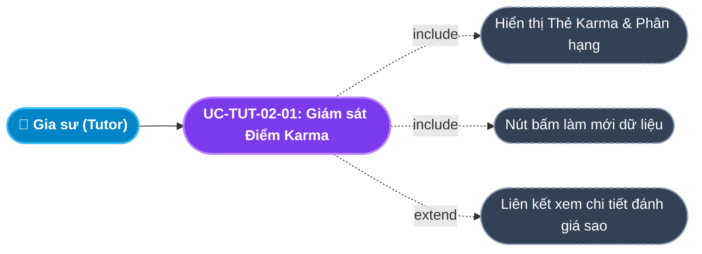
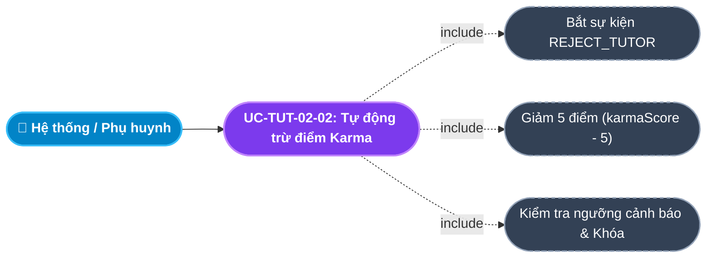
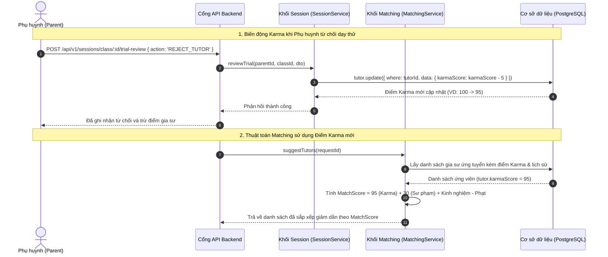

# Usecase: UC-TUT-02 - Hệ thống Điểm Tín nhiệm Karma & Xếp hạng Gia sư (Karma Score System)

## 1. Giới thiệu chức năng
- **Mục đích**: Thiết lập cơ chế tự động quản trị hành vi và xếp hạng tín nhiệm gia sư (Tutor Karma Score System) trên Cổng Đối tác Gia sư (Tutor Portal). Điểm Karma phản ánh trung thực mức độ tin cậy, tác phong giảng dạy và lịch sử gắn bó của gia sư với học sinh. Điểm số này là trọng số cốt lõi trong thuật toán gợi ý gia sư (Smart Matching Algorithm) trên CRM Admin và Client Portal. Hệ thống tự động thưởng điểm khi gia sư hoàn thành tốt các buổi dạy, nhận đánh giá 5 sao từ phụ huynh, đồng thời trừ điểm nghiêm khắc khi có hành vi vi phạm kỷ luật (đến muộn, bỏ dạy, phát sinh khiếu nại), từ đó tự động phân tầng quyền lợi nhận lớp và kích hoạt chế tài khóa tài khoản gian lận.
- **Actor (Tác nhân)**: Gia sư (Tutor), Phụ huynh (Parent), Thuật toán Gợi ý (Smart Matching Engine), Học vụ & Admin.
- **Điều kiện tiên quyết**: Gia sư đã được kích hoạt tài khoản `ACTIVE` với điểm khởi tạo ban đầu là 100 điểm (`karmaScore = 100`).

### Danh mục các chức năng con (Sub-features):
1. **UC-TUT-02-01: Giám sát Điểm tín nhiệm Karma thời gian thực**: Xem điểm Karma hiện tại trên Dashboard, phân loại thứ hạng (Ưu tú, Tiêu chuẩn, Cảnh báo) và lịch sử biến động.
2. **UC-TUT-02-02: Cơ chế Tự động Thưởng điểm (Karma Rewards)**: Tự động cộng điểm khi phụ huynh phê duyệt dạy thử thành công, đánh giá 5 sao hoặc hoàn thành các mốc buổi học liên tục không khiếu nại.
3. **UC-TUT-02-03: Cơ chế Tự động Trừ điểm & Xử phạt (Karma Penalties)**: Tự động trừ điểm khi bị phụ huynh từ chối dạy thử do lỗi gia sư (`-5` điểm), thu hẹp quy mô (`-2` điểm), phát sinh khiếu nại buổi học (`-20` điểm khi Học vụ xác minh có lỗi).
4. **UC-TUT-02-04: Tích hợp Trọng số Karma vào thuật toán Smart Matching**: Sử dụng điểm Karma làm hệ số ưu tiên cao nhất (tối đa 100 điểm) để xếp hạng ứng viên hàng đầu hiển thị cho Phụ huynh và Sales lựa chọn.
5. **UC-TUT-02-05: Kích hoạt chế tài hạn chế & Khóa tài khoản tự động (Blacklist Trigger)**: Khi điểm Karma giảm dưới các ngưỡng cảnh báo (< 50 điểm: giới hạn nhận lớp; < 20 điểm: khóa tài khoản vĩnh viễn).

---

## 2. Dữ liệu nghiệp vụ đầu vào (Input Data & Parameters)

### 2.1. Dữ liệu Thuộc tính Tín nhiệm Gia sư (Tutor Reputation Data)
| Tên trường | Kiểu dữ liệu | Giá trị mặc định | Ý nghĩa nghiệp vụ & Ràng buộc từ Code |
|---|---|---|---|
| `Điểm uy tín Karma` (karmaScore) | Số nguyên (Integer) | `100` | Thang điểm đo lường độ tin cậy. Khởi tạo: 100. Điểm tối đa không giới hạn, ngưỡng tối thiểu: 0. |
| `Đánh giá sao trung bình` (ratingAvg) | Số thập phân (Decimal 3,2) | `5.00` | Điểm đánh giá trung bình từ các phản hồi của phụ huynh sau các buổi học và khóa học. |
| `Trạng thái tài khoản` (status) | Enum / String | `ACTIVE` | `ACTIVE` (Hoạt động), `PENDING_REVIEW` (Chờ duyệt), `BANNED` (Bị khóa do Karma rơi xuống đáy hoặc gian lận). |

### 2.2. Ma trận Quy chuẩn Biến động Điểm Karma (Karma Change Matrix)
| Hành vi / Sự kiện nghiệp vụ | Biến động Karma | Căn cứ xử lý từ Code | Hệ quả tài khoản |
|---|---|---|---|
| **Khởi tạo tài khoản mới** | **Gán $100$ điểm** | `schema.prisma: karmaScore = 100` | Mức tín nhiệm cơ sở ban đầu. |
| **Phụ huynh chốt nhận lớp (`ACCEPT`)** | **$+10$ điểm** | Sau đợt dạy thử thành công. | Tăng uy tín ghép lớp nhanh. |
| **Đánh giá 5 sao từ phụ huynh** | **$+2$ điểm** | Tại API `parentConfirmSession`. | Tăng điểm hiển thị trên profile. |
| **Dạy thử thất bại do lỗi gia sư (`REJECT_TUTOR`)** | **$-5$ điểm** | `session.service.ts: karmaChange = -5` | Cảnh cáo tác phong chuyên môn. |
| **Phụ huynh thu hẹp quy mô (`SCALE_DOWN`)** | **$-2$ điểm** | `session.service.ts: karmaChange = -2` | Ảnh hưởng nhẹ do giảm số buổi. |
| **Buổi học bị xác minh khiếu nại (`DISPUTED`)** | **$-20$ điểm** | `matching.service.ts: totalDisputes * 20` | Trừ nặng trong thuật toán Matching. |
| **Tự ý bỏ lớp / Hủy sau khi nhận cọc** | **$-50$ điểm** | Xử lý vi phạm hợp đồng nhận cọc. | Tịch thu cọc và tụt hạng nghiêm trọng. |

---

## 3. Quy tắc nghiệp vụ (Business Rules)

| Mã Quy tắc | Tình huống nghiệp vụ | Cách hệ thống xử lý | Thông báo hiển thị cho người dùng |
|---|---|---|---|
| **BR-TUT-02-01** | **Khởi tạo chuẩn mực 100 điểm**: Gia sư vừa được duyệt hồ sơ `ACTIVE`. | CSDL mặc định gán `karmaScore = 100`. | Điểm uy tín ban đầu: 100/100 |
| **BR-TUT-02-02** | **Công thức tính điểm Match Score trong thuật toán Matching**: Hệ thống chấm điểm ứng viên cho yêu cầu tìm gia sư. | `MatchScore = karmaScore + qualificationBonus (15-30) + successfulSessions * 0.5 - (totalDisputes * 20)`. Karma chiếm trọng số nền tảng lớn nhất. | Hiển thị Match Score trên giao diện Admin/Sales |
| **BR-TUT-02-03** | **Chế tài Hạng Cảnh Báo ($20 \le \text{Karma} < 50$)**: Gia sư bị trừ điểm nhiều lần do vi phạm. | Hệ thống giới hạn: Gia sư chỉ được phép nhận tối đa **01 lớp học tại một thời điểm**; bị ẩn khỏi danh sách gợi ý ưu tiên. | "Tài khoản đang trong diện cảnh báo do điểm Karma thấp. Vui lòng hoàn thành tốt lớp học hiện tại." |
| **BR-TUT-02-04** | **Tự động đưa vào Danh sách đen ($\text{Karma} < 20$)**: Điểm Karma tụt xuống dưới 20 điểm. | Backend tự động đổi `tutor.status = 'BANNED'`. Khóa quyền truy cập sàn lớp và vô hiệu hóa số điện thoại trên hệ thống. | "Tài khoản của bạn đã bị khóa vĩnh viễn do điểm tín nhiệm dưới mức an toàn" |
| **BR-TUT-02-05** | **Hiển thị minh bạch trên Thẻ ứng viên**: Phụ huynh xem danh sách gia sư nộp đơn. | Điểm Karma được hiển thị trực quan dạng Badge tím cạnh tên gia sư để phụ huynh yên tâm lựa chọn. | Badge tím: Karma [Score] |

---

## 4. Đặc tả chi tiết các Use Case chức năng con (Sub-Use Cases Specification)

---

### 4.1. UC-TUT-02-01: Giám sát Điểm tín nhiệm Karma thời gian thực

#### Sơ đồ Use Case:

#### Bảng đặc tả nghiệp vụ:

| STT | Hạng mục | Nội dung chi tiết |
|:---:|---|---|
| **1** | **Thông tin chung** | - **UC ID**: `UC-TUT-02-01` - **UC Name**: Giám sát Điểm tín nhiệm Karma thời gian thực (Real-time Karma Monitoring) - **Actor**: Gia sư (Tutor) - **Mục tiêu**: Giúp gia sư nắm bắt điểm số uy tín của bản thân, thấu hiểu nguyên nhân biến động điểm và nỗ lực nâng cao chất lượng dạy học. - **Mô tả**: Xem thẻ Karma Score trên Tutor Portal, xem phân loại thứ hạng và truy cập bảng đánh giá chi tiết. - **Priority**: High |
| **2** | **Trigger** | Gia sư truy cập màn hình chính `/tutor`. |
| **3** | **Pre-condition** | Đã đăng nhập vào hệ thống với vai trò `TUTOR`. |
| **4** | **Post-condition** | Thẻ Karma hiển thị số điểm lớn màu xanh lá (`#71dd37`), tỷ lệ trên thang 100 và nút liên kết xem phản hồi. |
| **5** | **Main Flow** | 1. Gia sư vào Dashboard `/tutor`. 2. Client gửi request `GET /api/v1/crm/tutor/profile`. 3. Backend trả về thông tin gia sư kèm trường `karmaScore`. 4. Thẻ Karma hiển thị: Tiêu đề có icon Huy chương `Award`, nhãn `Điểm Uy Tín (Karma)`, điểm số hiển thị to rõ (ví dụ: `100 / 100`). 5. Cung cấp nút liên kết nhanh `Xem Đánh Giá` chuyển hướng sang `/tutor/reviews`. 6. Có nút icon `RefreshCw` để nạp lại số liệu mới nhất khi cần. |
| **6** | **Alternative / Exception Flow** | - **AF-01 (Bấm làm mới)**: Click icon xoay $\rightarrow$ Gọi lại `fetchTutorData()` cập nhật điểm sau khi vừa có buổi học được duyệt. |
| **7** | **Business Rules & Validation** | - Điểm Karma đọc trực tiếp từ CSDL không qua bộ đệm cũ để đảm bảo tính thời sự. |
| **8** | **Acceptance Criteria** | - **AC-01**: Hiển thị chính xác điểm số từ bảng `tutors` trong CSDL. - **AC-02**: Nhấn "Xem Đánh Giá" điều hướng đúng sang màn hình thống kê phản hồi phụ huynh. |

---

### 4.2. UC-TUT-02-02: Tự động trừ điểm Karma khi dạy thử thất bại (`REJECT_TUTOR`)

#### Sơ đồ Use Case:

#### Bảng đặc tả nghiệp vụ:

| STT | Hạng mục | Nội dung chi tiết |
|:---:|---|---|
| **1** | **Thông tin chung** | - **UC ID**: `UC-TUT-02-02` - **UC Name**: Tự động trừ điểm Karma khi vi phạm (Automatic Karma Penalty) - **Actor**: Hệ thống CRM (System), Phụ huynh - **Mục tiêu**: Tự động ghi nhận chế tài răn đe khi gia sư dạy không đạt yêu cầu trong đợt thử việc. - **Mô tả**: Khi phụ huynh bấm từ chối gia sư kèm lý do vi phạm, hệ thống tự động trừ 5 điểm Karma của gia sư trong giao dịch CSDL. - **Priority**: High |
| **2** | **Trigger** | Phụ huynh gửi yêu cầu đánh giá dạy thử với `action = 'REJECT_TUTOR'`. |
| **3** | **Pre-condition** | Lớp học đang ở trạng thái `TRIAL` và có liên kết với `tutorId`. |
| **4** | **Post-condition** | 1. Trường `karmaScore` của gia sư giảm 5 điểm. 2. Nếu điểm sau khi trừ $< 20$ $\rightarrow$ Kích hoạt khóa tài khoản `status = 'BANNED'`. |
| **5** | **Main Flow** | 1. Backend tiếp nhận request `POST /api/v1/sessions/class/:id/trial-review` với action `REJECT_TUTOR`. 2. Backend xác định `karmaChange = -5`. 3. Trong Prisma Transaction, thực hiện: `tx.tutor.update({ where: { id: tutorId }, data: { karmaScore: currentScore - 5 } })`. 4. Kiểm tra điểm mới: Nếu $\ge 20$, duy trì tài khoản; nếu $< 20$, cập nhật `status: 'BANNED'`. 5. Hoàn tất cập nhật CSDL. Gia sư kiểm tra Dashboard sẽ thấy điểm Karma giảm 5 điểm. |
| **6** | **Alternative / Exception Flow** | - **AF-01 (Trường hợp SCALE_DOWN)**: Nếu phụ huynh chọn giảm số buổi $\rightarrow$ Trừ nhẹ 2 điểm (`karmaChange = -2`). |
| **7** | **Business Rules & Validation** | - `BR-TUT-02-04`: Ngưỡng khóa tài khoản tự động là $< 20$ điểm. |
| **8** | **Acceptance Criteria** | - **AC-01**: Điểm Karma bị trừ đúng 5 điểm ngay khi phụ huynh bấm xác nhận từ chối gia sư. - **AC-02**: Điểm số mới cập nhật ngay trên giao diện Tutor Portal và ảnh hưởng trực tiếp đến thứ hạng gợi ý lớp mới. |

---

## 5. Sơ đồ tuần tự nghiệp vụ (Sequence Diagrams)

### 5.1. Sơ đồ: Biến động điểm Karma và Tác động tới Thuật toán Matching

---

## 6. Kịch bản kiểm thử & Nghiệm thu (Given / When / Then)

### Kịch bản 1: Gia sư mới bắt đầu với 100 điểm Karma trọn vẹn
- **Given**: Gia sư vừa được duyệt hồ sơ từ `PENDING_REVIEW` sang `ACTIVE`.
- **When**: Gia sư đăng nhập vào Tutor Portal lần đầu tiên.
- **Then**: Thẻ Điểm Uy Tín (Karma) hiển thị con số `100 / 100` màu xanh lá tươi kèm icon Huy chương.

### Kịch bản 2: Tự động trừ 5 điểm Karma khi dạy thử thất bại
- **Given**: Gia sư đang có điểm Karma là `100` điểm.
- **When**: Phụ huynh đánh giá sau buổi dạy thử chọn `"Đổi gia sư khác do chưa phù hợp"` (`REJECT_TUTOR`).
- **Then**: Điểm Karma của gia sư trong CSDL lập tức bị trừ 5 điểm còn `95` điểm. Khi gia sư bấm nút Refresh trên Dashboard, điểm số hiển thị cập nhật ngay thành `95`.

### Kịch bản 3: Tự động khóa tài khoản khi điểm Karma dưới 20 điểm
- **Given**: Gia sư liên tục vi phạm quy chế, điểm Karma hiện tại đang là `22` điểm.
- **When**: Gia sư tiếp tục bị phụ huynh từ chối dạy thử với lỗi tác phong (`-5` điểm), điểm tụt xuống còn `17` điểm.
- **Then**: Hệ thống tự động kích hoạt luật `BR-TUT-02-04`, cập nhật trạng thái gia sư thành `BANNED`. Gia sư bị đăng xuất và không thể tiếp tục nhận lớp trên sàn.
