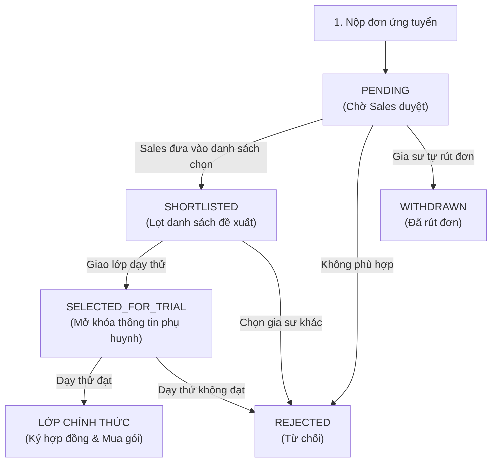
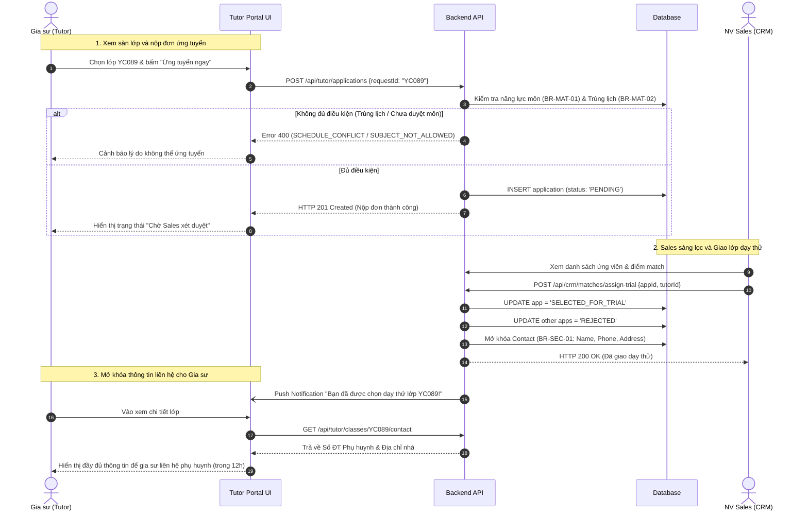

# ĐẶC TẢ NGHIỆP VỤ: ỨNG TUYỂN LỚP MỚI & SÀN LỚP ẨN DANH (TUTOR PORTAL)

> **Mã phân hệ:** TUT-03 / APPL-01  
> **Đối tượng sử dụng:** Gia sư (Tutor), Nhân viên Sales (CRM)  
> **Cổng truy cập:** `http://localhost:5173/tutor` (Menu Lớp mới tuyển)

---

## 1. Giao Diện Sàn Lớp Tuyển Công Khai (Class Job Board)

Gia sư sau khi hồ sơ được duyệt (`ACTIVE`) có quyền truy cập vào **Sàn lớp mới tuyển**. Mọi thông tin trên sàn đều tuân thủ nghiêm ngặt nguyên tắc **Ẩn danh bảo mật (BR-SEC-01)**:

```text
┌────────────────────────────────────────────────────────────────────────┐
│  MÔN TOÁN — LỚP 9 (ÔN THI VÀO 10)                           [MÃ: YC089]│
├────────────────────────────────────────────────────────────────────────┤
│  📍 Khu vực: Quận Cầu Giấy, Hà Nội (Gần đường Xuân Thủy)               │
│  ⏰ Lịch học: 2 buổi/tuần (Tối Thứ 3 & Thứ 6, từ 19:00 đến 21:00)       │
│  💰 Thù lao gia sư: 250,000 VNĐ / buổi 2 tiếng                         │
│  🎯 Yêu cầu: Sinh viên ĐH Sư Phạm / KHTN, có kinh nghiệm luyện thi vào 10│
│  📝 Ghi chú học sinh: Học lực khá, cần luyện các dạng toán hình học khó │
│                                                                        │
│  [ ỨNG TUYỂN NGAY ]                      (Đã có 4 gia sư nộp hồ sơ)    │
└────────────────────────────────────────────────────────────────────────┘
```
*(Gia sư KHÔNG BAO GIỜ thấy số điện thoại, họ tên hay địa chỉ nhà cụ thể của phụ huynh ở bước này).*

---

## 2. Vòng Đời Đơn Ứng Tuyển (Application Lifecycle)



### 2.1. Sơ đồ tuần tự: Ứng tuyển & Mở khóa thông tin dạy thử (Sequence Diagram)



---

## 3. Các Điều Kiện Kiểm Tra Khi Bấm "Ứng Tuyển" (Validation Rules)

Khi gia sư nhấn nút **"Ứng tuyển lớp này"**, hệ thống chạy hàng loạt kiểm tra tự động trước khi ghi nhận đơn:

### 3.1. Kiểm tra năng lực môn dạy (Rule BR-MAT-01)
* Môn học và Cấp lớp của yêu cầu tuyển phải nằm trong danh mục môn dạy đã được phê duyệt của gia sư (`tutor_subjects`).
* Nếu gia sư chưa được duyệt môn này, hệ thống chặn lại với lỗi `SUBJECT_NOT_ALLOWED`.

### 3.2. Kiểm tra chống trùng lịch thời gian (Rule BR-MAT-02)
* Khung giờ học của lớp mới không được phép giao cắt với:
  1. Lịch của các lớp gia sư **đang dạy chính thức** (`class_schedules`).
  2. Lịch của các lớp gia sư **đã nhận dạy thử** (`TRIAL_PENDING`).
* Nếu có bất kỳ sự trùng lặp nào, hệ thống từ chối nộp đơn với mã lỗi `SCHEDULE_CONFLICT` và hiển thị chi tiết khung giờ đang bị trùng.

### 3.3. Kiểm tra tính trùng lặp đơn
* Một gia sư chỉ được nộp đơn **duy nhất 1 lần** cho 1 yêu cầu tìm gia sư.

---

## 4. Quy Trình Giao Dạy Thử & Mở Khóa Thông Tin (BR-MAT-03 & BR-SEC-01)

1. **Sàng lọc ứng viên**: Nhân viên Sales xem danh sách các gia sư nộp đơn, xem điểm tương thích (%) do hệ thống chấm và chọn tối đa **3 gia sư** vào vòng cân nhắc.
2. **Giao lớp dạy thử (Trial Assignment)**:
   * Sales quyết định chọn **1 gia sư duy nhất** để thực hiện buổi dạy thử đầu tiên. Đơn ứng tuyển của gia sư này chuyển sang `SELECTED_FOR_TRIAL`.
   * Các đơn ứng tuyển của các gia sư khác tạm thời chuyển sang trạng thái chờ hoặc bị từ chối (`REJECTED`).
3. **Mở khóa thông tin liên hệ**:
   * Ngay khi chuyển sang `SELECTED_FOR_TRIAL`, hệ thống mới **chính thức mở khóa**: Họ tên phụ huynh, Số điện thoại phụ huynh và Địa chỉ nhà cụ thể cho đúng gia sư này trên Tutor Portal.
   * Gia sư có trách nhiệm gọi điện cho phụ huynh trong vòng **12 giờ** để chào hỏi và thống nhất ngày dạy thử đầu tiên.

### 4.4. Quy chế khi Dạy thử Thất bại (BR-MAT-04)
* Nếu sau buổi dạy thử, phụ huynh phản hồi không hài lòng và từ chối nhận gia sư:
  * Lớp chuyển sang `TRIAL_FAILED`.
  * Hệ thống **thu hồi ngay lập tức** quyền xem số điện thoại và địa chỉ nhà phụ huynh của gia sư này.
  * Lương 1 buổi dạy thử của gia sư (nếu có dạy đủ giờ) được trung tâm đối soát chi trả.

---

## 5. Danh Sách Mã Lỗi Phục Vụ Dev & QA

| Mã lỗi (Error Code) | HTTP Status | Nguyên nhân | Hướng xử lý |
| :--- | :---: | :--- | :--- |
| `SUBJECT_NOT_ALLOWED` | 400 | Gia sư chưa được phê duyệt dạy môn học hoặc cấp lớp này. | Nộp chứng chỉ bổ sung môn dạy. |
| `SCHEDULE_CONFLICT` | 400 | Khung giờ của lớp tuyển trùng với lịch dạy lớp khác của bạn. | Không thể nhận 2 lớp cùng giờ. |
| `ALREADY_APPLIED` | 409 | Gia sư đã nộp đơn vào yêu cầu này rồi. | Theo dõi đơn trong mục "Đơn đã nộp". |
| `REQUEST_CLOSED` | 400 | Lớp này đã đủ người hoặc đã đóng tuyển dụng. | Chọn lớp khác trên sàn. |
