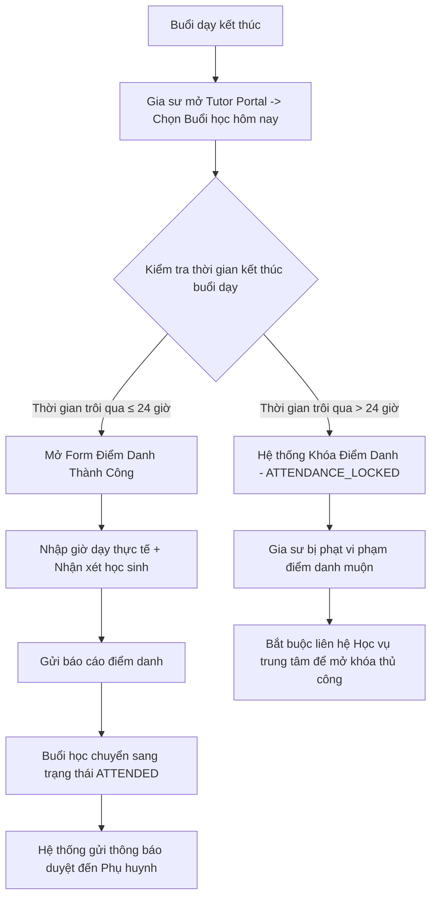
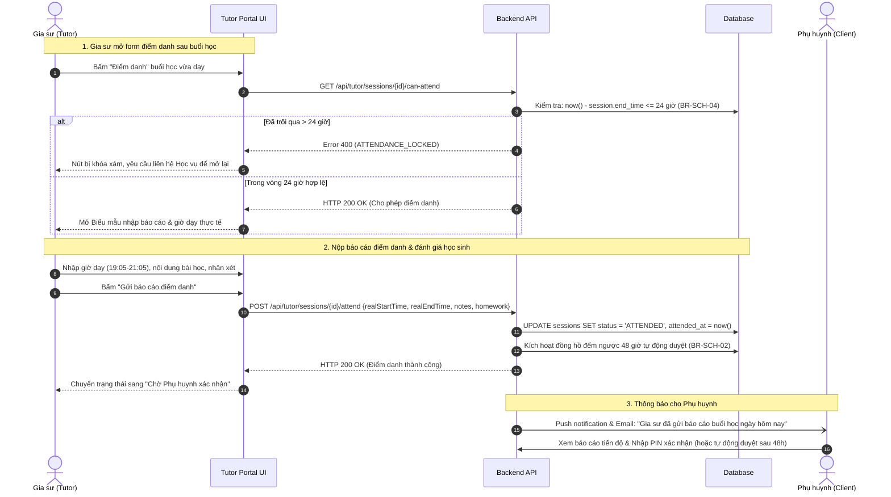

# ĐẶC TẢ NGHIỆP VỤ: ĐIỂM DANH BUỔI DẠY & BÁO CÁO TIẾN ĐỘ (TUTOR PORTAL)

> **Mã phân hệ:** TUT-04 / SES-02  
> **Đối tượng sử dụng:** Gia sư (Tutor)  
> **Cổng truy cập:** `http://localhost:5173/tutor` (Menu Buổi học hôm nay / Điểm danh)

---

## 1. Mục Tiêu Nghiệp Vụ
Điểm danh là hành động then chốt để gia sư chứng minh đã hoàn thành buổi giảng dạy. Báo cáo điểm danh không chỉ ghi nhận thời gian thực tế mà còn là cầu nối minh bạch giúp phụ huynh theo dõi sát sao sự tiến bộ từng ngày của con mình.

---

## 2. Quy Tắc Khóa Điểm Danh Trong 24 Giờ (Business Rule BR-SCH-04)

### 2.1. Sơ đồ tuần tự: Điểm danh & Kích hoạt đếm ngược 48h (Sequence Diagram)

### 2.1. Lý do áp dụng giới hạn 24 giờ:
* Tránh tình trạng gia sư để dồn 1-2 tuần hoặc cuối tháng mới điểm danh một thể, dẫn đến việc phụ huynh không còn nhớ chính xác ngày đó con có học hay không, gây tranh chấp tài chính.
* Đảm bảo tính tươi mới của nhận xét học tập: vừa dạy xong, nhận xét sẽ bám sát thực tế nhất.

---

## 3. Nội Dung Biểu Mẫu Điểm Danh (Attendance Form)

Gia sư chọn buổi học tương ứng trong danh sách lịch dạy và hoàn thiện các mục:
1. **Thời gian giảng dạy thực tế**:
   * Giờ bắt đầu thực tế (ví dụ: `19:05`).
   * Giờ kết thúc thực tế (ví dụ: `21:05`).
   * Tổng thời lượng: Phải đạt tối thiểu thời lượng theo quy định của lớp (thông thường là 120 phút).
2. **Nội dung bài học đã truyền đạt**:
   * Ví dụ: *"Chương 3: Phương trình bậc hai một ẩn và Định lý Vi-ét. Đã hoàn thành lý thuyết và chữa 10 bài tập cơ bản."*
3. **Đánh giá & Nhận xét thái độ của học sinh**:
   * Mức độ tập trung (Tập trung / Trung bình / Mất tập trung).
   * Điểm mạnh / Kiến thức con đã nắm vững.
   * Lỗ hổng kiến thức con cần ôn lại thêm.
4. **Bài tập về nhà giao cho con**:
   * Ghi rõ bài tập trong sách giáo khoa hoặc link tài liệu giao cho con làm trước buổi sau.
5. **Minh chứng hình ảnh (Tùy chọn)**:
   * Cho phép chụp ảnh phiếu bài tập con đã làm trên lớp, bảng viết hoặc vở ghi chép.

---

## 4. Xử Lý Sau Khi Nộp Điểm Danh

* **Trạng thái buổi học**: Lập tức chuyển từ `SCHEDULED` $\rightarrow$ `ATTENDED`.
* **Kích hoạt đồng hồ đếm ngược 48 giờ**: Phụ huynh có đúng 48 giờ để xác nhận (Mã PIN) hoặc khiếu nại (Dispute).
* **Nếu quá 24h gia sư quên điểm danh**:
  * Nút "Điểm danh" bị mờ đi và chuyển sang màu xám.
  * Khi bấm vào, hiển thị thông báo lỗi: *"Buổi dạy đã kết thúc quá 24 giờ. Hệ thống đã khóa điểm danh tự động. Vui lòng liên hệ bộ phận Học vụ để được hỗ trợ đối soát."*

---

## 5. Danh Sách Mã Lỗi Phục Vụ Dev & QA

| Mã lỗi (Error Code) | HTTP Status | Nguyên nhân | Hướng xử lý |
| :--- | :---: | :--- | :--- |
| `ATTENDANCE_LOCKED` | 400 | Quá 24 giờ kể từ thời điểm tan học. | Liên hệ Admin/Học vụ để giải trình. |
| `SESSION_NOT_STARTED` | 400 | Điểm danh trước khi buổi học bắt đầu theo lịch. | Dạy xong mới được điểm danh. |
| `DURATION_INSUFFICIENT` | 422 | Thời lượng dạy thực tế dưới mức tối thiểu quy định (ví dụ < 60 phút). | Nhập lại đúng giờ thực tế hoặc ghi rõ lý do. |
| `ALREADY_ATTENDED` | 409 | Buổi học này đã được điểm danh rồi. | Chờ phụ huynh xác nhận. |
