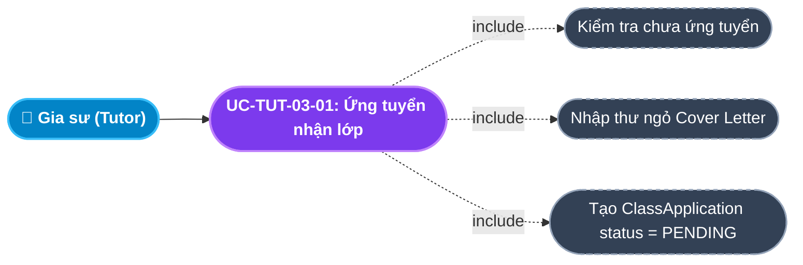
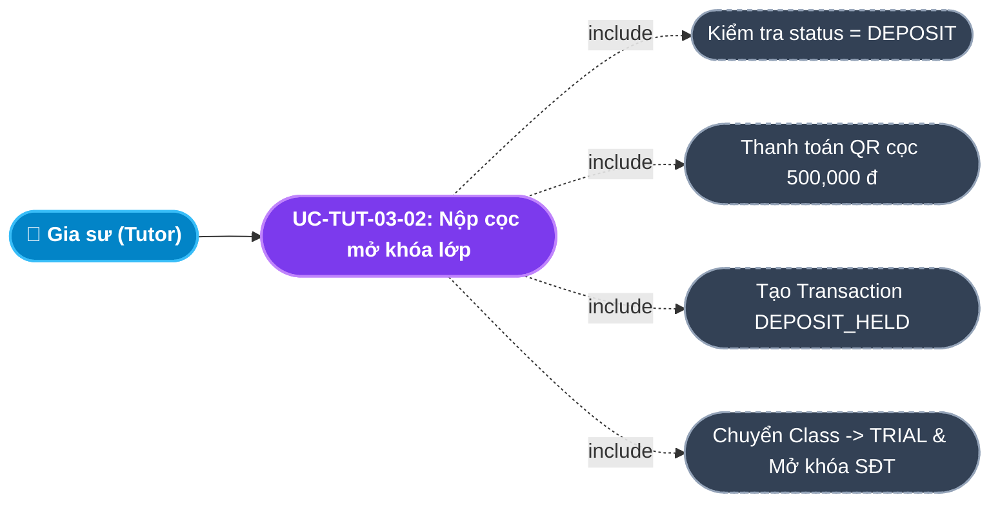
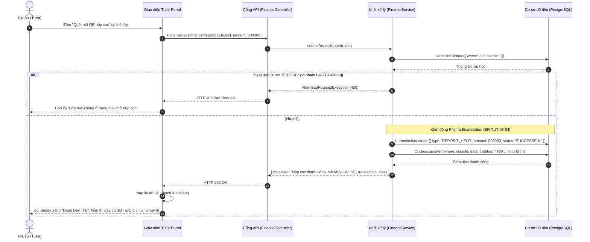

# Usecase: UC-TUT-03 - Bảng tin Tuyển dụng, Ứng tuyển & Nộp cọc Nhận lớp (Job Board & Deposit)

## 1. Giới thiệu chức năng
- **Mục đích**: Cung cấp sàn giao dịch việc làm gia sư công khai, minh bạch trên Cổng Đối tác Gia sư (Tutor Portal). Gia sư có thể tra cứu các lớp học đang mở tuyển (`PUBLISHED`), xem trước yêu cầu môn học, khối lớp, lịch dạy, số buổi/tuần và mức thù lao đề xuất. Để đảm bảo trách nhiệm và chống tình trạng nhận lớp rồi bỏ ngang, hệ thống áp dụng cơ chế Ký quỹ cam kết (Commitment Deposit): Sau khi được phụ huynh/Sales duyệt dạy thử, lớp chuyển sang trạng thái chờ nộp cọc (`DEPOSIT`). Gia sư nộp tiền cọc 500,000 đ qua cổng thanh toán QR; hệ thống tự động ghi nhận giao dịch `DEPOSIT_HELD`, chuyển trạng thái lớp sang `TRIAL` và mở khóa toàn bộ số điện thoại cùng địa chỉ chi tiết của phụ huynh.
- **Actor (Tác nhân)**: Gia sư (Tutor), Phụ huynh (Parent), Tư vấn viên (Sales), Kế toán (Accountant).
- **Điều kiện tiên quyết**: Gia sư có tài khoản ở trạng thái `ACTIVE` (đã xác thực CCCD và bằng cấp) và điểm uy tín Karma $\ge 50$.

### Danh mục các chức năng con (Sub-features):
1. **UC-TUT-03-01: Xem Bảng tin tuyển dụng lớp học (Browse Published Jobs)**: Tra cứu danh sách các lớp đang mở tuyển, thông tin môn học, số buổi/tuần, thù lao, lịch dạy (đã ẩn danh SĐT và số nhà cụ thể).
2. **UC-TUT-03-02: Nộp đơn ứng tuyển lớp dạy (Apply for Class Request)**: Gia sư viết thư ngỏ (Cover letter) giới thiệu kinh nghiệm và nộp đơn ứng tuyển vào lớp mong muốn.
3. **UC-TUT-03-03: Nhận thông báo trúng tuyển & Yêu cầu nộp cọc**: Khi được chọn, lớp xuất hiện trên Dashboard gia sư với trạng thái `DEPOSIT` kèm yêu cầu nộp cọc 500,000 đ.
4. **UC-TUT-03-04: Nộp cọc nhận lớp & Mở khóa thông tin liên hệ (Submit Deposit & Unlock Info)**: Gia sư thanh toán cọc qua QR; hệ thống tự động chuyển lớp sang `TRIAL`, ghi nhận giao dịch `DEPOSIT_HELD` và hiển thị đầy đủ SĐT, địa chỉ nhà phụ huynh.
5. **UC-TUT-03-05: Chặn ứng tuyển trùng lặp & Ràng buộc chuyên môn**: Tự động chặn gia sư nộp đơn 2 lần vào 1 lớp hoặc nộp đơn khi tài khoản chưa được duyệt.

---

## 2. Dữ liệu nghiệp vụ đầu vào (Input Data & Parameters)

### 2.1. Dữ liệu Đơn Ứng tuyển Lớp học (Apply Request Data)
| Tên trường | Kiểu dữ liệu | Tính chất | Ý nghĩa nghiệp vụ & Ràng buộc thực tế từ Code |
|---|---|---|---|
| `Mã yêu cầu tìm gia sư` (id / tutorRequestId) | UUID | Bắt buộc (URL Param) | Định danh bản ghi `tutorRequest` có trạng thái `PUBLISHED` hoặc `CONSULTING`. |
| `Thư ngỏ ứng tuyển` (coverLetter) | Văn bản (Text) | Tùy chọn | Lời giới thiệu kinh nghiệm giảng dạy, thành tích học sinh cũ gửi tới phụ huynh. Tối đa 1000 ký tự. |

### 2.2. Dữ liệu Nộp cọc Nhận lớp (Tutor Deposit Data)
| Tên trường | Kiểu dữ liệu | Tính chất | Ý nghĩa nghiệp vụ & Ràng buộc thực tế từ Code |
|---|---|---|---|
| `Mã lớp học` (classId) | UUID | Bắt buộc | Lớp học đang ở trạng thái `DEPOSIT`. |
| `Số tiền cọc` (amount) | Số (Decimal/Number) | Bắt buộc | Định mức tiền cọc cam kết: Mặc định là `500,000 đ` (hoặc tính theo quy mô lớp). |

### 2.3. Bảng trạng thái Lớp học trong tiến trình Nhận lớp (Class Lifecycle)
| Trạng thái Lớp (Enum) | Nhãn hiển thị | Màu sắc Badge | Ý nghĩa nghiệp vụ |
|---|---|---|---|
| `OPEN` | Đang tuyển | Xanh dương (`#e7e7ff`) | Lớp học đang công khai chờ gia sư nộp đơn ứng tuyển. |
| `DEPOSIT` | Chờ Nộp Cọc | Vàng cam (`#fff8e1` / `#ffab00`) | Gia sư đã được chọn; hệ thống yêu cầu nộp cọc 500,000 đ trong 24h. |
| `TRIAL` | Đang Dạy Thử | Tím xanh (`#e7e7ff` / `#696cff`) | Đã nộp cọc thành công; thông tin phụ huynh được mở khóa để bắt đầu dạy thử. |
| `TEACHING` | Đang Giảng Dạy | Xanh lá (`#e8fadf` / `#71dd37`) | Dạy thử thành công; chuyển cọc thành phí và học chính thức. |
| `CLOSED` | Đã Đóng / Hủy | Đỏ nhạt (`#ffe0db` / `#ff3e1d`) | Lớp bị hủy hoặc hoàn tất chu kỳ. |

---

## 3. Quy tắc nghiệp vụ (Business Rules)

| Mã Quy tắc | Tình huống nghiệp vụ | Cách hệ thống xử lý | Thông báo hiển thị cho người dùng |
|---|---|---|---|
| **BR-TUT-03-01** | **Chống ứng tuyển trùng lặp**: Gia sư đã nộp đơn nhưng cố tình gửi lại đơn thứ 2 vào cùng 1 yêu cầu. | Prisma kiểm tra `unique([tutorRequestId, tutorId])`. Nếu tồn tại $\rightarrow$ Trả HTTP 400. | "Bạn đã nộp đơn ứng tuyển cho lớp học này rồi" |
| **BR-TUT-03-02** | **Chặn ứng tuyển khi lớp đã đóng**: Yêu cầu đã chuyển sang `MATCHED` hoặc `CANCELLED`. | Backend kiểm tra trạng thái yêu cầu $\rightarrow$ Ném `BadRequestException` (HTTP 400). | "Lớp học đã đóng hoặc đã được ghép gia sư" |
| **BR-TUT-03-03** | **Bắt buộc nộp cọc đúng lớp DEPOSIT**: Gia sư nộp cọc cho lớp không ở trạng thái `DEPOSIT`. | Backend kiểm tra `class.status !== ClassStatus.DEPOSIT` $\rightarrow$ Từ chối giao dịch. | "Lớp học này không ở trạng thái chờ nộp cọc" |
| **BR-TUT-03-04** | **Cơ chế Mở khóa thông tin phụ huynh (Atomic Unlock)**: Gia sư thanh toán cọc 500,000 đ thành công. | Chạy Prisma Transaction: 1. Tạo bản ghi `Transaction` loại `DEPOSIT_HELD` 500k; 2. Cập nhật `class.status = 'TRIAL'`, gán `tutorId`; 3. Mở khóa toàn bộ SĐT và địa chỉ chi tiết của phụ huynh. | "Nộp cọc thành công, hệ thống đã mở khóa thông tin liên hệ phụ huynh." |
| **BR-TUT-03-05** | **Thời hạn liên hệ sau khi mở khóa**: Sau khi nộp cọc và nhận được SĐT phụ huynh. | Gia sư có trách nhiệm gọi điện liên hệ phụ huynh trong vòng **2 giờ** để hẹn lịch buổi dạy thử đầu tiên. | "Vui lòng gọi điện liên hệ với phụ huynh trong vòng 2 giờ!" |

---

## 4. Đặc tả chi tiết các Use Case chức năng con (Sub-Use Cases Specification)

---

### 4.1. UC-TUT-03-01: Nộp đơn ứng tuyển lớp dạy (Apply for Class Request)

#### Sơ đồ Use Case:

#### Bảng đặc tả nghiệp vụ:

| STT | Hạng mục | Nội dung chi tiết |
|:---:|---|---|
| **1** | **Thông tin chung** | - **UC ID**: `UC-TUT-03-01` - **UC Name**: Nộp đơn ứng tuyển lớp dạy (Apply for Class Request) - **Actor**: Gia sư (Tutor) - **Mục tiêu**: Bày tỏ nguyện vọng nhận lớp và giới thiệu năng lực bản thân tới phụ huynh và chuyên viên điều phối Sales. - **Mô tả**: Xem chi tiết tin tuyển tại `/tutor/jobs`, viết thư ngỏ và bấm gửi đơn ứng tuyển. - **Priority**: High |
| **2** | **Trigger** | Gia sư bấm nút **"Ứng tuyển ngay"** trên thẻ lớp học tại Bảng tin tuyển dụng. |
| **3** | **Pre-condition** | 1. Đã đăng nhập vai trò `TUTOR` với trạng thái `ACTIVE`. 2. Chưa từng nộp đơn vào lớp học này (`BR-TUT-03-01`). |
| **4** | **Post-condition** | 1. Bản ghi `classApplication` được tạo với `status = 'PENDING'`. 2. Số lượng ứng viên của yêu cầu tăng lên 1. 3. Hồ sơ gia sư xuất hiện trên màn hình duyệt ứng viên của Phụ huynh và Sales. |
| **5** | **Main Flow** | 1. Gia sư truy cập `/tutor/jobs`, xem danh sách lớp tuyển dụng. 2. Chọn lớp học phù hợp và bấm nút **"Ứng tuyển ngay"**. 3. Modal ứng tuyển xuất hiện, gia sư nhập Thư ngỏ (Cover letter). 4. Bấm **"Xác nhận Ứng tuyển"**. 5. Client gửi request `POST /api/v1/tutor-requests/:id/apply` kèm `{ coverLetter }`. 6. Backend kiểm tra điều kiện lớp và kiểm tra trùng lặp (`BR-TUT-03-01`, `BR-TUT-03-02`). 7. Backend lưu đơn ứng tuyển vào CSDL và trả về `HTTP 201 Created`. 8. Modal đóng lại, Toast thông báo: *"Ứng tuyển thành công! Vui lòng chờ phản hồi từ Sales."*. |
| **6** | **Alternative / Exception Flow** | - **EF-01 (Đã nộp trước đó)**: Backend trả lỗi 400, báo: *"Bạn đã nộp đơn ứng tuyển cho lớp học này rồi"*. |
| **7** | **Business Rules & Validation** | - `BR-TUT-03-01`: Ràng buộc Unique trên cặp `(tutorRequestId, tutorId)`. |
| **8** | **Acceptance Criteria** | - **AC-01**: Bấm ứng tuyển mở modal < 200ms. - **AC-02**: Nộp đơn thành công $\rightarrow$ Thư ngỏ được lưu chuẩn xác trong CSDL. |

---

### 4.2. UC-TUT-03-02: Nộp cọc nhận lớp & Mở khóa thông tin liên hệ (Submit Deposit & Unlock Info)

#### Sơ đồ Use Case:

#### Bảng đặc tả nghiệp vụ:

| STT | Hạng mục | Nội dung chi tiết |
|:---:|---|---|
| **1** | **Thông tin chung** | - **UC ID**: `UC-TUT-03-02` - **UC Name**: Nộp cọc nhận lớp & Mở khóa thông tin liên hệ (Submit Deposit & Unlock Info) - **Actor**: Gia sư (Tutor) - **Mục tiêu**: Hoàn tất thủ tục ký quỹ trách nhiệm để nhận toàn bộ thông tin số điện thoại và địa chỉ nhà của phụ huynh nhằm liên hệ xếp lịch dạy. - **Mô tả**: Bấm nút nộp cọc tại lớp đang chờ (`DEPOSIT`), hệ thống ghi nhận cọc tạm giữ `DEPOSIT_HELD` và mở khóa liên hệ. - **Priority**: Critical (Giao dịch tài chính then chốt) |
| **2** | **Trigger** | Gia sư bấm nút **"Quét mã QR nộp cọc"** tại thẻ lớp học có trạng thái `DEPOSIT` trên màn hình Dashboard `/tutor`. |
| **3** | **Pre-condition** | Lớp học đang ở trạng thái `DEPOSIT` (`BR-TUT-03-03`). |
| **4** | **Post-condition** | 1. `class.status` cập nhật thành `TRIAL`. 2. Ghi nhận bản ghi `Transaction` loại `DEPOSIT_HELD` số tiền 500,000 đ. 3. Màn hình chi tiết lớp học hiển thị rõ Số điện thoại, Tên phụ huynh và Số nhà cụ thể. |
| **5** | **Main Flow** | 1. Gia sư thấy lớp học trên Dashboard có khung cảnh báo vàng: *"Bạn cần nộp 500,000đ tiền cọc nhận lớp"*. 2. Gia sư bấm nút **"Quét mã QR nộp cọc"**. 3. Client gửi request `POST /api/v1/finance/deposit` với `{ classId, amount: 500000 }`. 4. Backend xác thực trạng thái lớp (`BR-TUT-03-03`). 5. Backend chạy Prisma Transaction: tạo giao dịch `DEPOSIT_HELD`, đổi lớp sang `TRIAL`, gán `tutorId` (`BR-TUT-03-04`). 6. Backend trả về `HTTP 200 OK` kèm thông tin lớp và giao dịch mới. 7. Giao diện cập nhật: Badge lớp chuyển sang màu xanh tím *"Đang Dạy Thử"*, khung nộp cọc biến mất, hiển thị nút xem thông tin liên hệ phụ huynh. |
| **6** | **Alternative / Exception Flow** | - **EF-01 (Lớp đã bị hủy hoặc nộp cọc rồi)**: Backend trả lỗi 400 *"Lớp học này không ở trạng thái chờ nộp cọc"*. |
| **7** | **Business Rules & Validation** | - `BR-TUT-03-04`: Đảm bảo toàn vẹn giao dịch tài chính cọc trong 1 Prisma Transaction. |
| **8** | **Acceptance Criteria** | - **AC-01**: Nộp cọc thành công $\rightarrow$ Lớp chuyển sang `TRIAL` ngay lập tức. - **AC-02**: Bảng lịch sử giao dịch `/tutor/transactions` ghi nhận đúng 01 dòng `Nộp cọc nhận lớp` (500,000 đ) trạng thái `Thành công`. |

---

## 5. Sơ đồ tuần tự nghiệp vụ (Sequence Diagrams)

### 5.1. Sơ đồ: Nộp cọc nhận lớp & Mở khóa liên hệ Phụ huynh

---

## 6. Kịch bản kiểm thử & Nghiệm thu (Given / When / Then)

### Kịch bản 1: Ứng tuyển lớp học thành công
- **Given**: Bảng tin tuyển dụng có lớp học môn Toán 9, học phí 250k/buổi, trạng thái `PUBLISHED`.
- **When**: Gia sư bấm Ứng tuyển ngay, điền thư ngỏ `"Tôi từng đạt giải Nhì Toán tỉnh, có 2 năm kinh nghiệm kèm học sinh mất gốc"` và bấm Xác nhận.
- **Then**: Đơn ứng tuyển được lưu vào CSDL với trạng thái `PENDING`. Toast thông báo thành công xuất hiện.

### Kịch bản 2: Chặn ứng tuyển trùng lặp vào cùng một lớp
- **Given**: Gia sư đã nộp đơn ứng tuyển vào lớp Toán 9 trước đó.
- **When**: Gia sư tiếp tục bấm Ứng tuyển lại vào lớp học này.
- **Then**: Hệ thống chặn lại và hiển thị cảnh báo lỗi: *"Bạn đã nộp đơn ứng tuyển cho lớp học này rồi"*.

### Kịch bản 3: Nộp cọc 500,000 đ thành công và mở khóa thông tin phụ huynh
- **Given**: Gia sư được phụ huynh chọn dạy thử, lớp hiển thị trên Dashboard với Badge vàng `"Chờ Nộp Cọc"` (`DEPOSIT`).
- **When**: Gia sư bấm nút `"Quét mã QR nộp cọc"` với số tiền 500,000 đ.
- **Then**: Lớp học chuyển sang trạng thái `"Đang Dạy Thử"` (`TRIAL`). Bảng giao dịch lưu bản ghi `DEPOSIT_HELD` 500,000 đ. Toàn bộ Số điện thoại và Địa chỉ nhà của phụ huynh được hiển thị rõ ràng trên màn hình chi tiết lớp.
