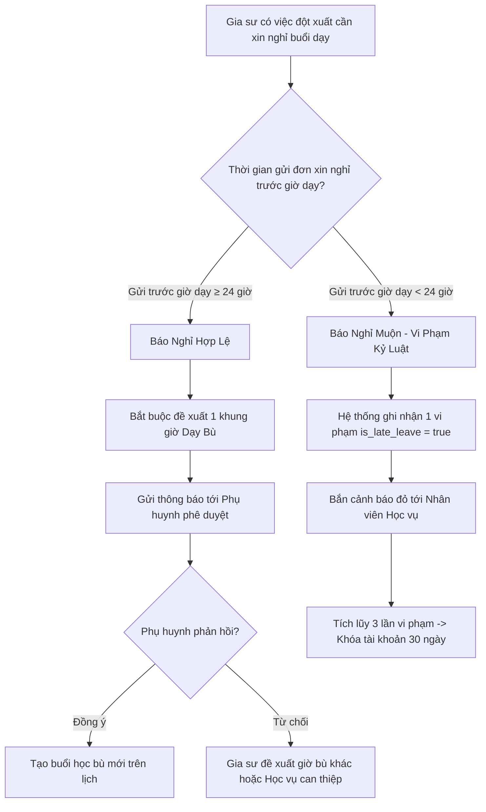
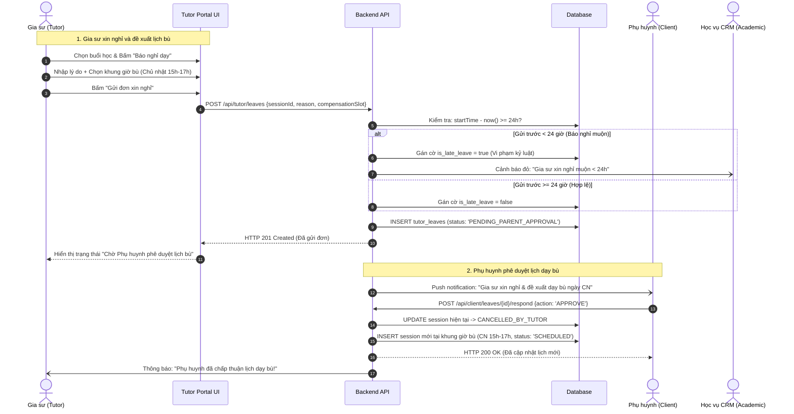

# ĐẶC TẢ NGHIỆP VỤ: GIA SƯ BÁO NGHỈ DẠY & ĐỀ XUẤT LỊCH BÙ (TUTOR PORTAL)

> **Mã phân hệ:** TUT-05 / SCH-02  
> **Đối tượng sử dụng:** Gia sư (Tutor), Phụ huynh (Parent), Học vụ (Academic)  
> **Cổng truy cập:** `http://localhost:5173/tutor` (Menu Lịch dạy / Báo nghỉ)

---

## 1. Mục Tiêu Nghiệp Vụ
Phụ huynh khi thuê gia sư rất sợ tình trạng gia sư thường xuyên bùng lịch, sát giờ dạy mới nhắn tin báo bận làm xáo trộn thời gian của gia đình và ảnh hưởng việc học của con. Do đó, hệ thống áp dụng quy chuẩn kỷ luật khắt khe: **Quy tắc Báo nghỉ trước 24 giờ (BR-SCH-02)** đối với mọi gia sư.

---

## 2. Quy Tắc Báo Nghỉ Của Gia Sư (Business Rule BR-SCH-02)

### 2.1. Sơ đồ tuần tự: Xin nghỉ & Chốt lịch dạy bù (Sequence Diagram)

---

## 3. Quy Trình Xin Nghỉ & Đề Xuất Lịch Dạy Bù

### 3.1. Các bước thực hiện trên Tutor Portal
1. Gia sư mở **"Lịch giảng dạy"** $\rightarrow$ chọn buổi học sắp tới cần xin nghỉ.
2. Bấm nút **"Báo nghỉ dạy"**.
3. Điền các trường thông tin:
   * **Lý do xin nghỉ**: Chọn danh mục (Bận lịch thi ở trường / Ốm đau, sức khỏe / Việc gia đình khẩn cấp / Khác).
   * **Mô tả chi tiết lý do**: Tối thiểu 15 ký tự.
   * **Đề xuất lịch dạy bù (Bắt buộc)**: Chọn ngày và khung giờ dự kiến dạy bù (ví dụ: Chủ nhật tuần này từ 15h00 - 17h00). Hệ thống sẽ kiểm tra đảm bảo khung giờ bù này gia sư đang rảnh.
4. Bấm **"Gửi đơn xin nghỉ"**.

### 3.2. Chế tài xử lý khi báo nghỉ muộn ($< 24$ giờ)
* Hệ thống vẫn cho phép gửi đơn để thông báo cho gia đình không phải chờ đợi.
* Tuy nhiên, hệ thống tự động gán cờ `is_late_leave = true` vào bản ghi `tutor_leaves`.
* Ghi nhận vào lịch sử vi phạm của gia sư trong bảng `audit_logs`.
* Nhân viên Học vụ sẽ gọi điện xác minh lý do:
  * Nếu lý do bất khả kháng (tai nạn, cấp cứu có minh chứng): Học vụ có quyền xóa cờ vi phạm.
  * Nếu lý do chủ quan: Giữ nguyên cờ vi phạm.

---

## 4. Hệ Thống Tích Lũy Vi Phạm & Xử Phạt Kỷ Luật (BR-PEN-02 & BR-PEN-03)

| Mức độ vi phạm | Hành vi | Hình thức xử lý kỷ luật |
| :--- | :--- | :--- |
| **Cảnh cáo mức 1** | Nghỉ muộn $< 24$ giờ lần đầu tiên trong tháng. | Gửi thông báo nhắc nhở nội bộ, trừ 0.2 điểm uy tín. |
| **Cảnh cáo mức 2** | Nghỉ muộn $< 24$ giờ lần thứ 2 trong vòng 30 ngày. | Nhân viên Học vụ làm việc trực tiếp, tạm dừng nhận lớp mới trong 7 ngày. |
| **Khóa tạm thời** | Nghỉ muộn lần 3 hoặc tự ý bỏ buổi dạy không báo trước. | **Khóa tài khoản 30 ngày (BR-PEN-02)**. Thu hồi các lớp đang phụ trách. |
| **Khóa vĩnh viễn** | Tái phạm sau khi mở khóa hoặc tự ý bỏ lớp giữa chừng không bàn giao. | **Cấm vĩnh viễn (BANNED)**, đưa vào danh sách đen của trung tâm. |

---

## 5. Danh Sách Mã Lỗi Phục Vụ Dev & QA

| Mã lỗi (Error Code) | HTTP Status | Nguyên nhân | Hướng xử lý |
| :--- | :---: | :--- | :--- |
| `COMPENSATION_SLOT_REQUIRED` | 422 | Chưa chọn khung giờ dạy bù khi gửi đơn xin nghỉ. | Bắt buộc chọn ngày và giờ dạy bù. |
| `COMPENSATION_SLOT_CONFLICT` | 400 | Khung giờ dạy bù đề xuất trùng với một lớp khác của gia sư. | Chọn khung giờ khác còn trống. |
| `LEAVE_ALREADY_EXISTS` | 409 | Buổi học này đã có đơn xin nghỉ đang chờ duyệt. | Chờ phản hồi của phụ huynh. |
| `SESSION_IN_PAST` | 400 | Không thể xin nghỉ cho buổi học đã qua giờ bắt đầu. | Liên hệ Học vụ để hỗ trợ. |
