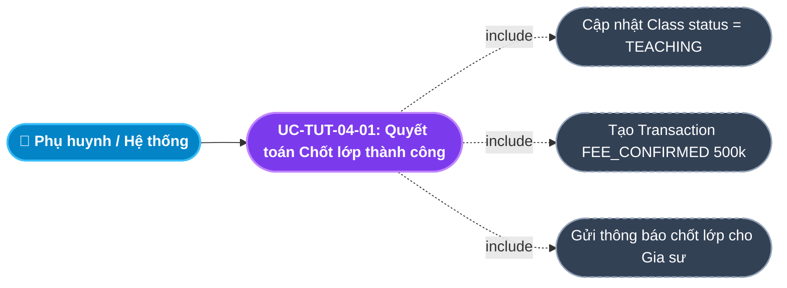
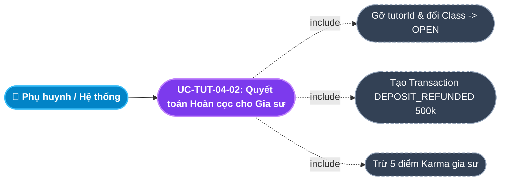
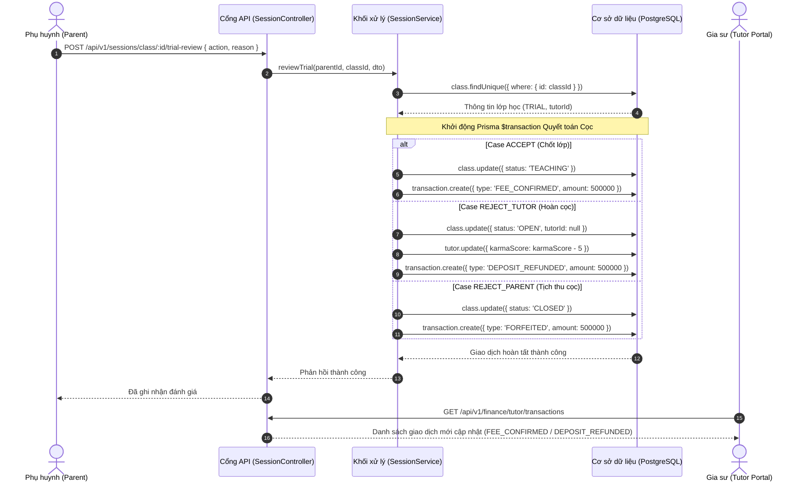

# Usecase: UC-TUT-04 - Quy trình Dạy thử & Quyết toán Tiền cọc (Trial Workflow & Deposit Settlement)

## 1. Giới thiệu chức năng
- **Mục đích**: Chuẩn hóa toàn bộ tiến trình thử việc và đối soát quyết toán khoản tiền cọc 500,000 đ của Gia sư trên Cổng Đối tác Gia sư (Tutor Portal). Khoản tiền cọc ký quỹ (`DEPOSIT_HELD`) sẽ được hệ thống và phòng Kế toán xử lý tự động ngay khi có kết quả đánh giá đợt dạy thử từ phía phụ huynh. Tài liệu quy định chi tiết 4 kịch bản thanh quyết toán cọc (chuyển cọc thành phí môi giới, hoàn cọc 100%, tịch thu cọc, hoặc hoàn cọc 50%), đảm bảo quyền lợi tài chính công bằng cho gia sư đồng thời duy trì kỷ luật sư phạm nghiêm ngặt.
- **Actor (Tác nhân)**: Gia sư (Tutor), Phụ huynh (Parent), Kế toán (Accountant), Chuyên viên Học vụ (Academic).
- **Điều kiện tiên quyết**: Lớp học đang ở trạng thái `TRIAL` và gia sư đã hoàn tất đặt cọc 500,000 đ (`DEPOSIT_HELD`).

### Danh mục các chức năng con (Sub-features):
1. **UC-TUT-04-01: Báo cáo hoàn thành dạy thử & Ghi nhận nhật ký**: Gia sư báo cáo hoàn thành đủ số buổi thử việc theo quy chuẩn (Giáo viên: 1 buổi; Sinh viên: 2 buổi).
2. **UC-TUT-04-02: Quyết toán Kịch bản Chốt lớp thành công (`ACCEPT`)**: Cọc chuyển thành doanh thu phí môi giới (`FEE_CONFIRMED`), lớp chuyển sang dạy chính thức `TEACHING`.
3. **UC-TUT-04-03: Quyết toán Hoàn cọc do lỗi Gia sư (`REJECT_TUTOR`)**: Hệ thống ghi nhận hoàn cọc `DEPOSIT_REFUNDED`, trừ 5 điểm Karma và thu hồi quyền phụ trách lớp.
4. **UC-TUT-04-04: Quyết toán Tịch thu cọc do lỗi Phụ huynh (`REJECT_PARENT`)**: Hệ thống ghi nhận `FORFEITED` 500,000 đ và đóng lớp học vĩnh viễn `CLOSED`.
5. **UC-TUT-04-05: Quyết toán Hoàn 50% cọc khi thu hẹp quy mô (`SCALE_DOWN`)**: Lớp học giảm số buổi, trung tâm hoàn trả 250,000 đ cho gia sư và trừ nhẹ 2 điểm Karma.

---

## 2. Dữ liệu nghiệp vụ đầu vào (Input Data & Parameters)

### 2.1. Dữ liệu Quyết toán Giao dịch Cọc (Deposit Settlement Transaction Data)
| Tên trường | Kiểu dữ liệu | Giá trị thực tế từ Code | Ý nghĩa nghiệp vụ |
|---|---|---|---|
| `Mã lớp học` (classId) | UUID | Khóa ngoại bảng `classes` | Lớp học dạy thử phát sinh quyết toán cọc. |
| `Mã gia sư` (tutorId) | UUID | Khóa ngoại bảng `tutors` | Gia sư thụ hưởng hoặc bị chế tài tiền cọc. |
| `Loại giao dịch` (type) | Enum (`TransactionType`) | `DEPOSIT_HELD`, `DEPOSIT_REFUNDED`, `FEE_CONFIRMED`, `FORFEITED` | Định danh kế toán phục vụ hạch toán doanh thu và hoàn tiền. |
| `Số tiền cọc` (amount) | Decimal (12,2) | `500,000 đ` (hoặc `250,000 đ`) | Số tiền thực hiện quyết toán. |
| `Trạng thái giao dịch` (status) | Enum (`TransactionStatus`) | `SUCCESSFUL` | Ghi nhận hoàn tất thành công trong hệ thống. |
| `Nội dung đối soát` (reference) | Chuỗi (String) | Tự động sinh | Chuỗi giải trình (VD: `Quyết toán cọc sau dạy thử: ACCEPT`). |

### 2.2. Bảng phân loại 4 Kịch bản Quyết toán Cọc chi tiết
| Kịch bản | Quyết định PH (`action`) | Trạng thái Lớp | Loại giao dịch (`TransactionType`) | Số tiền (VNĐ) | Biến động Karma |
|---|---|---|---|---|---|
| **1. Nhận lớp** | `ACCEPT` | `TEACHING` | `FEE_CONFIRMED` | 500,000 đ | $0$ (Bảo toàn) |
| **2. Đổi gia sư** | `REJECT_TUTOR` | `OPEN` | `DEPOSIT_REFUNDED` | 500,000 đ | $-5$ điểm |
| **3. Hủy do PH** | `REJECT_PARENT` | `CLOSED` | `FORFEITED` | 500,000 đ | $0$ (Bảo toàn) |
| **4. Giảm buổi** | `SCALE_DOWN` | `OPEN` | `DEPOSIT_REFUNDED` | 250,000 đ | $-2$ điểm |

---

## 3. Quy tắc nghiệp vụ (Business Rules)

| Mã Quy tắc | Tình huống nghiệp vụ | Cách hệ thống xử lý | Thông báo hiển thị cho người dùng |
|---|---|---|---|
| **BR-TUT-04-01** | **Thời hạn hoàn tiền cọc (SLA 24 giờ)**: Giao dịch `DEPOSIT_REFUNDED` được kích hoạt. | Kế toán trung tâm có trách nhiệm chuyển khoản lại tiền vào STK ngân hàng của gia sư trong vòng tối đa **24 giờ làm việc**. | "Hệ thống đã tạo lệnh hoàn cọc. Tiền sẽ được chuyển về tài khoản trong 24h." |
| **BR-TUT-04-02** | **Bảo toàn giao dịch cọc (Transaction Safety)**: Cập nhật lớp học và tạo bản ghi giao dịch cọc. | Bắt buộc chạy trong `prisma.$transaction(async (tx) => ...)`. Đảm bảo không bao giờ xảy ra tình trạng đổi trạng thái lớp nhưng không ghi log tiền cọc. | "Ghi nhận quyết toán cọc thành công" |
| **BR-TUT-04-03** | **Cơ chế đối soát minh bạch trên Portal Gia sư**: Sau khi có quyết định quyết toán cọc. | Màn hình `/tutor/transactions` tự động hiển thị dòng giao dịch tương ứng với icon mũi tên màu xanh lá (nếu Hoàn cọc) hoặc màu cam/đỏ (nếu Phạt cọc). | Hiển thị chi tiết trên bảng sao kê thu chi |
| **BR-TUT-04-04** | **Quy chuẩn số buổi dạy thử bắt buộc**: Gia sư tiến hành giảng dạy đợt thử việc. | Bắt buộc: Giáo viên dạy 1 buổi; Sinh viên dạy 2 buổi. Không được thu tiền trực tiếp của phụ huynh trong các buổi dạy thử nếu bị từ chối. | Tuân thủ hợp đồng cam kết giảng dạy |

---

## 4. Đặc tả chi tiết các Use Case chức năng con (Sub-Use Cases Specification)

---

### 4.1. UC-TUT-04-01: Quyết toán Kịch bản Nhận lớp thành công (`ACCEPT`)

#### Sơ đồ Use Case:

#### Bảng đặc tả nghiệp vụ:

| STT | Hạng mục | Nội dung chi tiết |
|:---:|---|---|
| **1** | **Thông tin chung** | - **UC ID**: `UC-TUT-04-01` - **UC Name**: Quyết toán Kịch bản Nhận lớp thành công (Formal Class Confirmation & Fee Conversion) - **Actor**: Phụ huynh (Parent), Hệ thống Backend - **Mục tiêu**: Chuyển đổi khoản tiền cọc tạm giữ của gia sư thành doanh thu phí môi giới và kích hoạt lớp học chính thức lâu dài. - **Mô tả**: Khi phụ huynh bấm Đồng ý nhận lớp, hệ thống ghi nhận `FEE_CONFIRMED` và chuyển lớp sang `TEACHING`. - **Priority**: High |
| **2** | **Trigger** | Phụ huynh gửi yêu cầu đánh giá dạy thử với `action = 'ACCEPT'`. |
| **3** | **Pre-condition** | Lớp học đang ở trạng thái `TRIAL`. |
| **4** | **Post-condition** | 1. `class.status` cập nhật thành `TEACHING`. 2. Ghi nhận bản ghi `Transaction` loại `FEE_CONFIRMED` số tiền 500,000 đ. 3. Gia sư nhận được thông báo chúc mừng chốt lớp thành công. |
| **5** | **Main Flow** | 1. Backend nhận payload `{ action: 'ACCEPT' }` từ phụ huynh. 2. Trong Transaction, hệ thống cập nhật `class.status = 'TEACHING'`. 3. Tạo bản ghi giao dịch `FEE_CONFIRMED`: số tiền 500,000 đ, `status: 'SUCCESSFUL'`, `reference: 'Quyết toán cọc sau dạy thử: ACCEPT'`. 4. Hoàn tất giao dịch. 5. Gia sư vào Dashboard `/tutor` thấy lớp chuyển sang Badge xanh lá *"Đang Giảng Dạy"*. |
| **6** | **Alternative / Exception Flow** | - **EF-01 (Lớp không phải TRIAL)**: Ném `BadRequestException` và hủy giao dịch. |
| **7** | **Business Rules & Validation** | - `BR-TUT-04-02`: Đảm bảo đồng bộ giữa trạng thái lớp và giao dịch phí môi giới. |
| **8** | **Acceptance Criteria** | - **AC-01**: Bảng `classes` cập nhật `status: 'TEACHING'`. - **AC-02**: Bảng `transactions` lưu đúng 1 dòng `FEE_CONFIRMED` với `amount: 500000`. |

---

### 4.2. UC-TUT-04-02: Quyết toán Kịch bản Hoàn cọc cho Gia sư (`REJECT_TUTOR`)

#### Sơ đồ Use Case:

#### Bảng đặc tả nghiệp vụ:

| STT | Hạng mục | Nội dung chi tiết |
|:---:|---|---|
| **1** | **Thông tin chung** | - **UC ID**: `UC-TUT-04-02` - **UC Name**: Quyết toán Kịch bản Hoàn cọc cho Gia sư (Deposit Refund Settlement) - **Actor**: Phụ huynh (Parent), Kế toán (Accountant) - **Mục tiêu**: Xử lý trả lại tiền cọc cho gia sư khi buổi dạy thử không đạt yêu cầu chuyên môn hoặc phụ huynh không hợp phong cách. - **Mô tả**: Đổi lớp thành `OPEN`, gỡ gia sư, trừ 5 điểm Karma và tạo lệnh hoàn trả cọc 500,000 đ. - **Priority**: High |
| **2** | **Trigger** | Phụ huynh gửi yêu cầu đánh giá dạy thử với `action = 'REJECT_TUTOR'`. |
| **3** | **Pre-condition** | Lớp học đang ở trạng thái `TRIAL`. |
| **4** | **Post-condition** | 1. `class.status = 'OPEN'`, `tutorId = null`, lưu `cancelReason`. 2. Ghi nhận giao dịch `DEPOSIT_REFUNDED` 500,000 đ. 3. `tutor.karmaScore` bị trừ 5 điểm. 4. Kế toán nhận lệnh chuyển trả 500k cho gia sư trong 24h (`BR-TUT-04-01`). |
| **5** | **Main Flow** | 1. Backend tiếp nhận action `REJECT_TUTOR`. 2. Chạy Transaction: Cập nhật `class.status = 'OPEN'`, xóa `tutorId`. 3. Trừ 5 điểm Karma của gia sư: `karmaScore - 5`. 4. Tạo bản ghi giao dịch `type: 'DEPOSIT_REFUNDED'`, `amount: 500000`, `reference: 'Quyết toán cọc sau dạy thử: REJECT_TUTOR'`. 5. Trả về thông báo thành công. 6. Gia sư kiểm tra `/tutor/transactions` thấy dòng giao dịch Hoàn cọc màu xanh lá. |
| **6** | **Alternative / Exception Flow** | - **EF-01 (Karma xuống dưới 20)**: Hệ thống tự động khóa tài khoản `status = 'BANNED'`. |
| **7** | **Business Rules & Validation** | - `BR-TUT-04-01`: SLA hoàn tiền trong 24 giờ làm việc. |
| **8** | **Acceptance Criteria** | - **AC-01**: Bảng giao dịch xuất hiện dòng `DEPOSIT_REFUNDED` 500,000 đ. - **AC-02**: Điểm Karma của gia sư bị trừ chính xác 5 điểm. |

---

## 5. Sơ đồ tuần tự nghiệp vụ (Sequence Diagrams)

### 5.1. Sơ đồ: Xử lý Quyết toán Cọc sau Dạy thử

---

## 6. Kịch bản kiểm thử & Nghiệm thu (Given / When / Then)

### Kịch bản 1: Quyết toán chốt lớp chuyển cọc thành phí môi giới
- **Given**: Gia sư đã nộp cọc 500,000 đ (`DEPOSIT_HELD`) và hoàn thành 2 buổi dạy thử môn Hóa.
- **When**: Phụ huynh bấm Chốt nhận gia sư (`action = 'ACCEPT'`).
- **Then**: Lớp học chuyển sang `TEACHING`. Bảng `transactions` sinh ra bản ghi `FEE_CONFIRMED` 500,000 đ. Gia sư được bảo toàn điểm Karma và nhận lớp giảng dạy chính thức.

### Kịch bản 2: Quyết toán hoàn tiền cọc khi phụ huynh từ chối
- **Given**: Gia sư dạy thử môn Lý nhưng phụ huynh đánh giá không hợp phương pháp (`REJECT_TUTOR`).
- **When**: Phụ huynh bấm gửi từ chối gia sư kèm lý do.
- **Then**: Lớp học chuyển về `OPEN` để tuyển người khác. Bảng `transactions` ghi nhận giao dịch `DEPOSIT_REFUNDED` 500,000 đ cho gia sư. Điểm Karma của gia sư bị trừ 5 điểm.

### Kịch bản 3: Tịch thu cọc khi phụ huynh hủy lớp vì việc riêng
- **Given**: Phụ huynh hủy lớp do gia đình có việc bận đột xuất (`REJECT_PARENT`).
- **When**: Phụ huynh xác nhận hủy lớp.
- **Then**: Lớp chuyển sang `CLOSED`. Bảng `transactions` ghi nhận `FORFEITED` 500,000 đ. Gia sư không bị trừ điểm Karma.
