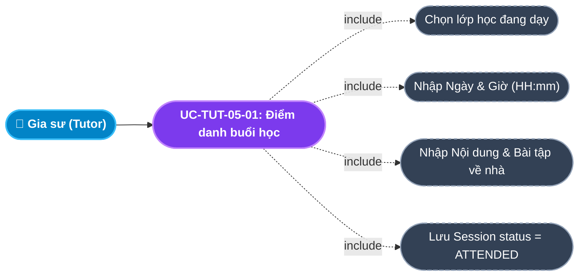
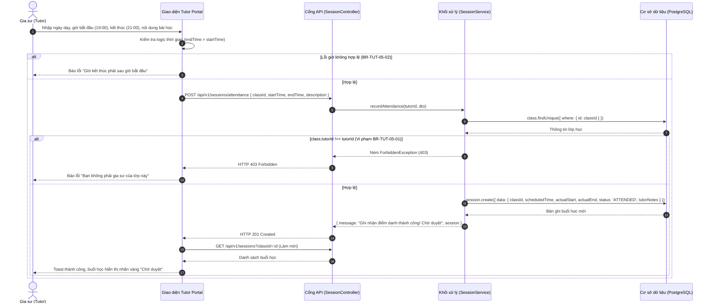

# Usecase: UC-TUT-05 - Điểm danh, Ghi nhận Nhật ký Buổi học & Tiến độ (Attendance & Session Logging)

## 1. Giới thiệu chức năng
- **Mục đích**: Cung cấp công cụ ghi nhận thời gian thực dạy, điểm danh điện tử và nhật ký sư phạm (Session Log) cho Gia sư trên Cổng Đối tác Gia sư (Tutor Portal). Sau mỗi ca dạy, gia sư chỉ mất 1-2 phút để nhập giờ bắt đầu - kết thúc thực tế, tóm tắt kiến thức đã truyền đạt, bài tập về nhà giao thêm và đánh giá thái độ học tập của học sinh. Buổi học sau khi điểm danh sẽ chuyển sang trạng thái chờ phụ huynh duyệt (`ATTENDED`), kích hoạt thông báo gửi tới phụ huynh để đối soát học phí, đồng thời tích lũy lịch sử giảng dạy phục vụ bảo vệ quyền lợi thù lao cho gia sư.
- **Actor (Tác nhân)**: Gia sư (Tutor), Phụ huynh (Parent), Hệ thống Backend (System).
- **Điều kiện tiên quyết**: Gia sư đang phụ trách lớp học hợp lệ (`targetClass.tutorId === currentTutorId`).

### Danh mục các chức năng con (Sub-features):
1. **UC-TUT-05-01: Điểm danh buổi học & Ghi nhận thời gian thực dạy (Record Session Attendance)**: Nhập ngày dạy (`dd/mm/yyyy`), giờ bắt đầu (`HH:mm`), giờ kết thúc (`HH:mm`), kiểm tra tính hợp lệ của khung giờ.
2. **UC-TUT-05-02: Ghi chép nhật ký sư phạm & Bài tập về nhà (Session Notes & Homework)**: Ghi lại nội dung bài học SGK/chuyên đề, dặn dò bài tập về nhà và nhận xét mức độ tập trung của con.
3. **UC-TUT-05-03: Kích hoạt trạng thái Chờ duyệt (`ATTENDED`)**: Hệ thống tự động lưu bản ghi `Session` và gửi thông báo nhắc phụ huynh phê duyệt.
4. **UC-TUT-05-04: Tra cứu lịch sử các buổi học đã dạy**: Xem danh sách toàn bộ các buổi học theo từng lớp kèm thời gian, nội dung ghi chú và trạng thái duyệt (`ATTENDED`, `CONFIRMED`, `DISPUTED`).

---

## 2. Dữ liệu nghiệp vụ đầu vào (Input Data & Parameters)

### 2.1. Dữ liệu biểu mẫu Điểm danh & Nhật ký (Attendance Form Data)
| Tên trường | Kiểu dữ liệu | Tính chất | Ý nghĩa nghiệp vụ & Ràng buộc thực tế từ Code |
|---|---|---|---|
| `Lớp học giảng dạy` (classId) | UUID | Bắt buộc | Chọn lớp học gia sư đang phụ trách. Bắt buộc `class.tutorId === currentTutorId`. |
| `Ngày dạy thực tế` (sessionDate) | Chuỗi (`dd/mm/yyyy`) | Bắt buộc | Ngày diễn ra buổi học. Tự động khởi tạo ngày hôm nay. Kiểm tra định dạng ngày hợp lệ (ngày 1-31, tháng 1-12, năm 2000-2100). |
| `Giờ bắt đầu` (startTimeHM) | Chuỗi (`HH:mm`) | Bắt buộc | Giờ bắt đầu vào dạy (24h). VD: `19:00`. |
| `Giờ kết thúc` (endTimeHM) | Chuỗi (`HH:mm`) | Bắt buộc | Giờ kết thúc ca dạy (24h). VD: `21:00`. Ràng buộc: `endTime > startTime`. |
| `Nội dung & Nhận xét` (description) | Văn bản (Text) | Bắt buộc | Ghi chép nội dung bài giảng, bài tập về nhà và đánh giá thái độ tiếp thu của học sinh. Tối đa 1000 ký tự. |

### 2.2. Dữ liệu Đầu ra của Buổi học (Session Output Data)
| Tên trường trong CSDL | Kiểu dữ liệu | Giá trị gán tự động | Ý nghĩa luồng xử lý |
|---|---|---|---|
| `scheduledTime` | DateTime | `new Date(startTime)` | Khung thời gian buổi học theo lịch. |
| `actualStart` | DateTime | `new Date(startTime)` | Thời điểm bắt đầu thực tế. |
| `actualEnd` | DateTime | `new Date(endTime)` | Thời điểm kết thúc thực tế (làm mốc tính 48h Auto-confirm). |
| `status` | Enum (`SessionStatus`) | `ATTENDED` | Trạng thái Chờ Phụ huynh phê duyệt. |
| `tutorNotes` | Văn bản (Text) | `description` | Nội dung gia sư ghi lại hiển thị trên Portal phụ huynh. |

---

## 3. Quy tắc nghiệp vụ (Business Rules)

| Mã Quy tắc | Tình huống nghiệp vụ | Cách hệ thống xử lý | Thông báo hiển thị cho người dùng |
|---|---|---|---|
| **BR-TUT-05-01** | **Xác thực quyền gia sư của lớp**: Gia sư điểm danh vào lớp học không phải do mình phụ trách. | Backend kiểm tra `targetClass.tutorId !== tutorId` $\rightarrow$ Ném `ForbiddenException` (HTTP 403). | "Bạn không phải là gia sư của lớp học này" |
| **BR-TUT-05-02** | **Ràng buộc thời gian logic**: Gia sư nhập giờ kết thúc nhỏ hơn hoặc bằng giờ bắt đầu (`endTime <= startTime`). | Client parseDateTime kiểm tra và chặn submit; Backend kiểm tra logic thời gian. | "Giờ kết thúc phải sau giờ bắt đầu" |
| **BR-TUT-05-03** | **Cơ chế kích hoạt đồng hồ Auto-confirm 48h**: Sau khi điểm danh thành công với `actualEnd`. | Mốc thời gian `actualEnd` được lưu lại. Hệ thống bắt đầu tính thời hạn 48 tiếng cho phụ huynh duyệt bài trước khi tự động giải ngân. | Mốc kích hoạt đếm ngược 48h tự động duyệt |
| **BR-TUT-05-04** | **Chống gian lận điểm danh khống**: Gia sư điểm danh vào các ngày chưa tới (trong tương lai). | Frontend và Backend chặn các buổi học có ngày dạy lớn hơn thời điểm hiện tại (`startTime > now()`). | "Không thể điểm danh cho ngày trong tương lai" |

---

## 4. Đặc tả chi tiết các Use Case chức năng con (Sub-Use Cases Specification)

---

### 4.1. UC-TUT-05-01: Điểm danh buổi học & Ghi nhận thời gian thực dạy

#### Sơ đồ Use Case:

#### Bảng đặc tả nghiệp vụ:

| STT | Hạng mục | Nội dung chi tiết |
|:---:|---|---|
| **1** | **Thông tin chung** | - **UC ID**: `UC-TUT-05-01` - **UC Name**: Điểm danh buổi học & Ghi nhận thời gian thực dạy (Record Session Attendance) - **Actor**: Gia sư (Tutor) - **Mục tiêu**: Báo cáo buổi học đã hoàn thành với đầy đủ thời gian và nội dung bài giảng để phụ huynh đối soát duyệt lương. - **Mô tả**: Chọn lớp, nhập ngày giờ học và mô tả kiến thức đã dạy tại màn hình `/tutor/attendance`. - **Priority**: High (Nghiệp vụ vận hành cốt lõi) |
| **2** | **Trigger** | Gia sư bấm nút **"Ghi Điểm Danh"** trên thanh điều hướng hoặc truy cập trang `/tutor/attendance`. |
| **3** | **Pre-condition** | Gia sư đang có ít nhất 01 lớp học hoạt động. |
| **4** | **Post-condition** | 1. Bản ghi `Session` mới được tạo với `status = 'ATTENDED'`. 2. Màn hình hiển thị dòng buổi học mới có nhãn vàng *"Chờ duyệt"*. |
| **5** | **Main Flow** | 1. Gia sư vào trang `/tutor/attendance`. 2. Chọn lớp học từ Dropdown các lớp đang phụ trách. 3. Nhập ngày dạy (mặc định hôm nay), giờ bắt đầu (VD: `19:00`), giờ kết thúc (VD: `21:00`). 4. Nhập nội dung bài dạy và bài tập: *"Hình học: Định lý Pytago, giải bài 1,2 SGK. Khôi tập trung tốt."*. 5. Bấm nút **"Gửi Báo Cáo Buổi Học"**. 6. Client kiểm tra thời gian hợp lệ (`parseDateTime`), gửi request `POST /api/v1/sessions/attendance`. 7. Backend xác thực quyền sở hữu lớp (`BR-TUT-05-01`), tạo bản ghi `Session` trạng thái `ATTENDED` (`BR-TUT-05-03`). 8. Backend trả về `HTTP 201 Created`. 9. Giao diện làm mới danh sách buổi học, hiển thị thông báo thành công. |
| **6** | **Alternative / Exception Flow** | - **EF-01 (Giờ kết thúc sai)**: Nhập giờ kết thúc sớm hơn giờ bắt đầu $\rightarrow$ Client báo lỗi: *"Giờ kết thúc phải sau giờ bắt đầu"* và không gửi request. |
| **7** | **Business Rules & Validation** | - `BR-TUT-05-01`: Bắt buộc `class.tutorId === tutorId`. - `BR-TUT-05-02`: `endTime > startTime`. |
| **8** | **Acceptance Criteria** | - **AC-01**: Điểm danh thành công $\rightarrow$ Buổi học lập tức xuất hiện trên Portal của Phụ huynh ở trạng thái "Chờ duyệt". - **AC-02**: Mốc `actualEnd` được lưu chính xác để phục vụ Cron Auto-confirm 48h. |

---

## 5. Sơ đồ tuần tự nghiệp vụ (Sequence Diagrams)

### 5.1. Sơ đồ: Gia sư điểm danh buổi học

---

## 6. Kịch bản kiểm thử & Nghiệm thu (Given / When / Then)

### Kịch bản 1: Điểm danh buổi học thành công
- **Given**: Gia sư vừa dạy xong ca 2 tiếng môn Toán lớp 9 từ 19h00 đến 21h00 tối nay.
- **When**: Gia sư chọn lớp, nhập giờ `19:00 - 21:00`, điền nội dung `"Luyện đề thi thử vào 10, con làm đúng 8/10 câu"` và bấm Gửi báo cáo.
- **Then**: Hệ thống tạo bản ghi buổi học với trạng thái `ATTENDED`. Buổi học hiển thị trên danh sách với thời gian 19:00 - 21:00 và nhãn vàng "Chờ duyệt".

### Kịch bản 2: Chặn giờ kết thúc không hợp lệ
- **Given**: Gia sư nhập nhầm giờ bắt đầu là `21:00` và giờ kết thúc là `19:00`.
- **When**: Gia sư bấm nút Gửi báo cáo buổi học.
- **Then**: Giao diện hiển thị cảnh báo đỏ: *"Giờ kết thúc phải sau giờ bắt đầu"*. Hệ thống không gửi dữ liệu lên máy chủ.

### Kịch bản 3: Chặn điểm danh vào lớp của người khác
- **Given**: Gia sư cố tình can thiệp API truyền `classId` của một gia sư khác đang dạy.
- **When**: Request được gửi lên Backend.
- **Then**: Backend kiểm tra quyền sở hữu và trả về lỗi `HTTP 403 Forbidden` kèm thông báo: *"Bạn không phải là gia sư của lớp học này"*.
