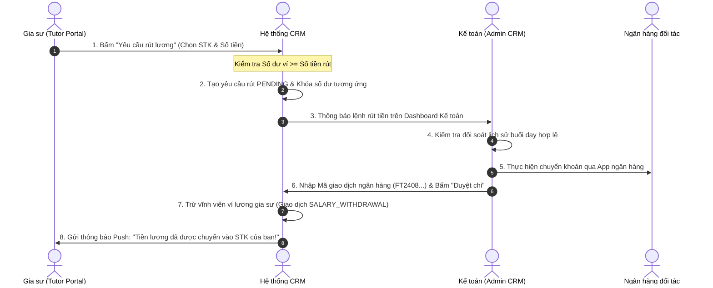

# ĐẶC TẢ NGHIỆP VỤ: VÍ LƯƠNG GIA SƯ & QUYẾT TOÁN THU NHẬP (TUTOR PORTAL)

> **Mã phân hệ:** TUT-06 / WAL-01  
> **Đối tượng sử dụng:** Gia sư (Tutor), Kế toán (Accountant)  
> **Cổng truy cập:** `http://localhost:5173/tutor` (Menu Ví thu nhập & Tài khoản ngân hàng)

---

## 1. Mục Tiêu Nghiệp Vụ
Để tạo động lực giảng dạy và giữ chân các gia sư giỏi, hệ thống cung cấp tính năng **Ví thu nhập thời gian thực (Real-time Salary Wallet)**. Gia sư có thể theo dõi chính xác từng đồng thù lao sau mỗi buổi dạy và rút tiền về tài khoản ngân hàng cá nhân một cách minh bạch, an toàn.

---

## 2. Cơ Chế Tích Lũy Lương Vào Ví (Real-time Accrual)

* **Thời điểm cộng tiền (BR-FIN-06)**: Lương của một buổi dạy **CHỈ ĐƯỢC CỘNG** vào `tutors.wallet_balance` ngay khi buổi học đó chuyển sang trạng thái **`CONFIRMED`** (Phụ huynh xác nhận mã PIN hoặc Auto-Confirm sau 48 giờ).
* **Số tiền cộng**: Đúng bằng mức thù lao thỏa thuận của lớp học đó (`classes.tutor_wage_rate`, ví dụ: 250,000 VNĐ / buổi).
* **Nhật ký giao dịch**: Hệ thống tự động sinh một bản ghi giao dịch trong bảng `transactions`:
  * Loại: `TUTOR_SALARY`.
  * Trạng thái: `SUCCESSFUL`.
  * Số tiền: Dương ($+250,000$).
  * Ghi chú: *"Thù lao buổi dạy ngày DD/MM - Lớp [Tên con] (Mã Bút: S12345)"*.
* **Thông báo tức thì**: Gia sư nhận thông báo Push: *"Ví lương vừa được cộng +250,000 VNĐ từ buổi học bé [Tên]!"*

---

## 3. Quản Lý Tài Khoản Ngân Hàng Nhận Lương (`tutor_bank_accounts`)

Gia sư có thể liên kết tài khoản ngân hàng để nhận tiền chuyển khoản:
* **Số lượng tối đa**: Mỗi gia sư được lưu tối đa **3 tài khoản ngân hàng**.
* **Thông tin khai báo**:
  * Tên ngân hàng: Chọn từ danh sách ngân hàng Việt Nam (Vietcombank, MB Bank, Techcombank, BIDV...).
  * Số tài khoản: Định dạng từ 8 đến 16 số.
  * Tên chủ tài khoản: Chữ in hoa không dấu (ví dụ: "NGUYEN VAN AN").
  * Chi nhánh: Tùy chọn.
  * Đặt làm tài khoản mặc định: Có / Không.
* **Bảo mật dữ liệu nhạy cảm (BR-SEC-03)**:
  * Số tài khoản được mã hóa AES-256 trước khi lưu vào CSDL.
  * Trên giao diện chỉ hiển thị 4 số cuối (ví dụ: `**** **** 8899`).

---

## 4. Quy Trình Rút Lương & Quyết Toán (Payout Flow)

### 4.1. Điều kiện rút tiền:
* Số dư ví khả dụng tối thiểu: **200,000 VNĐ**.
* Gia sư đã liên kết ít nhất 1 tài khoản ngân hàng hợp lệ.
* Không có yêu cầu rút tiền nào khác đang ở trạng thái `PENDING` (chống spam lệnh rút).

### 4.2. Kỳ quyết toán tự động cuối tháng:
* Vào ngày **25 đến ngày 28 hàng tháng**, Kế toán trung tâm có thể bấm **"Kết toán toàn bộ bảng lương"**:
  * Hệ thống tổng hợp số dư của tất cả gia sư có `wallet_balance > 0`.
  * Xuất file bảng kê chuyển khoản ngân hàng (Excel/CSV).
  * Kế toán chuyển khoản hàng loạt và cập nhật trạng thái chi lương.

---

## 5. Danh Sách Mã Lỗi Phục Vụ Dev & QA

| Mã lỗi (Error Code) | HTTP Status | Nguyên nhân | Hướng xử lý |
| :--- | :---: | :--- | :--- |
| `WITHDRAW_AMOUNT_TOO_LOW` | 422 | Số tiền yêu cầu rút nhỏ hơn mức tối thiểu 200,000 VNĐ. | Yêu cầu nhập số tiền lớn hơn hoặc bằng 200k. |
| `INSUFFICIENT_WALLET_BALANCE` | 400 | Số tiền yêu cầu rút vượt quá số dư ví hiện có. | Giảm số tiền rút về mức tối đa bằng số dư ví. |
| `BANK_ACCOUNT_REQUIRED` | 400 | Gia sư chưa thêm tài khoản ngân hàng nào để nhận tiền. | Yêu cầu thêm STK ngân hàng trước. |
| `PENDING_PAYOUT_EXISTS` | 409 | Đang có một lệnh rút tiền chưa xử lý. | Chờ kế toán chuyển khoản lệnh trước đó. |
