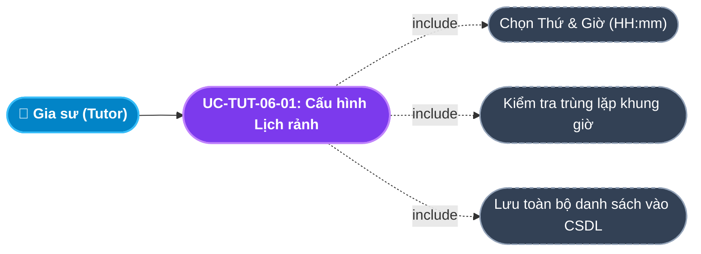
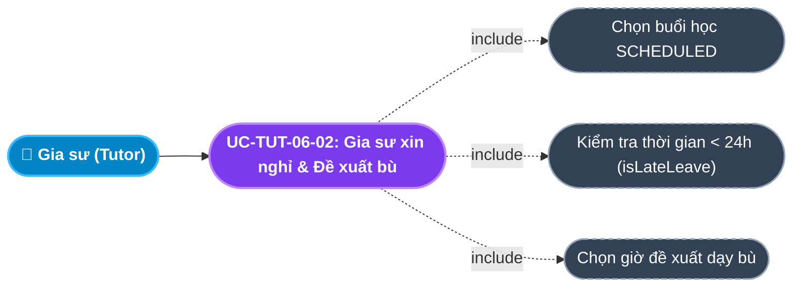
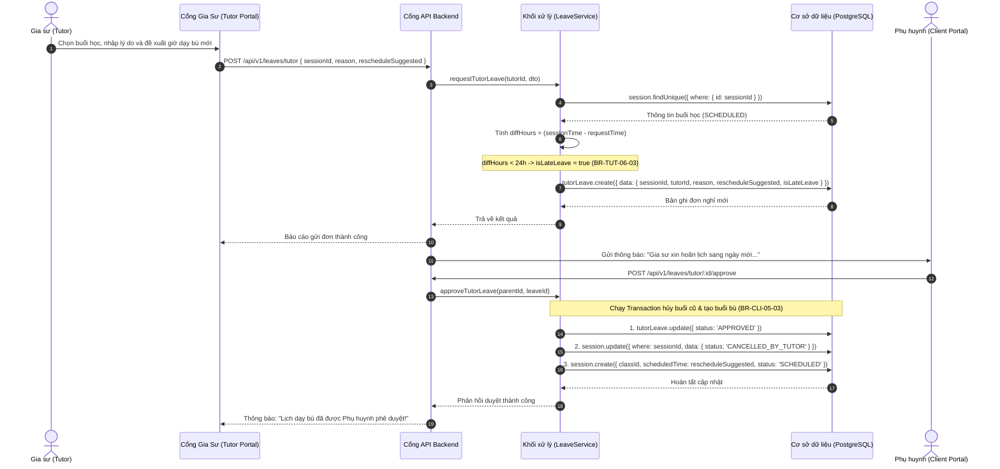

# Usecase: UC-TUT-06 - Quản lý Lịch rảnh, Báo nghỉ & Lên lịch Dạy bù (Availability & Rescheduling)

## 1. Giới thiệu chức năng
- **Mục đích**: Cung cấp bộ công cụ toàn diện giúp Gia sư cấu hình khung giờ rảnh trong tuần, quản lý thời khóa biểu giảng dạy và xử lý các tình huống xin nghỉ phép, dạy bù văn minh trên Cổng Đối tác Gia sư (Tutor Portal). Hệ thống cho phép gia sư thiết lập các ca rảnh cố định để thuật toán Smart Matching tự động so khớp lớp học không bị xung đột thời gian (`SCHEDULE_CONFLICT`). Khi có lịch thi cử hoặc việc đột xuất tại trường, gia sư có thể gửi đơn xin nghỉ phép kèm khung giờ dạy bù đề xuất (`rescheduleSuggested`). Hệ thống tự động kiểm tra thời hạn báo trước 24 giờ để gắn cờ báo nghỉ muộn (`isLateLeave`), đồng thời tự động cập nhật buổi học bù lên lịch khi được phụ huynh phê duyệt.
- **Actor (Tác nhân)**: Gia sư (Tutor), Phụ huynh (Parent), Học sinh (Student), Hệ thống CRM.
- **Điều kiện tiên quyết**: Gia sư đã đăng nhập vào Tutor Portal và đang có các lớp học chính thức hoặc đang trong đợt dạy thử.

### Danh mục các chức năng con (Sub-features):
1. **UC-TUT-06-01: Đăng ký & Cập nhật ma trận Lịch rảnh (Tutor Availability Schedules)**: Thiết lập các khung giờ rảnh cố định trong tuần [Thứ 2 - Chủ Nhật, Giờ bắt đầu - Giờ kết thúc theo chuẩn 24h], phục vụ tự động ghép lớp.
2. **UC-TUT-06-02: Xem Thời khóa biểu giảng dạy & Địa chỉ nhà học sinh**: Theo dõi lịch dạy theo tuần/tháng, hiển thị chi tiết số nhà, tên chung cư, số điện thoại phụ huynh kèm tính năng sao chép địa chỉ 1 chạm.
3. **UC-TUT-06-03: Gia sư gửi đơn Báo nghỉ & Đề xuất giờ dạy bù (Request Tutor Leave)**: Chọn buổi học sắp tới (`SCHEDULED`), nhập lý do bận và chọn khung giờ đề xuất dạy bù, tự động kiểm tra quy tắc báo trước 24 giờ.
4. **UC-TUT-06-04: Gia sư phê duyệt đơn báo nghỉ của Học sinh (Approve Student Leave)**: Gia sư tiếp nhận đơn xin nghỉ của học sinh, bấm phê duyệt để đồng thuận với giờ học bù và tự động sinh buổi dạy bù mới.
5. **UC-TUT-06-05: Tra cứu danh sách đơn nghỉ phép (View Leaves History)**: Thống kê toàn bộ các đơn xin nghỉ của bản thân và của học sinh kèm trạng thái xử lý (`PENDING`, `APPROVED`, `REJECTED`).

---

## 2. Dữ liệu nghiệp vụ đầu vào (Input Data & Parameters)

### 2.1. Dữ liệu Đăng ký Khung giờ rảnh (Availability Schedule Data)
| Tên trường | Kiểu dữ liệu | Tính chất | Ý nghĩa nghiệp vụ & Ràng buộc thực tế từ Code |
|---|---|---|---|
| `Ngày trong tuần` (dayOfWeek) | Số nguyên (Integer) | Bắt buộc | Nhận giá trị từ `2` đến `8` (`2` = Thứ Hai, `7` = Thứ Bảy, `8` = Chủ Nhật). |
| `Giờ bắt đầu` (slotStart) | Chuỗi (`HH:mm`) | Bắt buộc | Khung giờ bắt đầu rảnh (24h). VD: `08:00`, `18:30`. |
| `Giờ kết thúc` (slotEnd) | Chuỗi (`HH:mm`) | Bắt buộc | Khung giờ kết thúc rảnh (24h). VD: `10:00`, `20:30`. Ràng buộc: `slotEnd > slotStart`. |

### 2.2. Dữ liệu Đơn Báo nghỉ của Gia sư (Tutor Leave Data)
| Tên trường | Kiểu dữ liệu | Tính chất | Ý nghĩa nghiệp vụ & Ràng buộc thực tế từ Code |
|---|---|---|---|
| `Mã buổi học` (sessionId) | UUID | Bắt buộc | Buổi học xin nghỉ. Buổi học phải đang ở trạng thái `SCHEDULED`. |
| `Lý do xin nghỉ` (reason) | Văn bản (Text) | Bắt buộc | Lý do vắng mặt (VD: `Trùng lịch thi học kỳ tại trường ĐH`). Tối đa 500 ký tự. |
| `Khung giờ dạy bù đề xuất` (rescheduleSuggested) | DateTime ISO8601 | Bắt buộc | Thời điểm gia sư đề xuất sang dạy bù (phải sau thời điểm xin nghỉ). |
| `Cờ báo nghỉ muộn` (isLateLeave) | Boolean | Tự động tính | Hệ thống tự tính: Nếu khoảng cách từ lúc gửi đơn đến giờ học $< 24$ tiếng $\rightarrow$ `isLateLeave = true`. |

---

## 3. Quy tắc nghiệp vụ (Business Rules)

| Mã Quy tắc | Tình huống nghiệp vụ | Cách hệ thống xử lý | Thông báo hiển thị cho người dùng |
|---|---|---|---|
| **BR-TUT-06-01** | **Chống trùng lặp khung giờ rảnh**: Gia sư thêm khung giờ rảnh đã tồn tại trong danh sách. | Client kiểm tra `some(dayOfWeek, slotStart, slotEnd)` $\rightarrow$ Chặn thêm mới. | "Khung giờ này đã tồn tại trong lịch đề xuất!" |
| **BR-TUT-06-02** | **Ràng buộc buổi học xin nghỉ**: Gia sư xin nghỉ buổi học không ở trạng thái `SCHEDULED`. | Backend kiểm tra `session.status !== SessionStatus.SCHEDULED` $\rightarrow$ Từ chối, trả HTTP 400. | "Chỉ có thể xin nghỉ cho buổi học ở trạng thái SCHEDULED" |
| **BR-TUT-06-03** | **Quy tắc Báo nghỉ trước 24 giờ của Gia sư**: Gia sư gửi đơn xin nghỉ khi còn dưới 24 tiếng. | Hệ thống ghi nhận đơn nhưng tự động bật cờ `isLateLeave = true`. Nếu phát sinh nhiều lần sẽ bị trừ điểm uy tín Karma (`-10` điểm). | Ghi nhận cờ Báo nghỉ muộn dưới 24h |
| **BR-TUT-06-04** | **Tự động sinh buổi học bù khi Gia sư duyệt đơn học sinh**: Gia sư bấm duyệt đơn nghỉ của học sinh. | Chạy Transaction: 1. Đổi `studentLeave.status = 'APPROVED'`; 2. Chuyển buổi cũ sang `CANCELLED_BY_STUDENT`; 3. Tự động `create` buổi học mới với `scheduledTime = studentLeave.rescheduledTo`. | "Đã duyệt đơn nghỉ và tự động cập nhật lịch học bù mới!" |
| **BR-TUT-06-05** | **Gia sư không được tự ý nghỉ khi chưa có đơn**: Gia sư vắng mặt nhưng không nộp đơn trên app. | Phụ huynh khiếu nại $\rightarrow$ Hệ thống xác minh xử phạt trừ 50 điểm Karma và xử lý vi phạm hợp đồng nhận lớp. | Phạt trừ điểm uy tín do tự ý bỏ dạy |

---

## 4. Đặc tả chi tiết các Use Case chức năng con (Sub-Use Cases Specification)

---

### 4.1. UC-TUT-06-01: Đăng ký & Cập nhật ma trận Lịch rảnh (Tutor Availability Schedules)

#### Sơ đồ Use Case:

#### Bảng đặc tả nghiệp vụ:

| STT | Hạng mục | Nội dung chi tiết |
|:---:|---|---|
| **1** | **Thông tin chung** | - **UC ID**: `UC-TUT-06-01` - **UC Name**: Đăng ký & Cập nhật ma trận Lịch rảnh (Tutor Availability Schedules) - **Actor**: Gia sư (Tutor) - **Mục tiêu**: Thiết lập các khung giờ rảnh hàng tuần để hệ thống và điều phối viên ghép các lớp có thời gian tương thích, triệt tiêu xung đột lịch. - **Mô tả**: Chọn thứ (Thứ 2 - CN), giờ bắt đầu/kết thúc, thêm vào danh sách và bấm "Lưu lịch rảnh giảng dạy". - **Priority**: High |
| **2** | **Trigger** | Gia sư bấm nút **"Lưu lịch rảnh giảng dạy"** tại khối Đăng ký Lịch rảnh trên màn hình `/tutor`. |
| **3** | **Pre-condition** | Đã đăng nhập vào hệ thống với vai trò `TUTOR`. |
| **4** | **Post-condition** | 1. Toàn bộ lịch rảnh cũ trong bảng `tutor_schedules` được làm mới theo danh sách mới. 2. Toast thông báo: *"Đã lưu cấu hình lịch rảnh giảng dạy thành công!"*. |
| **5** | **Main Flow** | 1. Gia sư cuộn xuống khối **"Đăng ký Lịch rảnh trong tuần"**. 2. Chọn Thứ trong tuần (ví dụ: `Thứ 3`), nhập Giờ bắt đầu `18:30`, Giờ kết thúc `20:30`. 3. Bấm **"+ Thêm khung giờ"**. 4. Client kiểm tra trùng lặp (`BR-TUT-06-01`). Nếu hợp lệ, đưa vào danh sách tạm hiển thị trên giao diện. 5. Gia sư thêm tiếp các ca khác trong tuần. 6. Gia sư bấm nút **"Lưu lịch rảnh giảng dạy"**. 7. Client gửi request `POST /api/v1/crm/tutor/schedules` với payload `{ schedules }`. 8. Backend xóa các bản ghi lịch rảnh cũ của gia sư và ghi đè danh sách mới vào CSDL. 9. Backend trả về `HTTP 200 OK` kèm danh sách đã lưu. 10. Giao diện hiển thị Toast thành công. |
| **6** | **Alternative / Exception Flow** | - **AF-01 (Xóa khung giờ)**: Bấm nút "Xóa" tại từng dòng ca rảnh $\rightarrow$ Loại bỏ ca đó khỏi danh sách trước khi lưu. |
| **7** | **Business Rules & Validation** | - `BR-TUT-06-01`: Chặn trùng lặp ca cùng thứ và cùng giờ. |
| **8** | **Acceptance Criteria** | - **AC-01**: Bảng danh sách ca rảnh được sắp xếp tăng dần theo Thứ và Giờ bắt đầu. - **AC-02**: Lưu thành công, khi F5 lại trang dữ liệu vẫn được hiển thị chính xác 100%. |

---

### 4.2. UC-TUT-06-02: Gia sư gửi đơn Báo nghỉ & Đề xuất giờ dạy bù (Request Tutor Leave)

#### Sơ đồ Use Case:

#### Bảng đặc tả nghiệp vụ:

| STT | Hạng mục | Nội dung chi tiết |
|:---:|---|---|
| **1** | **Thông tin chung** | - **UC ID**: `UC-TUT-06-02` - **UC Name**: Gia sư gửi đơn Báo nghỉ & Đề xuất giờ dạy bù (Request Tutor Leave) - **Actor**: Gia sư (Tutor) - **Mục tiêu**: Xin nghỉ buổi dạy hợp lệ và chủ động đề xuất khung giờ dạy bù mới để phụ huynh phê duyệt, duy trì sự hài lòng của gia đình. - **Mô tả**: Chọn buổi học sắp tới, nhập lý do nghỉ và ngày giờ dạy bù mong muốn. - **Priority**: High |
| **2** | **Trigger** | Gia sư bấm nút **"Báo Nghỉ & Dời Lịch"** trên Dashboard hoặc màn hình chi tiết lớp. |
| **3** | **Pre-condition** | Buổi học đang ở trạng thái `SCHEDULED` và thuộc quyền phụ trách của gia sư. |
| **4** | **Post-condition** | 1. Bản ghi `tutorLeave` được tạo với `status = 'PENDING'`. 2. Tự động gắn cờ `isLateLeave = true` nếu gửi trước giờ học < 24 tiếng (`BR-TUT-06-03`). 3. Phụ huynh nhận được thông báo về đơn xin nghỉ và lịch học bù đề xuất. |
| **5** | **Main Flow** | 1. Gia sư chọn buổi học sắp tới cần xin hoãn. 2. Nhập lý do: *"Em bị trùng lịch thi học kỳ môn Triết học tại trường ĐH"*, chọn thời gian dạy bù: `2026-10-12 14:00:00`. 3. Bấm **"Gửi đơn xin nghỉ"**. 4. Client gửi request `POST /api/v1/leaves/tutor` kèm `{ sessionId, reason, rescheduleSuggested }`. 5. Backend kiểm tra quyền và trạng thái buổi học (`BR-TUT-06-02`). 6. Backend tính toán `diffHours`: Nếu $< 24$ tiếng $\rightarrow$ gắn cờ `isLateLeave = true` (`BR-TUT-06-03`). 7. Backend lưu bản ghi `tutorLeave` và gửi thông báo cho phụ huynh. 8. Giao diện thông báo thành công. |
| **6** | **Alternative / Exception Flow** | - **EF-01 (Xin nghỉ buổi đã diễn ra)**: Backend từ chối `400 Bad Request`, báo *"Chỉ có thể xin nghỉ cho buổi học ở trạng thái SCHEDULED"*. |
| **7** | **Business Rules & Validation** | - `BR-TUT-06-03`: Ngưỡng báo trước chuẩn mực của gia sư là 24 giờ. |
| **8** | **Acceptance Criteria** | - **AC-01**: Đơn báo nghỉ được lưu chính xác vào CSDL. - **AC-02**: Phụ huynh nhận được thông báo trên Client Portal kèm nút duyệt nhanh. |

---

## 5. Sơ đồ tuần tự nghiệp vụ (Sequence Diagrams)

### 5.1. Sơ đồ: Gia sư báo nghỉ và Phụ huynh phê duyệt lịch dạy bù

---

## 6. Kịch bản kiểm thử & Nghiệm thu (Given / When / Then)

### Kịch bản 1: Cấu hình ma trận lịch rảnh giảng dạy
- **Given**: Gia sư rảnh rỗi các buổi tối Thứ 2, Thứ 4, Thứ 6 từ 18h30 đến 20h30.
- **When**: Gia sư lần lượt chọn các ca trên, thêm vào danh sách và bấm "Lưu lịch rảnh giảng dạy".
- **Then**: Hệ thống lưu thành công vào CSDL. Khi xem lại, danh sách hiển thị đúng 3 ca rảnh kèm badge Thứ và giờ định dạng monospace rõ ràng.

### Kịch bản 2: Gia sư báo nghỉ trước 30 giờ (Hợp lệ, không phạt)
- **Given**: Buổi học được xếp lịch vào 19h00 tối Thứ Bảy.
- **When**: Lúc 10h00 sáng Thứ Sáu (trước hơn 30 tiếng), gia sư gửi đơn xin nghỉ kèm đề xuất dạy bù vào Chiều Chủ Nhật.
- **Then**: Đơn nghỉ được tạo thành công với cờ `isLateLeave = false`. Điểm uy tín Karma của gia sư được bảo toàn nguyên vẹn.

### Kịch bản 3: Gia sư báo nghỉ muộn sát giờ học (< 24 giờ)
- **Given**: Buổi học bắt đầu lúc 18h00 tối nay.
- **When**: Lúc 09h00 sáng nay (cách giờ học 9 tiếng), gia sư gửi đơn xin nghỉ.
- **Then**: Hệ thống ghi nhận đơn nhưng tự động đánh dấu `isLateLeave = true` làm căn cứ để trừ 10 điểm Karma nếu vi phạm tái diễn.
