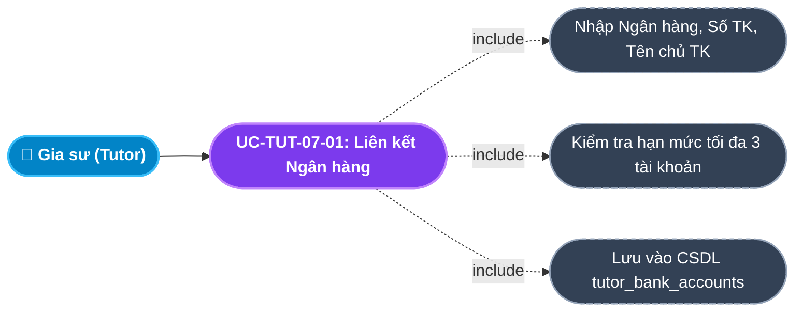
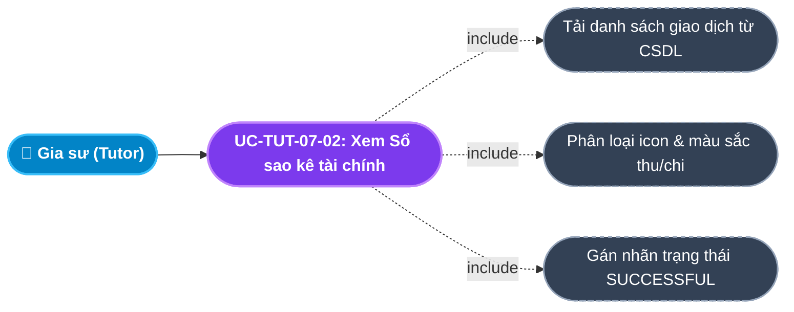
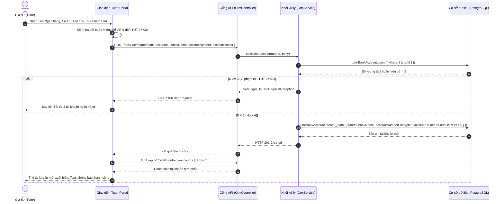

# Usecase: UC-TUT-07 - Quản lý Tài khoản Ngân hàng, Ví thù lao & Rút tiền (Bank Account & Wallet Payout)

## 1. Giới thiệu chức năng
- **Mục đích**: Cung cấp giải pháp quản trị tài chính cá nhân, liên kết tài khoản ngân hàng chính chủ và theo dõi dòng tiền thù lao minh bạch cho Gia sư trên Cổng Đối tác Gia sư (Tutor Portal). Gia sư có thể liên kết tối đa 3 tài khoản ngân hàng thụ hưởng để nhận tiền lương giảng dạy và tiền hoàn cọc tự động từ trung tâm. Phân hệ cung cấp sổ tay sao kê chi tiết mọi giao dịch thu chi (nộp cọc nhận lớp, hoàn cọc, nhận thù lao buổi học, rút tiền về tài khoản ngân hàng), đồng thời hỗ trợ Kế toán thực hiện quyết toán chi trả thù lao (Payout) chính xác và nhanh chóng.
- **Actor (Tác nhân)**: Gia sư (Tutor), Kế toán (Accountant), Quản trị viên (Admin).
- **Điều kiện tiên quyết**: Gia sư đã đăng nhập thành công vào hệ thống với vai trò `TUTOR`.

### Danh mục các chức năng con (Sub-features):
1. **UC-TUT-07-01: Liên kết & Quản lý Tài khoản Ngân hàng (Manage Bank Accounts)**: Khai báo số tài khoản, tên ngân hàng và chủ tài khoản (tối đa 3 tài khoản, tự động gán tài khoản đầu tiên làm mặc định).
2. **UC-TUT-07-02: Hủy liên kết Tài khoản Ngân hàng (Remove Bank Account)**: Xóa bỏ tài khoản ngân hàng không còn sử dụng.
3. **UC-TUT-07-03: Theo dõi Số dư Ví thù lao & Lịch sử Thu nhập (Wallet Balance Tracking)**: Xem số dư khả dụng (`walletBalance`) được tích lũy theo từng buổi học đã dạy và đã được phụ huynh xác nhận.
4. **UC-TUT-07-04: Tra cứu Sổ sao kê giao dịch tài chính (Financial Transactions History)**: Bảng chi tiết toàn bộ các dòng tiền: Nộp cọc (`DEPOSIT_HELD`), Hoàn cọc (`DEPOSIT_REFUNDED`), Nhận lương (`TUTOR_SALARY`), Rút tiền (`SALARY_WITHDRAWAL`), Phạt trừ cọc (`FORFEITED`).
5. **UC-TUT-07-05: Kế toán thực hiện Quyết toán Chi trả Lương (Accountant Payout)**: Kế toán duyệt lệnh chuyển khoản lương về STK gia sư, đưa số dư ví về 0 và ghi nhận giao dịch `SALARY_WITHDRAWAL`.

---

## 2. Dữ liệu nghiệp vụ đầu vào (Input Data & Parameters)

### 2.1. Dữ liệu Liên kết Ngân hàng (Bank Account Form Data)
| Tên trường | Kiểu dữ liệu | Tính chất | Ý nghĩa nghiệp vụ & Ràng buộc thực tế từ Code |
|---|---|---|---|
| `Tên Ngân hàng` (bankName) | Chuỗi (String) | Bắt buộc | Tên ngân hàng thụ hưởng (VD: `Vietcombank`, `MB Bank`, `Techcombank`). Tối đa 100 ký tự. |
| `Số tài khoản` (accountNumber) | Chuỗi (String) | Bắt buộc | Dãy số tài khoản ngân hàng (8 - 20 ký tự số). Được mã hóa lưu trữ an toàn trong CSDL (`accountNumberEncrypted`). |
| `Tên chủ tài khoản` (accountHolder) | Chuỗi (String) | Bắt buộc | Tên in hoa không dấu theo thẻ ngân hàng (VD: `NGUYEN VAN A`). Tối đa 100 ký tự. |
| `Tài khoản mặc định` (isDefault) | Boolean | Tự động gán | Tài khoản đầu tiên thêm vào được gán `isDefault = true`. Dùng làm đích nhận tiền mặc định. |

### 2.2. Bảng phân loại các Loại Giao dịch Tài chính (`TransactionType`)
| Loại giao dịch (Enum) | Nhãn hiển thị | Màu sắc Icon | Chiều dòng tiền | Ý nghĩa nghiệp vụ |
|---|---|---|---|---|
| `DEPOSIT_HELD` | Nộp cọc nhận lớp | Mũi tên lên cam (`#ffab00`) | Chi ra (-) | Gia sư nộp cọc 500k để ký quỹ nhận lớp học. |
| `DEPOSIT_REFUNDED` | Hoàn cọc | Mũi tên xuống xanh (`#71dd37`) | Thu vào (+) | Trung tâm hoàn lại tiền cọc (100% hoặc 50%) cho gia sư. |
| `TUTOR_SALARY` | Nhận lương | Mũi tên xuống xanh (`#71dd37`) | Thu vào (+) | Thù lao buổi dạy được phụ huynh duyệt cộng vào ví gia sư. |
| `SALARY_WITHDRAWAL` | Rút tiền / Quyết toán | Mũi tên lên cam (`#ffab00`) | Chi ra (-) | Kế toán chuyển khoản chi trả tiền từ ví về tài khoản ngân hàng. |
| `FORFEITED` | Phạt trừ cọc | Mũi tên lên đỏ (`#ff3e1d`) | Trừ cọc (-) | Khoản cọc bị tịch thu do vi phạm kỷ luật bỏ dạy. |

---

## 3. Quy tắc nghiệp vụ (Business Rules)

| Mã Quy tắc | Tình huống nghiệp vụ | Cách hệ thống xử lý | Thông báo hiển thị cho người dùng |
|---|---|---|---|
| **BR-TUT-07-01** | **Giới hạn số tài khoản ngân hàng**: Gia sư đã liên kết 3 tài khoản nhưng cố gắng thêm tài khoản thứ 4. | Giao diện ẩn form thêm mới (`bankAccounts.length < 3`); Backend kiểm tra số lượng tài khoản $\ge 3$ $\rightarrow$ Từ chối. | "Mỗi gia sư chỉ được liên kết tối đa 3 tài khoản ngân hàng" |
| **BR-TUT-07-02** | **Bắt buộc nhập đủ thông tin ngân hàng**: Để trống bất kỳ trường nào trong 3 trường bắt buộc. | Client validate `!bankName \|\| !accountNumber \|\| !accountHolder` $\rightarrow$ Chặn submit form. | "Vui lòng điền đầy đủ thông tin tài khoản." |
| **BR-TUT-07-03** | **Cơ chế thiết lập tài khoản mặc định tự động**: Gia sư thêm tài khoản đầu tiên vào hệ thống. | Backend kiểm tra nếu `count === 0` $\rightarrow$ tự động gán `isDefault = true`. | Hiển thị nhãn xanh lá: "Mặc định" |
| **BR-TUT-07-04** | **Quy chuẩn Quyết toán chi trả lương (Payout Rule)**: Kế toán thực hiện bấm Payout trên CRM. | Hệ thống chạy Transaction: 1. Đọc số dư ví `walletBalance`; 2. Tạo bản ghi `Transaction` loại `SALARY_WITHDRAWAL` với số tiền bằng đúng số dư ví; 3. Cập nhật `walletBalance = 0`. | "Quyết toán lương gia sư thành công" |
| **BR-TUT-07-05** | **Bảo toàn dữ liệu lịch sử giao dịch**: Các giao dịch tài chính sau khi đã tạo. | Tuyệt đối không cho phép xóa hay sửa đổi (Immutable Audit Log) để đảm bảo chuẩn mực thanh tra kiểm toán tài chính. | Ghi nhận vĩnh viễn trong CSDL |

---

## 4. Đặc tả chi tiết các Use Case chức năng con (Sub-Use Cases Specification)

---

### 4.1. UC-TUT-07-01: Liên kết Tài khoản Ngân hàng mới (Add Bank Account)

#### Sơ đồ Use Case:

#### Bảng đặc tả nghiệp vụ:

| STT | Hạng mục | Nội dung chi tiết |
|:---:|---|---|
| **1** | **Thông tin chung** | - **UC ID**: `UC-TUT-07-01` - **UC Name**: Liên kết Tài khoản Ngân hàng mới (Add Linked Bank Account) - **Actor**: Gia sư (Tutor) - **Mục tiêu**: Đăng ký thông tin thẻ/tài khoản ngân hàng chính chủ để nhận các khoản thanh toán lương và hoàn cọc từ trung tâm. - **Mô tả**: Nhập tên ngân hàng, số tài khoản và tên chủ tài khoản tại thẻ Tài khoản Ngân hàng trên Tutor Portal. - **Priority**: High |
| **2** | **Trigger** | Gia sư nhập thông tin vào form "Liên kết tài khoản mới" và bấm nút Lưu trên màn hình `/tutor`. |
| **3** | **Pre-condition** | Gia sư đang có ít hơn 3 tài khoản ngân hàng liên kết (`BR-TUT-07-01`). |
| **4** | **Post-condition** | 1. Bản ghi `tutorBankAccount` mới được tạo. 2. Thẻ ngân hàng mới xuất hiện trên danh sách với số tài khoản định dạng font monospace rõ ràng. 3. Toast thông báo: *"Đã liên kết tài khoản ngân hàng thành công!"*. |
| **5** | **Main Flow** | 1. Gia sư cuộn đến khối **"Tài khoản Ngân hàng (Ví)"** tại cột phải Dashboard. 2. Nhập: Tên ngân hàng (`Vietcombank`), Số tài khoản (`1012345678`), Tên chủ tài khoản (`NGUYEN VAN A`). 3. Bấm nút **"Thêm tài khoản"**. 4. Client kiểm tra không để trống dữ liệu (`BR-TUT-07-02`). 5. Client gửi request `POST /api/v1/crm/tutor/bank-accounts` kèm payload. 6. Backend kiểm tra số lượng tài khoản hiện có. Nếu là tài khoản đầu tiên, tự động gán `isDefault = true` (`BR-TUT-07-03`). 7. Backend lưu vào CSDL và trả về `HTTP 201 Created`. 8. Client nạp lại danh sách tài khoản, form nhập liệu được làm trống và hiển thị Toast thành công. |
| **6** | **Alternative / Exception Flow** | - **EF-01 (Bỏ trống thông tin)**: Để trống ô nào $\rightarrow$ Hiển thị cảnh báo đỏ ngay trên form: *"Vui lòng điền đầy đủ thông tin tài khoản."*. |
| **7** | **Business Rules & Validation** | - `BR-TUT-07-01`: Tối đa 3 tài khoản. - `BR-TUT-07-03`: Tự động gán mặc định nếu là tài khoản đầu tiên. |
| **8** | **Acceptance Criteria** | - **AC-01**: Thêm thành công $\rightarrow$ Thẻ tài khoản mới hiển thị đúng tên ngân hàng và số tài khoản. - **AC-02**: Khi đủ 3 tài khoản, form thêm mới tự động ẩn đi. |

---

### 4.2. UC-TUT-07-02: Tra cứu Sổ sao kê giao dịch tài chính (Financial Transactions History)

#### Sơ đồ Use Case:

#### Bảng đặc tả nghiệp vụ:

| STT | Hạng mục | Nội dung chi tiết |
|:---:|---|---|
| **1** | **Thông tin chung** | - **UC ID**: `UC-TUT-07-02` - **UC Name**: Tra cứu Sổ sao kê giao dịch tài chính (Financial Transactions History) - **Actor**: Gia sư (Tutor) - **Mục tiêu**: Giúp gia sư kiểm soát tường minh 100% mọi khoản thu chi, nộp cọc, nhận lương và hoàn cọc để bảo vệ quyền lợi tài chính. - **Mô tả**: Xem bảng sao kê giao dịch tại `/tutor/transactions`, có thời gian, loại giao dịch, số tiền, trạng thái và nội dung đối soát. - **Priority**: High |
| **2** | **Trigger** | Gia sư bấm nút **"Lịch sử GD"** tại khối Tài khoản Ngân hàng hoặc truy cập đường dẫn `/tutor/transactions`. |
| **3** | **Pre-condition** | Đã đăng nhập vào hệ thống với vai trò `TUTOR`. |
| **4** | **Post-condition** | Kết xuất bảng danh sách giao dịch sắp xếp theo thời gian mới nhất lên đầu. |
| **5** | **Main Flow** | 1. Gia sư vào trang Lịch sử giao dịch `/tutor/transactions`. 2. Giao diện hiển thị trạng thái đang tải. 3. Client gửi request `GET /api/v1/finance/tutor/transactions`. 4. Backend truy vấn các bản ghi `Transaction` gắn với `tutorId`, kèm thông tin lớp học và học sinh thụ hưởng. 5. Backend trả về mảng danh sách giao dịch. 6. Giao diện phân loại và hiển thị: Thời gian (Ngày, giờ), Loại giao dịch kèm icon chiều dòng tiền, Số tiền (in đậm màu xanh lá nếu thu vào, màu cam nếu chi ra), Trạng thái (Badge xanh *"Thành công"*), Nội dung giải trình. |
| **6** | **Alternative / Exception Flow** | - **EF-01 (Chưa có giao dịch)**: Nếu rỗng $\rightarrow$ Hiển thị Empty State với icon Đồng hồ: *"Bạn chưa phát sinh giao dịch nộp cọc hay nhận lương nào trên hệ thống."*. |
| **7** | **Business Rules & Validation** | - `BR-TUT-07-05`: Dữ liệu giao dịch là bất biến (Read-only). |
| **8** | **Acceptance Criteria** | - **AC-01**: Tải sao kê giao dịch < 400ms. - **AC-02**: Hiển thị chính xác số tiền format VNĐ (VD: `500.000 đ`). |

---

## 5. Sơ đồ tuần tự nghiệp vụ (Sequence Diagrams)

### 5.1. Sơ đồ: Liên kết Tài khoản Ngân hàng mới

---

## 6. Kịch bản kiểm thử & Nghiệm thu (Given / When / Then)

### Kịch bản 1: Thêm tài khoản ngân hàng đầu tiên (Tự động gán Mặc định)
- **Given**: Gia sư chưa liên kết tài khoản ngân hàng nào.
- **When**: Gia sư nhập Ngân hàng `"Vietcombank"`, Số TK `"1012345678"`, Chủ tài khoản `"NGUYEN VAN A"` và bấm Lưu.
- **Then**: Hệ thống tạo bản ghi mới với `isDefault = true`. Thẻ hiển thị có nhãn Badge màu xanh lá `"Mặc định"`.

### Kịch bản 2: Chặn thêm tài khoản thứ 4 khi đã có 3 tài khoản
- **Given**: Gia sư đã liên kết sẵn 3 tài khoản ngân hàng (Vietcombank, MB Bank, Techcombank).
- **When**: Gia sư kiểm tra giao diện Tutor Portal.
- **Then**: Form nhập liệu thêm tài khoản mới tự động ẩn đi. Nếu gửi request thủ công lên API, Backend trả về lỗi `HTTP 400 Bad Request`.

### Kịch bản 3: Tra cứu lịch sử đối soát nhận lương buổi dạy
- **Given**: Buổi học môn Hóa của gia sư vừa được phụ huynh duyệt hoàn thành với thù lao 250,000 đ.
- **When**: Gia sư truy cập trang Lịch sử giao dịch `/tutor/transactions`.
- **Then**: Bảng xuất hiện dòng giao dịch mới nhất: Loại giao dịch `"Nhận lương"` (`TUTOR_SALARY`), Số tiền `+250.000 đ` màu xanh lá, Trạng thái `"Thành công"`, Nội dung ghi rõ ngày tháng buổi học đối soát.
