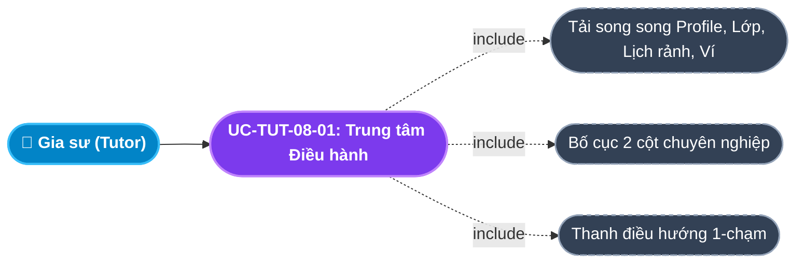
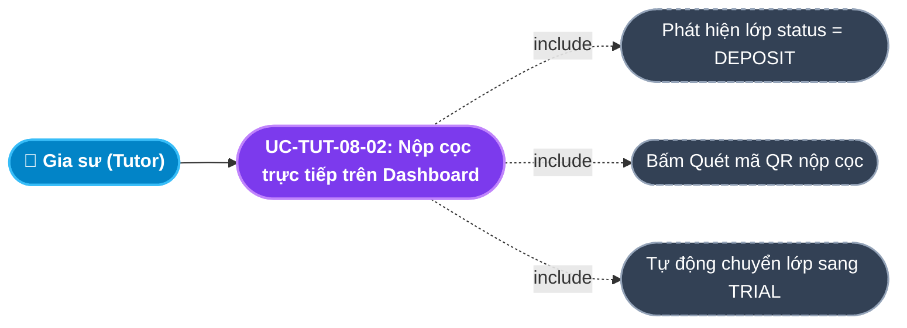
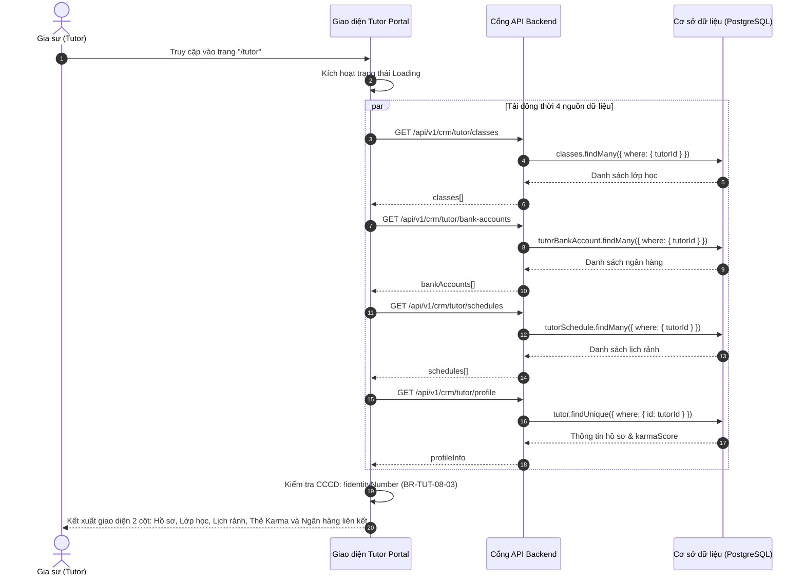

# Usecase: UC-TUT-08 - Dashboard Tổng quan Gia sư & Trung tâm Điều hành (Tutor Dashboard & Operations)

## 1. Giới thiệu chức năng
- **Mục đích**: Cung cấp trung tâm chỉ huy tập trung và bảng điều khiển tổng quan (Operations Dashboard) cho Gia sư trên Cổng Đối tác Gia sư (Tutor Portal). Giao diện được thiết kế theo hướng hành động tức thời (Action-Oriented), hiển thị toàn cảnh tiến độ các lớp học đang phụ trách, trạng thái tiền cọc chờ nộp, điểm tín nhiệm Karma, tài khoản ngân hàng và ma trận lịch rảnh. Hệ thống tích hợp chế độ chỉnh sửa hồ sơ nội tuyến (Inline Edit), banner cảnh báo thông minh khi thiếu thông tin CCCD định danh và điều hướng 1-chạm đến toàn bộ các nghiệp vụ trọng yếu (ghi điểm danh, báo nghỉ dời lịch, nộp cọc và nhận lớp tuyển dụng).
- **Actor (Tác nhân)**: Gia sư (Tutor), Hệ thống Backend (System).
- **Điều kiện tiên quyết**: Gia sư đã đăng nhập thành công vào hệ thống với vai trò `TUTOR`.

### Danh mục các chức năng con (Sub-features):
1. **UC-TUT-08-01: Trung tâm Điều hành Dashboard (Tutor Command Center)**: Hiển thị giao diện 2 cột thông minh: Cột trái (Hồ sơ chuyên môn, Danh sách lớp học, Cấu hình lịch rảnh); Cột phải (Thẻ điểm Karma, Tài khoản ngân hàng liên kết, Lịch sử giao dịch).
2. **UC-TUT-08-02: Thanh điều hướng thao tác nhanh (Quick Navigation Bar)**: 3 nút tác vụ thường xuyên: Báo Nghỉ & Dời Lịch (`/tutor/leaves`), Ghi Điểm Danh (`/tutor/attendance`), Xem Lớp Tuyển Dụng (`/tutor/jobs`).
3. **UC-TUT-08-03: Giám sát trạng thái lớp học & Nộp cọc tức thì**: Hiển thị danh thiếp các lớp học, tự động bật khung cảnh báo vàng kèm nút thanh toán QR khi lớp có trạng thái `DEPOSIT`.
4. **UC-TUT-08-04: Cảnh báo thông minh thiếu CCCD định danh (Smart Missing ID Alert)**: Tự động phát hiện hồ sơ thiếu số CCCD/CMND; hiển thị thông báo nhắc nhở cập nhật để kích hoạt tài khoản `ACTIVE`.
5. **UC-TUT-08-05: Trải nghiệm thông báo Toast không gián đoạn (Non-intrusive Toast Notifications)**: Phản hồi mọi tương tác cập nhật lịch rảnh, lưu hồ sơ, nộp cọc qua thư viện `react-hot-toast` chuyên nghiệp.

---

## 2. Dữ liệu nghiệp vụ đầu vào (Input Data & Parameters)

### 2.1. Dữ liệu Tổng hợp Dashboard Gia sư (Tutor Dashboard Composite Data)
| Khối dữ liệu | Nguồn API Backend | Ý nghĩa nghiệp vụ |
|---|---|---|
| `profileInfo` | `GET /api/v1/crm/tutor/profile` | Họ tên, CCCD, ngày sinh, nghề nghiệp, học vị, trạng thái kiểm duyệt, điểm Karma. |
| `classes` | `GET /api/v1/crm/tutor/classes` | Danh sách lớp học đang dạy kèm thù lao buổi dạy, tên học sinh và trạng thái (`DEPOSIT`, `TRIAL`, `TEACHING`). |
| `bankAccounts` | `GET /api/v1/crm/tutor/bank-accounts` | Danh sách các tài khoản ngân hàng đã liên kết. |
| `schedules` | `GET /api/v1/crm/tutor/schedules` | Danh sách các khung giờ rảnh trong tuần của gia sư. |

### 2.2. Bảng phân loại Trạng thái Lớp trên Dashboard
| Trạng thái | Màu sắc Badge | Nhãn hiển thị | Hành động tương ứng trên Dashboard |
|---|---|---|---|
| `DEPOSIT` | Vàng cam (`#fff8e1` / `#ffab00`) | Chờ Nộp Cọc | Hiển thị khung cảnh báo: *"Bạn cần nộp 500,000đ tiền cọc nhận lớp"* kèm nút quét QR. |
| `TRIAL` | Tím xanh (`#e7e7ff` / `#696cff`) | Đang Dạy Thử | Hiển thị link xem chi tiết lớp học và chuẩn bị ghi điểm danh buổi thử. |
| `TEACHING` | Xanh lá tươi (`#e8fadf` / `#71dd37`) | Đang Giảng Dạy | Lớp học chính thức, hiển thị thù lao buổi dạy và nút ghi điểm danh định kỳ. |

---

## 3. Quy tắc nghiệp vụ (Business Rules)

| Mã Quy tắc | Tình huống nghiệp vụ | Cách hệ thống xử lý | Thông báo hiển thị cho người dùng |
|---|---|---|---|
| **BR-TUT-08-01** | **Cảnh báo nộp cọc nổi bật**: Có lớp học được phụ huynh chọn chuyển sang trạng thái `DEPOSIT`. | Hệ thống tự động render khung viền vàng nổi bật bên trong thẻ lớp học, kèm nút bấm nộp cọc 500k tức thì. | "Bạn cần nộp 500,000đ tiền cọc nhận lớp." |
| **BR-TUT-08-02** | **Cập nhật nội tuyến không reload trang (Inline Editing)**: Gia sư bấm nút Chỉnh sửa hồ sơ. | Trạng thái `editingProfile` chuyển sang `true`, chuyển thẻ sang form nhập liệu mà không bị điều hướng rời khỏi trang. | Chế độ sửa nội tuyến mượt mà |
| **BR-TUT-08-03** | **Cảnh báo thiếu thông tin định danh CCCD**: `profileInfo.identityNumber` để trống. | Hệ thống hiển thị cảnh báo đỏ/vàng nhắc nhở gia sư cập nhật để bộ phận Học vụ có căn cứ phê duyệt tài khoản. | "Vui lòng cập nhật số CCCD để hoàn tất xác minh" |
| **BR-TUT-08-04** | **Phản hồi Toast thông minh**: Mọi thao tác lưu dữ liệu trên Dashboard. | Sử dụng `react-hot-toast` hiển thị góc trên màn hình, tự động ẩn sau 3 giây, hỗ trợ icon thành công/thất bại rõ ràng. | Toast Notification chuyên nghiệp |

---

## 4. Đặc tả chi tiết các Use Case chức năng con (Sub-Use Cases Specification)

---

### 4.1. UC-TUT-08-01: Trung tâm Điều hành Dashboard (Tutor Command Center)

#### Sơ đồ Use Case:

#### Bảng đặc tả nghiệp vụ:

| STT | Hạng mục | Nội dung chi tiết |
|:---:|---|---|
| **1** | **Thông tin chung** | - **UC ID**: `UC-TUT-08-01` - **UC Name**: Trung tâm Điều hành Dashboard (Tutor Command Center) - **Actor**: Gia sư (Tutor) - **Mục tiêu**: Cung cấp góc nhìn 360 độ về tình trạng giảng dạy, uy tín chuyên môn và tài chính cá nhân cho gia sư. - **Mô tả**: Tải và hiển thị tích hợp dữ liệu hồ sơ, danh sách lớp học, cấu hình lịch rảnh, điểm Karma và tài khoản ngân hàng. - **Priority**: High |
| **2** | **Trigger** | Gia sư đăng nhập hoặc truy cập đường dẫn `/tutor`. |
| **3** | **Pre-condition** | Đăng nhập thành công với vai trò `TUTOR`. |
| **4** | **Post-condition** | Kết xuất bảng điều khiển tổng quan đầy đủ các phân khu chức năng. |
| **5** | **Main Flow** | 1. Gia sư vào trang `/tutor`. 2. Giao diện kích hoạt trạng thái loading. 3. Gửi đồng thời 4 API: `tutor/classes`, `tutor/bank-accounts`, `tutor/schedules`, `tutor/profile`. 4. Dữ liệu nạp thành công vào các State tương ứng. 5. Kết xuất bố cục 2 cột: Cột trái (Hồ sơ, Lớp học, Lịch rảnh); Cột phải (Thẻ Karma 100 điểm, Tài khoản ngân hàng liên kết). 6. Hiển thị các nút điều hướng nhanh ở góc trên danh sách lớp. |
| **6** | **Alternative / Exception Flow** | - **EF-01 (Mất mạng)**: Giao diện giữ khung xương cơ bản và hiển thị log lỗi trên console. |
| **7** | **Business Rules & Validation** | - Thời gian tải trang tối ưu < 500ms. |
| **8** | **Acceptance Criteria** | - **AC-01**: Hiển thị đầy đủ thông tin lớp học và số tiền thù lao mỗi buổi format VNĐ. - **AC-02**: Nhấp vào bất kỳ link điều hướng nhanh nào chuyển trang mượt mà không reload cả trang. |

---

### 4.2. UC-TUT-08-02: Giám sát trạng thái lớp học & Nộp cọc tức thì

#### Sơ đồ Use Case:

#### Bảng đặc tả nghiệp vụ:

| STT | Hạng mục | Nội dung chi tiết |
|:---:|---|---|
| **1** | **Thông tin chung** | - **UC ID**: `UC-TUT-08-02` - **UC Name**: Giám sát trạng thái lớp & Nộp cọc tức thì (Class Monitoring & In-dashboard Deposit) - **Actor**: Gia sư (Tutor) - **Mục tiêu**: Giúp gia sư nộp cọc nhận lớp ngay trên Dashboard mà không cần chuyển trang phức tạp, tối ưu hóa tỷ lệ chuyển đổi nhận lớp. - **Mô tả**: Khi có lớp `DEPOSIT`, bấm nút nộp cọc trực tiếp trên thẻ lớp, hệ thống xử lý và cập nhật trạng thái lớp ngay. - **Priority**: High |
| **2** | **Trigger** | Gia sư bấm nút **"Quét mã QR nộp cọc"** bên trong khung cảnh báo vàng của lớp học. |
| **3** | **Pre-condition** | Lớp học đang ở trạng thái `DEPOSIT`. |
| **4** | **Post-condition** | 1. Lớp chuyển sang trạng thái `TRIAL`. 2. Khung cảnh báo vàng biến mất. 3. Toast thông báo: *"Đã nộp cọc giả lập thành công!"*. |
| **5** | **Main Flow** | 1. Gia sư kiểm tra khối danh sách lớp học. 2. Thấy lớp có khung màu vàng: *"Bạn cần nộp 500,000đ tiền cọc nhận lớp"*. 3. Gia sư bấm nút **"Quét mã QR nộp cọc"**. 4. Client gửi request `POST /api/v1/finance/deposit` với `{ classId, amount: 500000 }`. 5. Backend xử lý nộp cọc thành công. 6. Giao diện nạp lại danh sách lớp (`fetchTutorData`). 7. Thẻ lớp đổi sang Badge xanh tím *"Đang Dạy Thử"*, khung nộp cọc biến mất. |
| **6** | **Alternative / Exception Flow** | - **EF-01 (Lỗi nộp cọc)**: Backend trả lỗi $\rightarrow$ Toast hiển thị cảnh báo đỏ từ server. |
| **7** | **Business Rules & Validation** | - `BR-TUT-08-01`: Cảnh báo chỉ xuất hiện đối với lớp `DEPOSIT`. |
| **8** | **Acceptance Criteria** | - **AC-01**: Bấm nộp cọc $\rightarrow$ Lớp chuyển sang `TRIAL` và khung nộp cọc ẩn ngay lập tức. |

---

## 5. Sơ đồ tuần tự nghiệp vụ (Sequence Diagrams)

### 5.1. Sơ đồ: Tải dữ liệu toàn diện Dashboard Gia sư

---

## 6. Kịch bản kiểm thử & Nghiệm thu (Given / When / Then)

### Kịch bản 1: Mở chế độ chỉnh sửa hồ sơ nội tuyến (Inline Editing)
- **Given**: Gia sư đang xem thẻ hồ sơ cá nhân ở chế độ chỉ đọc.
- **When**: Gia sư bấm nút "Chỉnh sửa" ở góc phải thẻ.
- **Then**: Thẻ hồ sơ chuyển sang dạng Form nhập liệu với các ô Họ tên, CCCD, Ngày sinh, Học vị được điền sẵn dữ liệu cũ mà không làm reload hay chuyển trang web.

### Kịch bản 2: Hiển thị cảnh báo nộp cọc trên Dashboard khi có lớp mới
- **Given**: Gia sư vừa được phụ huynh lựa chọn vào dạy thử, lớp chuyển sang trạng thái `DEPOSIT`.
- **When**: Gia sư truy cập màn hình chính `/tutor`.
- **Then**: Thẻ lớp học hiển thị khung màu vàng nổi bật với thông điệp: *"Bạn cần nộp 500,000đ tiền cọc nhận lớp"* kèm nút bấm `"Quét mã QR nộp cọc"`.

### Kịch bản 3: Nộp cọc trực tiếp trên thẻ lớp thành công
- **Given**: Khung cảnh báo nộp cọc 500,000 đ đang hiển thị tại thẻ lớp học.
- **When**: Gia sư click nút "Quét mã QR nộp cọc".
- **Then**: Hệ thống hoàn tất giao dịch trong CSDL, thông báo Toast xanh lá xuất hiện: *"Đã nộp cọc giả lập thành công!"*. Thẻ lớp học chuyển sang Badge màu xanh tím `"Đang Dạy Thử"`.
