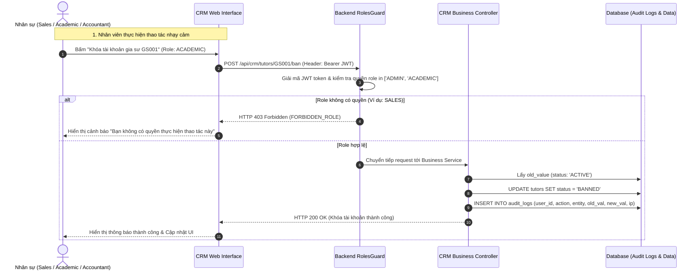

# ĐẶC TẢ NGHIỆP VỤ: PHÂN QUYỀN VAI TRÒ NỘI BỘ & AUDIT LOG (ADMIN CRM)

> **Mã phân hệ:** CRM-01 / AUTH-RBAC  
> **Đối tượng sử dụng:** Giám đốc trung tâm (Admin), Sales, Học vụ (Academic), Kế toán (Accountant)  
> **Cổng truy cập:** `http://localhost:5173/admin-crm`

---

## 1. Mô Hình Phân Quyền Vai Trò Nội Bộ (Role-Based Access Control - RBAC)

Hệ thống quản trị nội bộ Back-office của Trung tâm Gia sư phân tách rõ ràng trách nhiệm giữa 4 vai trò nhân sự:

```text
┌────────────────────────────────────────────────────────────────────────┐
│                        GIÁM ĐỐC TRUNG TÂM (ADMIN)                      │
│      • Toàn quyền hệ thống • Xem báo cáo doanh thu & KPI toàn diện     │
│      • Quản lý tài khoản nhân viên • Cấu hình tham số hệ thống         │
└──────────────────────────────────┬─────────────────────────────────────┘
         ┌─────────────────────────┼─────────────────────────┐
         ▼                         ▼                         ▼
┌─────────────────┐       ┌─────────────────┐       ┌─────────────────┐
│  TƯ VẤN VIÊN    │       │     HỌC VỤ      │       │     KẾ TOÁN     │
│     (SALES)     │       │   (ACADEMIC)    │       │  (ACCOUNTANT)   │
├─────────────────┤       ├─────────────────┤       ├─────────────────┤
│• Tiếp nhận YCGS │       │• Giám sát lớp   │       │• Kiểm soát ví PH│
│• Tư vấn khách   │       │• SLA Dispute 48h│       │• Bảng lương GS  │
│• Thẩm định GS   │       │• Xử lý dời lịch │       │• Duyệt chi Payout│
│• Khớp & Dạy thử │       │• Kỷ luật gia sư │       │• Hóa đơn & Hoàn │
└─────────────────┘       └─────────────────┘       └─────────────────┘
```

---

## 2. Ma Trận Phân Quyền Chức Năng Chi Tiết

| Chức năng nghiệp vụ | ADMIN | SALES | ACADEMIC | ACCOUNTANT |
| :--- | :---: | :---: | :---: | :---: |
| **Xem Dashboard Báo cáo Doanh thu & KPI** | ✅ Toàn quyền | ❌ | ❌ | 👁️ Chỉ xem thu-chi |
| **Xem & Duyệt hồ sơ Gia sư mới** | ✅ | ✅ Toàn quyền | 👁️ Chỉ xem | ❌ |
| **Quản lý danh mục Môn dạy (`tutor_subjects`)**| ✅ | ✅ | 👁️ Chỉ xem | ❌ |
| **Tiếp nhận & Chuyển trạng thái YCGS** | ✅ | ✅ Toàn quyền | 👁️ Chỉ xem | ❌ |
| **Điều phối, Tính % tương thích & Giao dạy thử**| ✅ | ✅ Toàn quyền | 👁️ Chỉ xem | ❌ |
| **Quản lý thông tin Lớp học & Đổi lịch định kỳ**| ✅ | 👁️ Chỉ xem | ✅ Toàn quyền | ❌ |
| **Giải quyết Khiếu nại điểm danh (Disputes)** | ✅ | ❌ | ✅ Toàn quyền | 👁️ Chỉ xem |
| **Xử lý đơn xin nghỉ học / nghỉ dạy** | ✅ | ❌ | ✅ Toàn quyền | ❌ |
| **Xử phạt vi phạm & Khóa tài khoản gia sư** | ✅ | ❌ | ✅ Kiến nghị/Duyệt| ❌ |
| **Duyệt lệnh rút lương gia sư (Payout)** | ✅ | ❌ | ❌ | ✅ Toàn quyền |
| **Thực hiện Hoàn tiền học phí (Refund)** | ✅ | ❌ | 👁️ Xác nhận lỗi | ✅ Thực thi chi |
| **Xem Nhật ký kiểm toán hệ thống (`audit_logs`)**| ✅ Toàn quyền | ❌ | ❌ | ❌ |

---

## 3. Cơ Chế Nhật Ký Kiểm Toán (Audit Logging System)

Để ngăn chặn gian lận nội bộ và phục vụ công tác thanh tra khi có sự cố, mọi hành động nhạy cảm trên hệ thống đều được tự động ghi lại vào bảng `audit_logs` với các trường:
* `id`: Định danh UUID.
* `user_id`: Nhân viên thực hiện thao tác.
* `action`: Tên hành vi (ví dụ: `TUTOR_STATUS_UPDATE`, `DISPUTE_RESOLVED`, `PAYOUT_APPROVED`, `PACKAGE_REFUNDED`).
* `entity_type`: Tên bảng bị ảnh hưởng (`tutors`, `classes`, `sessions`, `transactions`...).
* `entity_id`: ID của đối tượng bị thay đổi.
* `old_value`: Giá trị JSON trước khi đổi.
* `new_value`: Giá trị JSON sau khi đổi.
* `ip_address`: Địa chỉ IP của máy thao tác.
* `created_at`: Thời gian chính xác đến mili-giây.

### 3.1. Các hành vi bắt buộc ghi Audit Log:
1. Phê duyệt hoặc khóa tài khoản Gia sư (`PENDING_REVIEW` $\rightarrow$ `ACTIVE` / `BANNED`).
2. Giao lớp dạy thử cho gia sư (`TRIAL_PENDING`).
3. Ra phán quyết giải quyết khiếu nại điểm danh (`RESOLVED_*`).
4. Kế toán xác nhận chuyển khoản lương cho gia sư.
5. Thực hiện hoàn tiền gói học phí.
6. Thay đổi lịch học định kỳ của lớp học.

### 3.2. Sơ đồ tuần tự: Kiểm tra quyền & Ghi vết Audit Log (Sequence Diagram)



---

## 4. Bảo Mật Endpoint API Phía Server (Backend Guards)

* **JWT Strategy**: Mỗi request từ Admin CRM gửi lên đều mang Bearer Token chứa `role`.
* **RolesGuard**: Hệ thống kiểm tra annotation `@Roles('ADMIN', 'SALES'...)` trên từng controller/endpoint:
  * Nếu role không khớp: Trả về HTTP `403 FORBIDDEN` ngay lập tức.
  * Nếu token hết hạn: Trả về HTTP `401 UNAUTHORIZED`.

---

## 5. Danh Sách Mã Lỗi Phục Vụ Dev & QA

| Mã lỗi (Error Code) | HTTP Status | Nguyên nhân | Hướng xử lý |
| :--- | :---: | :--- | :--- |
| `FORBIDDEN_ROLE` | 403 | Tài khoản nhân viên không có quyền truy cập module này. | Đăng nhập tài khoản có quyền tương ứng. |
| `STAFF_INACTIVE` | 403 | Tài khoản nhân viên đã bị vô hiệu hóa. | Liên hệ Admin để kích hoạt lại. |
| `AUDIT_LOG_FAILED` | 500 | Lỗi ghi vết kiểm toán, giao dịch nghiệp vụ bị rollback để đảm bảo an toàn. | Kiểm tra log database. |
