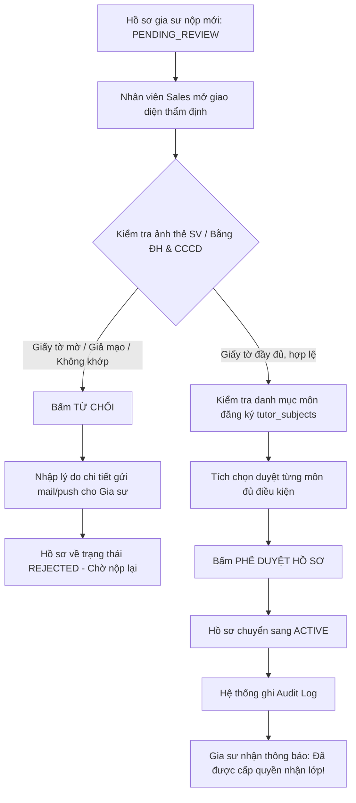
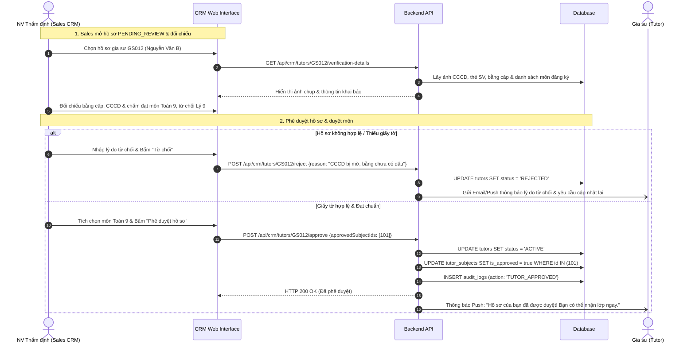

# ĐẶC TẢ NGHIỆP VỤ: THẨM ĐỊNH HỒ SƠ GIA SƯ & DUYỆT MÔN DẠY (ADMIN CRM)

> **Mã phân hệ:** CRM-02 / TUT-ADMIN  
> **Đối tượng sử dụng:** Tư vấn viên (Sales), Quản trị viên (Admin)  
> **Cổng truy cập:** `http://localhost:5173/admin-crm` (Tab Quản lý Gia sư)

---

## 1. Mục Tiêu Nghiệp Vụ
Chất lượng của trung tâm gia sư phụ thuộc trực tiếp vào chất lượng đội ngũ gia sư. Phân hệ Thẩm định giúp nhân viên trung tâm kiểm tra tính xác thực của bằng cấp, đối chiếu năng lực thực tế trước khi cấp quyền cho gia sư tham gia ứng tuyển lớp học.

---

## 2. Quy Trình Thẩm Định Hồ Sơ Gia Sư

### 2.1. Sơ đồ tuần tự: Thẩm định hồ sơ & Duyệt môn dạy (Sequence Diagram)

---

## 3. Các Tiêu Chuẩn Thẩm Định Thực Tế

### 3.1. Thẩm định danh tính & Giấy tờ tùy thân
* **Đối chiếu số CCCD**: Đối chiếu số CCCD gia sư nhập với ảnh chụp 2 mặt giấy tờ gốc.
* **Đối chiếu ảnh chân dung**: Khuôn mặt trên ảnh chụp CCCD phải khớp với ảnh đại diện hồ sơ.
* **Độ tuổi**: Đảm bảo gia sư từ đủ 18 tuổi trở lên.

### 3.2. Thẩm định Chuyên môn & Phê duyệt Môn dạy (`tutor_subjects`)
Nhân viên thẩm định xét duyệt từng môn học mà gia sư đăng ký:
* **Môn Toán / Lý / Hóa cấp 3 (Lớp 10-12)**: Yêu cầu gia sư học các ngành Tự nhiên, Sư phạm, Kỹ thuật (ĐH Bách Khoa, KHTN, Sư Phạm...) hoặc có điểm thi ĐH môn đó $\ge 8.5$.
* **Môn Tiếng Anh**: Yêu cầu có chứng chỉ IELTS $\ge 6.5$, TOEIC $\ge 800$, hoặc là sinh viên chuyên ngành Ngôn ngữ Anh.
* **Môn Tiểu học (Lớp 1-5)**: Yêu cầu sinh viên khoa Giáo dục Tiểu học hoặc có kỹ năng luyện chữ đẹp, tính kiên nhẫn cao.
* **Hành động**: Nhân viên có quyền **Duyệt môn Toán** nhưng **Từ chối môn Tiếng Anh** nếu gia sư không cung cấp được chứng chỉ tiếng Anh hợp lệ.

---

## 4. Quản Lý Trạng Thái Gia Sư (`TutorStatus`)

| Trạng thái | Ý nghĩa | Quyền hạn trên Tutor Portal |
| :--- | :--- | :--- |
| `PENDING_REVIEW` | Hồ sơ mới tạo, đang chờ xét duyệt. | Chỉ xem được thông tin cá nhân, **chưa được xem hay ứng tuyển lớp tuyển**. |
| `ACTIVE` | Hồ sơ đã được duyệt đạt chuẩn. | Toàn quyền ứng tuyển lớp mới, điểm danh và rút lương. |
| `BANNED` | Bị khóa kỷ luật do vi phạm quy định. | **Bị khóa toàn bộ tính năng**, thu hồi các lớp đang dạy, đóng băng ví lương. |

---

## 5. Danh Sách Mã Lỗi Phục Vụ Dev & QA

| Mã lỗi (Error Code) | HTTP Status | Nguyên nhân | Hướng xử lý |
| :--- | :---: | :--- | :--- |
| `TUTOR_ALREADY_ACTIVE` | 400 | Hồ sơ này đã được duyệt trước đó rồi. | Tải lại danh sách gia sư. |
| `REJECTION_REASON_REQUIRED`| 422 | Bấm từ chối hồ sơ nhưng không nhập lý do phản hồi. | Bắt buộc nhập lý do (tối thiểu 10 ký tự). |
| `NO_SUBJECTS_APPROVED` | 400 | Phê duyệt hồ sơ nhưng không tích chọn duyệt môn dạy nào. | Bắt buộc duyệt ít nhất 1 môn dạy hợp lệ. |
| `CANNOT_BAN_ACTIVE_CLASSES`| 400 | Gia sư đang có lớp học chính thức chưa hoàn tất bàn giao. | Yêu cầu chuyển giao lớp trước khi khóa vĩnh viễn. |
