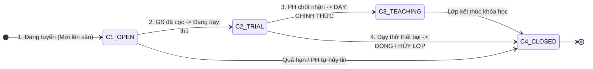

# ĐẶC TẢ NGHIỆP VỤ: BẢNG KANBAN GIÁM SÁT VÒNG ĐỜI LỚP HỌC (ADMIN CRM)

> **Mã phân hệ:** CRM-REF-02  
> **Phân hệ:** Cổng Quản trị Trung tâm (Admin CRM)  
> **Đối tượng:** Quản trị viên (Admin), Nhân viên Vận hành, Kế toán

---

## 1. Bản Đồ 4 Giai Đoạn Vòng Đời Lớp Học (Class Lifecycle Kanban)

Trên mô hình sàn tự động, bảng Kanban đóng vai trò là **Bảng giám sát trạng thái lớp học theo thời gian thực** gồm 4 cột:

---

## 2. Chi Tiết Từng Giai Đoạn Trên Bảng Kanban

### 2.1. Cột 1: `ĐANG TUYỂN` (OPEN)
* Lớp vừa được phụ huynh tạo trên web, hệ thống tự duyệt và đăng ngay lên Sàn lớp.
* Đồng thời, hệ thống đang gửi thông báo chuông Web mời Top 5 gia sư phù hợp vào xem.
* **Chuyển trạng thái:** Ngay khi có 1 gia sư quét mã VietQR nộp cọc 500k thành công $\rightarrow$ Thẻ lớp tự động chuyển sang cột `ĐANG DẠY THỬ`.

### 2.2. Cột 2: `ĐANG DẠY THỬ` (TRIAL)
* Thẻ lớp hiển thị thông tin gia sư đã đóng cọc và quy chuẩn số buổi dạy thử:
  * Nếu gia sư là Giáo viên: Tag `GV - 1 BUỔI THỬ`.
  * Nếu gia sư là Sinh viên: Tag `SV - 2 BUỔI THỬ`.
* Đồng hồ đếm ngược hạn dạy thử.
* Sau khi hoàn tất số buổi dạy thử, hệ thống tự động gửi form đánh giá cho phụ huynh trên web.

### 2.3. Cột 3: `HỌC CHÍNH THỨC` (TEACHING)
* Phụ huynh bấm *"Chốt nhận gia sư"* trên web.
* Tiền cọc 500k của gia sư tự động chuyển thành Doanh thu phí môi giới của trung tâm.
* Lớp đi vào học định kỳ hàng tuần, phụ huynh thanh toán trực tiếp cho gia sư cuối tháng.

### 2.4. Cột 4: `ĐÃ ĐÓNG / HỦY LỚP` (CLOSED)
* Lớp hoàn tất khóa học hoặc bị hủy giữa chừng.
* **Bắt buộc lưu lý do đóng lớp (`cancel_reason`):**
  * *Hủy do lỗi Gia sư:* Dạy kém, đến muộn $\rightarrow$ Tịch thu cọc, phạt điểm Karma.
  * *Hủy do lỗi Phụ huynh:* Gia đình bận, đổi ý $\rightarrow$ Kế toán hoàn 100% cọc (500k) cho gia sư trong 24h.
  * *Khóa học kết thúc:* Học sinh đã thi đỗ chuyển cấp / thi xong đại học.

---

## 3. Chế Độ Xem Kép (Dual View Mode)

Với số lượng lớp học lớn, bảng giám sát được thiết kế với 2 chế độ hiển thị (chuyển đổi bằng nút bấm toggle):
* **Chế độ Kanban Board (Dạng thẻ):**
  * Theo dõi trực quan tiến trình của từng lớp theo 4 cột trạng thái.
  * Mỗi cột được thiết kế thanh cuộn (scrollbar) dọc độc lập, ngăn tình trạng cuộn toàn trang làm mất tiêu đề cột.
  * Thẻ lớp hiển thị Avatar học sinh & gia sư sinh động, trạng thái lớp, và mức học phí.
* **Chế độ Danh sách (Table View):**
  * Hiển thị danh sách lớp học dưới dạng Bảng truyền thống, gọn gàng và dễ theo dõi số liệu.
  * Tích hợp cơ chế **Phân trang (Pagination)** giúp tải dữ liệu nhanh chóng khi số lượng bản ghi lên tới hàng ngàn lớp.
  * Phù hợp cho Kế toán hoặc Quản lý khi cần quét, lọc và xem thông tin dạng tổng hợp nhanh gọn.
