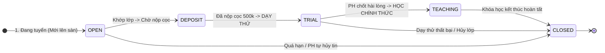
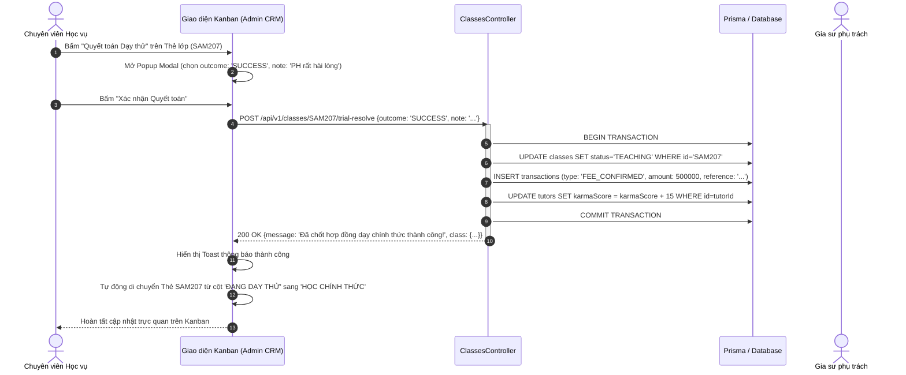

# Usecase: UC-ADM-02 - Bảng Kanban Giám sát Vòng đời Lớp học (Class Lifecycle Kanban & Dual-View Monitor)

> **Mã phân hệ:** CRM-REF-02  
> **Phân hệ:** Cổng Quản trị Trung tâm (Admin CRM)  
> **Tác nhân chính:** Quản trị viên (Admin), Chuyên viên Vận hành / Học vụ (Academic Staff), Kế toán (Accountant), Chuyên viên Tư vấn (Sales)

---

## 1. Giới thiệu chức năng

### 1.1. Mục đích
Cung cấp bảng điều khiển trung tâm trực quan hóa toàn bộ vòng đời của tất cả các lớp học trong hệ thống theo thời gian thực (Real-time Class Lifecycle Monitoring). Bảng giám sát áp dụng mô hình luồng công việc 4 giai đoạn chuẩn mực, hỗ trợ **Chế độ xem Kép (Dual View Mode: Kanban Board dạng cột thẻ & Data Table dạng bảng phân trang)**. Chức năng giúp đội ngũ vận hành nắm bắt ngay lập tức các điểm tắc nghẽn (Bottlenecks) trong khâu dạy thử, kiểm soát tiến độ chốt hợp đồng, quản lý lịch học cố định và ghi nhận lý do đóng lớp minh bạch phục vụ kế toán đối soát.

### 1.2. Actor (Tác nhân)
* **Quản trị viên (Admin)**: Toàn quyền giám sát, lọc dữ liệu, cấu hình trạng thái và xử lý khẩn cấp mọi lớp học.
* **Chuyên viên Vận hành / Học vụ (Academic Staff)**: Giám sát giai đoạn dạy thử (`TRIAL`), nhắc nhở gia sư nộp giáo án/báo cáo, hỗ trợ phụ huynh đánh giá chất lượng buổi thử, điều chỉnh lịch học cố định.
* **Kế toán (Accountant)**: Theo dõi chuyển dịch tiền cọc khi lớp sang trạng thái `TEACHING` (chốt doanh thu) hoặc `CLOSED` (hoàn cọc/phạt cọc).
* **Chuyên viên Tư vấn (Sales)**: Theo dõi các lớp ở cột `OPEN` để kịp thời kích hoạt ghép lớp hoặc hỗ trợ gia sư ứng tuyển.

### 1.3. Điều kiện tiên quyết
* Người dùng đã đăng nhập hệ thống và được gán vai trò `ADMIN`, `SALES`, `ACADEMIC` hoặc `ACCOUNTANT`.
* Dữ liệu lớp học đã được khởi tạo thông qua luồng ghép lớp (`matchingService.assignTutor`) hoặc phụ huynh đăng tin.

### 1.4. Danh mục các chức năng con (Sub-features)
1. **UC-ADM-02-01**: Giám sát Vòng đời Lớp học trên Bảng Kanban 4 Cột (Kanban Board Real-time Tracking).
2. **UC-ADM-02-02**: Chuyển đổi Chế độ Xem Kép & Phân trang Dữ liệu (Dual View Toggle & Pagination).
3. **UC-ADM-02-03**: Phê duyệt Kết quả Dạy thử & Quyết toán Trạng thái Lớp (Trial Evaluation Resolution).
4. **UC-ADM-02-04**: Thiết lập & Chuẩn hóa Lịch học Cố định Hàng tuần (Class Weekly Schedule Management).

---

## 2. Dữ liệu nghiệp vụ đầu vào (Input Data & Parameters)

### 2.1. Cấu trúc Vòng đời Trạng thái Lớp học (`ClassStatus`)



### 2.2. Chi tiết 4 Cột Giám sát trên Giao diện Kanban

| Tên Cột | Mã Trạng thái DB | Dữ liệu hiển thị trên Thẻ (Card) | Quy định vận hành |
| :--- | :--- | :--- | :--- |
| **1. ĐANG TUYỂN** | `OPEN` / `DEPOSIT` | • Mã lớp (VD: `SAM207`)<br>• Tên học sinh, khối lớp, môn học<br>• Học phí đề xuất/buổi<br>• Số lượng gia sư đã nộp đơn ứng tuyển | Lớp mới niêm yết công khai trên Sàn. Nếu đã có gia sư nộp cọc hoặc được duyệt gán, thẻ tự động nhảy sang cột 2. |
| **2. ĐANG DẠY THỬ** | `TRIAL` | • Thông tin Gia sư phụ trách kèm Avatar<br>• Tag định danh: `GV - 1 BUỔI THỬ` hoặc `SV - 2 BUỔI THỬ`<br>• Đồng hồ đếm ngược hạn dạy thử (SLA 7 ngày)<br>• Trạng thái buổi thử (Đã dạy / Chờ dạy) | Hệ thống tự động sinh buổi dạy thử. Học vụ theo dõi để kích hoạt form đánh giá cho phụ huynh ngay sau buổi học. |
| **3. HỌC CHÍNH THỨC**| `TEACHING` | • Gia sư chính thức & Học sinh<br>• Lịch học cố định trong tuần (VD: T2-T4 19:00)<br>• Tổng số buổi đã học / Số buổi còn lại<br>• Badge doanh thu phí môi giới: `ĐÃ THU PHÍ 500K` | Lớp đang vận hành ổn định định kỳ. Tiền cọc 500k đã chuyển hóa thành doanh thu `FEE_CONFIRMED`. |
| **4. ĐÃ ĐÓNG / HỦY** | `CLOSED` | • Lý do hủy (`cancelReason`)<br>• Quyết định cọc: `HOÀN CỌC 100%`, `TỊCH THU`, `HOÀN CỌC 50%`<br>• Ngày đóng lớp & Người ra quyết định | Toàn bộ các lớp ngừng hoạt động (do kết thúc khóa học hoặc đổ vỡ dạy thử) được lưu trữ tại đây để tra cứu kiểm toán. |

### 2.3. Tham số Đầu vào Thao tác Quyết toán Dạy thử (`POST /api/v1/classes/:id/trial-resolve`)

| Tham số | Kiểu dữ liệu | Bắt buộc | Mô tả & Ràng buộc giá trị |
| :--- | :--- | :---: | :--- |
| `classId` | UUID (URL Param) | Có | Định danh duy nhất của lớp học trong bảng `classes`. |
| `outcome` | String (Body) | Có | Kết quả giải quyết: `SUCCESS` (Chốt học chính thức), `FAIL_REFUND` (Dạy thử thất bại, hoàn cọc cho GS), `FAIL_REOPEN` (Mở lại lớp tuyển gia sư khác). |
| `note` | String (Body) | Không | Ghi chú giải trình của Học vụ/Admin về nguyên nhân dẫn đến phán quyết. |

---

## 3. Quy tắc nghiệp vụ (Business Rules)

| Mã BR | Tình huống kích hoạt | Xử lý của hệ thống | Mã lỗi / Phản hồi |
| :--- | :--- | :--- | :--- |
| **BR-ADM-02-01** | Gia sư nộp cọc 500,000 VNĐ thành công. | Hệ thống chuyển ngay `status` từ `DEPOSIT` sang `TRIAL`. Tạo bản ghi giao dịch `Transaction` loại `DEPOSIT_HELD` giá trị 500,000 VNĐ. Thẻ lớp trên Kanban tự động dịch chuyển từ Cột 1 sang Cột 2 mà không cần reload trang. | `CLASS_STATUS_UPDATED` |
| **BR-ADM-02-02** | Phân loại quy chuẩn số buổi dạy thử theo chức danh gia sư. | Hệ thống kiểm tra `tutorType` của gia sư: Nếu là `TEACHER` $\rightarrow$ Gắn tag `GV - 1 BUỔI THỬ`; Nếu là `STUDENT` $\rightarrow$ Gắn tag `SV - 2 BUỔI THỬ`. Hệ thống chỉ cho phép chốt lớp sau khi học sinh đã học đủ số buổi thử quy định. | `TRIAL_RULE_ENFORCED` |
| **BR-ADM-02-03** | Chốt kết quả dạy thử thành công (`SUCCESS`). | Khi chọn `outcome: 'SUCCESS'`: Hệ thống cập nhật `status = 'TEACHING'`, tạo giao dịch `Transaction` loại `FEE_CONFIRMED` số tiền 500,000 VNĐ ghi nhận doanh thu công ty, cộng $+15$ điểm tín nhiệm Karma cho gia sư. Thẻ lớp chuyển sang Cột 3. | `200 OK` ("Đã chốt hợp đồng dạy chính thức thành công!") |
| **BR-ADM-02-04** | Đóng lớp do dạy thử thất bại (`FAIL_REFUND`). | Khi chọn `outcome: 'FAIL_REFUND'`: Hệ thống cập nhật `status = 'CLOSED'`, lưu `cancelReason = body.note`, tạo giao dịch `Transaction` loại `DEPOSIT_REFUNDED` 500,000 VNĐ để kế toán chuyển khoản trả lại gia sư, điểm Karma của gia sư được bảo toàn. | `200 OK` ("Đã xử lý quyết toán lớp dạy thử.") |
| **BR-ADM-02-05** | Thiết lập lịch học cố định hàng tuần (`POST /api/v1/classes/:id/schedules`). | Mảng `schedules` phải chứa từ 1 đến 7 khung giờ. Hệ thống tự động gắn cờ `deletedAt = NOW()` và `isActive = false` cho các khung giờ cũ trước khi chèn mới, đảm bảo tính toàn vẹn dữ liệu lịch học. | `400 BAD_REQUEST` ("Danh sách lịch học không hợp lệ") |

---

## 4. Đặc tả chi tiết các Use Case chức năng con

```mermaid
usecaseDiagram
    actor "Chuyên viên Học vụ" as Academic
    actor "Kế toán" as Accountant
    actor "Quản trị viên" as Admin

    package "UC-ADM-02: Quản lý Kanban Vòng đời Lớp học" {
        usecase "UC-ADM-02-01: Giám sát Kanban 4 Cột Real-time" as UC1
        usecase "UC-ADM-02-02: Chuyển đổi Dual-View & Phân trang" as UC2
        usecase "UC-ADM-02-03: Quyết toán Kết quả Dạy thử" as UC3
        usecase "UC-ADM-02-04: Thiết lập Lịch học Cố định Tuần" as UC4
    }

    Academic --> UC1
    Accountant --> UC1
    Admin --> UC1

    Academic --> UC2
    Accountant --> UC2

    Academic --> UC3
    Admin --> UC3

    Academic --> UC4
```

### 4.1. UC-ADM-02-01: Giám sát Kanban 4 Cột Real-time (Kanban Board Real-time Tracking)
* **Mục tiêu**: Cung cấp bức tranh toàn cảnh về tiến độ của toàn bộ các lớp học trên một màn hình trực quan.
* **Tác nhân**: Quản trị viên, Nhân viên Học vụ, Kế toán.
* **Tiền điều kiện**: Đăng nhập quyền truy cập `/admin-crm`. Tab `classes` được kích hoạt.
* **Hậu điều kiện**: Dữ liệu lớp học được phân bổ chính xác vào 4 cột tương ứng.
* **Luồng cơ bản**:
  1. Người dùng bấm vào mục "Kanban Lớp học" trên thanh menu bên trái.
  2. Frontend gọi API `GET /api/v1/crm/classes`.
  3. Hệ thống trả về mảng danh sách các lớp học kèm thông tin quan hệ (`student`, `tutor`, `parent`, `tutorRequest`).
  4. Giao diện render 4 cột Kanban độc lập:
     * Cột 1 `ĐANG TUYỂN`: Lọc các lớp có `status === 'OPEN'` hoặc `'DEPOSIT'`.
     * Cột 2 `ĐANG DẠY THỬ`: Lọc các lớp có `status === 'TRIAL'`.
     * Cột 3 `HỌC CHÍNH THỨC`: Lọc các lớp có `status === 'TEACHING'`.
     * Cột 4 `ĐÃ ĐÓNG / HỦY`: Lọc các lớp có `status === 'CLOSED'`.
  5. Mỗi cột có thanh cuộn riêng biệt (Vertical Scroll), tiêu đề cột luôn ghim cố định ở đỉnh để thuận tiện thao tác.
* **Dữ liệu đầu ra**: Bảng Kanban 4 cột với số lượng lớp học được đếm tự động trên badge tiêu đề từng cột.

### 4.2. UC-ADM-02-02: Chuyển đổi Dual-View & Phân trang (Dual View Toggle & Pagination)
* **Mục tiêu**: Cho phép người dùng chuyển đổi linh hoạt giữa giao diện thẻ sinh động và giao diện bảng số liệu phân trang tốc độ cao khi quản lý hàng ngàn bản ghi.
* **Tác nhân**: Kế toán, Chuyên viên Quản trị.
* **Tiền điều kiện**: Đang ở màn hình quản lý Lớp học.
* **Hậu điều kiện**: Dữ liệu chuyển đổi giữa dạng `kanban` và dạng `table`.
* **Luồng cơ bản**:
  1. Người dùng bấm nút biểu tượng "Dạng Bảng" (Table View Icon) trên thanh công cụ góc phải.
  2. Biến trạng thái `classViewMode` chuyển thành `'table'`.
  3. Giao diện chuyển sang hiển thị bảng Data Table tiêu chuẩn:
     * Các cột: Mã Lớp, Học Sinh, Môn & Khối Lớp, Gia Sư, Học Phí/Buổi, Trạng Thái, Hành Động.
     * Áp dụng thuật toán phân trang Client-side / Server-side: `paginatedClasses` giới hạn 10 bản ghi/trang (`ITEMS_PER_PAGE = 10`).
  4. Người dùng có thể bấm chuyển trang (1, 2, 3...) hoặc gõ từ khóa tìm kiếm trên thanh tìm kiếm để lọc tức thì theo Mã lớp, Tên học sinh hoặc Môn học.
  5. Bấm lại nút biểu tượng "Dạng Thẻ" (LayoutGrid) để quay trở lại chế độ Kanban Board.
* **Dữ liệu đầu ra**: Giao diện hiển thị bảng dữ liệu gọn gàng kèm thanh điều hướng phân trang.

### 4.3. UC-ADM-02-03: Phê duyệt Kết quả Dạy thử & Quyết toán Trạng thái Lớp (Trial Evaluation Resolution)
* **Mục tiêu**: Xử lý phán quyết sau khi gia sư hoàn tất 1-2 buổi dạy thử, chốt hợp đồng chính thức hoặc xử lý hoàn cọc.
* **Tác nhân**: Chuyên viên Học vụ, Admin.
* **Tiền điều kiện**: Lớp học đang ở cột `TRIAL` (`status === 'TRIAL'`).
* **Hậu điều kiện**: Lớp học được cập nhật sang trạng thái `TEACHING`, `CLOSED` hoặc `OPEN`.
* **Luồng cơ bản**:
  1. Trên thẻ lớp ở cột `TRIAL`, Học vụ bấm nút "Quyết Toán Dạy Thử" (hoặc từ menu dropdown).
  2. Popup modal xác nhận mở ra với các lựa chọn phán quyết:
     * `SUCCESS`: Dạy thử thành công, phụ huynh chốt học chính thức.
     * `FAIL_REFUND`: Dạy thử không thành công do phụ huynh đổi ý/không hợp, hoàn cọc cho gia sư.
     * `FAIL_REOPEN`: Dạy thử thất bại do gia sư, gỡ gia sư và mở lại tuyển người mới.
  3. Nhân viên nhập ghi chú giải trình (`note`) và bấm "Xác nhận Quyết toán".
  4. Frontend gửi yêu cầu `POST /api/v1/classes/:id/trial-resolve`.
  5. Backend thực thi Transaction Prisma:
     * Cập nhật `Class.status` tương ứng.
     * Tạo bản ghi `Transaction` tương ứng (`FEE_CONFIRMED` hoặc `DEPOSIT_REFUNDED`).
  6. Trả về thông báo thành công qua Toast notification. Thẻ lớp lập tức di chuyển sang cột tương ứng trên Kanban.
* **Luồng ngoại lệ**: Nếu ID lớp học không tồn tại hoặc đã bị xóa, hệ thống báo lỗi `404 NOT_FOUND` ("Không tìm thấy lớp học").
* **Dữ liệu đầu ra**: Bản ghi `Class` và `Transaction` được cập nhật trong cơ sở dữ liệu.

### 4.4. UC-ADM-02-04: Thiết lập & Chuẩn hóa Lịch học Cố định Hàng tuần (Class Weekly Schedule Management)
* **Mục tiêu**: Cài đặt các buổi học cố định trong tuần để tự động sinh lịch học định kỳ và kiểm soát điểm danh.
* **Tác nhân**: Chuyên viên Học vụ, Gia sư.
* **Tiền điều kiện**: Lớp học đã được chốt gia sư (`TRIAL` hoặc `TEACHING`).
* **Hậu điều kiện**: Bảng `class_schedules` ghi nhận các khung giờ học mới.
* **Luồng cơ bản**:
  1. Học vụ mở chi tiết lớp học (`GET /api/v1/classes/:id`).
  2. Bấm vào nút "Cấu hình Lịch học Cố định".
  3. Chọn thứ trong tuần (`dayOfWeek`: 2 đến 8 tương ứng Thứ Hai đến Chủ Nhật), giờ bắt đầu (`slotStart`: HH:mm) và giờ kết thúc (`slotEnd`: HH:mm).
  4. Bấm "Lưu Lịch Học".
  5. Backend thực thi vô hiệu hóa các bản ghi lịch cũ (`isActive = false, deletedAt = NOW()`) và tạo danh sách bản ghi mới trong bảng `class_schedules`.
  6. Hệ thống hiển thị thông báo: *"Đã thiết lập n khung giờ học cố định trong tuần."*.
* **Dữ liệu đầu ra**: Danh sách bản ghi `ClassSchedule` hợp lệ liên kết với `classId`.

---

## 5. Sơ đồ tuần tự nghiệp vụ (Sequence Diagrams)



---

## 6. Kịch bản kiểm thử & Nghiệm thu (Test Scenarios)

### Kịch bản 1: Giám sát và kéo thả/chuyển trạng thái lớp học sang Học chính thức
* **Given**: Lớp `SAM207` đang ở cột `ĐANG DẠY THỬ` (`status: 'TRIAL'`), đã hoàn thành 2 buổi dạy thử với học sinh.
* **When**: Nhân viên Học vụ chọn phán quyết `outcome = 'SUCCESS'` và bấm xác nhận.
* **Then**:
  * Trạng thái lớp trong DB cập nhật thành `TEACHING`.
  * Bản ghi `Transaction` loại `FEE_CONFIRMED` số tiền `500,000 VNĐ` được ghi nhận.
  * Thẻ lớp trên giao diện Kanban chuyển sang cột `HỌC CHÍNH THỨC`.
  * Gia sư nhận thông báo chốt lớp thành công và được cộng 15 điểm Karma.

### Kịch bản 2: Dạy thử thất bại - Chuyển sang Đã Đóng và Hoàn cọc cho Gia sư
* **Given**: Lớp `SAM301` ở trạng thái `TRIAL`, gia sư đã dạy thử 1 buổi nhưng phụ huynh thông báo con bận lịch học thêm ở trường không theo tiếp được.
* **When**: Học vụ chọn phán quyết `outcome = 'FAIL_REFUND'` kèm ghi chú: "Phụ huynh hủy do trùng lịch học trường".
* **Then**:
  * Trạng thái lớp cập nhật sang `CLOSED`.
  * Trường `cancelReason` lưu chính xác ghi chú của Học vụ.
  * Bản ghi `Transaction` loại `DEPOSIT_REFUNDED` 500,000 VNĐ được tạo ra ở trạng thái chờ kế toán chuyển khoản.
  * Thẻ lớp chuyển sang cột `ĐÃ ĐÓNG / HỦY`.

### Kịch bản 3: Chuyển đổi linh hoạt giữa chế độ Kanban và Bảng Table phân trang
* **Given**: Hệ thống đang có 35 lớp học hoạt động.
* **When**: Người dùng bấm nút chuyển chế độ xem sang dạng Bảng (Table View).
* **Then**:
  * Giao diện ẩn 4 cột Kanban và hiển thị bảng dữ liệu gồm 10 hàng đầu tiên (Trang 1).
  * Bộ phân trang hiển thị tổng cộng 4 trang (`Math.ceil(35 / 10) = 4`).
  * Bấm sang Trang 2 hiển thị các bản ghi từ 11 đến 20 mà không bị giật lag màn hình.
