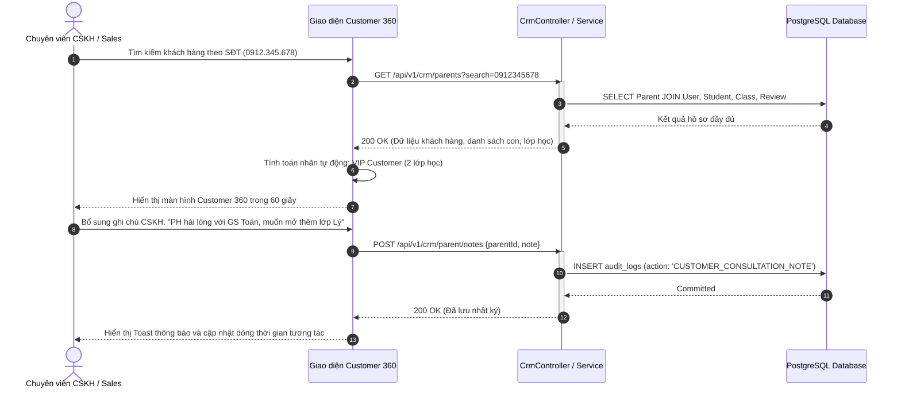

# Usecase: UC-ADM-03 - Hồ sơ Khách hàng Customer 360 & Nhật ký Quản trị (Customer 360 & Consultation Audit Trail)

> **Mã phân hệ:** CRM-REF-03  
> **Phân hệ:** Cổng Quản trị Trung tâm (Admin CRM)  
> **Tác nhân chính:** Quản trị viên (Admin), Chuyên viên Tư vấn (Sales), Chuyên viên Chăm sóc Khách hàng (CSKH), Nhân viên Học vụ (Academic)

---

## 1. Giới thiệu chức năng

### 1.1. Mục đích
Cung cấp giải pháp **Hồ sơ Khách hàng 360 Độ (Customer 360 View)** toàn diện, hợp nhất toàn bộ thông tin gia đình, danh sách học sinh, lịch sử các lớp học, hồ sơ đánh giá chất lượng gia sư và nhật ký khiếu nại của từng phụ huynh trên một giao diện tập trung duy nhất. Chức năng giúp đội ngũ nhân viên trung tâm nắm bắt hoàn cảnh gia đình, sở thích học tập của học sinh và lịch sử giao dịch chỉ trong vòng **60 giây**, từ đó cá nhân hóa dịch vụ tư vấn, phân loại phân khúc khách hàng tự động (Customer Segmentation) và lưu vết kiểm toán (Audit Trail) chống thất thoát quan hệ khách hàng.

### 1.2. Actor (Tác nhân)
* **Chuyên viên Tư vấn / CSKH (Sales / Support Staff)**: Tra cứu nhanh lịch sử học tập, sở thích học sinh, đọc nhật ký chăm sóc trước khi gọi điện, bổ sung ghi chú tương tác mới.
* **Nhân viên Học vụ (Academic Staff)**: Xem lịch sử đánh giá gia sư của gia đình, theo dõi các yêu cầu đổi người hoặc sự cố buổi học trong quá khứ.
* **Quản trị viên (Admin)**: Xem toàn bộ lịch sử thanh toán học phí, các nhãn khách hàng VIP và kiểm tra truy vết thao tác hệ thống (`AuditLog`).

### 1.3. Điều kiện tiên quyết
* Người dùng đã đăng nhập hệ thống CRM và có vai trò `ADMIN`, `SALES`, hoặc `ACADEMIC`.
* Khách hàng đã có tài khoản phụ huynh hợp lệ trong bảng `parents` và `users`.

### 1.4. Danh mục các chức năng con (Sub-features)
1. **UC-ADM-03-01**: Tra cứu & Xem Toàn cảnh Hồ sơ Khách hàng 360 Độ (Customer 360 Profile Ingestion).
2. **UC-ADM-03-02**: Quản lý Thông tin Gia đình & Hồ sơ Học sinh Liên kết (Multi-Student Family Profiling).
3. **UC-ADM-03-03**: Phân khúc & Gắn nhãn Khách hàng Tự động (Automated Customer Segmentation).
4. **UC-ADM-03-04**: Ghi nhận Nhật ký Tương tác & Truy vết Kiểm toán (Consultation & Audit Trail Logging).

---

## 2. Dữ liệu nghiệp vụ đầu vào (Input Data & Parameters)

### 2.1. Cấu trúc Màn hình Customer 360 Độ

```text
┌─────────────────────────────────────────────────────────────────────────────────────────────┐
│ THÔNG TIN PHỤ HUYNH: NGUYỄN THỊ HƯƠNG (0912.345.678) - QUẬN CẦU GIẤY                        │
├─────────────────────────────────────────────┬───────────────────────────────────────────────┤
│ 1. HỒ SƠ GIA ĐÌNH & ĐẶC ĐIỂM HỌC SINH       │ 2. LỊCH SỬ LỚP HỌC, ĐÁNH GIÁ & TÀI CHÍNH      │
├─────────────────────────────────────────────┼───────────────────────────────────────────────┤
│ • Họ tên PH: Nguyễn Thị Hương               │ [LỚP HIỆN TẠI - SAM207]                       │
│ • Địa chỉ: 18 Trần Duy Hưng, Cầu Giấy       │ • Môn: Toán 10 (Học sinh: Bé Khôi)            │
│ • Kênh liên hệ ưu tiên: ZALO / CALL         │ • Gia sư: Nguyễn Văn Nam (Sinh viên Sư phạm)  │
│ • Khung giờ gọi: 19h00 - 21h00 (Tối)        │ • Trạng thái: TEACHING (Đã học 8 buổi)        │
│ • Phân khúc: 🌟 KHÁCH HÀNG VIP (2 lớp)       │ • Đánh giá dạy thử: ⭐⭐⭐⭐⭐ (5.0 / 5)         │
│ • Ghi chú gia đình: Cần gia sư kiên nhẫn    │                                               │
│                                             │ [LỚP QUÁ KHỨ - SAM105]                        │
│ • HỌC SINH 1: Bé Khôi (Lớp 10)              │ • Môn: Tiếng Anh 9 (Bé Khôi)                  │
│   - Mục tiêu: Thi đỗ Đại học khối A         │ • Kết quả: Đã kết thúc - Thi đỗ vào Lớp 10    │
│   - Tính cách: Chăm chỉ, sợ Hình học        │                                               │
│                                             │ [LỊCH SỬ GIAO DỊCH & KHIẾU NẠI]               │
│ • HỌC SINH 2: Bé Linh (Lớp 6)               │ • Tổng giao dịch: 2 lớp - Doanh thu: 1,000,000│
│   - Mục tiêu: Luyện phát âm Tiếng Anh       │ • Ticket Bảo hành: 0 khiếu nại tồn đọng       │
│   - Tính cách: Năng động, thích vẽ          │ • Nhật ký CSKH gần nhất: 15/09/2026 - Hài lòng│
└─────────────────────────────────────────────┴───────────────────────────────────────────────┘
```

### 2.2. Chi tiết các Trường Thông tin Phụ huynh (`Parent` Model)

| Trường dữ liệu | Kiểu dữ liệu | Mô tả & Tác dụng nghiệp vụ |
| :--- | :--- | :--- |
| `id` | UUID | Khóa chính, đồng bộ với `User.id`. |
| `fullName` | String (100) | Họ và tên đầy đủ của phụ huynh đại diện gia đình. |
| `address` | String (255) | Địa chỉ nơi ở hiện tại của gia đình. |
| `district` | String (50) | Quận/Huyện phục vụ tính bán kính di chuyển gia sư. |
| `province` | String (50) | Tỉnh/Thành phố (Mặc định: TP. Hà Nội / TP. Hồ Chí Minh). |
| `occupation` | String (100) | Nghề nghiệp phụ huynh (Công chức, Kinh doanh, Giáo viên...). |
| `contactTimePref` | String (50) | Thời gian tiện liên hệ: `MORNING`, `AFTERNOON`, `EVENING`, `ANYTIME`. |
| `preferredContactMethod`| String (50) | Phương thức liên hệ ưu tiên: `CALL` (Gọi điện), `ZALO`, `EMAIL`. |
| `familyNotes` | Text | Ghi chú văn hóa gia đình, yêu cầu gia sư (không hút thuốc, đi nhẹ nói khẽ). |

---

## 3. Quy tắc nghiệp vụ (Business Rules)

| Mã BR | Tình huống kích hoạt | Xử lý của hệ thống | Mã lỗi / Phản hồi |
| :--- | :--- | :--- | :--- |
| **BR-ADM-03-01** | Tự động phân khúc Khách hàng VIP (VIP Customer Labeling). | Nếu phụ huynh sở hữu $\ge 2$ lớp học có trạng thái `TEACHING`/`CLOSED` (không bị phạt) hoặc tổng doanh thu mang lại $\ge 1,000,000$ VNĐ: Hệ thống tự động gắn nhãn huy hiệu 🌟 `VIP Customer` trên giao diện, ưu tiên xử lý ticket hỗ trợ và ghép lớp tức thì. | `AUTO_LABEL_VIP` |
| **BR-ADM-03-02** | Nhận diện tiềm năng học sinh kế cận (Cross-sell Early Detection). | Khi quét dữ liệu gia đình phát hiện có học sinh nhỏ tuổi hơn (VD: Học sinh 1 lớp 10, Học sinh 2 lớp 5 hoặc lớp 9 chuẩn bị thi chuyển cấp): Hệ thống tự động kích hoạt thẻ gợi ý `TIỀM NĂNG CON NHỎ` vào tháng 8 đầu năm học mới để nhân viên gọi điện tặng ưu đãi. | `AUTO_LABEL_CROSS_SELL` |
| **BR-ADM-03-03** | Cảnh báo Khách hàng Rủi ro Cần quan tâm (Churn Risk Alert). | Nếu lớp học của gia đình vừa phát sinh sự cố (Gia sư báo nghỉ đột xuất, buổi học bị khiếu nại `DISPUTED`, hoặc vừa kích hoạt bảo hành đổi gia sư): Gắn ngay nhãn cảnh báo đỏ ⚠️ `CẦN QUAN TÂM ĐẶC BIỆT`, hiển thị cảnh báo lên đầu danh sách quản lý phụ huynh. | `CHURN_ALERT_FLAG` |
| **BR-ADM-03-04** | Toàn vẹn dữ liệu Lịch sử Đánh giá (Review Immutability). | Các đánh giá sao (`rating`) và nhận xét (`comment`) của phụ huynh về gia sư sau buổi dạy thử hoặc kết thúc khóa học là bất biến, không một nhân viên nào được phép chỉnh sửa hay xóa để đảm bảo tính khách quan của hệ thống tín nhiệm Karma. | `403 FORBIDDEN` ("Không được phép chỉnh sửa dữ liệu đánh giá lịch sử") |
| **BR-ADM-03-05** | Truy vết kiểm toán thay đổi dữ liệu (Audit Logging). | Mọi hành động cập nhật thông tin phụ huynh, ghi chú gia đình hoặc thay đổi trạng thái tài khoản đều phải tự động ghi vào bảng `audit_logs` gồm `userId` nhân viên thực hiện, `action`, `oldValue`, `newValue` và `ipAddress`. | `AUDIT_LOG_COMMITTED` |

---

## 4. Đặc tả chi tiết các Use Case chức năng con

```mermaid
usecaseDiagram
    actor "Chuyên viên Tư vấn / CSKH" as CSKH
    actor "Nhân viên Học vụ" as Academic
    actor "Quản trị viên" as Admin

    package "UC-ADM-03: Hồ sơ Khách hàng 360 Độ" {
        usecase "UC-ADM-03-01: Tra cứu & Xem Hồ sơ 360" as UC1
        usecase "UC-ADM-03-02: Quản lý Hồ sơ Học sinh Gia đình" as UC2
        usecase "UC-ADM-03-03: Phân khúc & Gắn nhãn Khách hàng" as UC3
        usecase "UC-ADM-03-04: Ghi nhận Nhật ký & Audit Trail" as UC4
    }

    CSKH --> UC1
    Academic --> UC1
    Admin --> UC1

    CSKH --> UC2
    CSKH --> UC3
    Admin --> UC3

    CSKH --> UC4
    Academic --> UC4
    Admin --> UC4
```

### 4.1. UC-ADM-03-01: Tra cứu & Xem Toàn cảnh Hồ sơ Khách hàng 360 Độ (Customer 360 Profile Ingestion)
* **Mục tiêu**: Cung cấp bức tranh toàn cảnh một màn hình về mọi tương tác, lớp học và tài chính của phụ huynh.
* **Tác nhân**: Chuyên viên Tư vấn, CSKH, Học vụ, Admin.
* **Tiền điều kiện**: Đăng nhập quyền Admin CRM.
* **Hậu điều kiện**: Toàn bộ dữ liệu gia đình được kết xuất trực quan.
* **Luồng cơ bản**:
  1. Người dùng truy cập tab "Quản lý Phụ huynh" (`/admin-crm` -> Tab `parents`).
  2. Frontend gọi API `GET /api/v1/crm/parents`.
  3. Người dùng nhập tên hoặc số điện thoại vào ô tìm kiếm để lọc nhanh khách hàng.
  4. Bấm vào tên phụ huynh để mở màn hình chi tiết Customer 360.
  5. Hệ thống truy vấn:
     * Thông tin cá nhân (`Parent`, `User`).
     * Danh sách học sinh (`Student[]`).
     * Lịch sử tất cả các lớp học (`Class[]`) kèm trạng thái, gia sư, doanh thu.
     * Danh sách các bài đánh giá nhận xét (`Review[]`).
     * Lịch sử giao dịch tiền cọc & thanh toán (`Transaction[]`).
  6. Giao diện hiển thị trực quan các thẻ thông tin và huy hiệu phân khúc (VIP, Tiềm năng, Cần chú ý).
* **Dữ liệu đầu ra**: Giao diện Customer 360 tải đầy đủ trong thời gian $\le 0.5$ giây.

### 4.2. UC-ADM-03-02: Quản lý Thông tin Gia đình & Hồ sơ Học sinh Liên kết (Multi-Student Family Profiling)
* **Mục tiêu**: Quản lý chi tiết từng học sinh trong gia đình (học lực, mục tiêu, phong cách học tập, môn cần gia sư).
* **Tác nhân**: Chuyên viên CSKH, Nhân viên Học vụ.
* **Tiền điều kiện**: Đang mở hồ sơ Customer 360 của phụ huynh.
* **Hậu điều kiện**: Dữ liệu học sinh được cập nhật chuẩn xác.
* **Luồng cơ bản**:
  1. Trong khối "Danh sách Học sinh", bấm vào học sinh cần cập nhật hoặc bấm "Thêm học sinh mới".
  2. Điền các trường: Họ tên, Ngày sinh, Trường học, Khối lớp hiện tại, Trình độ học lực (`academicLevel`: `WEAK`, `AVERAGE`, `GOOD`, `EXCELLENT`), Phong cách học (`learningStyle`), Mục tiêu thi cử (`targetGoal`).
  3. Bấm "Lưu thông tin học sinh".
  4. Hệ thống cập nhật bảng `students` liên kết với `parentId`.
  5. Hiển thị thông báo thành công và làm mới dữ liệu trên màn hình.
* **Dữ liệu đầu ra**: Bản ghi `Student` được cập nhật trong cơ sở dữ liệu.

### 4.3. UC-ADM-03-03: Phân khúc & Gắn nhãn Khách hàng Tự động (Automated Customer Segmentation)
* **Mục tiêu**: Tự động phân loại tập khách hàng giúp tối ưu chiến lược chăm sóc và phân bổ nguồn lực trung tâm.
* **Tác nhân**: Hệ thống Tự động (System), Chuyên viên CSKH.
* **Tiền điều kiện**: Dữ liệu lớp học và lịch sử giao dịch sẵn sàng.
* **Hậu điều kiện**: Nhãn phân khúc được gán chính xác trên hồ sơ.
* **Luồng cơ bản**:
  1. Khi một sự kiện nghiệp vụ xảy ra (Lớp học sang `TEACHING`, mở lớp thứ 2, phát sinh khiếu nại), hệ thống tự động chạy quy tắc chấm phân khúc:
     * Nếu số lớp $\ge 2 \rightarrow$ Gắn tag `VIP_CUSTOMER`.
     * Nếu có học sinh chuẩn bị thi chuyển cấp $\rightarrow$ Gắn tag `EXAM_PREPARATION`.
     * Nếu có khiếu nại chưa xử lý $\rightarrow$ Gắn tag `AT_RISK_CARE`.
  2. Nhân viên CSKH cũng có thể gắn thêm các nhãn thủ công (VD: `PHỤ HUYNH KỸ TÍNH`, `ƯU TIÊN GIÁO VIÊN NỮ`).
  3. Các nhãn này hiển thị dạng badge màu sắc nổi bật ngay cạnh tên khách hàng.
* **Dữ liệu đầu ra**: Danh sách nhãn phân khúc được cập nhật trên giao diện và database.

### 4.4. UC-ADM-03-04: Ghi nhận Nhật ký Tương tác & Truy vết Kiểm toán (Consultation & Audit Trail Logging)
* **Mục tiêu**: Lưu vết mọi cuộc gọi tư vấn, khiếu nại và thay đổi dữ liệu để các nhân viên kế nhiệm luôn nắm bắt lịch sử.
* **Tác nhân**: Chuyên viên CSKH, Tư vấn viên.
* **Tiền điều kiện**: Khách hàng đã được tạo trên hệ thống.
* **Hậu điều kiện**: Bản ghi nhật ký tương tác được lưu vĩnh viễn.
* **Luồng cơ bản**:
  1. Sau khi gọi điện tư vấn hoặc nhận phản ánh từ phụ huynh, nhân viên mở mục "Nhật ký CSKH & Tư vấn" trên màn hình Customer 360.
  2. Chọn loại tương tác: `CUỘC GỌI ĐỊNH KỲ`, `TƯ VẤN LỚP MỚI`, `XỬ LÝ KHIẾU NẠI`, `KHẢO SÁT 30 NGÀY`.
  3. Nhập tóm tắt nội dung cuộc trao đổi và cảm xúc khách hàng (Hài lòng / Bình thường / Không hài lòng).
  4. Bấm "Lưu Nhật Ký".
  5. Hệ thống ghi bản ghi vào bảng `audit_logs` liên kết với `parentId` và `staffId`.
* **Dữ liệu đầu ra**: Dòng thời gian (Timeline) nhật ký tư vấn được bổ sung thêm một sự kiện mới.

---

## 5. Sơ đồ tuần tự nghiệp vụ (Sequence Diagrams)



---

## 6. Kịch bản kiểm thử & Nghiệm thu (Test Scenarios)

### Kịch bản 1: Tra cứu và tải toàn diện hồ sơ Customer 360 trong vòng dưới 1 giây
* **Given**: Phụ huynh `Nguyễn Thị Hương` có 2 học sinh, 2 lớp học (1 lớp đang dạy, 1 lớp đã hoàn thành) và 1 bài đánh giá 5 sao.
* **When**: Chuyên viên tư vấn gõ số điện thoại `0912.345.678` vào ô tìm kiếm trên tab Quản lý Phụ huynh.
* **Then**:
  * Bảng dữ liệu lọc ra đúng bản ghi của chị Hương trong thời gian $\le 0.3$ giây.
  * Mở chi tiết hiển thị đầy đủ thông tin cả 2 học sinh (`Bé Khôi` và `Bé Linh`).
  * Danh sách lớp học hiển thị rõ mã lớp `SAM207` (Trạng thái `TEACHING`) và `SAM105` (Trạng thái `CLOSED`).
  * Huy hiệu 🌟 `VIP Customer` xuất hiện tự động trên tiêu đề hồ sơ.

### Kịch bản 2: Bổ sung ghi chú văn hóa gia đình và truy vết kiểm toán
* **Given**: Nhân viên CSKH gọi điện khảo sát phụ huynh và được dặn dò: "Gia sư cần đi nhẹ nói khẽ, không dùng điện thoại trong giờ dạy".
* **When**: Nhân viên lưu ghi chú này vào mục `familyNotes` của phụ huynh.
* **Then**:
  * Trường `familyNotes` trong bảng `parents` được cập nhật thành công.
  * Bảng `audit_logs` tự động sinh 1 bản ghi mới ghi nhận `userId` của nhân viên, thời gian chính xác và nội dung ghi chú.
  * Mọi nhân viên khác khi mở hồ sơ phụ huynh này đều nhìn thấy ngay lưu ý trên khối cảnh báo gia đình.

### Kịch bản 3: Phát hiện và gắn nhãn cảnh báo khách hàng có nguy cơ rời bỏ dịch vụ
* **Given**: Phụ huynh có lớp học `SAM402` vừa phát sinh khiếu nại buổi học (`status: 'DISPUTED'`) do gia sư vắng mặt không báo trước.
* **When**: Hệ thống kiểm tra điều kiện phân khúc khách hàng tự động.
* **Then**:
  * Hồ sơ phụ huynh lập tức được gắn nhãn cảnh báo đỏ ⚠️ `CẦN QUAN TÂM ĐẶC BIỆT`.
  * Trên danh sách phụ huynh tổng quan, bản ghi được đưa lên vị trí ưu tiên để trưởng nhóm CSKH chỉ đạo nhân viên liên hệ hỗ trợ trong vòng 30 phút.
